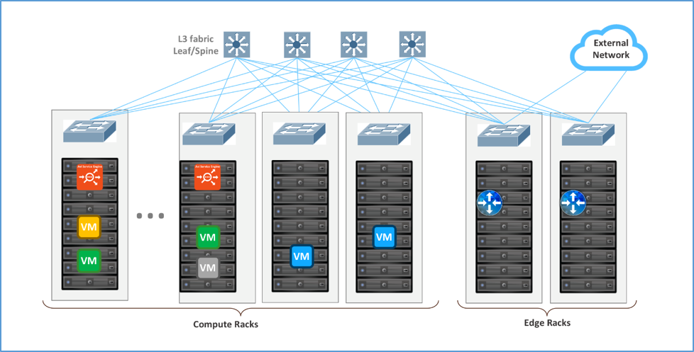
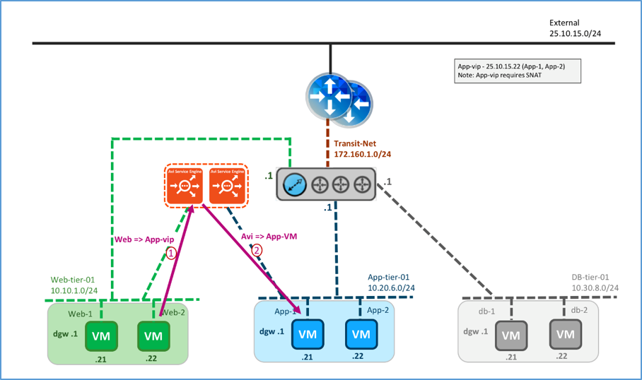

In this topology the Avi SE is installed parallel to DLR. Physically, the Avi SE gets deployed on the ESXi compute rack. The exact ESXi hosts or cluster on which the SE needs to be placed can be configured in SE group properties on Avi Vantage. This topology can work with both VLAN (layer 2) and VXLAN (layer 3 routed overlay) networks.

### Logical and Physical View

Logically, Avi SE is installed parallel to DLR. The SEs may be deployed in elastic HA (active/active or N+M buffer) or legacy HA (active/standby) mode. The SE connects to the Web-tier-01 network for front-end and App-tier-01 network for back-end. Traffic from web server is SNATed by the SE. Default gateway for different servers (web, application and DB) is DLR.

<figure class="thumbnail wp-caption alignnone">   
<figcapture> Logical View, Parallel to DLR using VXLAN or VLANs with Avi for East-West 
</figcapture>
</figure> 

 

Following the recommended design (refer to <a href="https://communities.vmware.com/docs/DOC-27683">VMware® NSX for vSphere Network Virtualization Design Guide ver 3.0</a>), the recommendation is to configure the SE group properties to physically deploy the SEs in the compute racks, where the web-tier and app-tier networks (VXLANS or VLANS) are available.

<figure class="thumbnail wp-caption alignnone">   
<figcapture> Physical View, Parallel to DLR Using VXLAN or VLANs with Avi Vantage for East-West 
</figcapture>
</figure> 

 

### Traffic Flows

### East-West Traffic Flow

Logical traffic flows are:

* Web server → Avi SE
* Avi SE → app server 
<figure class="thumbnail wp-caption alignnone">   
<figcapture> Logical View, East-West Traffic Flows 
</figcapture>
</figure> 

 

Physical traffic flows are:

* Web VM → ESXi kernel hosting the Web VM → ESXi kernel hosting the SE
* ESXi kernel hosting the SE → SE VM → ESXi kernel hosting the app VM
* ESXi hosting the app VM → the app VM 
<figure class="thumbnail wp-caption alignnone">   
<figcapture> Physical View, East-West Traffic Flows 
</figcapture>
</figure> 

### VIP requirements

* App-VIP requires SNAT 

 

