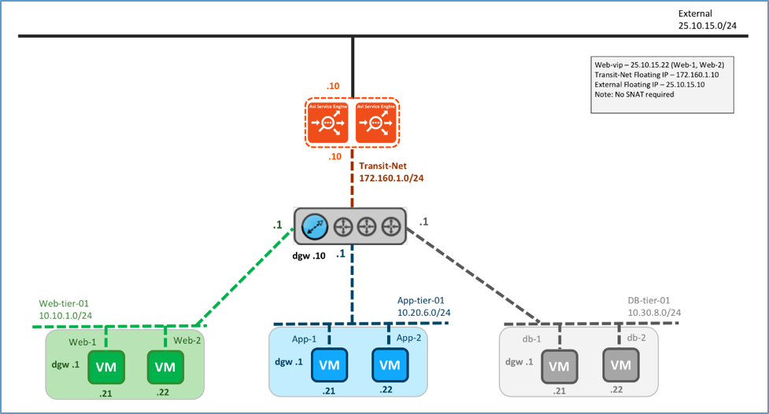
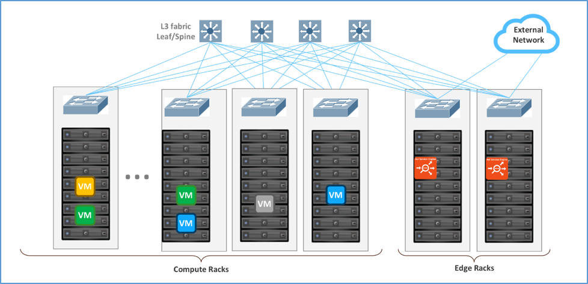
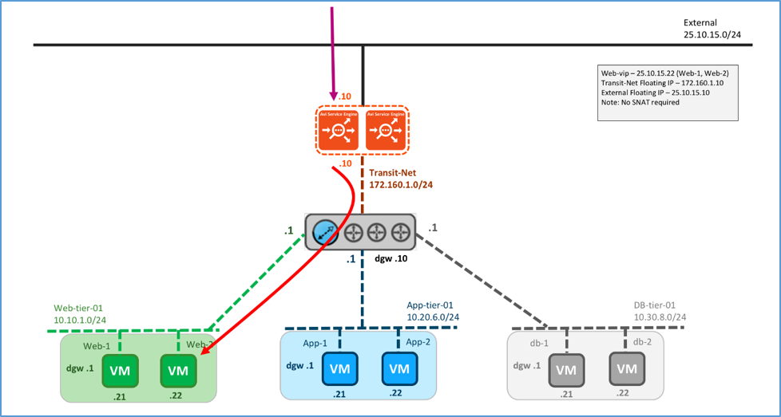
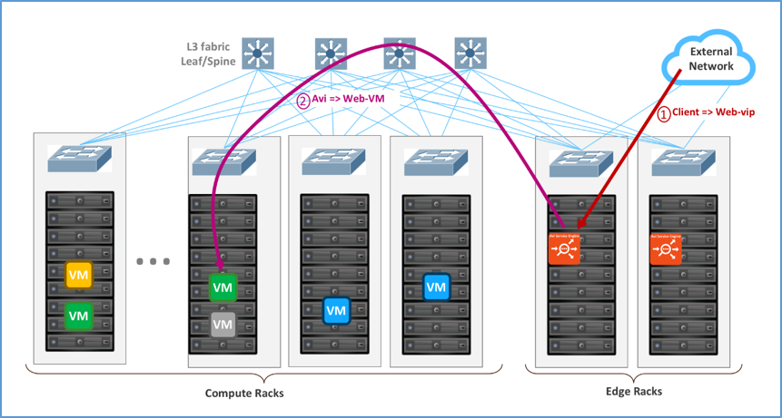
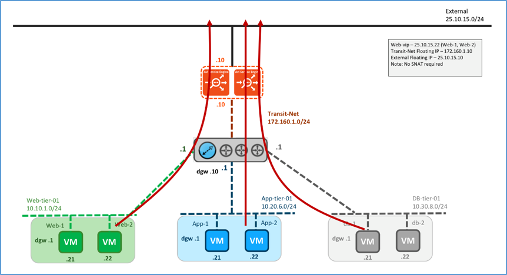
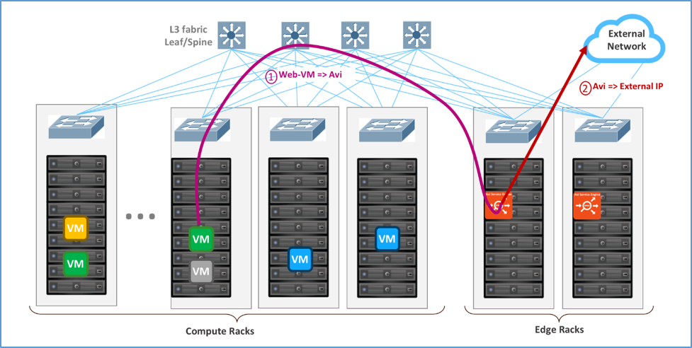

In this topology the Avi SE is installed on top of NSX DLR. Physically, the Avi SE gets deployed on the ESXi on the Edge rack. This topology is popular on layer 3 physical fabrics, such as spine-leaf. The feature for this topology will be completely supported in future Avi Vantage releases.

### Logical and Physical View

Logically, the Avi SE is installed on top of NSX DLR. The SEs must be deployed in legacy HA (active/standby) mode. The SE connects to the External network (non-encapsulated) for front-end and Web-tier-01 VXLAN (encapsulated) for back-end. The default gateway for web, application and DBMS servers is DLR. The default gateway for DLR is a floating IP address on the SE in the Transit network. See <a href="/default-gateway-ip-routing-on-avi-se/">IP Routing on Avi SE</a> feature for more details. In this case the client IP is preserved.

 

<figure class="thumbnail wp-caption alignnone">   
<figcapture> Logical View, Parallel to NSX Edge Using Avi for North-South Load Balancing 
</figcapture>
</figure> 

 

Following the recommendation (refer to <a href="https://communities.vmware.com/docs/DOC-27683">VMware® NSX for vSphere Network Virtualization Design Guide ver 3.0</a>), configure the SE group properties to physically deploy the SEs in the Edge racks where External network is available.

 

<figure class="thumbnail wp-caption alignnone">   
<figcapture> Physical View, Parallel to NSX Edge Using Avi for North-South Load Balancing 
</figcapture>
</figure> 

### Traffic Flows

### North-South Traffic Flow

Logical Traffic flows are:

* Client → Web VIP on Avi SE
* Avi SE → Web server via DLR 

 

<figure class="thumbnail wp-caption alignnone">   
<figcapture> Logical View, North-South Traffic Flow 
</figcapture>
</figure> 

Physical traffic flows are as follows:

* Client on External network → ESXi hosting the SE → SE VM
* SE VM → VXLAN on ESXi kernel hosting the SE → ESXi kernel hosting the web VM
* ESXi kernel hosting the web VM → web VM 

 

<figure class="thumbnail wp-caption alignnone">   
<figcapture> Physical View, North-South Traffic Flow 
</figcapture>
</figure> 

### South-North Traffic Flow

Logical traffic flows originating from the servers:

* Server VM → DLR
* DLR → SE
* SE → External network 
<figure class="thumbnail wp-caption alignnone">   
<figcapture> Logical View, South-North Traffic Flow 
</figcapture>
</figure> 

 

Physical traffic flows originating from the servers are:

* ESXi hosting the web/app/DBMS server → ESXi hosting the SE 
*Note: DLR is not a step since it is distributed and done here in the ESXi hosting the web/app/DBMS kernel.*
* From SE → External network 

 

<figure class="thumbnail wp-caption alignnone">   
<figcapture> Physical View, South-North Traffic Flow 
</figcapture>
</figure> 

### VIP requirements

* No SNAT is required. 

 

