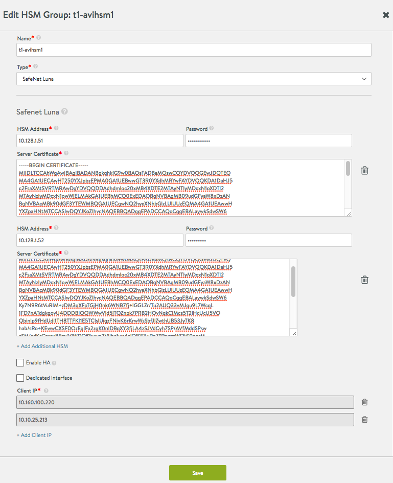
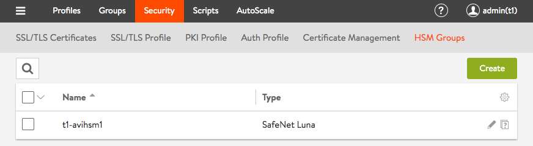
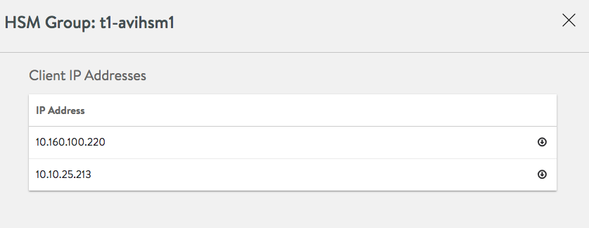
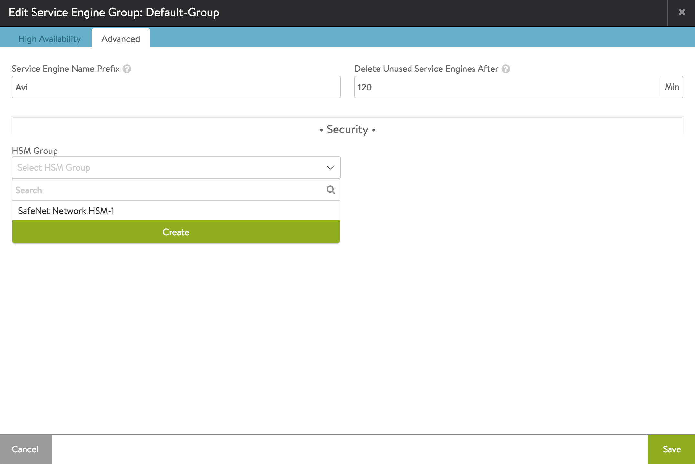
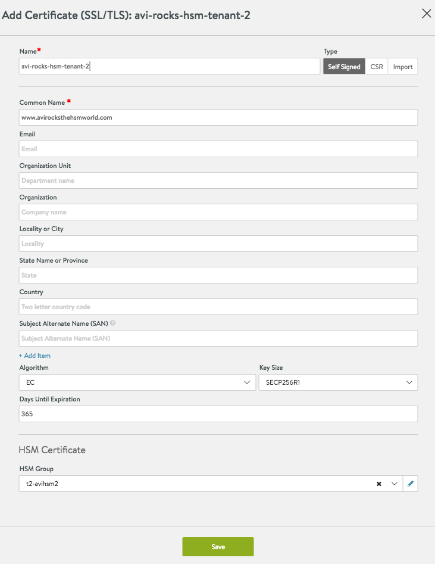
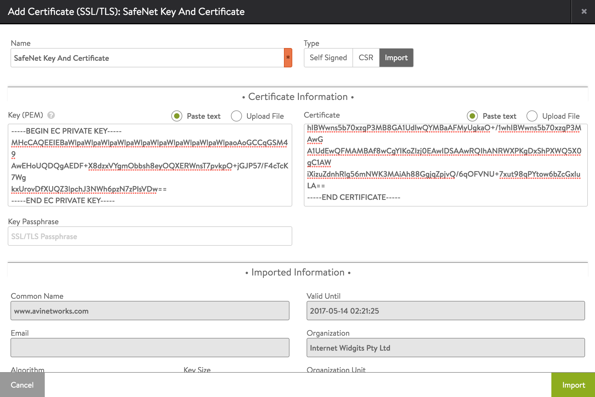

**Note: Those still on Avi Vantage 16.2 should instead read <a href="/docs/17.1/antage-integration-with-safenet-network-hsm-16-2">Avi Vantage Integration with SafeNet Network HSM (16.2)</a>.**

## Introduction

Avi Vantage includes support for networked hardware security module (HSM) products, including SafeNet Network HSM and Thales nShield.

This article covers the SafeNet Network HSM (formerly Luna SA) integration. For Thales nShield support, see <a href="/docs/17.1/thales-nshield-integration-2/">here</a>.

This article describes how to configure Avi Vantage to use the key generation and encryption/decryption services provided by SafeNet Network HSM. This enables use of SafeNet Network HSM to store keys associated with SSL/TLS resources configured on a virtual service.

## Integration Support

Avi Vantage release 16.3.2 uses SafeNet Network HSM Client Software Release 5.4.1 for 64-bit Linux.

Avi Vantage can be configured to support a cluster of HSM devices in high availability (HA) mode. Avi Vantage support of HSM devices requires installation of the user's SafeNet Client Software bundle, which can be downloaded from the <a href="http://www.safenet-inc.com/">SafeNet</a>/Gemalto website.

Starting with 16.2.2, Avi Vantage supports creation and usage of more than one HSM profile.

### Prerequisites

Before using Avi Vantage with SafeNet Network HSM, the following are required:

* SafeNet devices are installed on your network.
* SafeNet devices are reachable from the Avi Controller and Avi Service Engines.
* SafeNet devices have a virtual HSM partition defined before installing the client software.
* Each Avi Controller and Service Engine must:
    
    1)  Have the client license from SafeNet to access the HSM.
    
    2)  Be able to reach the HSM at ports 22 and 1792 through Avi Controller, SE management, or SE data path interface.
      

Download:

* SafeNet Network HSM client software (Version 5.4)
* SafeNet Network HSM customer documentation 

### HSM Group Updates

Creation, update or deletion of an HSM group requires reloading of a new SafeNet configuration, which can only be achieved by restarting the Avi SEs. Restart of Avi SEs temporarily disrupts traffic.

## SafeNet Software Import

To enable support for SafeNet Network HSM, the downloaded SafeNet client software bundle must be uploaded to the Avi Controller. It must be named ***"safenet.tar"*** and can be prepared as follows:

* Copy files from the downloaded software into any given directory (e.g., safenet_pkg).
* Change directory (cd) to that directory, and enter the following **cp** commands:  
<pre><code class="language-lua">cp 610-012382-008_revC/linux/64/configurator-5.4.1-2.x86_64.rpm configurator-5.4.1-2.x86_64.rpm
cp 610-012382-008_revC/linux/64/libcryptoki-5.4.1-2.x86_64.rpm libcryptoki-5.4.1-2.x86_64.rpm
cp 610-012382-008_revC/linux/64/vtl-5.4.1-2.x86_64.rpm vtl-5.4.1-2.x86_64.rpm
cp 610-012382-008_revC/linux/64/lunacmu-5.4.1-2.x86_64.rpm lunacmu-5.4.1-2.x86_64.rpm
cp 610-012382-008_revC/linux/64/cklog-5.4.1-2.x86_64.rpm cklog-5.4.1-2.x86_64.rpm
cp 610-012382-008_revC/linux/64/multitoken-5.4.1-2.x86_64.rpm multitoken-5.4.1-2.x86_64.rpm
cp 610-012382-008_revC/linux/64/ckdemo-5.4.1-2.x86_64.rpm ckdemo-5.4.1-2.x86_64.rpm
cp 610-012382-008_revC/linux/64/lunacm-5.4.1-2.x86_64.rpm lunacm-5.4.1-2.x86_64.rpm
tar -cvf safenet.tar configurator-5.4.1-2.x86_64.rpm libcryptoki-5.4.1-2.x86_64.rpm vtl-5.4.1-2.x86_64.rpm lunacmu-5.4.1-2.x86_64.rpm cklog-5.4.1-2.x86_64.rpm multitoken-5.4.1-2.x86_64.rpm ckdemo-5.4.1-2.x86_64.rpm lunacm-5.4.1-2.x86_64.rpm</code></pre>  
* HSM package can be uploaded in the web interface at Administration > Settings > Upload HSM Packages.
* HSM package upload is also supported through the CLI. You can use the following command in the Avi Controller CLI shell to upload the HSM package:  
<pre><code class="language-lua">upload hsmpackage filename /tmp/safenet_pkg/safenet.tar</code></pre>  This command uploads the packages and installs them on the Avi Controller or Avi Controllers (if clustered). If the Controller is deployed as a 3-node cluster, the command installs the packages on all 3 nodes. Upon completion of the above command, "HSM Package uploaded successfully" should appear. 

* Avi SEs in an SE group referring to an HSM group need a one-time reboot for auto-installation of the HSM packages. To reboot an Avi SE, issue the following CLI shell command:  
<pre><code class="language-lua">reboot serviceengine Avi-se-ksueq</code></pre>  
* To allow Avi Controllers to talk to SafeNet HSM, the SafeNet client software bundle distributed with the product must be uploaded to Avi Vantage. The software bundle preparation and upload is described above. In this example, note that the Avi SE name is "Avi-se-ksueq." 

## Enabling HSM Support in Avi Vantage

After using the above steps to install the SafeNet software bundle onto the Avi Controller, the Controller may be configured to secure virtual services with HSM certificates. Note: Starting with release 16.2.2, <a href="/certificate-management-integration-for-csr-automation/">automated CSR workflow for SafeNet HSM</a> is supported.
<ol> 
 <li>Create the HSM group and add the HSM devices to it.</li> 
 <li>Register the client with HSM devices.</li> 
 <li>Set up HA across HSM devices (optional).</li> 
 <li>Associate the HSM group with the SE group.</li> 
 <li>Add the application certificates and keys by importing them. These are the keys and certificates generated out of band.</li> 
 <li>Enable HSM support on a virtual service.</li> 
</ol> 

Detailed steps are provided in the following sections.

### Step 1: Create the HSM Group and Add the HSM Devices to It

To begin, use the following commands on controller bash shell to fetch the certificates of the HSM servers. The example below fetches certificates from two servers 1.1.1.11 and 1.1.1.13

<pre><code class="language-lua">sudo scp admin@1.1.1.11:server.pem hsmserver11.pem
sudo scp admin@1.1.1.13:server.pem hsmserver13.pem</code></pre>  

The contents of these certificates are used while creating the HSM Group. Avi Vantage supports trusted authentication for all nodes in the system. This can be done by providing IP addresses of Controller(s) and Service Engine(s) which will interact with HSM. Use the below options of the HSM Group editor. By default, SEs use the management network to interact with the HSM. On CSP, Avi Vantage also supports the use of a dedicated network for HSM interaction.

Next, create the HSM group. From the GUI, navigate to Templates > Security > HSM Groups.  Multiple HSMs may be included in the group via the green *Add Additional HSM* button.

 

 

### Step 2: Register the Client with HSM Devices

Follow these steps:
<ol> 
 <li>Icon next to the "Edit" icon leads to a page which allows the user to download generated certificates.</li> 
 <li>After download, save the certificate as &lt;client_name&gt;.pem. In this example, the certificate needs to be saved as 10.160.100.220.pem before <code>scp</code> to HSM.  
  <!-- Crayon Syntax Highlighter v2.7.1 --> <pre><code class="language-lua">scp 10.160.100.220.pem admin@1.1.1.11:</code></pre> 
  <!-- [Format Time: 0.0002 seconds] --> </li> 
 <li>Register the client on the HSM.  <pre crayon="false" class="command-line language-bash" data-prompt="1|username@avi:~$ " data-output="2-99"><code>ssh admin@1.1.1.11
admin@1.1.1.11's password:
Last login: Thu May 12 19:52:00 2016 from 12.97.16.194
Luna SA 5.4.7-1 Command Line Shell - Copyright (c) 2001-2014 SafeNet, Inc. All rights reserved.
[1.1.1.11] lunash: client register -c 10.160.100.220 -i 10.160.100.220 'client register' successful. Command Result : 0 (Success)
[1.1.1.11] lunash: client assignPartition -c 10.160.100.220 -p par43 'client assignPartition' successful. Command Result : 0 (Success)
[1.1.1.11] lunash: exit</code></pre></li> 
 <li>Perform the above steps (1) and (2) for all HSM devices.</li> 
 <li>On the Avi Controller bash shell, the application ID must be opened before the Avi SE can communicate with the HSM. This can be done using the following command, which will automatically be replicated to each Avi Controller in the cluster. <pre crayon="false" class="command-line language-bash" data-prompt="username@avi:~$" data-output="2-99"><code>/opt/avi/scripts/safenet.py -p SafeNet-Network-HSM-1 -i 10.10.56.34 -c "/etc/luna/bin/sautil -v -s 1 -i 1792:1793 -o -p my_partition_password"
Copyright (C) 2009 SafeNet, Inc. All rights reserved.
sautilis the property of SafeNet, Inc. and is provided to our customers for
the purpose of diagnostic and development only.  Any re-distribution of this
program in whole or in part is a violation of the license agreement.
Config file: /etc/Chrystoki.conf.
Will use application ID [1792:1793].
Application ID [1792:1793] opened.
Open ok.
Session opened. Handle 1
HSM Slot Number is 1.
HSM Label is "ha1                             ".WARNING: Application Id 1792:1793 has been opened for access. Thus access will
remain open until all sessions associated with this Application Id are
closed or until the access is explicitly closed.</code></pre></li> 
</ol> 

Note: In the step above, if an error message appears stating that the application is already open, you can close it using the following command. After closing it, reopen the application. In case HSM groups were created in different tenants, safenet.py scripts has take an optional argument <code>-t &lt;tenant_name&gt;</code>.

<pre class="command-line language-bash" data-prompt="username@avi:~$" data-output="2-99"><code>/opt/avi/scripts/safenet.py -p SafeNet-Network-HSM-1 -i 10.10.56.34 -c "/etc/luna/bin/sautil -v -s 1 -i 1792:1793 -c"
Copyright (C) 2009 SafeNet, Inc. All rights reserved.
sautilis the property of SafeNet, Inc. and is provided to our customers for
the purpose of diagnostic and development only.  Any re-distribution of this
program in whole or in part is a violation of the license agreement.
Config file: /etc/Chrystoki.conf.
Close ok.</code></pre> 

### Step 3: Setting Up HA Across HSM Devices *(optional)*

Starting with 16.3.2, Avi Vantage automates configuration of HA across HSM devices. Before configuring HA, ensure that the clients are registered with the HSM using <code><strong>listSlots</strong></code> command. This** **command provides details about the HSM devices to be set up. The serial number provided in the output of this command is needed to set up HA across these devices.

More details about each of these commands can be found in the SafeNet documentation.

<pre class="command-line language-bash" data-prompt="username@avi:~$" data-output="2-13, 16-40"><code>/opt/avi/scripts/safenet.py -p SafeNet-Network-HSM-1 -t admin -c "/usr/safenet/lunaclient/bin/vtl listSlots"
Number of slots: 5

The following slots were found:

Slot # Description Label Serial # Status
========= ==================== =============================== ========== ============
slot #1 LunaNet Slot par43 156908040 Present
slot #2 LunaNet Slot par40 156936072 Present
slot #3 - - - Not present
slot #4 - - - Not present
slot #5 - - - Not present</code></pre> 

HA can also be enabled from the CLI as follows:

<pre class="command-line language-bash" data-prompt=": >" data-output="2-99"><code>configure hardwaresecuritymodulegroup safenet-network-hsm-1
hardwaresecuritymodulegroup &gt; hsm type hsm_type_safenet_luna
hardwaresecuritymodulegroup:hsm &gt;sluna
hardwaresecuritymodulegroup:hsm:sluna &gt;is_ha
hardwaresecuritymodulegroup:hsm:sluna &gt;save
hardwaresecuritymodulegroup:hsm &gt;save
hardwaresecuritymodulegroup &gt;save</code></pre> 

Alternatively, this can also be done in the web interface by selecting the HSM group. This option is available only while editing the HSM group with more than one server.

### Step 4: Associate the HSM Group with an SE Group

The HSM group must be added to the SE group that will be used by virtual service.

Navigate to Infrastructure > Cloud > Default-Cloud > Service Engine Group > Default Group.

This also can be configured using the Avi Controller CLI shell:

<pre><code class="language-lua">configure serviceenginegroup Default-Group hardwaresecuritymodulegroup_ref safenet-network-hsm-1</code></pre>  

In the above, replace <code>"safenet"</code> with the name you used when creating the HSM group.

### Step 5: Add the Application Certificates and Keys

5.1 Create Application Certificate and Keys.

The Controller is setup as a client of HSM and can be used to create keys and certificates on the HSM. Both the RSA and EC type of key/cert creation is supported.

Use a browser to navigate to the Avi Controller's management IP address. If Avi Vantage is deployed as a 3-node Controller cluster, navigate to the management IP address of the cluster. Use this procedure to create keys and certificates. The creation process is similar to any other key/certificate creation. For a key/certificate bound to HSM, select the HSM group while creating the object. The picture below illustrates the creation of self-signed certificate bound to a HSM group.

Navigate to Templates > Security > SSL/TLS Certificates, and click Create > Application Certificate.

Note in the above picture, HSM Group t2-avihsm2 is selected. This is the HSM group that was created earlier. Clicking on the "Save" button creates the self-signed EC cert on HSM provided in t2-avihsm2.

5.2 Import Application Certificate and Keys

Use a browser to navigate to the Avi Controller’s management IP address. If Avi Vantage is deployed as a 3-node Controller cluster, navigate to the management IP address of the cluster. Use this procedure to import the private keys created using the SafeNet cmu/sautil utilities, and the associated certificates.
<ol> 
 <li>Navigate to Templates &gt; Security &gt; SSL/TLS Certificates, and click Create &gt; Application Certificate.</li> 
 <li>Enter a name for the certificate definition.</li> 
 <li>Click Import.</li> 
 <li>Prepare to import the private key for the server certificate. 
  <ol> 
   <li>Above the Key field, in the Certificate Information section, select Paste text (to copy-and-paste the certificate text directly in the web interface) or Upload File.</li> 
   <li>If the key file is secured by a passphrase, enter it in the Key Passphrase field.</li> 
   <li>Paste the key file (if copy-and-pasting) or navigate to the location of the file (if uploading).</li> 
  </ol> </li> 
 <li>Prepare to import the server certificate: 
  <ol> 
   <li>Above the Certificate field, select Paste text or Upload File.</li> 
   <li>Paste the key file (if copy-and-pasting) or navigate to the location of the file (if uploading).</li> 
  </ol> </li> 
 <li>Click Validate. Avi Vantage checks the key and certificate files to ensure they are valid.</li> 
</ol> 

### Step 6: Enable HSM Support on a Virtual Service

<ol> 
 <li>In the Controller web management interface, navigate to Applications &gt; Virtual Services.</li> 
 <li>Click New or Edit.</li> 
 <li>If configuring a new virtual service, enter the name of the VIP.</li> 
 <li>Select the HSM certificate from the SSL Certificate drop-down list.</li> 
 <li>Enter the virtual service name and VIP address.</li> 
 <li>In the Service Port section, enable SSL.</li> 
 <li>Click Advanced. On the Advanced page, select the SE group to which the HSM group was added.</li> 
 <li>Click Save.</li> 
</ol> 

The virtual service is now ready to handle SSL/TLS traffic using the encryption/decryption services of the SafeNet Network HSM device.

