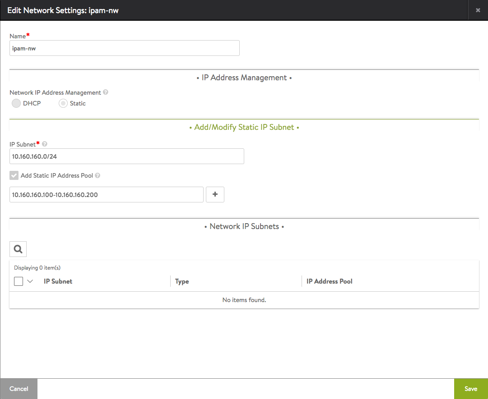
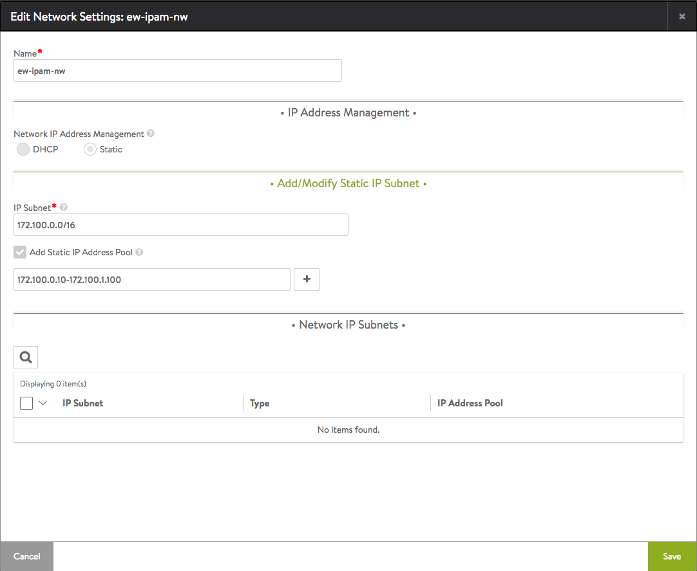
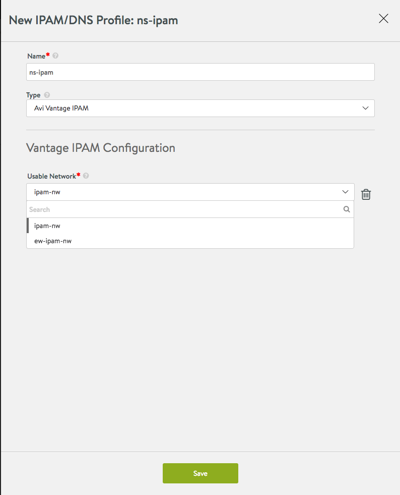

This article walks through the configuration of Avi Vantage's native IPAM solution, which is available for the following clouds:

* Containers (Mesos, OpenShift, Docker UCP, Rancher)
* Linux server cloud (bare metal)
* VMware
* No Access 

See also: <a href="/docs/17.1/service-discovery-using-ipam-and-dns-16-3/">Service Discovery Using IPAM and DNS</a>

### IPAM Configuration

Avi Vantage allocates IP addresses from a pool of IP addresses within the subnet configured as listed below.
<ol> 
 <li>Navigate to Infrastructure &gt; Clouds, and click on the cloud name.</li> 
 <li>Select Network and click Create.</li> 
 <li>Enter a name for the network.</li> 
 <li>Add networks for IP address allocation: 
  <ol> 
   <li>Click Add Subnet.</li> 
   <li>Enter the subnet address, in the following format: 10.160.160.0/24</li> 
   <li>Click Add Static IP address pool. Avi Vantage will allocate IP addresses from this pool. For example, 10.160.160.100-10.160.160.200.</li> 
   <li>Click Save.</li> 
   <li>Repeat 1-4 for each network to be used for IP address allocation.</li> 
  </ol> </li> 
 <li>Click Save.</li> 
</ol> 

Note:

* Virtual service creation will fail if the static IP address pool is empty or exhausted.
* For east-west IPAM (applicable to container-based clouds, i.e., Mesos, OpenShift, Docker UCP, and Rancher), create another network with the appropriate link-local subnet and a separate IPAM/DNS Profile. 

North-south IPAM network creation after following steps above:

East-west IPAM network configuration:

 

IPAM networks are now created. Navigate to Templates > IPAM/DNS Profile and create a placeholder for IPAM (separate one for east-west wherever it's relevant). You can assign one or more of the networks created above to be default usable networks if no specific network and/or subnet are provided in the virtual service configuration. The administrator can configure these networks, thus eliminating the need for developers to provide specific network/subnets while creating their applications.

