Avi Vantage can be deployed in Amazon Web Services (AWS) with multiple AWS accounts utilizing <a href="https://aws.amazon.com/iam/">IAM</a> <a href="http://docs.aws.amazon.com/IAM/latest/UserGuide/id_roles_common-scenarios_aws-accounts.html">AssumeRole</a> functionality (which provides access across AWS accounts to the AWS resources/API from respective accounts), instead of sharing the “Access Key ID and Secret Access Key” of each user from different accounts.

### **About the Feature**

From Avi Vantage 16.2.3 onwards, while creating the AWS cloud-type, users have a new option, “**Use Cross-Account AssumeRole,**” which can be enabled if the AWS cloud needs to be created in an AWS account other than the one in which the Avi Controller is currently running. From the UI, the feature can be enabled via a simple check box, as shown below.

<a href="img/Untitled1-1.png">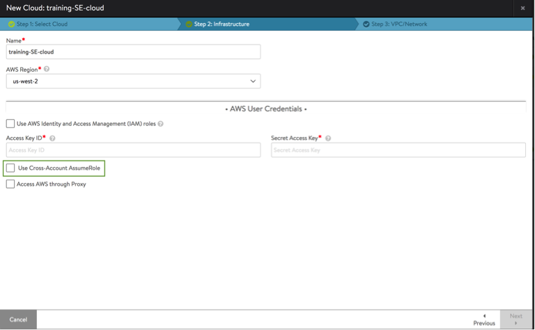</a>

## **Configuration and Use of Cross-Account AssumeRole Functionality**

Referring to the below diagram, consider a hypothetical organization “XYZ Corp” having multiple AWS account IDS:

* IT --123456789012
* Prod - 112233445566
* Training - 111122223333 

<a href="img/Untitled-3.png">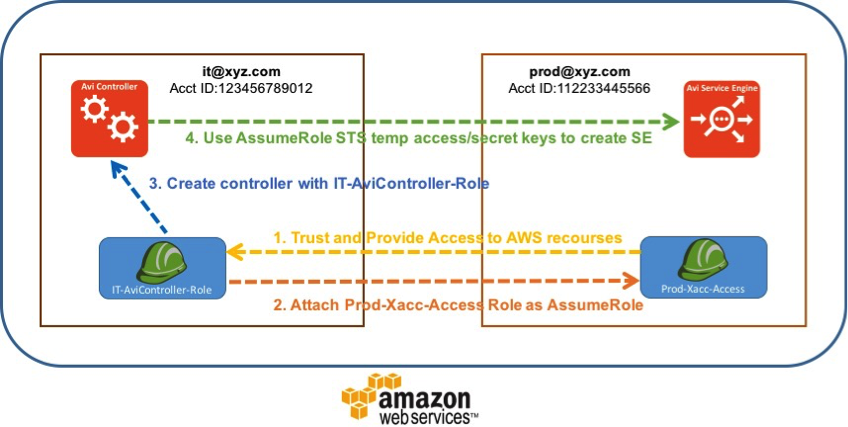</a>

 

Prior to Avi Vantage 16.2.3, "XYZ Corp would have required an “Access Key ID and Secret Access Key” to create the Avi Vantage Service Engine cloud in AWS for each account. This would be a security concern for sharing the AWS access keys for respective accounts. In addition, it would have been cumbersome to keep track of all the keys and update them when changed. Instead, we can utilize the <a href="http://docs.aws.amazon.com/IAM/latest/UserGuide/id_roles.html">AWS IAM Roles</a> in each of the accounts, which provides access to AWS resources/API across AWS accounts. These can be dynamic in nature.

### **Prerequisite Configuration**

This needs to be done in AWS to set up IAM user/roles to access other accounts using AWS STS AssumeRole.

AWS accounts needing access to AWS resources/API. In our example, we are going to run the Avi Controller in the IT account (AWS account id – 123456789012) and have the Avi SE cloud provide data path services in the Prod account (AWS account id – 112233445566). Please use the account IDs and resource ARNs applicable to your environment when following this guide. Cross-account setup is explained in the AWS tutorial <a href="http://docs.aws.amazon.com/IAM/latest/UserGuide/tutorial_cross-account-with-roles.html">http://docs.aws.amazon.com/IAM/latest/UserGuide/tutorial_cross-account-with-roles.html</a>. We will walk through the relevant steps for ease of deployment Avi Vantage users.

### **STEP-1 “Create a Role”**

****In Prod Account we need to setup the “Prod-Xacc-Access” Role which will be a cross-account role.
<ol> 
 <li>Go to IAM-&gt;Roles, “Create New Role."  <a href="img/cropthis-1.png">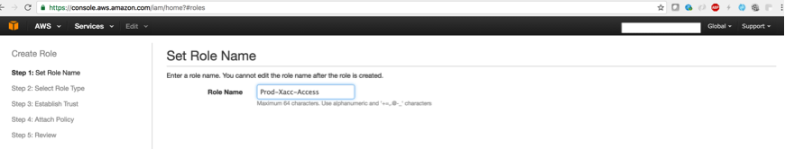  </a></li> 
 <li>Select “Role for Cross-Account Access” and in that “Provide access between AWS accounts you own.”  <a href="img/Untitled-copy.png">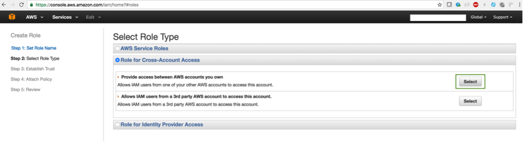</a><a href="img/Untitled-4.png">  </a></li> 
 <li style="text-align: left;">Enter the AWS account ID of the AWS account which can assume this role. In our example, it’s the IT (AWS account id – 123456789012). You may choose “Require MFA” based on your requirement.  <a href="img/splitit.png">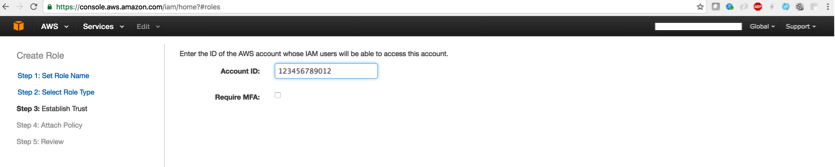</a><a href="img/splitit-copy.png">  </a></li> 
 <li style="text-align: left;">Select the policies which this role (Prod-Xacc-Access) requires to be able to create the Avi SE by which to provide Avi Vantage functionality. The required policies which are attached to the role AviController-EC2-Policy, AviController-IAM-XAccess-Policy, AviController-R53-Policy, AviController-S3-Policy are provided in the references section.  <a href="img/Untitled-7.png">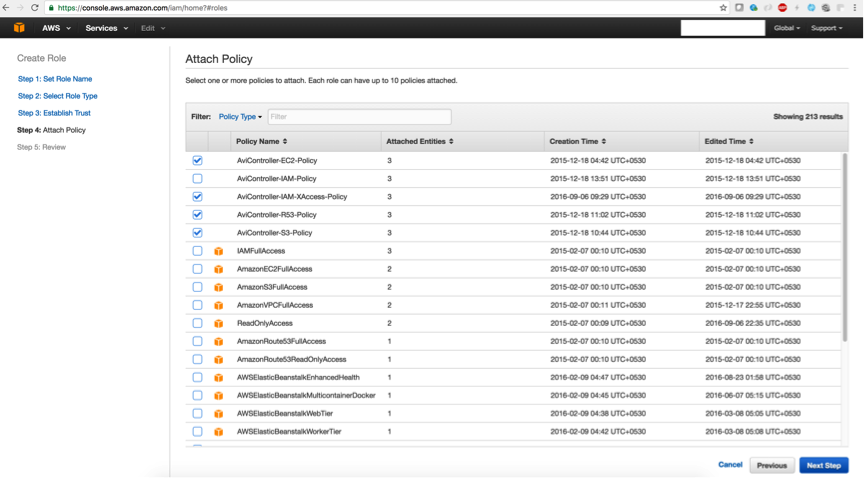  </a></li> 
 <li style="text-align: left;">Finish creation of “Prod-Xacc-Access” role by reviewing it and clicking “Create Role” submit button.    In the summary of the Role “<strong>Prod-Xacc-Access</strong>” the “Role ARN” would be displayed as “<strong>arn:aws:iam::112233445566:role/Prod-Xacc-Access.</strong>”  Please make a note of this format:  “arn:aws:iam::&lt;account id&gt;:role/&lt;role-name&gt;”.</li> 
</ol> 

### **STEP-2 “Grant Access to the Role”
**

Now that the “Prod-Xacc-Access” is setup in Prod AWS account (112233445566), any user or role in the IT AWS account (123456789012) is able to assume the role with appropriate configuration, similar to the below steps.

We need to create the role “IT-AviController-Role” in the IT AWS account (123456789012) to assume the role of “Prod-Xacc-Access” in the Prod AWS Account (112233445566). This is the role with which our Avi Controller instance will be attached.

Create the policy “Cross-Account-AssumeRole-policy,” which will be attached to the role “IT-AviController-Role.”
<ol> 
 <li>Go to IAM-&gt;Policies “Create Policy”, select “Create Your Own Policy.”  <a href="img/Untitled-copy-1.png">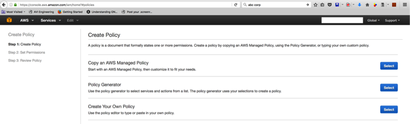</a><a href="img/Untitled-8.png">  </a></li> 
 <li>Configure the policy with the “sts:AssumeRole” action, providing the resource reference of the “Prod-Xacc-Access” role’s ARN i.e., “<strong>arn:aws:iam::112233445566:role/Prod-Xacc-Access</strong>." Click “Create Policy” to save the policy.  <a href="img/Untitled-copy-3.png">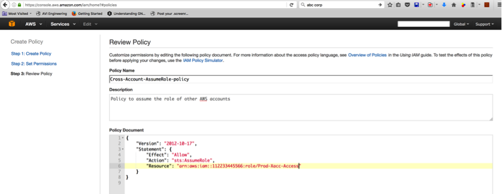</a><a href="img/Untitled-9.png">  </a>  If there are multiple accounts to be attached, we can use the following policy syntax:

 <pre crayon="false" pre="" data-output="1-100"><code>
{
   "Version": "2012-10-17",
   "Statement": [
       {
           "Effect": "Allow",
           "Action": "sts:AssumeRole",
           "Resource": "arn:aws:iam::&lt;ACCOUNT-ID1&gt;:role/&lt;Role-Name-1&gt;"
       },
       {
           "Effect": "Allow",
           "Action": "sts:AssumeRole",
           "Resource": "arn:aws:iam::&lt;ACCOUNT-ID1&gt;:role/&lt;Role-Name-2&gt;"
       },
       {
           "Effect": "Allow",
           "Action": "sts:AssumeRole",
           "Resource": "arn:aws:iam::&lt;ACCOUNT-ID2&gt;:role/&lt;Role-Name&gt;"
       }
   ]
}</code></pre> </li> 
 <li>Go to IAM-&gt;Roles “Create Role” for creating “IT-AviController-Role”  <a href="img/szz-copy.png">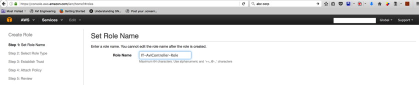</a><a href="img/szz.png">  </a></li> 
 <li>Select “AWS Services Roles” and then “Amazon EC2” as the Role Type.  <a href="img/Untitlfasdfdasfasded-copy.png">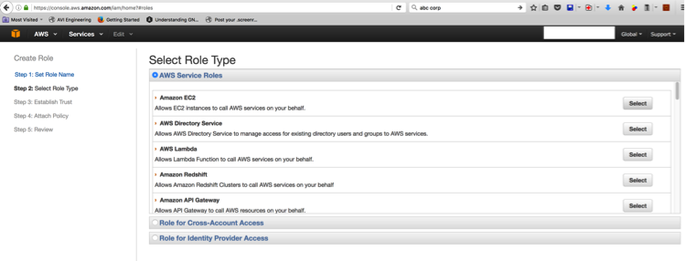</a><a href="img/Untitlfasdfdasfasded.png">  </a></li> 
 <li>In “Attach-Policy,” select the “Cross-Account-AssumeRole-Policy” created earlier and also “AviController-EC2-Policy”, which is required for a few operations internally to the Controller.  <a href="img/Untidfasdfled.png">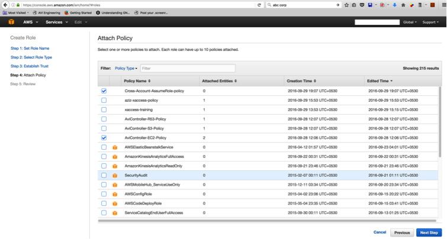  </a></li> 
</ol> 

Complete the role creation and verify both the policies attached.
<a href="img/Untitddddled.png">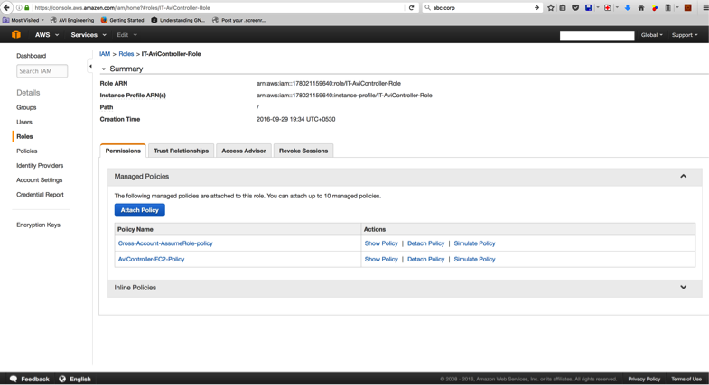  </a>

### Avi Vantage Configuration Steps

<ol> 
 <ol> 
  <li>Now that prerequisite setup is completed, we can create the Avi Controller with the “IT-AviController-Role” as IAM Role by following the steps explained in the <a href="/docs/16.3/installing-avi-vantage-in-amazon-web-services-16-2/">AWS Installation Guide</a> (make sure you use Avi Vantage 16.2.3 and later releases). Skip the cloud creation steps during setup and choose “<strong>No Orchestrator</strong>” during the setup. <strong>Also make sure the VPCs and subnets are configured/setup in AWS so that Avi Controller management interface and the Avi Service Engine’s management networks would be reachable if in other accounts</strong>.</li> 
  <li>Create the AWS cloud by going to “Infrastructure-&gt;Clouds” and clicking “Create” button.  <a href="img/Unddddddtitled-copy.png">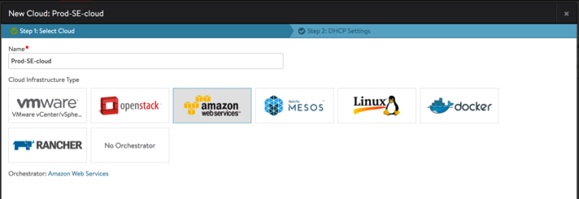</a></li> 
  <li>Choose the appropriate region and select the “Use AWS Identity and Access Management (IAM) roles” as we have attached “IT-AviController-Role” IAM role for the Controller instance when it was being launched.  <a href="img/Untifffffftled-copy.png">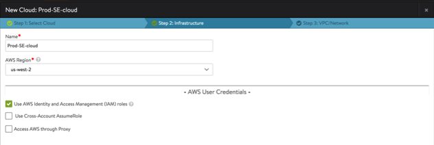</a><a href="img/Untifffffftled.png">  </a></li> 
  <li>The user would check “Use Cross-Account AssumeRole” were this cloud to be setup in other AWS accounts. In our case,  (a) we want to create the Avi SE cloud in Prod AWS account (112233445566) from the Controller running in IT AWS account (123456789012), and  (b) we have already set up the cross account AssumeRole for the “IT-AviController-Role”, so therefore,  (c) on the checkbox selection, the back-end APIs will do a lookup to fetch associated AssumeRole accounts and their roles and display them in the drop down selection.  If there were no AssumeRoles attached, the result would be empty. There would be a text box for the user to input the ARN of the role for which the Avi Controller instance’s IAM role (in our case, IT-AviController-Role) can assume the role.  <a href="img/Untitlddddded-copy-2.png">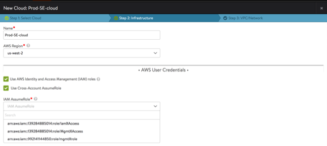</a><a href="img/Untitlddddded-copy.png">  </a></li> 
  <li>Select the ARN of the Account and Role where the Avi SE targets need to be deployed.  <a href="img/xxxxUntitled-copy.png">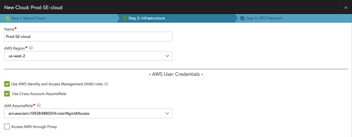</a></li> 
  <li>If the role has appropriate access and is correctly setup, Avi Controller can fetch the AWS account details and the configuration's VPC networks and then continue in similar fashion to the older Avi SE AWS Cloud setup.  <a href="img/Unddeedetitled-copy.png">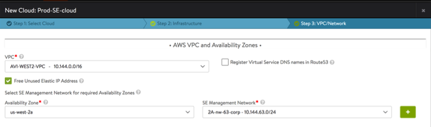</a><a href="img/Unddeedetitled.png">  </a></li> 
  <li>Cloud setup will progress and the Avi SE AMI will be copied to the target account.  <a href="img/Untitled-12.png">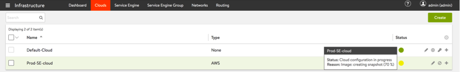  </a></li> 
  <li>Cloud status will move to cloud ready for Virtual Service placement once the transfer completes.  <a href="img/222.png">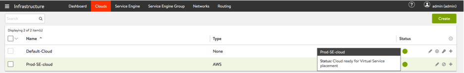  </a></li> 
  <li>Virtual services can now be configured on this cloud by following the <a href="/docs/16.3/architectural-overview/applications/virtual-services/create-virtual-service/">virtual service configuration KB article</a>.</li> 
 </ol> 
</ol> 

### **References:**

<ol> 
 <li>AWS IAM - <a href="https://aws.amazon.com/iam/">https://aws.amazon.com/iam/</a></li> 
 <li>AWS IAM Roles - <a href="http://docs.aws.amazon.com/IAM/latest/UserGuide/id_roles.html">http://docs.aws.amazon.com/IAM/latest/UserGuide/id_roles.html</a></li> 
 <li>AWS IAM AssumeRole - <a href="http://docs.aws.amazon.com/IAM/latest/UserGuide/id_roles_common-scenarios_aws-accounts.html">http://docs.aws.amazon.com/IAM/latest/UserGuide/id_roles_common-scenarios_aws-accounts.html</a></li> 
 <li>AWS Delegating API access using IAM Roles - <a href="https://aws.amazon.com/blogs/aws/delegating-api-access-to-aws-services-using-iam-roles/">https://aws.amazon.com/blogs/aws/delegating-api-access-to-aws-services-using-iam-roles/</a></li> 
 <li>AWS IAM Tutorial on Delegate Access across AWS accounts using IAM Roles - <a href="http://docs.aws.amazon.com/IAM/latest/UserGuide/tutorial_cross-account-with-roles.html">http://docs.aws.amazon.com/IAM/latest/UserGuide/tutorial_cross-account-with-roles.html</a></li> 
 <li>AviController-EC2-Policy and AviController-R53-Policy are referenced in the <a href="/docs/16.3/iam-role-setup-for-installation-into-aws/">IAM role setup guide</a>:</li> 
</ol> 

AviController-IAM-XAccess-Policy

<pre pre="" data-output="1-100"><code>
{
    "Version": "2012-10-17",
    "Statement": [
        {
            "Sid": "Stmt1450417666000",
            "Effect": "Allow",
            "Action": [
                "iam:GetPolicy",
                "iam:GetPolicyVersion",
                "iam:GetRole",
                "iam:GetRolePolicy",
                "iam:ListAttachedRolePolicies",
                "iam:ListPolicies",
                "iam:ListRolePolicies",
                "iam:ListRoles",
                "iam:ListAccountAliases",
                "iam:ListAttachedUserPolicies",
                "iam:ListAttachedGroupPolicies",
                "iam:GetUserPolicy",
                "iam:GetGroupPolicy",
                "iam:ListUserPolicies",
                "iam:ListgroupPolicies"
            ],
            "Resource": ["*"]
        }
    ]
}
</code></pre> 

AviController-S3-Policy

<pre pre="" data-output="1-100"><code>
{
    "Version": "2012-10-17",
    "Statement": [
        {
            "Sid": "Stmt1450394113000",
            "Effect": "Allow",
            "Action": [
                "s3:AbortMultipartUpload",
                "s3:CreateBucket",
                "s3:DeleteBucket",
                "s3:DeleteObject",
                "s3:GetBucketLocation",
                "s3:GetBucketTagging",
                "s3:GetObject",
                "s3:ListAllMyBuckets",
                "s3:ListBucket",
                "s3:ListBucketMultipartUploads",
                "s3:ListMultipartUploadParts",
                "s3:PutBucketTagging",
                "s3:PutObject"
            ],
            "Resource": [
                "*"
            ]
        }
    ]
}
</code></pre> 