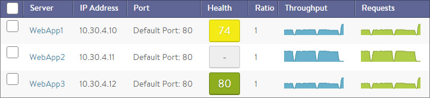
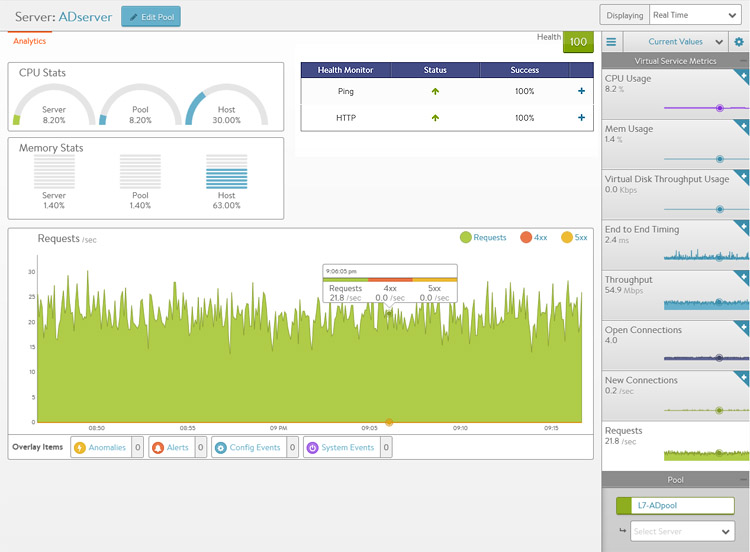

Information for each server within a pool is available within the Server Details Page. This page allows views into correlation between server resources, application traffic, and response times.

 

## Server Page

The Server Page may be access by clicking on the server's name from either the *Pool > Servers /*page or the /*Pool > Analytics' Servers* tile. When viewing the Server Details page, the server shown is within the context of the pool it was selected within. Rephrased, if the server (IP:Port) is a member of two or more pools, the stats and health monitors shown are only for the server within the context of the viewed pool.

 

Not all metrics within the Server Page are available in all environments. For instance, servers that are not virtualized or hooked into a hypervisor are not able to have their physical resources displayed.

The statistics can be changed or skewed by switching between Average Values, Peak Values, and Current Values. To see the highest CPU usage over the past day, change the time to 24 hour and the Value to Peak. This will show the highest stats recorded during the past day.

* **CPU Stats**: The CPU Stats box shows the CPU usage for this Server, the average during this time period across all servers in the pool, and the hypervisor host.
* **Memory Stats**: The memory Stats box shows the Memory usage for this server, the average during this time period across all servers in the pool, and the hypervisor host.
* **Health Monitor**: This table shows the name of any health monitors configured for the pool. The Status column shows the most current up or down health of the server. The Success column shows the percentage of health monitors that passed or failed during the display time frame. Clicking the plus will expand the table to show more info for a down server. See <a href="/docs/17.1/why-is-a-server-marked-down/">Why Is a Server Marked Down</a>.
* **Main Panel**: The large panel shows the highlighted metric, similar to the VS Details and Pool Details pages. Overlay Items shows Anomalies, Alerts, Config Events, and System Events that are related to this server within the pool.
* **Pool Tile Bar**: The Pool in the top right bar shows the health of the pool. This can also be used to jump back up to the Pool Page. Under the pool name is a pull-down menu that allows quick access to jumping to the other servers within the Pool.
* **Metrics Tile Bar**: The metrics options will vary depending on the hypervisor Avi is plugged into. For non-virtualized servers, the metrics are limited to non-resource metrics, such as End to End Timing, Throughput, Open Connections, New Connections, and Requests. Other metrics that may be shown include CPU, Memory and Virtual Disk Throughput.  