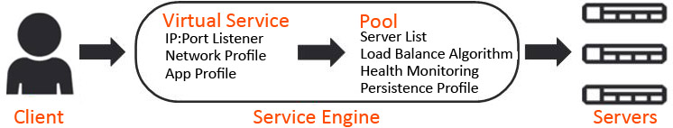
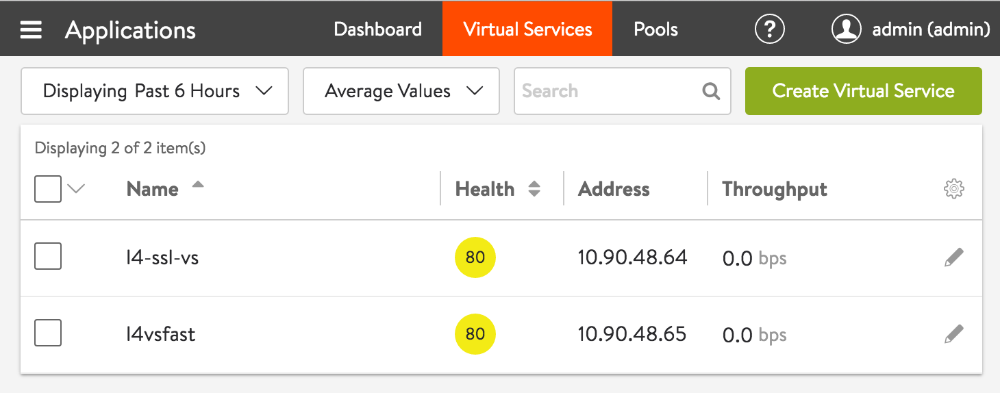
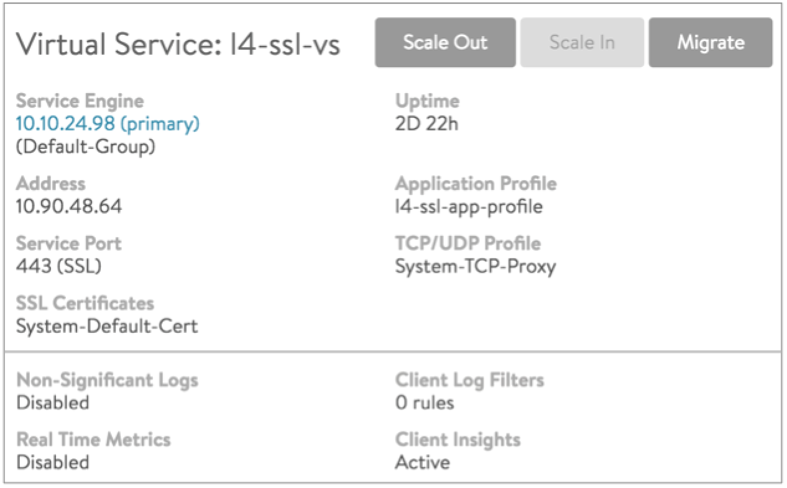

Virtual services are the core of the Vantage Vantage load-balancing and proxy functionality. A virtual service advertises an IP address and ports to the external world and listens for client traffic. When a virtual service receives traffic, it may be configured to:

* Proxy the client's network connection.
* Perform security, acceleration, load balancing, gather traffic statistics, and other tasks.
* Forward the client's request data to the destination pool for load balancing. 

A virtual service can be thought of as an IP address that Vantage is listening to, ready to receive requests. In a normal TCP/HTTP configuration, when a client connects to the virtual service address, Vantage will process the client connection or request against a list of settings, policies and profiles, then send valid client traffic to a back-end server that is listed as a member of the virtual service’s pool.

Typically, the connection between the client and Vantage is terminated or proxied at the SE, which opens a new TCP connection between itself and the server. The server will respond back directly to the Vantage IP address, not to the original client address. Vantage forwards the response to the client via the TCP connection between itself and the client.

A typical virtual service consists of a single IP address and service port that uses a single network protocol. Vantage allows a virtual service to listen to multiple service ports or network protocols.

For instance, a virtual service could be created for both service port 80 (HTTP) and 443 SSL (HTTPS). In this example, clients can connect to the site with a non-secure connection and later be redirected to the encrypted version of the site. This allows administrators to manage a single virtual service instead of two. Similarly, protocols such as DNS, RADIUS and Syslog can be accessed via both UDP and TCP protocols.

It is possible to create two unique virtual services, where one is listening on port 80 and the other is on port 443; however, they will have separate statistics, logs, and reporting. They will still be owned by the same Service Engines (SEs) because they share the same underlying virtual service IP address.

To send traffic to destination servers, the virtual service internally passes the traffic to the pool corresponding to that virtual service. A virtual service normally uses a single pool, though an advanced configuration using policies or DataScripts can perform content switching across multiple pools. A script also can be used in lieu of a pool, such as a virtual service that only performs an HTTP redirect.

A pool can only be assigned to a single virtual service. If the virtual service is deleted or pointed at a different pool, the pool will become unassigned and available to be used by a different virtual service.

When creating a virtual service, that virtual service listens to the client-facing network, which is most likely the upstream network where the default gateway exists. The pool connects to the server network.

Normally, the combined virtual service and pool are required before Vantage can place either object on an SE. When making an SE placement decision, Vantage must choose the SE that has the best reachability or network access to both client and server networks. Alternatively, both the clients and servers may be on the same IP network.

### Virtual Service Page

Select Applications > Virtual Services to open the virtual services page. This page displays a list of the configured virtual services. It can be used to quickly check the status and view high level information for each.

This page includes the following functions:

  **Search:** Search through the names of the objects.

  **Create:** Opens the *Create Virtual Service*popup.

  **Edit:** Opens the *Edit Virtual Service*popup.

  **Delete:** Immediately removes a virtual service from Vantage. This will terminate all existing connections, delete the configuration of the virtual service, and place the pools used by that virtual service into an unused state. When deleting, a secondary prompt will ask to remove the pool at the same time or leave it intact. The SEs hosting the virtual service may be eligible for deletion if they are no longer in use. Note that an object cannot be un-deleted.

The table on this page contains the following information for each virtual service. The columns are customizable, so the exact view may be different.

* **Name:**  Lists the name of each virtual service. Clicking the name of a virtual service opens the Analyticstab of the Virtual Service Details page.
* **Health:**  Provides both a number from 1-100 and a color-coded status to provide quick information about the health of each virtual service. If the virtual service is down, an exclamation point will appear instead of a number. A dash appears if the virtual service is disabled, not deployed, or in an error state.  
    * Hovering the cursor over this score opens the Health Score popup for the virtual service.
    * The View Insights link at the bottom of the popup opens the Insights tab of the Virtual Service Details page.
    * Clicking within the Health Score popup opens the Analytics tab of the Virtual Service Details page.
* **Address:** Displays the IP address advertised by the virtual service.
* **Services:** Lists the service ports configured for the virtual service. Ports that are configured for terminating SSL/TLS connections are denoted in parenthesis. A virtual service may have multiple ports configured. For example:  
    * 80 (HTTP)
    * 443 (SSL)
* **Pools:** Lists the pools assigned to each virtual service. Clicking a pool name opens the Analytics tab of the Pool Details Page.
* **Service Engine Group: **The group from which Service Engines may be assigned to the virtual service.
* **Service Engines:** Lists the Service Engines to which the virtual service is assigned. Clicking a Service Engine name opens the Analytics tab of the Service Engine Details page.
* **/# Service Engines**:  Shows the number of SEs assigned to the virtual service as a time series. Useful to see if a virtual service scales up or down the number of SEs.
* **Throughput:** Thumbnail chart of the throughput for each virtual service for the time frame selected.  
    * Hovering the cursor over this graph shows the throughput for the highlighted time.
    * Clicking a graph opens the Analytics tab of the Virtual Service Details page for the virtual service.
* **Open Conns: **Avg number of open connections.
* **Client RTT**:**** The average TCP latency between clients of the virtual service and its SEs.
* **Server RTT**:**** The average TCP latency between back-end servers of the virtual service and its SEs.
* **Conns**: ****Rate of total connections per second.
* **Error Conns**:**** Rate of errored connections per second.
* **Rx pkts**: ****Average rate of packets received per second.
* **Tx pkts**: ****Average rate of packets transmitted per second.
* **Policy Drops**: ****Rate of total connections dropped due to VS policy per second. It includes drops due to rate limits, security policy drops, connection limits, etc.
* **DDoS Attacks**:**** Number DDOS attacks occurring per second.
* **Alerts**:**** Number of alerts related to the virtual service, pool, or Service Engines. 

----

### Virtual Services Details Pages

----

The Virtual Service Details pages shows extensive information about a virtual service. Access these pages by clicking the name of a virtual service within the *Applications > Dashboard* or from the *Applications > Virtual Service* page.

The details pages are a loose collection of a number of sub-pages under the umbrella of the virtual service.

* <a href="/architectural-overview/applications/virtual-services/vs-analytics">Virtual Service Analytics Page</a>
* <a href="/architectural-overview/applications/virtual-services/vs-logs">Virtual Service Logs Page</a>
* <a href="/configuration-guide/applications/virtual-services/vs-health">Virtual Service Health Page</a>
* <a href="/configuration-guide/applications/virtual-services/vs-clients">Virtual Service Clients Page</a>
* <a href="/configuration-guide/applications/virtual-services/vs-security">Virtual Service Security Page</a>
* <a href="/architectural-overview/applications/virtual-services/vs-events">Virtual Service Events Page</a>
* <a href="/architectural-overview/applications/virtual-services/vs-alerts/">Virtual Service Alerts Page</a>

### Virtual Service Quick Info Popup

All of the virtual service details pages include the Virtual Service Quick Info popup, which may be accessed by hovering over or clicking the name of the virtual service in the top left corner of the page.

The Virtual Service Quick Info popup provides buttons for the following functions:

* **Scale Out:** Scales out, which distributes connections for the virtual service to one additional SE per click, up to the maximum number of SEs defined in the SE group properties.
* **Scale In:** Scales in the virtual service by one SE, down to a minimum of one SE.
* **Migrate:** Moves the virtual service from the SE it is currently on to a different SE within the same SE group. 

This popup also displays the following information (if applicable) for the virtual service:

* **Service Engine:** Names or IP addresses of the SEs this virtual service is deployed on. Clicking on an SE name opens the Service Engine Details page for that SE.
* **Uptime / Downtime:** The amount of time the virtual service has been in the current up or down state.
* **Address:** IP address of the virtual service.
* **Application Profile:** The application profile applied to the virtual service.
* **Service Port:** Service port(s) on which the virtual service is listening for client traffic.
* **TCP/UDP Profile:** The profile applied to the virtual service.
* **SSL Certificates:** The certificate(s) applied to the virtual service.
* **Non-Significant Logs:** When disabled, the virtual service defaults to logging significant events or errors. When enabled, all connections or requests are logged. (The Analytics page has additional logging options.)
* **Real Time Metrics:** When this option is disabled, metrics are collected every five minutes, regardless of whether the Display Time is set to the Real Time. When the option is enabled, metrics are collected every 15 seconds.
* **Client Log Filters:** Number of custom log filters applied to the virtual service. Log filters can selectively generate non-significant or more verbose logs.
* **Client Insights:** Type of client insights gathered by the virtual service: Active, Passive, or None. 

 