Avi Vantage may be deployed in multiple environments for the same system. Each environment is called a "cloud". During the initial configuration of the Avi Controller, a cloud is created by selecting the deployment environment: Mesos, VMware, Amazon Web Services (AWS), OpenStack, or another supported environment. Within the Infrastructure settings, the default cloud may be modified and additional clouds may be added.

Since each cloud is its own environment, networking and Avi Service Engine (SE) settings are maintained separately within each cloud.

## Dashboard

The default landing page for the Infrastructure section shows the dashboard for SEs. The SE dashboard display is similar to the one for virtual services (Applications > Dashboard), but shows only SEs.

<a href="img/infra-dashboard-1.png">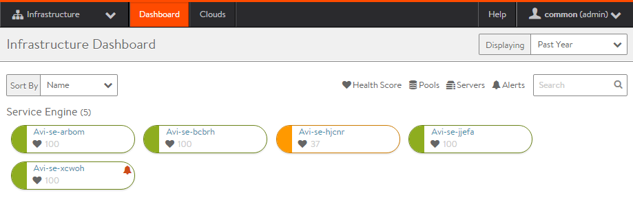</a>

All SEs across all clouds are shown. For each SE, the color indicates its health, with a numeric health score also shown next to the heart icon below the name of each SE. Hovering the mouse over the SE icon shows the SE health score breakdown. Clicking the SE name will jump to that SE's page.

## Clouds

Clouds are containers for the environment that Vantage is installed or operating within. During initial setup of Vantage, a default cloud, named "Default-Cloud", is created. This is where the first Controller is deployed, into Default-Cloud. Additional clouds may be added, containing SEs and virtual services.

If deploying redundant Controllers in a 3-node cluster, all 3 Controllers must be deployed into the same cloud.

A Controller is not limited to a single cloud, and also can belong to Controller clusters in other clouds.

The cloud table presents a list of the configured clouds.

* **Name:** The name of the cloud. The initial cloud is always named Default-Cloud.
* **Type:** Vantage may be installed in many types of environments, such as vCenter, OpenStack, or bare metal servers (no orchestrator). Vantage may be deployed into multiple environments, but only once per type. For example, a single Vantage deployment may connect to only one vCenter.
* **Status:** The colored status icon indicates the readiness of the cloud. Hovering the mouse over the icon provides more information about the status, such as ready for use or incomplete configuration.
* **Additional Icons:** The far right column of the table has a number of additional icons. The exact icons shown will depend on the clouds configured and their status.  
    * **Edit:** Open the edit modal for the cloud.
    * **Convert:** Convert the cloud from read access mode or write access mode to no access mode. When in no access mode, Avi Controllers do not have access to the cloud's orchestrator, such as vCenter. See the installation documentation for the orchestrator to see the full implications of no access mode.
    * **Expand:** Click the plus icon or anywhere within the table row to expand the row and show more information about the cloud. For instance, in AWS the Region, Availability Zone, and Networks are shown.
    * **Download SE Image:** When Vantage is deployed in read access mode or no access mode, SEs must be installed manually. Use this button to pull the SE image for the appropriate image type (ova or qcow2). The SE image will have the Controller's IP or cluster IP address embedded within it, so an SE image may only be used for the Vantage deployment that created it.
    * **Generate Token:** Authentication tokens are used for securing communication between Controllers and SEs. If Vantage is deployed in read access mode or no access mode, the SE authentication tokens must be copied manually by the Vantage user from the Controller web interface to the cloud orchestrator. For example, in a VMware deployment, the OVF template deployment dialog requires the Controller's authentication token as one of the input values.If needed for your read access mode or no access mode deployment, click this icon to display the Controller's authentication token, then copy-and-paste the token into the appropriate field in the cloud orchestrator interface. (See the Vantage installation guide for your infrastructure type for details.)
    * **Install LBaaS Plugin:** For OpenStack clouds, this icon opens the LBaaS plugin dialog. Input the information regarding the Neutron server to install the plugin. Vantage will automatically push the LBaaS package to Neutron. If other considerations prevent using this method to install the plugin, such as requiring an SSH key instead of a Neutron password, then manually install by downloading the plugin from avinetworks.com/portal. 

### Cloud Creation

An initial cloud is created by default when Vantage is first deployed, and is documented in the Installation Guide for the appropriate cloud environment. To add an additional cloud, click the green New button to add the new cloud to the Vantage deployment.

Select the desired cloud. For deploying Avi SEs on bare metal servers, select No Orchestrator. This step is for the virtualization infrastructure and orchestrator. Supported network SDN technologies such as Cisco APIC or Nuage may be configured as additional properties of the cloud for which they are supported.

<a href="img/inf_cloud_create-withmesos.jpg">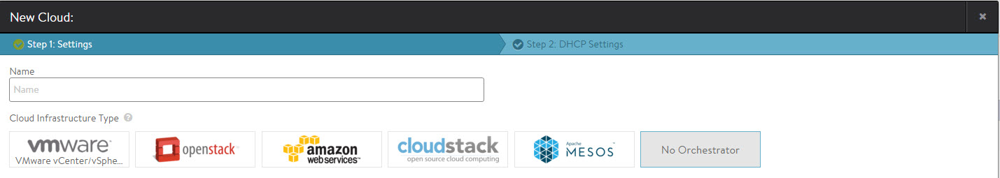</a>

Vantage supports hybrid deployments. A single deployment can exist in multiple environments (for example, VMware and OpenStack) at the same time. Vantage does not support multiple clouds of the same type. For instance, Vantage cannot be deployed in write access mode into multiple VMware vCenter clouds.

### Cloud Management

Clicking on the name of a cloud allows configuration of infrastructure objects within the environment. Each of these objects are specific to this cloud. For instance, a default static route configured in cloud 1 is only applicable to SEs in that cloud, and will not affect SEs in another cloud.

### Service Engines

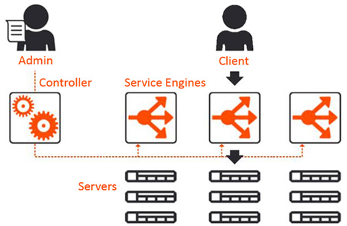 Avi Service Engines (SEs) handle all of the data plane operations within Vantage. SEs host the virtual services and require either direct or routable access to all client and server networks a virtual service touches.

A typical Vantage deployment may have many SEs for various purposes, such as redundancy, scalability, and accommodating large numbers of applications being served. SEs are always grouped within the context of a SE group, which provides settings for high availability, scalability, and potentially resource isolation for tenants.

* <a href="#service-engines">Service Engines Page ›</a>
* <a href="#service-engine-details">Service Engine Quick Info Popup ›</a>
* <a href="#create-service-engine">Create a Service Engine ›</a>
* <a href="#delete-service-engine">Delete a Service Engine ›</a> 

### Service Engines Page

The Service Engines page lists the SEs that are currently configured in Vantage.

<a href="img/se-list.png">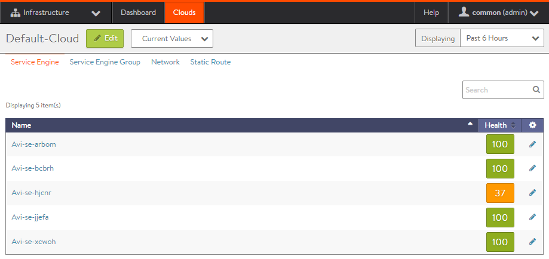</a>

To display the SE list for a cloud, select Infrastructure > Clouds, click on a cloud name, and click Service Engines.

This page includes the following functions:

* **Search:** Search through the list of object names.
* **Edit:** Opens the Edit Service Engine popup. 

This page contains the following information for each SE in the selected cloud:

* **Name:** Lists the name of each SE. Clicking the name of an SE opens the Analytics tab of the Service Engine Details page.
* **Health:** Provides both a numeric health score from 1-100 and a color-coded status to provide quick information about the health of the SE.  
    * Hovering the cursor over the score opens the Health Score popup for the SE.
    * The View Health link at the bottom of the popup opens the Health tab of the Service Engine Details page.
    * Clicking within the Health Score opens the Analytics tab of the Service Engine Details page. > <strong>Note:</strong> Clicking on blank space in the Service Engine row will expand the row to show the list of virtual services assigned this this SE.
 

### Service Engines Details Page

The Service Engine Details page shows information about the currently selected SE.

<a href="img/se-details-drilleddown.png">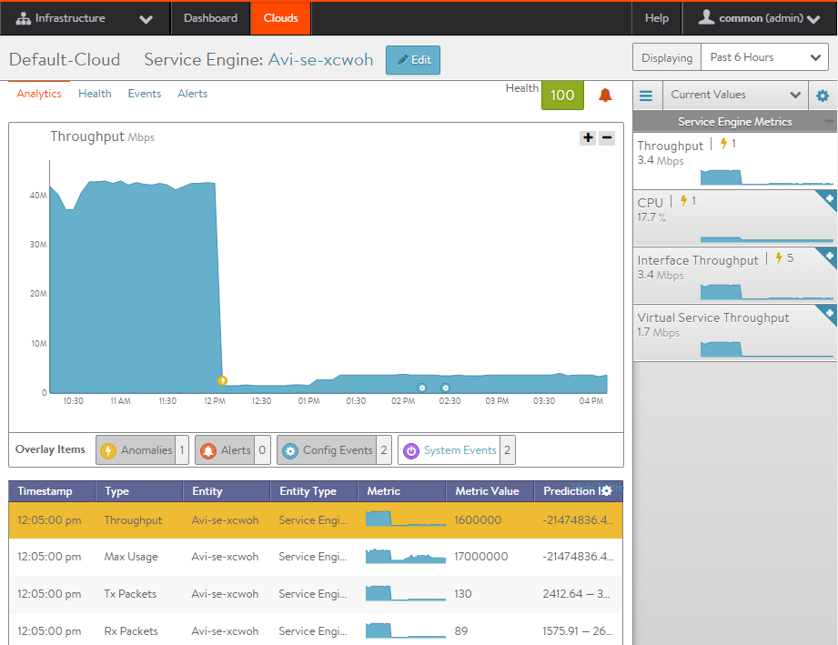</a>

This page contains the following popup and tabs:

* <a href="#quickinfo-popup">Quick Info Popup ›</a>
* <a href="#analytics-tab">Analytics Tab ›</a>
* <a href="#health-tab">Health Tab ›</a>
* <a href="#events-tab">Events Tab ›</a>
* <a href="#alerts-tab">Alerts Tab ›</a> 

### Service Engine Quick Info

Hovering over or clicking the name of the SE in the top left corner of the Service Engine Details page opens the Service Engine Info popup for that SE.

<a href="img/se-details-hoverover.png">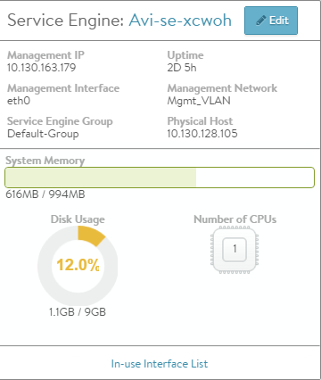</a>

This popup provides the following information for the SE:

* **Management IP:** IP address the SE uses to communicate with the Controller.
* **Uptime:** The amount of time in days and hours that the SE has been either active or down.
* **Management Interface:** Network interface being used to allow the SE to communicate with the Controller. This address is reserved for management, and is not used for data plane or load balanced traffic. If management and data plane traffic will share the same network, they will still use two separate network interfaces and IP addresses.
* **Management Network:** Network used by the SE to communicate with the Controller. This may be the same network as one of the data networks used for load balancing. Best practice is to utilize a separate, dedicated network for control plane communications.
* **Service Engine group:** SE group that this SE belongs to. If you did not create an SE group, or the virtual service was not assigned to a unique SE group, then a new SE will default to the Default SE group.
* **Physical Host:** IP address of the physical server hosting the virtual machine on which the SE is running.
* **System Memory:** Amount of used versus available memory. Memory utilization should not exceed 90% for an extended period of time.
* **Disk Usage:** Percentage of allocated storage space being used by the SE. By default, an SE will be allocated 10 GB of storage. As the storage becomes full, logs may be purged prior to indexing. Adding more storage to a SE allows a greater volume of logs to be stored.
* **Number of CPUs:** Number of virtual CPU cores allocated to the SE. An idle SE will still consume some CPU as it is running normal housekeeping processes. An SE should not exceed 90% for an extended period of time as it may introduce latency in client transactions. 

### Service Engine Analytics

The Analytics tab presents information about various performance metrics over the time period selected.

### Service Engine Analytics: Metrics

The following metrics are available for SEs:

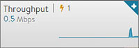

* **Throughput:** Total bandwidth flowing through the SE for all virtual services being hosted by that SE. This includes the bandwidth flowing in and out of the SE between the client and the virtual service, and the traffic between the SE and the servers. Thus, an SE may report approximately double the throughput of its virtual services. 

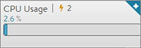

* **CPU Usage:** Displays the utilization of the CPUs allocated to the SE. The total number of CPUs appears in the Service Engine Quick Info Popup. Under normal conditions, CPU usage should not regularly exceed 90%, as this may cause latency in the virtual services and disrupt the client experience. The CPU Usage metric tile shows a horizontal bar indicating current usage, with a red line at the right to indicate how close the SE is to pushing the limits of its available CPU capacity.You may indirectly control or improve CPU usage by taking actions, such as:  
    * **Configuration:** Changing the configuration of virtual services, such as changing SSL or compression settings, will impact the CPU usage.
    * **CPU Allocation:** Allocating more vCPUs per SE. The default setting is two vCPUs per SE. Increasing this number is particularly useful for tasks such as SSL termination or compression which heavily consume CPU resources. The setting for the number of vCPUs assigned to an SE is in the SE group.
    * **Scale Out:** Reduce the CPU load by scaling this SE's virtual services across additional SEs, which will increase the total capacity and reduce the load on this SE. The high availability setting of the SE group dictates when a virtual service should be scaled out across additional SEs or simply migrated away from a busy SE.
    * **CPU Reservation:** By default, CPUs resource is not reserved in a VMware deployment. Within vCenter, you may enable reservation for the SE's virtual machine, which guarantees that other virtual machines sharing the same physical host server will not be able to borrow or compete for CPU resources. This setting may be changed in the SE group properties. Changes will take effect for new SEs only. To make this change for existing SEs, it must be manually changed within vCenter. Refer to your VMware documentation. 

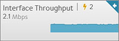

* **Interface Throughput:** Shows the combined throughput for all network interfaces utilized by this SE. Throughput is measured as both client and server side of any virtual services, plus the management traffic between the SE and the Controllers. 

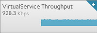

* **Virtual Service Throughput:** Shows the combined throughput for all network interfaces utilized by this SE. Throughput is measured as both client and server side of any virtual services, plus the management traffic between the SE and the Controllers. 

### Service Engine Analytics: Chart Pane

The main chart pane in the middle of the Analytics tab displays a detailed historical chart of the selected Metric tile for the current virtual service, pool, or SE.

* Hovering the mouse over any point in the chart will display the results for that selected time in a popup window.
* Clicking within the chart will freeze the popup at that point in time. This may be useful when the chart is scrolling as the display updates over time.
* Clicking again will unfreeze the highlighted point in time. 

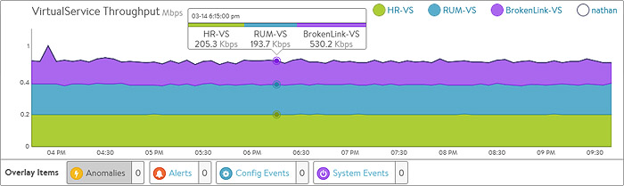

Many charts contain radio buttons in the top right that allow you to customize which data should be excluded from the chart. For example, if the End to End Timing chart is heavily skewed by one very large metric, then deselecting that metric by clearing the appropriate radio button will re-factor the chart based on the remaining metrics shown. This may change the value of the vertical Y-axis.

Some charts also contain overlay items, which will appear as color-coded icons along the bottom of the chart.

### Service Engine Analytics: Overlays Pane

The overlays pane allows you to overlay icons signifying important events within the timeline of the chart pane. This feature helps you correlate anomalies, alerts, configuration changes, and system events with changes in traffic patterns.

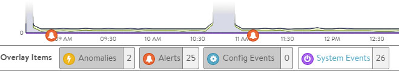

Within the overlays pane:

* Each overlay type displays the number of entries for the selected time period.
* Clicking an overlay button toggles that overlay's icons in the chart pane. The button lists the number of instances (if any) of that event type within the selected time period.
* Selecting an overlay button displays the icon for the selected event type along the bottom of the chart pane. Multiple overlay icon types may overlap. Clicking the overlay type's icon in the chart pane will bring up additional data below the Overlay Items bar. The following overlay types are available:  
    * **Anomalies:** Display anomalous traffic events, such as a spike in server response time, along with corresponding metrics collected during that time period.
    * **Alerts:** Display alerts, which are filtered system-level events that have been deemed important enough to notify an administrator.
    * **Config Events:** Display configuration events, which track configuration changes made to Vantage by either an administrator or an automated process.
    * **System Events:** Display system events, which are raw data points or metrics of interest. System events can be noisy, and are best used by alerts which filter and classify these raw events by severity. 

### SE Analytics: Anomalies Overlay

The Anomalies overlay displays periods during which traffic behavior was considered abnormal based on recent historical moving averages. Changing the time interval will provide greater granularity and potentially show more anomalies. Clicking the Anomalies Overlay button displays yellow anomaly icons in the chart pane, which can scroll down to view additional information related to that anomaly. During times of anomalous traffic, Vantage records any metrics that have deviated from the norm, which may provide hints as to the root cause of the anomaly.
> Note: An anomaly is defined as a metric that has a deviation of 4 sigma or greater across the moving average of the chart. 
> Note: Anomalies are not recorded or displayed in the real time mode.
 

These metrics are defined as follows:

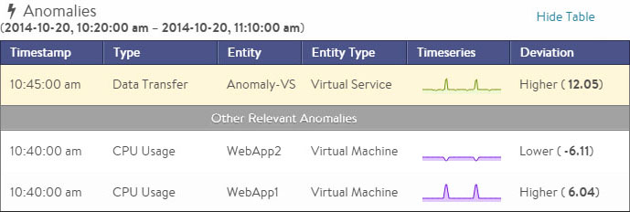

* **Timestamp:** Date and time when the anomaly was detected. This may either span the full duration of the anomaly, or merely be near the same time window.
* **Type:** The specific metric deviating from the norm during the anomaly period. To be included, the metric deviation must be greater than 4 sigma. Numerous types of metrics, such as CPU utilization, bandwidth, or disk I/O may trigger anomalous events.
* **Entity:** Name of the specific object that is reporting this metric.
* **Entity Type:** Type of entity that caused the anomaly. This may be one of the following:  
    * Virtual Machine (server); these metrics require Vantage to be configured for either read or write access to the virtualization orchestrator such as vCenter or OpenStack. In the example above, CPU utilization of the two servers was learned by querying vCenter.
    * Virtual service
    * SE
* **Time Series:** Thumbnail historical graph for the selected metric, including the most current value for the metric which will be data on the far right. Moving the mouse over the chart pane will show the value of the metric for the selected time. Use this to compare the normal, current, and anomaly time periods.
* **Deviation:** Change or deviation from the moving average, either higher or lower. The time window for the moving average depends on the time series selected for the Analytics tab. 

### SE Analytics: Alerts Overlay

The Alerts overlay displays the results of any events that meet the filtering criteria defined in the Alerts tab. Alerts notify administrators about important information or changes to a site that may require immediate attention.

Alerts may be transitory, meaning they may expire after a defined period of time. For instance, Vantage may generate an alert if a server is down and then allow that alert to expire after a specified time period once the server comes back online. The original event remains available for later troubleshooting purposes.

Clicking the Alerts icon in the Overlay Items bar displays any red Alerts icons in the chart Pane. Selecting one of these chart alerts will bring up additional information below the Overlay Items bar, which will show the following information:

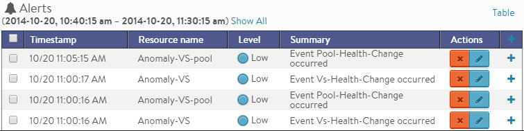

* **Timestamp:** Date and time when the Alert occurred.
* **Resource Name:** Name of the object that is reporting the Alert.
* **Level:** Severity of the Alert. You can use the priority level to determine whether additional notifications should occur, such as sending an email to administrators or sending a log to Syslog servers. The level may be one of the following:  
    * **High:** Red
    * **Medium:** Yellow
    * **Low:** Blue
* **Summary:** Brief description of the event.
* **Actions:**  
    * **Dismiss** the Alert with the red X to remove it from both the list shown and the Alert icon the chart pane. Dismissing an Alert here is the same as dismissing it via the bell icon at the top of the screen next to the Health Score, or dismissing it via the Alerts tab.
    * **Edit** the Alert filter to make Vantage more or less sensitive to generating new <a href="/docs/17.1/configuration-guide/operations/alerts/">alerts</a>.
* **Expand/Contract:** Clicking the plus (+) or minus sign (-) for an Alert opens and closes a sub-table showing more detail about the Alert. This will typically show the original events that triggered the alert. 

### SE Analytics: Config Events Overlay

The Config Events overlay displays configuration events, such as changing the Vantage configuration by adding, deleting, or modifying a pool, virtual service, or SE, or an object related to the object being inspected. If traffic dropped off at precisely 10:00 a.m., and at that time an administrator made a change to the virtual services security settings, there's a good chance the cause of the change in traffic was due to the (mis)configuration.

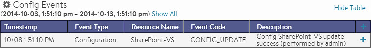

Clicking the Config Events icon in the Overlay Items bar displays any blue Config Event icons in the chart pane. Selecting one of these chart alerts will bring up additional information below the Overlay Items bar, which will show the following information:

* **Timestamp:** Date and time when the configuration change occurred.
* **Event Type:** Always be scoped to *Configuration* event types.
* **Resource Name:** Name of the object that has been modified.
* **Event Code:** There are three event codes:  
    * CONFIG_CREATE
    * CONFIG_UPDATE
    * CONFIG_DELETE
* **Description:** Brief description of the event.
* **Expand/Contract:** Clicking the plus (+) or minus sign (-) for a configuration event either expands or contracts a sub-table showing more detail about the event. When expanded, this shows a difference comparison of the previous configuration versus the new configuration, as follows:  
    * Additions to the configuration, such as adding a health monitor, will be highlighted in green in the new configuration.
    * Removing a setting will be highlighted in red in the previous configuration.
    * Changing an existing setting will be highlighted in yellow in both the previous and new configurations. 

### SE Analytics: System Events Overlay

This overlay displays System Events relevant to the current object, such as a server changing status from up to down or the health score of a virtual service changing from 50 to 100.

Clicking the System Events icon in the Overlay Items bar displays any purple System Event icons in the chart pane. Select a system event icon in the chart pane to bring up more information below the Overlay Items bar.

* **Timestamp:** Date and time when the system even occurred.
* **Event Type:** This will always be System.
* **Resource Name:** Name of the object that triggered the event.
* **Event Code:** High-level definition of the event, such as VS_Health_Change or VS_Up.
* **Description:** Brief description of the system event.
* **Expand/Contract:** Clicking the plus (+) or minus sign (-) for a system event expands or contracts that system event to show more information. 

### Service Engine Health

The health score of an on object is comprised from the following scores:

* **Performance:** Performance score (1-100) for the selected item. A score of 100 is ideal, meaning clients are not receiving errors and connections or requests are quickly returned.
* **Resource Penalty:** Any penalty assessed because of resource availability issues is assigned a score, which is then subtracted from the Performance score. A score of 0 is ideal, meaning there are no obvious resource constraints on Vantage or virtualization orchestrator connected servers.
* **Anomaly Penalty:** Any penalty assessed because of anomalous events is assigned a score, which is then subtracted from the Performance score. An ideal score is 0, which means Vantage has not seen recent anomalous traffic patterns that may imply future risk to the site.
* **Health Score:** The final health score for the selected item equals the Performance Score minus the Resource and Anomaly Penalty scores. 

The sidebar tiles show the scores of each of the three subcomponents of the health score, plus the total score. To determine why an object such as a virtual service has a low health score, select one of the first three tiles that is showing a subpar score.

This will bring up additional sub-components for the top level metric, such as pools, connection Apdex, Response Apdex, or others. Again, select the tile that is showing the worst score. Some tiles may have additional information shown in the main chart section that requires scrolling down to view. Clicking on a tile for another object such as a pool or SE will jump to the Insights page for that object.

The chart pane of the tab shows a detailed graph of the selected score:

* Clicking any of the summary Metrics tiles on the sidebar displays the detailed version of that graph in the chart pane of the tab. Additional details may display at the bottom of the tab that show various factors contributing to that score.
* Hovering your mouse cursor over any of the charts displays the health score for the selected date and time on all graphs. 

### Service Engine Events

The Events tab presents system-generated events over the time period selected for the SE. System events are applicable to the context in which you are viewing them. For example, when viewing events for a SE, only events that are relevant to that object are displayed.

<a href="img/se-details-events.png">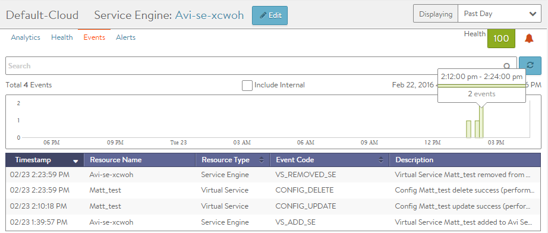</a>

The top of this tab displays the following items:

* **Search:** The Search field allows you to filter the events using whole words contained within the individual events.
* **Refresh:** Clicking Refresh updates the events displayed for the currently-selected time.
* **Number:** The total number of events being displayed. The date/time range of those events appear beneath the Search field on the left.
* **Clear Selected:** If filters have been added to the Search field, clicking the Clear Selected (**X**) icon on the right side of the search bar will remove those filters. Each active search filter will also contain an **X** that you can click to remove the specific filter.
* **Histogram:** The Histogram shows the number of events over the period of time selected. The X-axis is time, while the Y-axis is the number of events during that bar’s period of time.  
    * Hovering the cursor over a Histogram bar displays the number of entries represented by that bar, or period of time.
    * Click and drag inside the histogram to refine the date/time period which further filters the events shown. When drilling in on the time in the Histogram, a Zoom to selected link appears above the Histogram. This expands the drilled in time to expand to the width of the Histogram, and also changes the Displaying pull-down menu to Custom. To return to the previously selected time period, use the Display pull-down menu. 

The table at the bottom of the **Events** tab displays the events that matched the current time window and any potential filters. The following information appears for each event:

* **Timestamp:** Date and time the event occurred. Highlighting a section of the histogram allows further filtering of events within a smaller time window.
* **Event Type:** This may be one of the following:  
    * **System:** System events are generated by Vantage to indicate a potential issue or create an informational record, such as VS_Down.
    * **Configuration:** Configuration events track changes to the Vantage configuration. These changes may be made by an administrator (through the CLI, API, or GUI), or by automated policies.
* **Resource Name:** Name of the object related to the event, such as the pool, virtual service, SE, or Controller.
* **Event Code:** A short event definition, such as Config_Action or Server_Down.
* **Description:** A complete event definition. For configuration events, the description will also show the username that made the change.
* **Expand/Contract:** Clicking the plus (+) or minus sign (-) for an event log either expands or contracts that event log. Clicking the + and – icons in the table header expands and collapses all entries in this tab. 

For configuration events, expanding the event displays a difference comparison between the previous and new configurations.

* New fields will appear highlighted in green in the new configuration
* Removed fields will appear highlighted in red.
* Changed fields will show highlighted in yellow. 

### Service Engine Alerts

The Alerts tab displays specified events that have trigger an alert. Alert actions can be configured, and proactive notifications generated via Syslog or email in the Notifications tab of the Administration page. Alerts act as filters that provide notification for prioritized events or combinations of events through various mechanisms such as the Vantage web interface, email, or Syslog. Vantage includes a number of default alerts based on events deemed to be universally important.

The top of this tab shows the following items:

* **Search:** The Search field allows you to filter the alerts using whole words contained within the individual alerts.
* **Refresh:** Clicking Refresh updates the alerts displayed for the currently-selected time.
* **Number:** The total number of alerts being displayed. The date/time range of those alerts appear beneath the Search field on the left.
* **Dismiss:** Select one or more alerts from the table below then click Dismiss to remove the alert from the list. > Note: Alerts are transitory, meaning they will eventually and automatically expire. Their intent is to notify an administrator of an issue, rather than being the definitive record for issues. Alerts are based on events, and the parent event will still be in the events record.
 

The table at the bottom of the Alerts tab displays the following alert details:

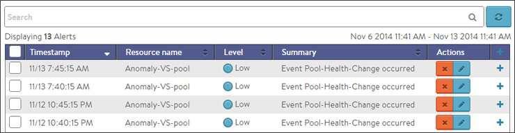

* **Timestamp:** Date and time when the alert was triggered. Changing the time interval using the Displaying pull-down menu may potentially show more alerts.
* **Resource Name:** Name of the object that is the subject of the alert, such as a Server or virtual service.
* **Level:** Severity level of the alert, which can be High, Medium, or Low. Specific notifications can be set up for the different levels of alerts via the Administration page's Alerts Overlay.
* **Summary:** Summarized description of the alert.
* **Action:** Click the appropriate button to act on the alert:  
    * **Dismiss:** Clicking the red **X** dismisses the alert and removes it from the list of displayed alerts.
    * **Edit:** Clicking the blue pencil icon opens the Edit Alert Config popup for the alert configuration that triggered this alert. This can include a verbose and customized description of the alert or allow an administrator to alter settings such as the severity of the alert.
* **Expand/Contract:** Clicking the plus (**+**) or minus sign (**-**) for an event log either expands or contracts that event log to display more information. Clicking the **+** and **–** icon in the table header expands and collapses all entries in this tab 

### Service Engine Create: Write Access Mode Deployments

An Avi Controller that is deployed in write access mode has full write access to the virtualization platform and can automatically deploy new SEs and modify the network configuration of existing SEs. The Controller will place the virtual service on a SE within a cluster and host that has optimal reachability to the servers. In a new Vantage deployment, the first SE will not be created until the first virtual service is created, as this is required to know which server network will be used.

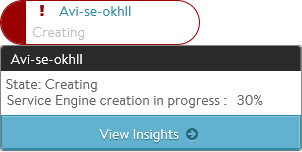 The health score of a newly created virtual service will appear as gray with an exclamation point while the SE is being created; hovering the mouse over the health score will show the status as Creating. During this time, the Controller copies the SE image file from itself to the host server, sets up virtual machine settings via the virtualization orchestrator, then sets the network adapters and IP addresses required to reach clients and servers. This process may take anywhere from a few seconds to a few minutes, depending on the time it takes to copy the SE image across the network to a physical host. If creation of the SE fails, the Controller will wait for five minutes and then attempt to recreate the SE on a new host.

In an established environment, a new virtual service may use an existing SE and thus be brought up immediately. Preferences for high availability, scalability, and number of virtual services per SE are defined within the SE group settings.

If all virtual services for a SE are deleted and the SE is no longer in use, the Controller will wait 120 minutes before automatically removing the unused SE. This setting may be configured via the SE group properties.

### Service Engine Create: Read/No Access Mode Deployments

When Vantage is deployed in read access mode or no access mode, Vantage does not have write access to the virtualization infrastructure. In this case, an administrator must manually perform any operations that require write access to the virtualization environment (create and delete SEs and configure network settings).

A new virtual service may be able to use an existing SE, though it may still require an administrator to change the network settings such as adding a new network interface into a port group required for access to servers.

Creating a new SE when the Avi Controller has Read or no access to the virtualization platform is almost identical to the process described in the Installation Guide for your selected virtualization platform, except that:

* If the data plane network interfaces (those processing load balanced traffic) need to be set to a static IP address, an administrator will need to manually match the network interface shown in the Avi Controller with the Network Adapter shown in the virtualization platform. The Controller cannot poll the Network Name because it does not have access to the virtualization platform.
* An admin will need to find the MAC Address of the virtual machine's network adapter that clients wish to use, and then correspond that to the MAC Address shown in the Edit a Service Engine popup. 

### Edit a Service Engine

The Edit Service Engine popup allows an administrator to modify the network settings for the SE. To edit an SE, select Infrastructure > Service Engines and click on the SE name or on the edit icon.

<a href="img/se-edit.png">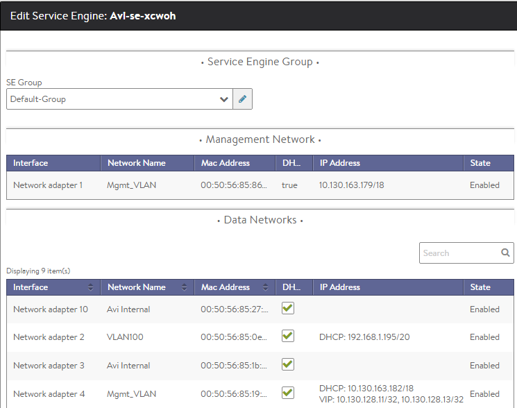</a>
> <strong>Note:</strong> Properties such as hardware resources and VLAN placement are configured within the SE group.
 

Many networking properties can be configured on the Networks tab and in the Service Engine Edit popup. Editing the SE properties will only affect the specific SE being modified; you will need to manually modify any new SE created thereafter. If Vantage has No access to the hypervisor, the administrator will need to manually edit the network and IP settings for each SE. For deployments in write access mode, editing the values on the Network tab is needed to ensure that any new SE will inherit the desired settings.

* **Service Engine Group:** An SE may be manually migrated to a different SE group by selecting the new SE group from the dropdown menu. Moving a SE is not graceful. It will first terminate any existing connections.
* **DHCP:** DHCP may be enabled per network interface, not per IP network. This is the default setting for all network interfaces. An SE attempting to use DHCP to acquire an IP address will retry every five minutes and will generate an error in the events log if it is unsuccessful.**Note:** A single interface may have multiple networks configured. It is therefore possible to have both DHCP and static IP addresses configured for a single interface.
* **Default Gateway:** Enter a new IP address for the gateway in the Default Gateway field. 

### Delete a Service Engine

An SE may be deleted for many reasons, such as:

* Placement on a different physical host.
* Updating resource sizes (e.g., number of vCPUs)
* Reduced load no longer requires as many SEs. 

If Vantage is deployed to have write access mode to the hypervisor orchestrator, Vantage will automatically delete unused SEs. If Vantage is deployed in read access mode or no access mode, SEs may be deleted from the Controller, but it will still require an administrator to manually delete the SE from the virtualization platform.

**Note: To delete an SE from a Controller immediately rather than wait for the SE to time out based on the SE group settings, use the CLI or API.**

### Service Engine Group

An SE group is a collection of one or more SEs that may share properties, such as network access and failover. An SE cannot scale out across or fail over to an SE which is in a different SE group, even if both SEs share the same physical host or network properties. Different applications can thus receive guaranteed data plane isolation when deployed on different SE groups.

Virtual services created in a new Vantage deployment will be assigned to the Default-Group SE group. To deploy virtual services to a different SE group:
<ol> 
 <li>Create a new SE group.</li> 
 <li>Move or create the new virtual service in the new group using the Advanced tab of the Edit Virtual Service page.</li> 
</ol> 

When creating a new SE group in write access mode, no new SEs will be created until a virtual service is deployed to the SE group. In read access mode or no access mode deployments, the new SEs must be manually created. They will attempt to connect back to the Controller after they have booted up, at which point they will be added to the Default SE group. SEs in read access mode and no access mode deployments can be migrated to a new SE group, provided all virtual services deployed on the SE are disabled.

SEs in write access mode deployments cannot be migrated to new SE groups. Instead, the old SE is deleted and a new SE is created. This process is automatic if the virtual services are migrated.

### Service Engine Groups Page

The Service Engine Groups page lists the configured SE groups<a href="img/Screen-Shot-2016-07-08-at-3.25.20-PM.png">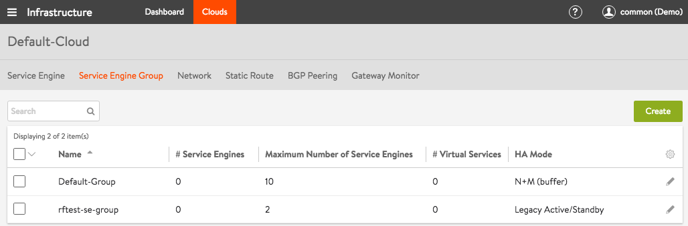</a>

The table on this page contains the following information for each SE group:

* **Name:** Lists the name of each SE group.
* **/# Service Engines:** Shows the number of SEs assigned to the SE group. If the value is non-zero, clicking the row on the table will show an expanded view with the names of SEs.
* **Maximum Number of Service Engines:** Maximum number of SEs the group can contain.
* **/# Virtual Services:** Shows the number of virtual services currently assigned to the SE group. If the value is non-zero, clicking the row on the table will show an expanded view with the names of virtual services.
* **HA Mode:** High availability mode configured for the group. 

To delete an SE group, click the box at the far left of its row. A Delete button will appear. Click Delete to delete the SE groups whose rows have been checked.

**Note:** Only unused SE groups may deleted. If the SE group is in use by a virtual service, a popup will warn that dependent virtual services must first be deleted or migrated to other SE groups via the Virtual Service > Edit > Advanced properties tab. A tenant must always have a minimum of one configured SE group. The default SE group may be modified, but not deleted.

### Create a Service Engine Group

To create or edit an SE group:
<ol> 
 <li>Select Infrastructure &gt; Clouds and click on the cloud name (for example, Default-Cloud).</li> 
 <li>Select Service Engine Group to open the Service Engine Groups page, which lists the SE groups currently configured in Vantage.</li> 
 <li>Click New Service Engine Group or click on an SE group name in the table.</li> 
</ol> 

The create and edit popups for SE groups have identical properties. This popup includes the following tabs:

* Basic Settings Tab
* Advanced Tab 

Basic Settings Tab

Click New in the Edit Service Engine Group popup to open the High Availability tab.

Edit the High Availability settings:

* Name: Enter a unique name for the SE group in the Name field.
* Optionally configure any setting within the High Availability tab.
* Either click the Advanced Tab, or Save to return to the Service Engine Groups page. 

### High Availability Settings

The availability of a virtual service after an SE failure is governed by settings set at the SE group level.

<a href="img/Screen-Shot-2016-07-08-at-3.45.41-PM.png">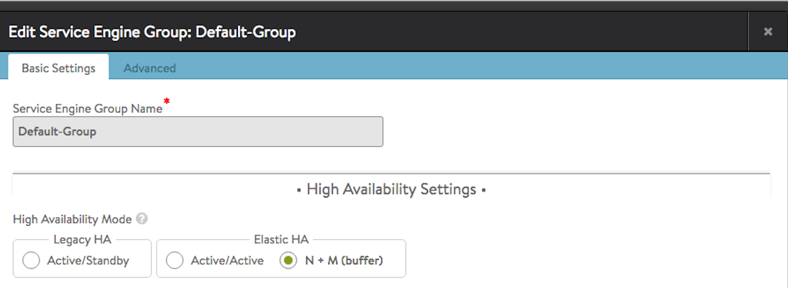</a>

To gain an understanding of the three HA modes defined by Vantage, refer to these articles:

* <a href="/docs/17.1/legacy-ha-for-avi-service-engines/">Legacy HA</a>
* <a href="/docs/17.1/elastic-ha-for-avi-service-engines/">Elastic HA</a> 

### Service Engine Capacity and Limit Settings

<a href="img/se-group-limit-settings.png">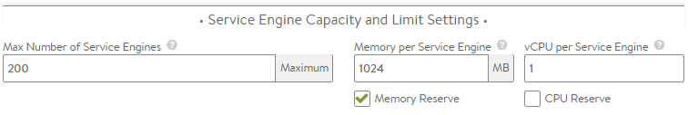</a>

* **Number of Service Engines:** defines the maximum SEs that may be created within a SE group. This number, combined with the virtual services per SE setting, dictate the maximum number of virtual services that can be created within an SE group. If this limit is reached, it is possible new virtual services may not be able to be deployed and will show a gray, undeployed status. This setting can be useful for limiting Vantage from consuming too many virtual machines.
* **Memory per Service Engine:** Enter the amount of RAM, in MB, to allocate to all new SEs. Changes to this field will only affect new SEs. Allocating more memory to an SE will allow larger HTTP cache sizes, more concurrent TCP connections, better protection against certain DDoS attacks, and increased storage of un-indexed logs. This option is only applicable in write access mode deployments.  
    * **Memory Reserve:** Reserving memory ensures an SE will not have contention issues with over-provisioned host hardware. Reserving memory makes that memory unavailable for use by another virtual machine, even when the virtual machine that reserved those resources is powered down. Avi recommends reserving memory, as memory contention may randomly overwrite part of the SE memory, destabilizing the system. This option is applicable only for deployments in write access mode. For deployments in read access mode deployments or no access mode, memory reservation for the SE VM must be configured on the virtualization orchestrator.
* **vCPU per Service Engine:** Enter the number of virtual CPU cores to allocate to new SEs. Changes to this setting do not affect existing SEs. This option is only applicable in write access mode. Adding CPU capacity will help with computationally expensive tasks, such as SSL processing or HTTP compression.  
    * **CPU Reserve:** Reserving CPU capacity with a virtualization orchestrator ensures a SE will not have issues with over-provisioned host hardware. Reserving CPU cores makes those cores unavailable for use by another virtual machine, even when the virtual machine that reserved those resources is powered down. This option is only applicable in write access mode deployments. 

### Advanced Service Engine Group Settings

The Advanced tab in the Edit Service Engine Group popup allows configuration of optional functionality for SE groups. This tab appears only when Avi Vantage is deployed in write access mode deployments.

Note: This tab appears only when Vantage is deployed in write access mode.

<a href="img/se-group-advanced-settings.png">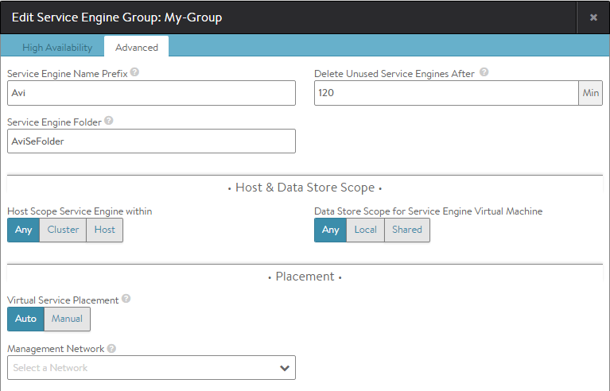</a>

* **Service Engine Name Prefix:** Enter the prefix to use when naming the SEs within the SE group. This name will be seen both within Vantage, and as the name of the virtual machine within the virtualization orchestrator.
* **Service Engine Folder:** SE Virtual Machines for this SE group will be grouped under this folder name within the virtualization orchestrator.
* **Delete Unused Service Engines After:** Enter the number of minutes to wait before the Controller deletes an unused SE. Traffic patterns can change quickly, and a virtual service may therefore need to scale across additional SEs with little notice. Setting this field to a high value ensures that Vantage keeps unused SEs around in case of a sudden spike in traffic. A shorter value means the Controller may need to recreate a new SE to handle a burst of traffic, which may take a couple of minutes. This option is only applicable in write access mode.
* **Host Scope Service Engine Within:** SEs may be deployed on any host that most closely matches the resources and reachability criteria for placement. This setting directs the placement of SEs.  
    * **Any:** The default setting allows SEs to be deployed to any host that best fits the deployment criteria.
    * **Cluster:** Excludes SEs from deploying within specified clusters of hosts. Checking the Include checkbox reverses the logic, ensuring SEs only deploy within specified clusters.
    * **Host:** Excludes SEs from deploying on specified hosts. The Include checkbox reverses the logic, ensuring SEs only be deploy within specified hosts.
* **Data Store Scope for Service Engine Virtual Machine:** Set the storage location for SEs. Storage is used to store the OVA (vmdk) file for VMware deployments.  
    * **Any:** Vantage will determine the best option for data storage.
    * **Local:** The SE will only use storage on the physical host.
    * **Shared:** Vantage will prefer using the shared storage location. Specific data stores may be Excluded or specified via Include.
* **Virtual Service Placement:** When multiple SE groups exist within a tenant, the virtual service's Advanced tab may be used to choose which SE group to deploy the virtual service within. This may be set as a mandatory field to be populated when creating a virtual service, or when Auto is enabled, the Default-Group will be chosen.
* **Management Network:** If the SEs require a different network for management than the Controller, it must be specified here. The SEs will use their management route to establish communications with the Controllers. 

### Service Engine Group Network Settings

The Networks tab presents the list of discovered and manually configured networks within your network environment. Individual networks can be configured for DHCP or a static IP address allocation. For VMware installations, port groups can be mapped to specific subnets.

* **DVS versus Standard Switching:** VMware supports two modes for switching, Distributed Virtual Switching and Standard Switching. Vantage works with both methods; however, some environments may have both enabled at the same time. This will cause issues for Vantage because there may be multiple port groups per subnet, and the Controller may find duplicate networks for the same IP subnets when performing network discovery. Vantage does not know which network should be used to reach clients or servers and may therefore be unable to place a new virtual service or create a SE in the correct network. You can resolve this by excluding a redundant discovered network. The virtual service Advanced and pool Advanced tabs may alternatively be used to mitigate this issue by mandating a virtual service or pool be placed in a specific network.
* **IP Address Allocation:** Vantage requires IP addresses for a SE to communicate on any desired network. By default, a SE requires one IP address for the management network to communicate with the Controller, and a separate IP address for each data network used by its virtual services or pool servers. If the management network and data network are the same, then the SE will still require two IP addresses. You can allocate IP addresses on either a per-SE basis or via the Networks tab.
* **Network versus Service Engine:** Many network related settings may be configured within both the Network tab and the Service Engine Edit popup. Configurations made within the Network tab will be applied to any new SE created via write access mode. Changes made via the Service Engine Edit popup will only be applied to the specific SE modified. 

Select Infrastructure > Networks to open the Networks tab.

The table on this tab provides the following information for each network:

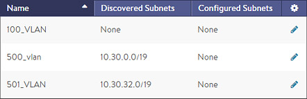

* **Name:** Name of the network.
* **Discovered Subnets:** These subnets are auto-discovered via the virtualization orchestrator. This field may be None, Excluded, or a list of one or more IP networks.
* **Configured Subnets:** These subnets are IP networks manually added within the Vantage configuration. This is often an IP network that could not be automatically discovered. 

### Edit Service Engine Group Network Settings

Click the blue Edit icon to open the Edit Network popup.

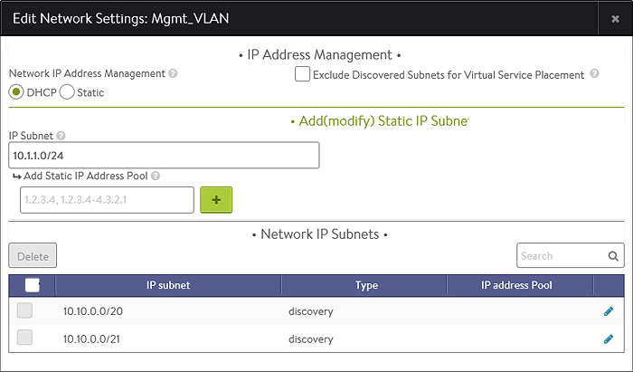

Enter the following information to edit the network:

* **Network IP Address Management:** When the DHCP option is checked, SEs will attempt to acquire any necessary IP addresses via DHCP. If an SE is unable to acquire an IP address, it will wait five minutes and try again. If no DHCP server is available or if the IP address pool is exhausted, the SE will be unable to properly obtain an IP address and may not be able to configure itself or be able to host a virtual service. Setting this option to Static implies the SE will be assigned static IP addresses.
* **Exclude Discovered Subnets:** IP networks that are discovered in a network or port group will be displayed in the blue table below this option. If there are multiple port groups with the same IP network, Vantage will not know which network should be used for the SEs, Virtual Servers, or when communicating with clients or servers. This is most common for VMware environments that use both DVS and standard switching. Excluding the subnets will exclude all subnets discovered for the network. To exclude a single subnet, first exclude all subnets and then re-add the desired subnets using the Add Subnet option.
* **Add Subnets:** Manually add an IP subnet to this network. Use this options along with Exclude Discovered Subnets to override automated discovery for this network.  
    * **IP Subnet:** Specify the IP subnet settings for the new network. For instance: 10.1.1.1/24
    * **Static IP Address Pool:** Instead of using DHCP for IP addresses for this network, SEs can use a statically allocated list of addresses. Add one or more IP addresses, either as a comma separated list or as a dash-separated range. While possible, it is not recommended to use both DHCP and a static IP pool at the same time. The IP pool allows Vantage to dynamically scale out virtual services and add new SEs. If the IP pool is exhausted for this network, then the Controller may not be able to provision or assign new SEs.
* **Save** to return to the Networks tab. 

### Static Route

Static routes allow administrators to determine the next hop path for routed traffic. Static routes may be defined for an IP subnet or a specific IP address, determined by the subnet mask defined.

A static route may also be set as the default gateway. Default gateways may also be defined within the settings of an SE, which will override the global static routes, and will be specific to the modified SE. If DHCP is not used and a default gateway needs to be defined, then it is recommended to define the gateway within the Static Routes tab, which will be applicable to all SEs.

### Static Routes Tab

Select Infrastructure > Networks > Static Routes to open the Static Routes tab. This tab includes the following functions:

* **Search:** Search through the list of routes.
* **Create:** Opens the Create Static Route popup.
* **Edit:** Opens the Edit Static Route popup.
* **Delete:** Delete the selected static routes. 

The table on this tab provides the following information for each static route:

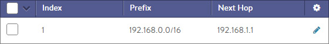

* **Index:** Each static route is given a unique identifier, which is used internally for referencing the route.
* **Prefix:** Any egress traffic from Vantage matching this IP subnet will be sent to the IP address of the next hop gateway. A Prefix set to Default Gateway means all traffic that does not match any other static route Prefix will be forwarded to the Next Hop for the default gateway.
* **Next Hop:** The gateway address to use when routing traffic to the IP network specified by the Prefix. 

### Create/Edit Static Route

The Create Static Route and Edit Static Route popups share the same interface.

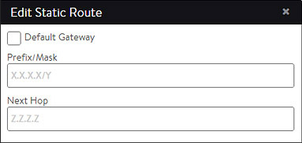

Enter the following information to create or edit a static route:

* Check the **Default Gateway** checkbox if this route should be the default for SEs. A default gateway learned from DHCP will override this gateway and will be displayed in an individual SE.
* **Prefix/Mask:** Any egress traffic from Vantage matching this IP subnet will be sent to the IP address of the next hop gateway. A Prefix set to Default Gateway means all traffic that does not match any other Prefix will be forwarded to the Next Hop for this Prefix entry.
* **Next Hop:** The gateway address to use when routing traffic to the IP network specified by the Prefix.
* **Save** to finish adding or editing the static route.  