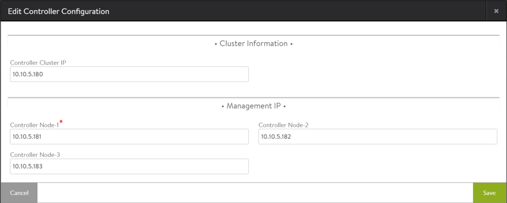
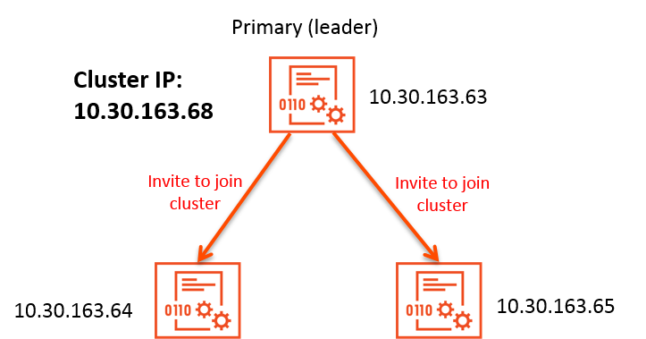

To ensure complete system redundancy, the Avi Controller must be highly available. To provide high availability (HA) for the Avi Controller, add 2 additional Avi Controller nodes to create a 3-node Avi Controller cluster.

HA of the Avi Controller requires 3 separate Controller instances, configured as a 3-node cluster. Start with a single-node Avi Controller deployment and use the following steps to add 2 additional Avi Controller nodes to form a 3-node cluster.

Note: If the cluster is already deployed and you want to modify its node membership or dismantle the cluster, click <a href="/changing-avi-controller-cluster-configuration">here </a>instead.

## Prerequisites for Cluster Deployment

* Leader node:  
    * Leader can be any single node with configuration or without configuration.
    * Leader can have Avi Service Engines (SEs) connected.
    * The node must have a static IP address.  
        * Using DHCP can cause issues when nodes reboot and their IP addresses change.
        * The current release does no support use of hostnames for cluster configuration.
* Follower nodes:  
    * An Avi Controller cluster can have 3 nodes, 1 leader node and 2 follower nodes.
    * Follower nodes are expected to have no configuration, and no changes to the Vantage login credentials.
    * Follower nodes are expected to be of the same Vantage package version as the leader.
    * Follower typically is a VM or Mesos container created from the the Avi Controller installation package.
    * Each follower node must have a static IP address. 

## Deploying an Avi Controller Cluster

In describing this procedure, begin with a single Avi Controller that is already installed and will become the leader node.
<ol> 
 <li><a href="/installation-guides/">Install</a> 2 (two) new Avi Controller nodes. It is recommended that each Avi Controller should be on the same management network as the Avi Controller that was already installed. See<a href="/clustering-controllers-from-different-networks"> Clustering Controllers from Different Networks</a> if they cannot be on the same management network. Do not perform any configuration on these newly installed Avi Controller nodes.</li>
 <li><a href="/controller-cluster-ip">Controller cluster IP</a>: Choose an IP address to use as the <a href="/controller-cluster-ip">Cluster IP address</a>.
  <ul> 
   <li>For OpenStack deployments, choose one of the following options: 
    <ul> 
     <li>Option A: Pick an unused IP address from the same network to which the Avi Controllers are connected. During clustering, the Avi Controller will automatically create a Neutron port with the cluster IP as a fixed IP address. This ensures that Neutron does not assign that IP address for some other purpose.</li> 
     <li>Option B: Explicitly create a Neutron port and then use the IP address assigned to that port as the cluster IP address.</li> 
    </ul> </li> 
  </ul> </li> 
 <li>Use a web browser to navigate to the management IP address of the Avi Controller that was already installed.</li> 
 <li>Navigate to Administration &gt; Controller, and click Edit. The Edit Controller Configuration popup appears.</li> 
 <li>In the Controller Cluster IP field, enter the shared IP address for the Controller cluster.</li> 
 <li>In the Controller Node-2 and Controller Node-3 fields, enter the management IP addresses of the new Controller nodes.</li> 
</ol> 

After these steps, the incumbent Controller becomes the leader of the cluster and invites the other Controllers to the cluster as follower members. Vantage then performs a warm reboot of the cluster. This process can take 2-3 minutes. The configuration of the leader Avi Controller node is synchronized to the new follower nodes when the cluster comes online following the reboot.

The leader Avi Controller assigns the cluster IP address as a secondary IP address to its management interface.  

 

For OpenStack deployments, the leader also performs a Neutron API call to set cluster IP address in the list of allowed-address-pairs for the Neutron port corresponding to its management interface.  

In order to use FQDNs instead of IP address of controller nodes, refer to <a href="/cluster-configuration-with-fqdn/">this</a> page.

## Transition Process

* Trust is established between the leader and new followers over HTTPS.
* The leader exports cluster state information to each follower over SSH.
* Each node locally applies the cluster state information, and restarts services.
* Existing Avi SEs, originally connected to only the leader node, detect the cluster membership changes and connect to all the Avi Controller nodes in the cluster. 

Note: During this transition, the REST API is not available. Generally, the transition takes 4-10 minutes.

### Transition Status

The progress of transition to a 3-node cluster is indicated by the following status messages:

* **Configuration is in progress:** During this phase, Vantage verifies the configuration and verifies the state information on each of the new nodes. Only nodes with no state can be added to the cluster. Vantage also updates the cluster database, and launches a configuration script on each of the nodes.
* **Inaccessible:** Avi Controller processes are restarted.
* **Restoring:** Vantage configuration is synchronized across all nodes.
* **Waiting for Service Engines to connect:** Vantage waits for any known SEs that have not yet connected to and registered with any of the Avi Controller nodes.
* **Ready** 

If dismantling a cluster (returning to only a single Avi Controller node), the status messages are the same. However, during the *Configuration is in progress* phase, the state information on the followers is ignored.

