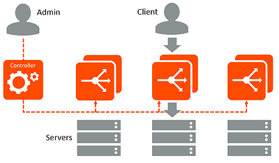
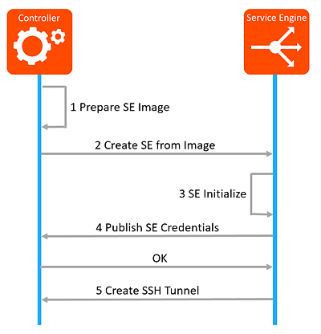

Avi Controllers continually exchange information securely with Service Engines (SEs). Likewise, in cluster deployments (multiple Controllers), the Controllers also continually exchange information with one other, securely. SEs perform data plane operations such as load balancing, and report related information to the Controllers. This information includes server health, client connection information, and request logs. In cluster deployments, the multiple Controllers share the workload for log processing and analytics.

Controllers also may sometimes send commands down to the SEs, for example to make configuration changes. During normal operation, this management traffic may average a few Kb/s per SE. Spikes in communication may occur if the Controller requests full client logs, which may potentially be several GB in size.

## SE to Controller Session Setup

Controllers and SEs communicate using SSH port 22 over their management IP addresses. When a new SE is deployed and is connected to the network, it contacts the Controller to set up a secure management session. (The management IP addresses of the SE and Controller are included in the SE's meta-information.) The SE and Controller exchange keys and establish an encrypted connection over port 22. Once the connection is fully established, the Controller pushes down the relevant configuration to the SE. Controllers never initiate these connections. They are always initiated by the SEs.

### Trust Establishment

* Create a domain of trust within a given instance of the Controller Cluster and the set of Service Engines that are created by this Cluster
* Secure Transport using SSH port forwarding to secure all the services in the Controller  
    * Use internal users - *aviseuser* and *avictlruser* with key authentication to create the tunnels
    * Public keys for the identities are saved in the authorized keys for these users in the Controller and SE
    * Keys are exchanged using a signed REST API over an HTTPS tunnel 

### 1 Prepare SE Image

* Generate a self-signed root CA for the controller cluster. This will act as the trust anchor for the Controller and SEs.
* Each Controller node in the cluster will be identified by a unique key pair that is signed by the root CA.
* Generate a SE Image key pair to enable automation of the creation of SEs upon demand.
* Controller packages the root CA certificate as well as the SE Image key pair in the SE image. 

### 2 Create SE from Image

* Controller creates the SE using the appropriate Cloud infrastructure APIs 

### 3 SE Initialize

* Upon bootup, SE will generate a unique key pair for itself to create the SSH tunnel. An internal *aviseuser* identity is used to create the SSH tunnel. 

### 4 Publish SE Credentials

* Establishes an HTTPS session to the controller on port 8443. Verifies that the Controller presents a certificate that is signed by the root CA certificate.
* Uses a REST API to publish the SE specific public key to the Controller.
* API data contents are signed by the SE Image credentials which is verified by the Controller. This step happens only once.
* Controller saves the SE specific public key in the authorized keys for *aviseuser* from this SE.
* From this point onward, SE can establish the SSH tunnel using the SE specific credentials. SE Image key will no longer be permitted for API requests on 8443 from this SE. 

### 5 Create SSH Tunnel

* Using *aviseuser* and the SE specific key pair, SSH tunnel using port forwarding is created over which SE talks to the controller.
* This same SSH tunnel is used in the reverse direction for communication from controller to SE 