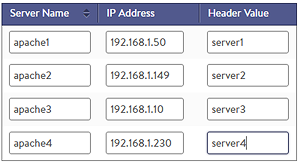

The *custom HTTP header* mode of persistence may be applied to a virtual service with an attached HTTP application profile. This method allows an HTTP header to be manually mapped to a specific server for persistence. The Service Engine will inspect the value of the defined HTTP header and will match the value against a statically assigned header field for each server. If there is a match, the client will be persisted to the server. The server’s header field is configured in the Application &gt; Pool’s edit server page using the Header Value field within the server table.

 

In this example, when a client sends an HTTP request Vantage checks to see if a header exists based on the name configured in the customer HTTP header persistence profile. If the header exists in the client's request, the value is mapped against the servers as shown. If the value was *server2*, Vantage would send the client to *apache2*. If the header does not exist, or the value does not match, the client is free to be load balanced to any server.

 

See also <a href="/docs/17.1/overview-of-server-persistence">Overview of Server Persistence</a> for descriptions of other persistence methods and options.

### Persist Table

This method is a static mapping of header values to servers, so no persistence table needs to be maintained on each Service Engine and no mirroring is required. All Service Engines supporting a virtual service whose pool is configured with this persistence type will automatically direct or persist users correctly to the same servers.

### Configuration Options

* **Name**:  A unique name for the persistence profile.
* **Description**:  An optional, custom description for the profile.
* **Type**:  Custom HTTP Header.  Changing the type will change the profile to another persistence method.
* **Select New Server When Persistent Server Down: ** If a server is marked down, such as by a health monitor or when it has reached a connection limit, should existing persisted users continue to be sent to the server, or load balanced to a new server?  
    * **Immediate:**  Vantage will immediately select a new server to replace the one marked down and switch the persistence entry to the new server.
    * **Never:**  No replacement server will be selected. Persistent entries will be required to expire normally based upon the persistence type.
* **Header Name**:  This is the name of the HTTP header send from a client which is inspected for a value that is statically mapped to a server. 