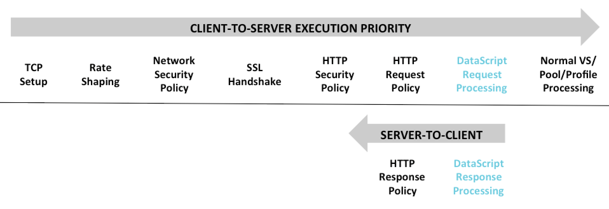

Many DataScript capabilities can be performed via policies or standard features. It is important to understand the order of precedence, as the execution priority will dictate the order that various features, policies, and DataScripts will occur.  For instance, if a policy decides to discard a connection while a DataScript decides to redirect the client, the order of execution is critical to ensuring the intended behavior occurs.

Responses generated by DataScripts or policies (as opposed to responses generated by a server) are not evaluated by DataScripts.  For instance, an HTTP response generated by the HTTP Request Policy cannot be inspected or modified by a DataScript.

More than one DataScript may be applied to a single virtual service. The order of the DataScripts is important, as DataScripts with the same event will be executed in the order established. When adding DataScripts via the UI, use the up and down arrows next to the DataScript to reorder. The DataScript at the top of the list will execute first. Avi Vantage processes traffic in the following order of precedence:

### Client Request to Server:

<ol> 
 <li>TCP Setup</li> 
 <li>Rate Shaping</li> 
 <li>Network Security Policy</li> 
 <li>SSL Handshake</li> 
 <li>HTTP Security Policy</li> 
 <li>HTTP Request Policy</li> 
 <li>DataScript Request Event</li> 
 <li>Normal VS/Pool/Profile Processing</li> 
</ol> 

 

### Server Response to Client:

<ol> 
 <li>DataScript response event</li>
 <li>HTTP response policy</li>
</ol> 

In the order of precedence, individual features may be inserted at different points based on the functionality of the feature. For instance, connection throttling will occur during step 1 of the client request, not step 7.

### Multiple DataScripts

More than one DataScript may be applied to a single virtual service.  The order of the DataScripts is important, as DataScripts with the same event will be executed in the order set.  When adding DataScripts via the UI, use the up and down arrows next to the DataScript to reorder.  The DataScript at the top of the list will execute first.

 
