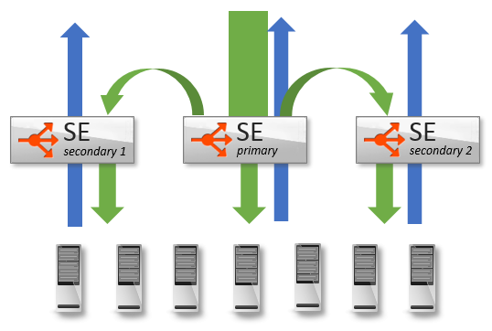
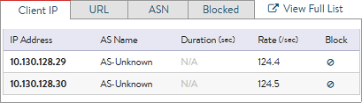
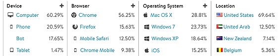
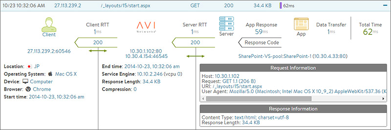
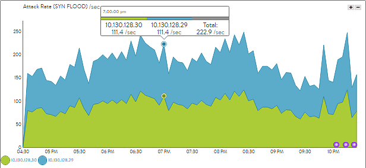

Distributed Denial of Service attacks are generally volumetric attacks, intended to overwhelm their target by consuming all available capacity for the vector being attacked. Avi Vantage is built on a distributed data plane model, which allows Vantage to quickly scale capacity to handle the attack.

Volumetric attacks can commonly be grouped into three buckets, based on the intended vulnerability being targeted. These are:

* Throughput / packets per second
* Memory
* CPU 

Vantage protects itself, networks, and applications through a number of mechanisms, as well as a unique ability to dynamically increase its size when necessary.  Administrators have complete control to view and respond to attacks.

### Scaling Capacity

Avi Vantage plays a significant role as the last line of defense to protect applications and networks against DDoS attacks. One of Avi's key defenses is the ability to absorb DDoS by quickly scaling out a virtual service across commodity hardware.

A single Avi Service Engine may be configured with up to <a href="/sizing-service-engines">36 CPU cores and 128 GB memory</a>. Performance increases nearly linearly with the additional hardware allocation. A Service Engine installed on a bare-metal server can saturate multiple 10-Gbps NICs and sustain millions of packets per second.

Vantage may also <a href="/autoscale-service-engines">scale out</a>, distributing load horizontally across multiple SEs. Using Avi's native autoscale, a single virtual service may be distributed across up to four SEs. Using <a href="/bgp-support-for-virtual-services">BGP and Equal Cost MultiPath routing</a>, a single VS may be scaled across 32 Service Engines.

Last, Avi's licensing model is flexible, enabling an application virtual service under attack to automatically be moved to dedicated Service Engines. Isolating the attack ensures multiple applications or tenants are not impacted by the event, and provides further scale of resources to defend against the attack.  Vantage can also burst beyond the licensed limit of the system, ensuring the health of the applications above all else.

### Attack Mitigation

Vantage natively protects against <a href="/ddos-attacks-mitigated">dozens of different DDoS attacks</a> targeting IP, TCP, SSL, and HTTP. Service Engines will automatically defend themselves by implementing features such as TCP SYN cookies, idle connection reaping and protocol validation, to name a few. <a href="/block-an-ip-address-to-a-virtual-service">IP Blacklists</a> may be configured and <a href="/modify-network-security-acl-via-api">automatically updated</a> by third party systems via REST APIs. Administrators may also choose to block an attacker through a single 'block' button from the Security page in the UI.

### Customized Protection

Many predefined DoS detections are built into the system, but are easily configurable for full customization on a per-application basis. For instance, an attacker doing a port scan may be simply reported, or may be actively blocked. Another attacker doing an HTTP request flood may be throttled, dropped, or sent a customized error page. A wide range of <a href="/rate-shaping-and-throttling-options">rate shaping and throttling features</a> for layer 4 through 7 protocols exist to ensure maximum security with minimal effort or training.

Further customization may be done via Avi's <a href="/architectural-overview/applications/vs-policies/">Policy Engine</a>, which allows point-and-click rule sets to be defined, such as blocking or throttling users from <a href="/geo-location-database">specific countries</a>.

For the highest level of customization, DataScripts may be used to identify suspicious traffic and take appropriate actions. <a href="/datascript-guide/">DataScripts</a> are scripted rules based on Lua which may be used for higher layer DDoS mitigation, such as blocking brute force login attempts or just about any use case required.

### Attack Visibility

Avi Vantage is a distributed fabric, rather than a collection of isolated appliances linked by a centralized manager. Since each Service Engine is part of a fabric, an attack on any SE is fed to the Avi Controllers for analysis and correlation. The Controllers push configuration changes down to the other Service Engines, such as to throttle a bad actor. For instance, a port scan that is distributed across multiple Service Engines will still be detected and the attacker automatically quarantined, even if the connection is the first made by the attacker to the SE.

Vantage provides rich data on client interaction with virtual services. Avi logs the client's site navigation, timings, errors, etc. More than 100 data points are <a href="/architectural-overview/applications/virtual-services/vs-logs/">logged </a>for an attacking client. Avi makes it easy to drill in to view top attackers, their IP, country, ASN, operating system, as well as any interaction they had with the site prior to launching the attack. Most important, it is easy to take action with a single click of a button to throttle, block permanently or block for a limited time.

A system that is difficult to understand is also difficult to properly secure. Similarly, Vantage can proactively send alerts to email, syslog, SNMP, or custom APIs to ensure administrators are kept aware of events as they happen. The powerful <a href="/metrics-list/">alerting and reporting</a> tools, which monitor over 500 real-time metrics, are a vital component of ensuring successful DDoS and attack mitigation.

