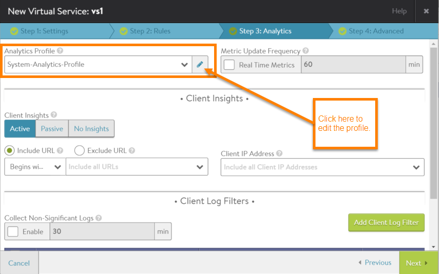
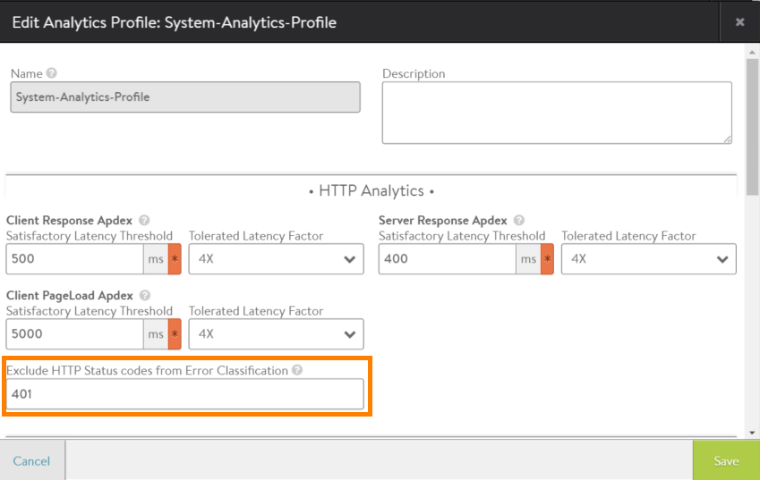

Some protocols can be a bit chatty and may generate a high volume of messages that do not indicate an error but are not excluded by disabling non-significant logs. These extraneous messages not only clutter the log but also may unnecessarily reduce the virtual service's overall health score. 

For example, applications that use NT LAN Manager (NTLM) to authenticate access to protected resources may generate a high volume of 401 Unauthorized messages. These are HTTP responses from the server that have status code 401. NTLM uses 401 messages during the authentication process. When a client requests a resource that is secured by NTLM, the protocol responds with a 401 message to challenge the client for the credentials required to access the resource. Each time NTLM re-authenticates access to the same resource, more 401 messages are generated.

To exclude unneeded messages from a virtual service's client logs, configure a filter within the analytics profile used by the virtual service. 

## Exclude HTTP Status Codes from Client Logs

To exclude HTTP responses that have a specific status code (such as 401), edit the analytics profile used by the virtual service.
<ol> 
 <li>Access the analytics profile used by the virtual service: 
  <ol> 
   <li>Navigate to Applications &gt; Virtual Services.</li> 
   <li>Click the edit icon next to the virtual service name.</li> 
   <li>Click Analytics to display the tab of analytics options.</li> 
   <li>Select the application profile from the Analytics Profile pull-down list, and click the edit icon. This opens the configuration popup for the profile. (If creating a new analytics profile, select Create instead.)</li> 
  </ol> 
<a href="img/exclude-status-code-1.png">  </a>
</li> 
 <li>Enter the error code to exclude (in this example, 401) in the Exclude HTTP Status codes from Error Classification field. (If creating a new profile, also enter a name in the Name field.)  <a href="img/exclude-status-code2.png">  </a></li> 
 <li>Click Save.</li> 
</ol> 

Note: If a new profile was created, make sure to add the profile to the virtual service. By default, the system default analytics profile (System-Analytics-Profile) is attached to a virtual service.

Note: If preferred, the configuration popup for an analytics profile can be accessed without going through the virtual service's configuration. Navigate to Templates > Profiles > Analytics. Then click the edit icon next to the profile name, or click Create if creating a new profile.
