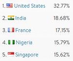
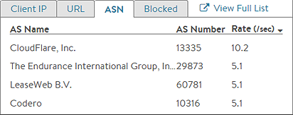
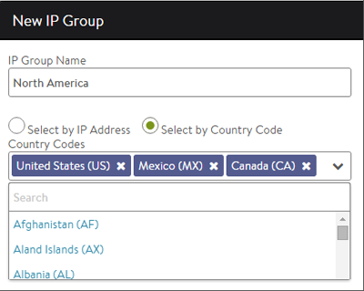

### Database

Avi Vantage includes a geolocation database for identifying the origin of clients.  This is a fixed database based on the <a href="http://dev.maxmind.com/geoip/legacy/geolite/">MaxMind</a> IP-Country and IP-ASN data. The database is maintained on the Controllers, and incorporates database updates when the Controllers are upgraded.

### Usage

The geolocation data is used in many locations, including:

* Client logs
* Policies, such as white lists or black lists
* Client insights
* Security page DDoS attacks
* Tier 2 objects, such as cache, compression, or logging eligibility 

### Overriding the Database

The geolocation data may be overwritten or augmented by creating a custom IP group.

For example, create a new IP group called "Internal" and add 10.0.0.0/8 and 192.168.0.0/16. Alternately, create a new IP group with Select by Country Code. In the example, the group is named North America and includes US, MX, and CA.

Note: A custom IP group will override only the geolocation database for the tenant were the IP group was created.
