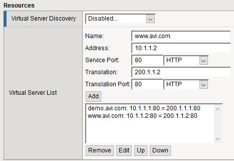

To ensure high availability across geographic regions or data centers, Avi Networks recommends use of multiple data centers to distribute risk and reduce failure domains. Avi recognizes that many customers already own global server load balancers from other vendors, which provide DNS-based load balancing across geographies. Avi Vantage is able to work with most global server load balancing (GSLB) solutions, though the level of integration depends on the vendor used.

The procedure in this article works with Avi Vantage version 15.x and higher, and F5 Networks Global Traffic Manager (GTM) version 10.x and higher. Other versions also may work but are not covered or tested under the scope of this article.

For help configuring Avi Vantage's GSLB capabilities, see <a href="/avi-gslb-architecture/">here</a>.

## Assumptions

This scope of this document covers integration of Avi Vantage with F5 GTM. This document assumes that:

* Avi Vantage is installed in one or more data centers.
* F5’s BIG-IP GTM is installed. 

GTM may or may not be installed in the same data centers where Avi Vantage will be providing local application delivery services.

## Configuration of Avi Vantage

No special configuration is required for virtual services advertised by Avi Vantage to be load balanced through global server load balancers. The virtual services may exist on a single Avi Controller cluster or they may exist across multiple Controller clusters in different data centers.

### Create Load Balancer Server Object

First, Avi Vantage must be added as a load balancer object to the GTM.  From within the GTM GUI, navigate to DNS > GSLB > Server and select Create. Configure the following fields within the General Properties section:

* **Name**:  Unique Avi instance name, for example "Avi_DC1"
* **Product**:  Generic Load balancer.
* **Address**:  With the recommended configuration, the GTM never uses this IP address. Nonetheless, the field must have a value, so enter any IP address of an Avi Controller from the cluster and click Add.
* **Data Center**:  Select a pre-configured GTM data center object, for example "DataCenter1". The GTM uses this information for determining which device will send health checks to Avi Vantage. 

Within the Configuration section:

* **Health Monitor **: Avi's recommendation is to leave this health monitor field empty. It is optional to add a health check to verify access to Avi Vantage. This involves the GTM sending a query to the IP address of the Avi Controller. This additional check is not recommended by default as it requires the GTM to have access to the Controllers, which are often on protected management networks. Should this check be desired, the Address and Translation Address of the Avi Vantage server object must be correct. The health monitor to check access to the Avi Controller is added via the Health Monitor setting. Keep in mind that access to the Controllers does not reflect successful access to the application virtual service. 

Within the Resources section, each virtual service must be added to the Avi Vantage server object:

* **Name**:  Name of the VS
* **Address**:  IP address of the VIP
* **Service Port**:  Port used to access the VS
* **Translation**:  If the VS is NATed between Avi Vantage and the client, input the public IP address that clients should access.
* **Translation Port**:  If the VS is PATed (port has been changed) between Avi Vantage and the client, input the public port that clients should access. 
 

### Create GTM Pool

Navigate to DNS > GSLB > Pool.  Click Create and configure the following fields:

* **Name**:  Enter a name for the GTM pool.
* **Health Check**:  Apply a health monitor appropriate for the application type.  
    * **TCP Monitor**:  If a basic TCP health monitor is used, an additional configuration change is recommended on the Avi Vantage VS.  From the Avi Vantage UI, edit the desired virtual service and navigate to the Advanced tab.  Enable the *Remove Listening Port when VS Down*.  When this option is not enabled (the default), Avi Vantage will accept the TCP connection, and then send a RST. GTM will mark this VS up, even though it received a RST.  When the option is enabled, Avi Vantage will not accept the connection, which will ensure a down VS is correctly marked down on the GTM.
* **Member List**:  From the Virtual Server pull-down menu, select the appropriate virtual services from the list and click Add. The virtual services should have been added in the previous Create LB step. 

### Create GTM WideIP

Navigate to DNS > GSLB > WideIP.  Click on Create and configure the following fields:

* **Name**:  Enter the FQDN of the application.
* **Pool List**:  Add the GTM pool to the list. 