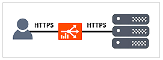
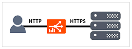
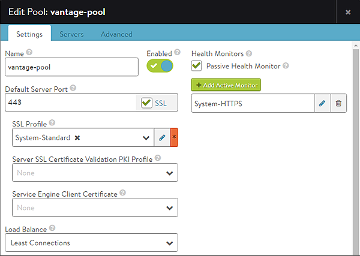
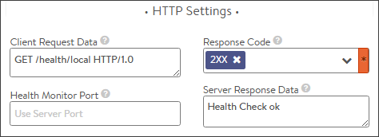

This article covers the specific configuration for this monitor type.  See the <a href="/docs/17.1/overview-of-health-monitors">Overview of Health Monitors</a> article for general monitor information, implementation, and other monitor types.

### HTTPS Use Cases

The HTTPS health monitor validates the health of HTTPS encrypted web servers. There are two scenarios when this would apply.

* **Layer 4 Virtual Service**:  Client sessions are HTTPS encrypted and load balanced by Vantage.  The SSL connection is not terminated and the virtual service is configured as L4, which means it does not have an HTTP application profile configured.
* **HTTP Virtual Service**:  Regardless if the client traffic comes into the virtual service as HTTP or HTTPS, the virtual service terminates the application traffic and a new SSL connection is negotiated to the destination server.  The VS is configured with an HTTP profile. 

### Pool Configuration

To attach an HTTPS health monitor to a pool for both of these use cases, several additional steps must be taken.  These additional steps are unique to the HTTPS monitor and are not required for other types of monitors.
<ol> 
 <li>Attach the HTTPS health monitor to the pool via the settings tab.</li> 
 <li>Enable SSL via the Pool &gt; Settings &gt; Default Service Port.</li> 
 <li>The health monitor initiated from the Service Engines will negotiate TLS version and ciphers that have been specified via the SSL Profile that must be attached to the pool.</li> 
 <li>Optionally, the Service Engine can authenticate the servers certificate via the Server SSL Certificate Validation PKI Profile.</li> 
 <li>Optionally, the Service Engine can present a client certificate to authenticate itself to the server via the Service Engine Client Certificate setting.</li> 
</ol> 

### General Monitor Configuration

* **Send Interval**:  Frequency at which the health monitor initiates a server check, in seconds.
* **Receive Timeout**:  Maximum amount of time before the server must return a valid response to the health monitor, in seconds.
* **Successful Checks**:  Number of consecutive health checks that must succeed before Vantage marks a down server as being back up.
* **Failed Checks**:  Number of consecutive health checks that must fail before Vantage marks an up server as being down. 

### HTTPS Monitor Configuration

The following options are available for the HTTPS health monitor:

* **Client Request Data:**  Send an HTTP request to the web server. Avi Vantage does not validate the request, as different servers may support unique request syntax.  
    * **Method**:  Any method may be used, though GET, POST and HEAD are the most common for monitoring. If no method is defined, Vantage will use GET.  
        * GET /index.htm
        * POST /upload.asp HTTP/1.0\r\nHost: www.site.com\r\nContent-Length: 10\r\nABCDE12345
    * **Path**:  The path may include the URI and query, such as <code>/index.htm?user=test</code>. If no path is specified, Vantage will use <code>/</code>
    * **Version**:  The HTTP version can be 1.0 or 1.1. If no version is specified, Vantage will use 1.0.
    * **Host**:  If no Host header is specified, Vantage includes a host header populated with the server's name.  HTTP 1.1 servers expect a Host header to be included in the request.
    * **Carriage Return**:  By default, Vantage will add a carriage return line feed to the end of the send string in the form of \r\n.  For HTTP 1.0, and additional \r\n may be required.  For send strings that require multiple lines of data, such as headers, the carriage returns may need to be added, such as in the POST example above.
* **Response Code:**  A successful HTTP monitor requires either the Response Code, the Server Response Data, or both fields to be populated. The Response Code expects the server to return a response code within the specified range. For a GET request, a server should usually return a 200, 301 or 302. For a HEAD request, the server will typically return a 304. A response code by itself does not validate the server’s response content, just the status.
* **Server Response Data:**  Enter a snippet of content from the server’s HTTP response by copying and pasting text from either the source HTML or the web page of the server. Avi Vantage inspects raw HTML data and not rendered web pages. For example, Vantage does not follow HTTP redirects and will compare the redirect response with the defined Server Response string, while a browser will show the redirected page. The Server Response content is matched against the first 2KB of data returned from the server, including both headers and content/body. The Server Response Data can also be used to search for a specific response code, such as 200 OK. When both Response Code and Server Response Data are populated, both must be true for the health check to pass.
* **Health Monitor Port:**  Specify a port that should be used for the health check. When this setting is blank, the default port configured for the server will be used. When it is specified, clients may be directed to a different port than what is monitored. For instance, a server at HTTP port 80 may have two health monitors attached, one for HTTP default port, and a second for HTTPS specifically on port 443. If both health monitors pass, the server can receive traffic on HTTP port 80. This ensures clients can input items in their shopping cart and later purchase those items over SSL on 443. 

### Server Maintenance Mode

Custom server response can be used to mark a server as disabled.  During this time, health checks will continue, and servers operate the same as if manually disabled, which means existing client flows are allow to continue, but new flows are sent to other available servers.  Once a server stops responding with the maintenance string it will be brought online, being marked up or down as it normally would based on the server response data.

This feature allows an application owner to gracefully bleed connections from a server prior to taking the server offline without the requirement to log into Avi Vantage to first place the server in disabled state.

* **Maintenance Response Code**:  If the defined HTTP response code is seen in the server response, place the server in maintenance mode. Multiple response codes may be used via comma separation.
* **Maintenance Server Response Data**:  If the defined string is seen in the server response, place the server in maintenance mode. 

### Example Health Check

Sample HTTPS health monitor config:

Sample HTTPS health check send string:

<pre><code class="language-lua">GET /health/local HTTP/1.0
User-Agent: avi/1.0
Host: 10.10.10.3
Accept: */*</code></pre>  

Sample server response:

<pre><code class="language-lua">HTTP/1.0 200 OK
Server: Apache-Coyote/1.1
Cache-Control: no-cache, no-store
Pragma: no-cache
Content-Type: text/plain
Content-Length: 15
Date: Fri, 20 May 2016 18:23:05 GMT
Connection: close

Health Check Ok</code></pre>  

The server response includes both the Response Code: *200*, and the Server Response Data: *Health Check ok*. Therefore this server will be marked up.
Notice that Avi automatically includes additional headers in the send string, including User-Agent, Host, and Accept to ensure the server receives a fully formed request.

