This article describes how to deploy Avi Vantage with Mesosphere DC/OS in Amazon Web Services (AWS).

## Avi Vantage

Avi Vantage is a software-based solution that provides elastic application delivery services and real-time analytics, such as load balancing, SSL termination, and user-to-application timing.
<a href="img/aws-mesos-install-arch-1.png">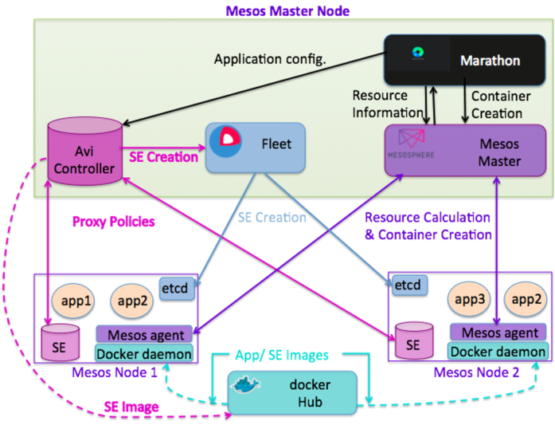</a>

### Components

Avi Vantage is a fully distributed, virtualized system that consists of Avi Controller and Avi Service Engines (SEs), running as containers.

* Avi Controller: Container that acts as a single point of control and management, providing a web interface, analytics, and REST API. Avi Controller manages the life cycle of Avi SEs by creating, controlling, and deleting them. The Avi Controller stores and manages all policies related to services and management. The Avi Controller is also a single point of contact exposed to other cloud platforms and SDN controllers. For example, it can communicate with the Mesosphere DC/OS master, a VMware vCenter, an OpenStack controller, and and Cisco APIC.
* Avi Service Engine (SE): Container that takes actual user traffic and provides application delivery services while collecting real-time metrics for user-to-application timing. An Avi SE is dynamically created, plumbed into the network, and provisioned with a service policy by the Avi Controller, as required to deploy an application in Marathon. The application is treated as a virtual service in Avi Vantage. The virtual service can be a combination of an IP address and TCP/UDP port number, or just a port number, that represents a load balancing service. 

## Integration with Mesosphere DC/OS

### Mesosphere DC/OS

Mesosphere DCOS is host cluster resource management system. Mesosphere DCOS provides resource management in terms of CPU, memory and host ports.

The DCOS also includes a set of core system services, such as a native Marathon instance to manage processes and installable services, and Mesos-DNS for service discovery. The DCOS provides a web interface and a command-line interface (CLI) to manage the deployment and scaling of your applications.

### Marathon

Marathon manages all processes and services throughout the DCOS cluster. Marathon starts and monitors applications and services, and automatically heals failures.

A native Marathon instance is installed as a part of Mesosphere DCOS. After DCOS has been started, you can manage the native Marathon instance through the web interface at /marathon or from the DCOS CLI with the **dcos marathon** command.

### Docker Hub

Docker Hub is a registry service for building and shipping application or service containers on a cloud or hosted privately. It provides a centralized resource for container image discovery, distribution, and change management.

Docker Hub is responsible for image management for all applications, services, and big data infrastructure throughout the Mesos infrastructure.

### CoreOS and Fleet

Core OS is an OS optimized for container-based solutions using Linux as well as Docker containers. Fleet is one of the distributed cluster management services provided by CoreOS. Fleet is used for cluster job scheduling.

### Software Versions

<table class="table table table-bordered table-hover">  
<tbody>        
<tr>   
<th>Software
</th>
<th>Version
</th>
</tr>
<tr>   
<td>Avi Vantage</td>
<td>15.3.1 or higher</td>
</tr>
<tr>   
<td>Mesosphere DC/OS</td>
<td>1.0.0</td>
</tr>
<tr>   
<td>Marathon</td>
<td>0.9.1</td>
</tr>
<tr>   
<td>CoreOS</td>
<td>717.3.0</td>
</tr>
<tr>   
<td>Docker client, server</td>
<td>1.6.2</td>
</tr>
<tr>   
<td>Fleet</td>
<td>0.10.2</td>
</tr>
</tbody>
</table> 

### System Time (NTP) Requirement

The system time on all nodes must be synchronized. Use of a Network Time Protocol (NTP) server is recommended.
 

## Solution Overview

Avi Vantage solution tightly integrates with the Mesos environment, providing enterprise-grade proxy services in the Mesos environment along with these additional benefits:

* Firewall/ micro-segmentation
* Application visibility
* Autoscaling 

In a Mesos environment, the Avi Controller requires an Avi SE to be created on every Mesos node. The Avi Controller requests Fleet to create SEs on all Mesos nodes. A Docker image of the Avi SE is provided through Docker hub.

In a Mesos environment, applications are created in Marathon. The Avi Controller communicates with Marathon to synchronize application configuration. The Avi Controller then configures proxy policies for all applications on all SEs on all nodes. As all applications in a Mesos environment communicate with each other through the proxy service, Avi Vantage can provide a single point of management for proxy as well as firewall services, as well as network application visibility.

The Avi Controller gets information about applications from Marathon, and gets information about application resources from the Mesos master. The Avi Controller has information about the network performance of all applications. The Avi Controller combines network performance information with Marathon information and Mesos master information to decide whether to autoscale application. When needed, the Avi Controller requests Marathon to perform autoscaling.

## Installation

In this installation procedure, Amazon Cloud Formation is used to create a Mesos infrastructure. The Cloud Formation script will create 1 Mesos master node with size m3.xlarge, and 2 Mesos nodes with size t2.medium.

The Avi Controller container is spun up as a container on the Mesos master node along with Marathon and Fleet.

### Mesos Infrastructure Bring-up Through AWS

To begin, log in to your AWS account using an Internet browser.
<ol> 
 <li>Click on Cloud Formation under Management Tools.  <a href="img/aws-mesos-install-awsconsole1.png">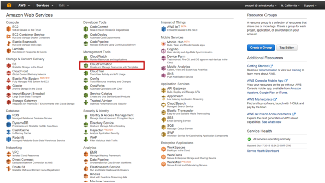</a></li> 
 <li>Click on Create Stack.</li> 
 <li>Select Specify an Amazon S3 url, under Choose a template. 
  <ol> 
   <li>Copy-and-paste the following link: https://s3-us-west-1.amazonaws.com/avi-tm/avi-mesos.cloudformation.json</li> 
   <li>Click Next to proceed.</li> 
  </ol> 
<a href="img/aws-mesos-install-awsconsole2.png">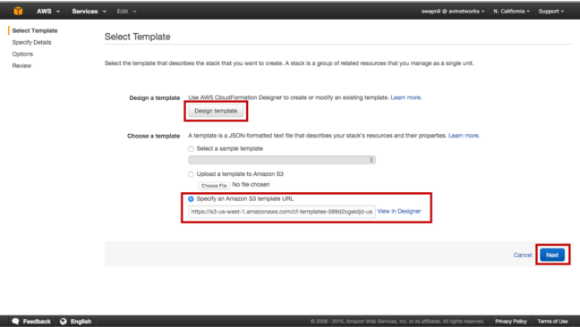</a>
 </li> 
 <li>AWS Cloud Formation takes you to the Details page. 
  <ol> 
   <li>Provide a name for your stack.</li> 
   <li>Accept the EULA.</li> 
   <li>Provide a KeyName and then click Next.</li> 
  </ol> 
<a href="img/aws-mesos-install-awsconsole3.png">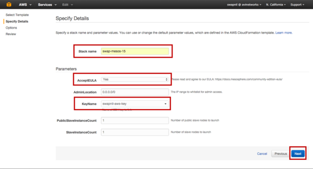</a> 
</li> 
 <li>AWS Cloud Formation takes you to an Options page. Click on Next.  <a href="img/aws-mesos-install-awsconsole4.png">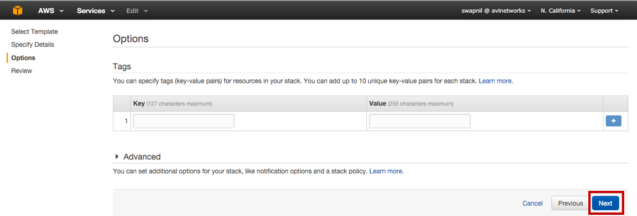</a></li> 
 <li>AWS Cloud Formation takes you to a Review page. Scroll down, select the Accept AWS agreement checkbox, and click Finish.  <a href="img/aws-mesos-install-awsconsole5.png">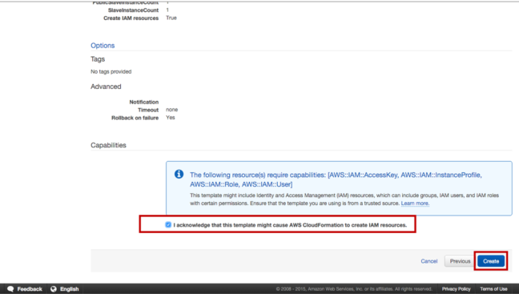</a> </li> 
 <li>AWS Cloud Formation takes around 10-20 minutes to deploy all VMs and bringing up all services. Once Cloud Formation stack is successfully deployed, the status should be CREATE_COMPLETE as shown in this example.  <a href="img/aws-mesos-install-awsconsole6.png">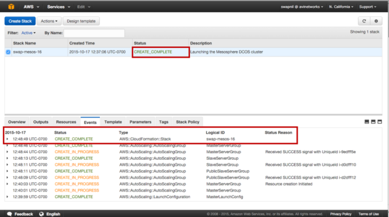</a> </li> 
</ol> 

### Verify Infrastructure Bring-up

<ol> 
 <li>Click on Outputs.</li> 
 <li>Copy the Mesos master’s URL from the field.  <a href="img/aws-mesos-install-awsconsole7.png">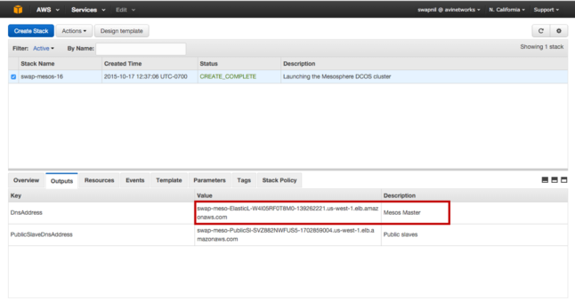</a></li> 
 <li>Open a new browser window and paste the Mesos master’s URL.</li> 
 <li>Copy the Mesos master’s IP address.  <a href="img/aws-mesos-install-awsconsole8.png">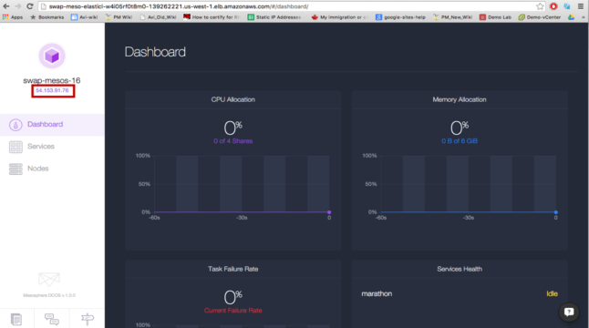</a></li> 
 <li>Open a new browser window and type the URL of the Mesos master. The URL should look be like this: https://<em>mesos-master-ip</em>:9443</li> 
 <li>Accept the security warning to proceed to the login page for the Avi Controller's web interface. Log in to the Avi Controller with username and password admin, admin. 
<a href="img/aws-mesos-install-awsconsole9.png">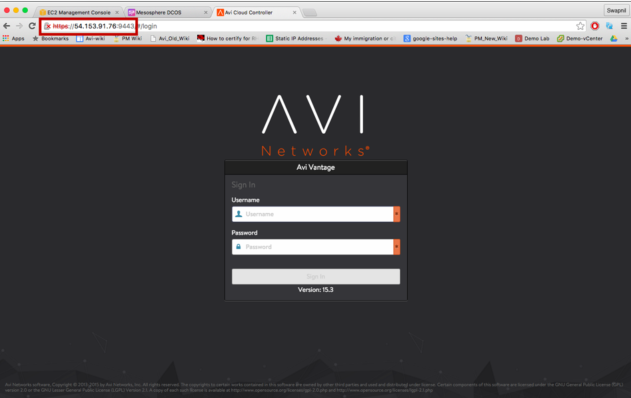</a>
</li> 
</ol> 

### Application Creation in Marathon

<ol> 
 <li>Download Docker.json from <a href="https://s3-us-west-1.amazonaws.com/avi-tm/Docker.json">https://s3-us-west-1.amazonaws.com/avi-tm/Docker.json</a>. Save the file in Downloads.</li> 
 <li>Open an SSH session to the Mesos master's IP address, and post the application:  <pre crayon="false" class="command-line language-bash" data-prompt=": >"><code>curl -H "Content-Type: application/json" -X POST -d@Downloads/Docker.json http://:8080/v2/apps</code></pre></li> 
</ol> 

### Application Verification

<ol> 
 <li>Log in to Marathon: https://<em>marathon-ip</em>:8080</li> 
 <li>Log in to the Avi Controller to verify that the application is getting load balanced.  <a href="img/aws-mesos-install-awsconsole11.png">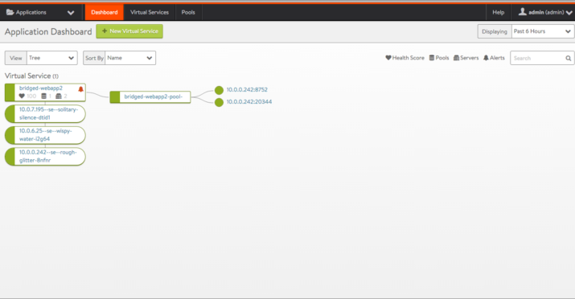</a></li> 
</ol> 

### Access Web Service through Avi Vantage

<ol> 
 <li>Browse to EC2 Load Balancing instance. 
  <ol> 
   <li>Click on  to go to the AWS homepage.</li> 
   <li>Select EC2 and click on Load Balancing in the left pane.</li> 
   <li>Click on the "PublicSlaveL" instance in the Load Balancer field ("avi-mesos-PublicSlaveL" in this example.)  <a href="img/aws-mesos-install-awsconsole12-1.png">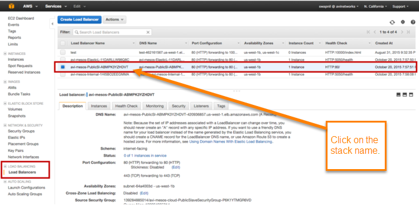</a></li> 
  </ol> </li> 
 <li>Edit the ELB instance to forward traffic to the application in the Mesos environment. 
  <ol> 
   <li>Verify the application port from the Avi Controller web interface. Select the application and hover near the name.  <a href="img/aws-mesos-install-awsconsole13.png">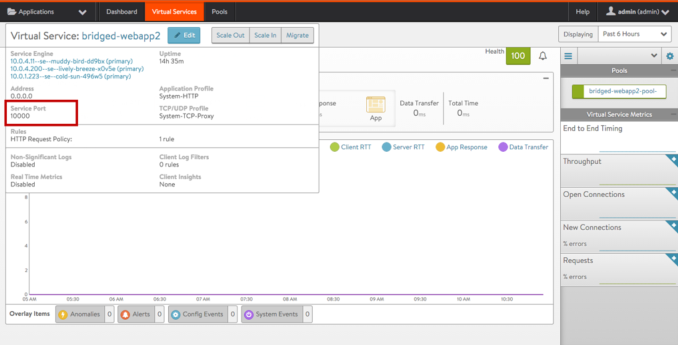</a></li> 
   <li>Click on Listener and edit ELB Listener to change the HTTP listener to the service (application) port number. 
 
</li> 
   <li>Click on Health Check and edit ELB health Check to the application port number.<a href="img/aws-mesos-install-awsconsole15.png">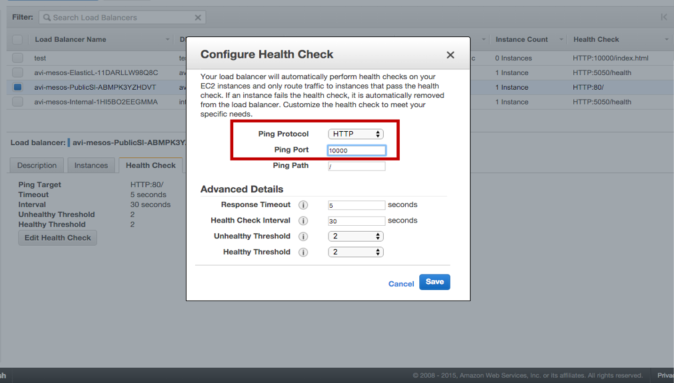</a></li> 
  </ol> </li> 
 <li>Click on the Description tab for the same ELB instance. Copy the DNS name and paste it into a new browser tab.  <a href="img/aws-mesos-install-awsconsole16.png">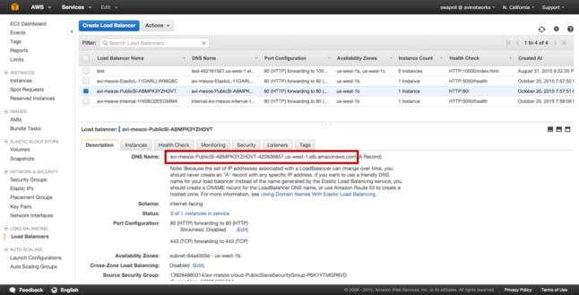</a>

 
  <ol> 
   <li>Paste the DNS name into a new browser window.  <a href="img/aws-mesos-install-awsconsole17.png">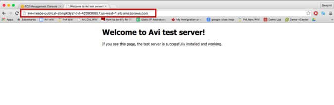</a>

 </li> 
   <li>Click on WebApp1 to verify that live traffic is flowing through.  </li> 
  </ol> </li> 
</ol> 