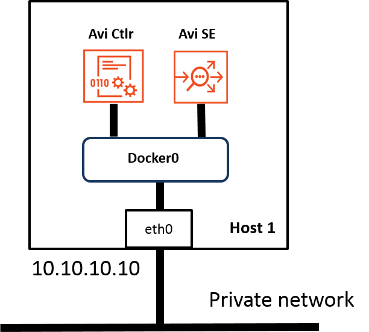
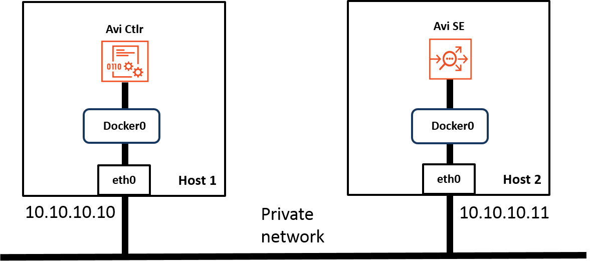
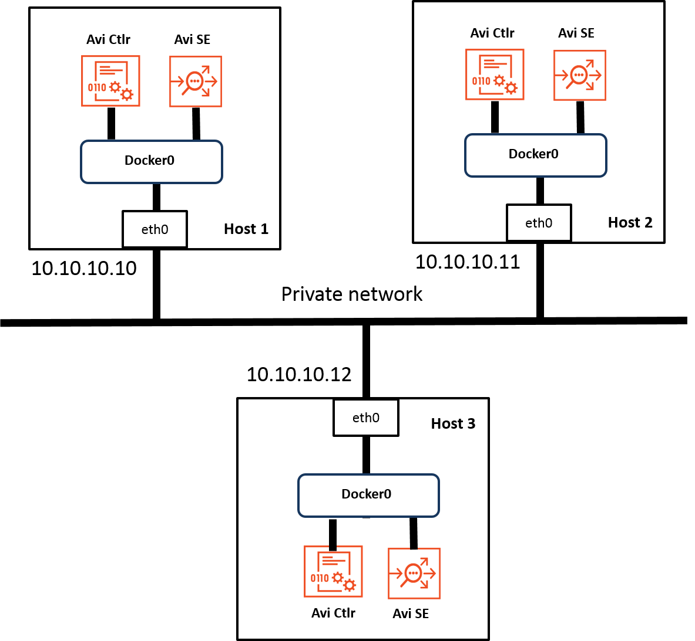
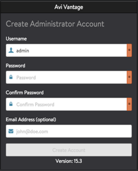
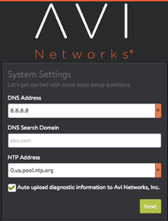
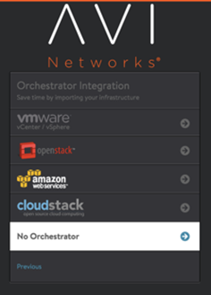
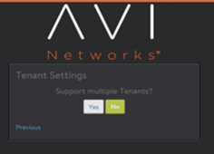

This article describes how to install Avi Vantage on a bare-metal infrastructure.

Avi Vantage is a software-based solution that provides real-time analytics and elastic application delivery services, including user-to-application timing, SSL termination, and load balancing. Installing Avi Vantage onto bare-metal servers directly leverages the raw horsepower of the underlying hardware without the overhead added by the virtualization layer. The Avi Vantage bare-metal solution uses containerization provided by Docker for support across operating systems and for easy installation.

## Deployment Topologies

Avi Vantage can be deployed onto bare-metal servers in the following topologies. The number of bare-metal servers required for deployment depends on the deployment topology.
<table class="table table table-bordered table-hover">  
<tbody>     
<tr>    
<th>Deployment Topology
</th>
<th>Bare-metal Servers Required
</th>
<th>Description
</th>
</tr>
<tr>    
<td>Single host</td>
<td>1</td>
<td>Avi Controller and SE both run on a single host.</td>
</tr>
<tr>    
<td>Separate hosts</td>
<td>2</td>
<td>Avi Controller and SE run on separate hosts. The Controller is deployed on one of the hosts. The SE is  deployed on the other host.</td>
</tr>
<tr>    
<td>3-node cluster</td>
<td>3</td>
<td>Provides high availability for the Controller.</td>
</tr>
</tbody>
</table>  

A single instance of the Controller is deployed on each host. At any given time, one of the Controllers is the leader and the other 2 are followers.

### Single-host Deployment

Single-host deployment runs the Controller and SE on the same bare-metal server. This is the simplest topology to deploy. However, this topology does not provide High Availability for the Controller or SE.

### Two-host Deployment

Two-host deployment runs the Controller on one bare-metal server and the SE on another bare-metal server.

### Three-host Cluster Deployment

Three-host deployment requires a separate instance of the Controller on each of 3 bare-metal servers.

In a 3-node cluster deployment, one of the Controller instances is the leader. The other 2 instances are followers. If the leader goes down, one of the followers takes over so that service to end-users is continued.

## Deployment Prerequisites

This section lists the minimum requirements for installation.

### Hardware Requirements

Each bare-metal server on which you plan to install and run Avi Vantage must meet at least the following physical requirements:
<table class="myTable table table-bordered table-hover">  
<tbody>      
<tr>   
<th>Component
</th>
<th>Minimum Requirement
</th>
</tr>
<tr>   
<td>CPU</td>
<td>Intel Xeon with 8 cores</td>
</tr>
<tr>   
<td>Memory</td>
<td>16 GB RAM</td>
</tr>
<tr>   
<td>Hard Drive (HD)</td>
<td>64 GB</td>
</tr>
<tr>   
<td>Network Interface Controller (NIC)</td>
<td>1 x 1 Gbps (Intel NIC 82598 or 82599 controller family)</td>
</tr>
</tbody>
</table>  

### Software Requirements

Bare-metal deployment of Avi Vantage also requires the following software:
<table class="myTable table table-bordered table-hover">  
<tbody>     
<tr>   
<th>Software
</th>
<th>Version
</th>
</tr>
<tr>   
<td>Avi Vantage (distributed by Avi Networks as Docker image)</td>
<td>15.3</td>
</tr>
<tr>   
<td>Docker (image management service that runs on Linux)</td>
<td>1.6.0</td>
</tr>
<tr>   
<td>Operating System (OS)</td>
<td>One of the following:  Oracle Enterprise Linux 7.0, 7.1, or 7.2  Red Hat Enterprise Linux 7.0</td>
</tr>
</tbody>
</table>   

## Installation

Avi Vantage deployment onto bare metal requires the following procedure:
<ol> 
 <li>Install the Docker platform (if not already installed).</li> 
 <li>Install Avi Controller and SE images onto host.</li> 
 <li>Use the setup wizard to perform initial configuration of the Controller.</li> 
 <li>Deploy the SE.</li> 
</ol> 

Detailed steps are provided below.

### Install Docker

Avi Vantage for bare-metal servers is distributed as a Docker image. If Docker is not already installed in your network, use the applicable steps to install it. If deploying onto multiple hosts, repeat the applicable installation procedure on each host.

### Install Docker onto Oracle Enterprise Linux

<ol> 
 <li>Install updates to Oracle Linux (OEL): <pre crayon="false" class="command-line language-bash" data-prompt=": >"><code>yum
    update</code></pre> </li> 
 <li>Download and install the latest version of Docker: <pre crayon="false" class="command-line language-bash" data-prompt=": >"><code>wget –q0-
    https://get.docker.yom/ | sh</code></pre> </li> 
 <li>Start Docker services: <pre crayon="false" class="command-line language-bash" data-prompt=": >"><code>sudo service docker
    start</code></pre> </li> 
 <li>If deploying on more than one host, repeat the steps above on each host.</li> 
</ol> 

### Install Docker onto Red Hat Linux

<ol> 
 <li>Register the bare-metal host with Red Hat: <pre crayon="false" class="command-line language-bash" data-prompt=": >"><code>subscription-manager register</code></pre> </li> 
 <li>Enable the repository for extra services: <pre crayon="false" class="command-line language-bash" data-prompt=": >"><code>subscription-manager --enable=rhel-7-server-extras-rpms</code></pre> </li> 
 <li>Install updates to Red Hat: <pre crayon="false" class="command-line language-bash" data-prompt=": >"><code>sudo yum update</code></pre> </li> 
 <li>Install Docker: <pre crayon="false" class="command-line language-bash" data-prompt=": >"><code>sudo yum install docker</code></pre></li> 
 <li>Start Docker services: <pre crayon="false" class="command-line language-bash" data-prompt=": >"><code>sudo service docker
    start</code></pre> </li> 
 <li>If deploying on more than one host, repeat the steps above on each host.</li> 
</ol> 

### Verify Docker Installation and Version

Enter the **docker
version** command to verify the Docker version that is installed and running. In this example, the version is 1.8.1.:

<pre br=""></pre> 
<pre class="command-line language-bash" data-user="root" data-host="localhost ~" data-output="2-100"><code>docker version
Client:
 Version:      1.8.1
 API version:  1.20
 Go version:   go1.4.2
 Git commit:   d12ea79
 Built:        Thu Aug 13 02:35:49 UTC 2015
 OS/Arch:      linux/amd64
Server:
 Version:      1.8.1
 API version:  1.20
 Go version:   go1.4.2
 Git commit:   d12ea79
 Built:        Thu Aug 13 02:35:49 UTC 2015
 OS/Arch:      linux/amd64
</code></pre> 

## Install Avi Controller Image

<ol class="md-ignore"> 
 <li>Use SCP to copy the .tgz package onto the bare-metal node that will host the Avi Controller: <pre crayon="false" class="command-line language-bash" data-prompt=": >"><code>scp docker_install.tar.gz root@Host-IP:/tmp/</code></pre> </li> 
 <li>Use SSH to log into the host: <pre crayon="false" class="command-line language-bash" data-prompt=": >"><code>ssh
    root@Host-IP</code></pre> </li> 
 <li>Change to the /tmp directory: <pre crayon="false" class="command-line language-bash" data-prompt=": >"><code>cd /tmp/</code></pre></li> 
 <li>Unzip the .tgz package: <pre crayon="false" class="command-line language-bash" data-prompt=": >"><code>sudo tar -xvf
    docker_install.tar.gz</code></pre> </li> 
 <li>Run the setup.py script. The script will display prompts for a series of questions. For the yes/no questions,  enter "y". For the questions about resource allocation, enter the amounts for your deployment. The script also  prompts for the Controller's IP address.

 <pre crayon="false" pre="" class="command-line language-bash" data-user="root" data-host="localhost ~" data-output="2-100"><code>./avi_baremetal_setup.py
Welcome to AVI Initialization Script
DPDK Mode:
  Pre-requisites(DPDK): This script assumes the below utilities are installed:
                        docker, make, gcc, kernel-headers
                         (yum -y install docker gcc make \
                          kernel-uek-devel-'uname -r' kernel-uek-headers-'uname -r')
  Supported Nics(DPDK): Intel 82599/82598 Series of Ethernet Controllers
  Supported Vers(DPDK): Oracle Linux 7.0, 7.1, 7.2
Non-DPDK Mode:
  Pre-requisites: This script assumes the below utilities are installed:
                  docker (yum -y install docker)
  Supported Vers: Oracle Linux 7.0, 7.1, 7.2; RHEL 7.0
Caution       : This script deletes existing AVI docker containers &amp; images.
Do you want to proceed in DPDK Mode [y/n] y
Do you want to run AVI Controller on this Host [y/n] y
Do you want to run AVI SE on this Host [y] y
Enter The Number Of Cores For AVI Controller. Range [4, 31] 4
Please Enter Memory (in GB) for AVI Controller. Range [12, 124] 12
Enter The Number Of Cores For AVI Service Engine. Range [1, 28]
Please Enter Memory (in MB) for AVI Service Engine. Range [28672, 116378]
Please Enter Controller IP 10.10.10.10
Disabling AVI Services...
Removing Existing AVI SE Docker Images. Please Wait..
Loading AVI SE Image. Please Wait..
Removing Existing AVI CONTROLLER Docker Images. Please Wait..
Loading AVI CONTROLLER Image. Please Wait..
Compiling DPDK
kernel.core_pattern = /var/crash/%e.%p.%t.core

Installation Successful. Reboot At A Convenient Time
</code></pre> </li> 
 <li>Reboot the host to complete installation: <pre crayon="false" class="command-line language-bash" data-prompt=": >"><code>reboot</code></pre> </li> 
 <li>If deploying a 3-node cluster, repeat the steps above on the hosts for each of the other 2 Controllers.</li> 
</ol> 

## Perform Initial Controller Setup

<ol> 
 <li>Use a web browser to navigate to the Avi Controller and start the setup wizard.</li> 
 <li>Create an administrator account: </li> 
 <li>Enter DNS server and NTP server information: </li> 
 <li>Choose No Orchestrator as your infrastructure: </li> 
 <li>In the Support Multiple Tenants window, click No: </li> 
</ol> 

## Deploy Service Engine

<ol class="md-ignore"> 
 <li>Use SCP to copy the .tgz package onto the bare-metal node that will host the SE: <pre crayon="false" class="command-line language-bash" data-prompt=": >"><code>scp docker_install.tar.gz root@Host-IP:/tmp/</code></pre> </li> 
 <li>Use SSH to log into the host: <pre crayon="false" class="command-line language-bash" data-prompt=": >"><code>ssh root@Host-IP</code></pre> </li> 
 <li>Change to the /tmp directory: <pre crayon="false" class="command-line language-bash" data-prompt=": >"><code>cd /tmp/</code></pre></li> 
 <li>Unzip the .tgz package: <pre crayon="false" class="command-line language-bash" data-prompt=": >"><code>sudo tar -xvf docker_install.tar.gz</code></pre> </li> 
 <li>Run the setup.py script. The script will display prompts for a series of questions. Use the same answers as used  for the Controller. (For the yes/no questions, enter "y". For the questions about resource allocation, enter the  amounts for your deployment. The script also prompts for the Controller's IP address.)

 <pre crayon="false" pre="" class="command-line language-bash" data-user="root" data-host="localhost ~" data-output="2-100"><code>./avi_baremetal_setup.py
Welcome to AVI Initialization Script
DPDK Mode:
  Pre-requisites(DPDK): This script assumes the below utilities are installed:
                        docker, make, gcc, kernel-headers
                         (yum -y install docker gcc make \
                          kernel-uek-devel-'uname -r' kernel-uek-headers-'uname -r')
  Supported Nics(DPDK): Intel 82599/82598 Series of Ethernet Controllers
  Supported Vers(DPDK): Oracle Linux 7.0, 7.1, 7.2
Non-DPDK Mode:
  Pre-requisites: This script assumes the below utilities are installed:
                  docker (yum -y install docker)
  Supported Vers: Oracle Linux 7.0, 7.1, 7.2; RHEL 7.0
Caution       : This script deletes existing AVI docker containers &amp; images.
Do you want to proceed in DPDK Mode [y/n] y
Do you want to run AVI Controller on this Host [y/n] n
Do you want to run AVI SE on this Host [y] y
Enter The Number Of Cores For AVI Service Engine. Range [1, 28]
Please Enter Memory (in MB) for AVI Service Engine. Range [28672, 116378]
Please Enter Controller IP: 10.10.10.10
Disabling AVI Services...
Removing Existing AVI SE Docker Images. Please Wait..
Loading AVI SE Image. Please Wait..
Compiling DPDK
kernel.core_pattern = /var/crash/%e.%p.%t.core

Installation Successful. Reboot At A Convenient Time
</code></pre> </li> 
 <li>Reboot the host to complete installation: <pre crayon="false" class="command-line language-bash" data-prompt=": >"><code>reboot</code></pre> </li> 
</ol> 