This article describes how to install Avi Vantage in a Linux cloud. The instructions in this guide can be used for installing Avi Vantage 16.1 and higher.

Avi Vantage is a software-based solution that provides real-time analytics and elastic application delivery services, including user-to-application timing, SSL termination, and load balancing.

Installing Avi Vantage directly onto Linux servers leverages the raw horsepower of the underlying hardware without the overhead added by a virtualization layer. For example, installing Avi Vantage directly onto Linux servers that support Data Plane Development Kit (DPDK) allows the feature's optimized packet processing to be leveraged for virtual service traffic.

Note: If installing Avi SEs directly onto Linux servers that include DPDK, make sure to enable the option in Avi Vantage when adding the host for the Avi SE.

### Docker Container

The Avi Vantage Linux server cloud solution uses containerization provided by Docker for support across operating systems and for easy installation.

## Deployment Topologies

Avi Vantage can be deployed onto a Linux server cloud in the following topologies. The number of Linux servers required for deployment depends on the deployment topology.
<table class="table table-hover table table-bordered table-hover">  
<tbody>     
<tr>    
<th>Deployment Topology
</th>
<th>Linux Servers Required
</th>
<th>Description
</th>
</tr>
<tr>    
<td>Single host</td>
<td>1</td>
<td>Avi Controller and Avi SE both run on a single host.</td>
</tr>
<tr>    
<td>Separate hosts</td>
<td>2</td>
<td>Avi Controller and Avi SE run on separate hosts. The Avi Controller is deployed on one of the hosts. The Avi SE is deployed on the other host.</td>
</tr>
<tr>    
<td>3-node cluster</td>
<td>3</td>
<td>Provides high availability for the Avi Controller.</td>
</tr>
</tbody>
</table>  

A single instance of the Avi Controller is deployed on each host. At any given time, one of the Avi Controllers is the leader and the other 2 are followers.

### Single-host Deployment

Single-host deployment runs the Avi Controller and Avi SE on the same Linux server. This is the simplest topology to deploy. However, this topology does not provide high availability for the Avi Controller or Avi SE.

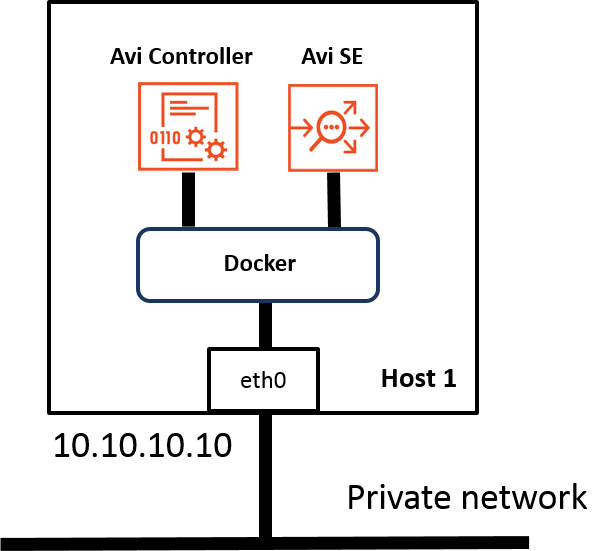

### Two-host Deployment

Two-host deployment runs the Avi Controller on one Linux server and the Avi SE on another Linux server.

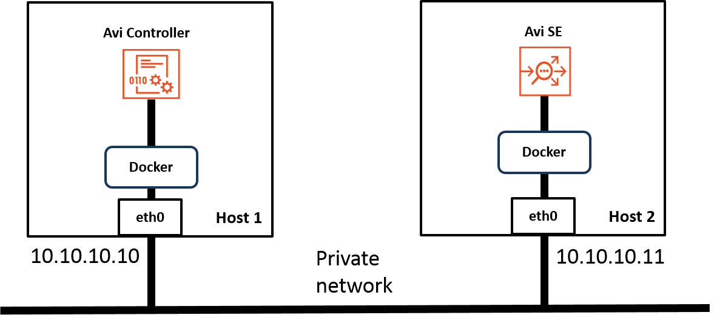

### Three-host Cluster Deployment

Three-host deployment requires a separate instance of the Avi Controller on each of 3 Linux servers.
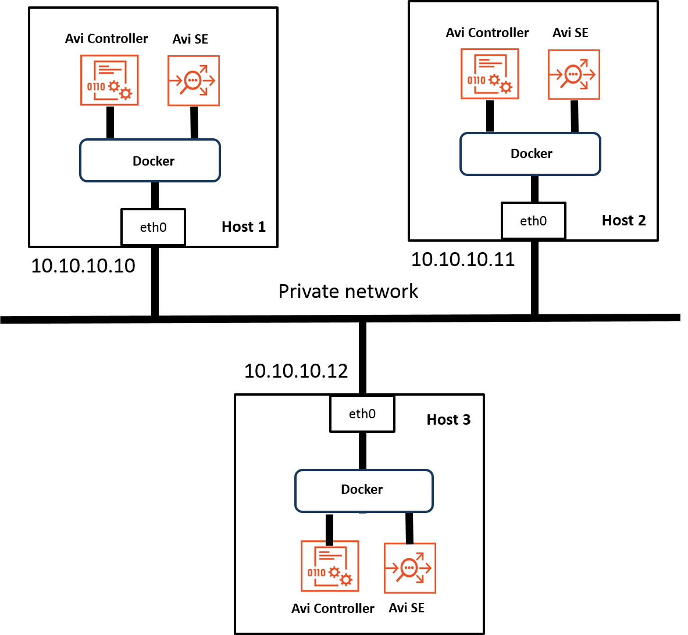

In a 3-node cluster deployment, one of the Avi Controller instances is the leader. The other 2 instances are followers. If the leader goes down, one of the followers takes over so that service to end-users is continued.

## Deployment Prerequisites

This section lists the minimum requirements for installation.

### Hardware Requirements

Each Linux server to be managed by Avi Vantage must meet at least the following physical requirements:
<table class="table table-hover table table-bordered table-hover">  
<tbody>      
<tr>   
<th>Component
</th>
<th>Minimum Requirement
</th>
</tr>
<tr>   
<td>CPU</td>
<td>Intel Xeon with 8 cores</td>
</tr>
<tr>   
<td>Memory</td>
<td>24 GB RAM</td>
</tr>
<tr>   
<td>Hard Drive (HD)</td>
<td>64 GB</td>
</tr>
<tr>   
<td>Network Interface Controller (NIC)</td>
<td>1 x 1 Gbps (Intel NIC 82598 or 82599 controller family)</td>
</tr>
</tbody>
</table>  

### Software Requirements

Installation of Avi Vantage for a Linux server cloud also requires the following software:
<table class="table table-hover table table-bordered table-hover">  
<tbody>     
<tr>   
<th>Software
</th>
<th>Version
</th>
</tr>
<tr>   
<td>Avi Vantage (distributed by Avi Networks as Docker image)</td>
<td>16.1</td>
</tr>
<tr>   
<td>Docker (image management service that runs on Linux)</td>
<td>1.6.1 or greater</td>
</tr>
<tr>   
<td>Operating System (OS)</td>
<td>One of the following:  Oracle Enterprise Linux 7.0, 7.1, or 7.2  Red Hat Enterprise Linux 7.0, 7.1, or 7.2  CentOS 7.0, 7.1, 7.2</td>
</tr>
</tbody>
</table>   

## Installation

To install Avi Vantage, some installation tasks are performed on each of the Linux hosts:

* **Avi Controller host:** The installation wizard for the Avi Controller must be run on the Linux server that will host the Avi Controller. If deploying a 3-node cluster of Avi Controllers, run the wizard only on the host that will be the cluster leader. (The cluster can be configured at any time after installation is complete.)
* **Avi SE hosts:** On each Linux server that will host an Avi SE, configuration of some SSH settings is required. At a minimum, an SSH user account must be added to the Avi Controller, and the public key for the account must be installed in the authorized keys store on each of the Avi SE hosts. If an SSH user name other than "root" will be used, some additional steps are required. 

### Installation Workflow

Avi Vantage deployment for a Linux server cloud consists of the following:
<ol> 
 <li>Install the Docker platform (if not already installed).</li> 
 <li>Install the Avi Controller image onto a Linux server.</li> 
 <li>Use the setup wizard to perform initial configuration of the Avi Controller: 
  <ul> 
   <li>Avi Vantage user account creation (your Avi Vantage administrator account)</li> 
   <li>DNS and NTP servers</li> 
   <li>Infrastructure type (Linux)</li> 
   <li>SSH account information (required for installation and access to the Avi SE instance on each of the Linux servers that will host an Avi SE)</li> 
   <li>Avi SE host information (IP address, DPDK, CPUs, memory)</li> 
   <li>Multitenancy support</li> 
  </ul> 
The SSH, Avi SE host, and multitenancy selection can be configured either using the wizard or later, after completing it. (The wizard times out after awhile.) This article provides links for configuring these objects using the Avi Controller web interface.
</li> 
</ol> 

Detailed steps are provided below.

### 1. Install Docker

Avi Vantage for Linux server cloud is distributed as a Docker image. If Docker is not already installed on the host (Linux server), use the applicable steps to install it. If deploying onto multiple hosts, repeat the applicable installation procedure on each host.

### Install Docker onto Oracle Enterprise Linux

<ol> 
 <li>Install updates to Oracle Linux (OEL): <pre crayon="false" class="command-line language-bash" data-prompt=": >"><code>yum update</code></pre></li> 
 <li>Download and install the latest version of Docker: <pre crayon="false" class="command-line language-bash" data-prompt=": >"><code>wget –qO- https://get.docker.com/ | sh</code></pre></li> 
 <li>Start Docker services: <pre crayon="false" class="command-line language-bash" data-prompt=": >"><code>sudo systemctl start docker</code></pre></li> 
 <li>Enable Docker services: <pre crayon="false" class="command-line language-bash" data-prompt=": >"><code>sudo systemctl enable docker</code></pre></li> 
 <li>If deploying on more than one host, repeat the steps above on each host.</li> 
</ol> 

### Install Docker onto Red Hat Linux

<ol> 
 <li>Register the Linux server with Red Hat: <pre crayon="false" class="command-line language-bash" data-prompt=": >"><code>subscription-manager register</code></pre></li> 
 <li>Enable the repository for extra services: <pre crayon="false" class="command-line language-bash" data-prompt=": >"><code>subscription-manager --enable=rhel-7-server-extras-rpms</code></pre></li> 
 <li>Install updates to Red Hat: <pre crayon="false" class="command-line language-bash" data-prompt=": >"><code>sudo yum update</code></pre></li> 
 <li>Install Docker: <pre crayon="false" class="command-line language-bash" data-prompt=": >"><code>sudo yum install docker</code></pre></li> 
 <li>Start Docker services: <pre crayon="false" class="command-line language-bash" data-prompt=": >"><code>sudo systemctl start docker</code></pre></li> 
 <li>Enable Docker services: <pre crayon="false" class="command-line language-bash" data-prompt=": >"><code>sudo systemctl enable docker</code></pre></li> 
 <li>If deploying on more than one host, repeat the steps above on each host.</li> 
</ol> 

### Verify Docker Installation and Version

Enter the **docker version** command to verify the Docker version that is installed and running. In this example, the version is 1.8.1.:
<pre pre="" class="command-line language-bash" data-user="aviuser" data-host="avihost" data-output="2-100"><code>docker version
Client:
 Version:      1.8.1
 API version:  1.20
 Go version:   go1.4.2
 Git commit:   d12ea79
 Built:        Thu Aug 13 02:35:49 UTC 2015
 OS/Arch:      linux/amd64
Server:
 Version:      1.8.1
 API version:  1.20
 Go version:   go1.4.2
 Git commit:   d12ea79
 Built:        Thu Aug 13 02:35:49 UTC 2015
 OS/Arch:      linux/amd64
</code></pre>   

### 2. Install Avi Controller Image

<ol> 
 <li>Use SCP to copy the .tgz package onto the Linux server that will host the Avi Controller: <pre crayon="false" class="command-line language-bash" data-prompt=": >"><code>scp docker_install.tar.gz root@Host-IP:/tmp/</code></pre></li> 
 <li>Use SSH to log into the host: <pre crayon="false" class="command-line language-bash" data-prompt=": >"><code>ssh root@Host-IP</code></pre></li> 
 <li>Change to the /tmp directory: <pre crayon="false" class="command-line language-bash" data-prompt=": >"><code>cd /tmp/</code></pre></li> 
 <li>Unzip the .tgz package: <pre crayon="false" class="command-line language-bash" data-prompt=": >"><code>sudo tar -xvf docker_install.tar.gz</code></pre></li> 
</ol> <ol start="5"> 
 <li>Run the setup.py script. The setup script can be run in interactive mode or as a single command string. 
  <ul> 
   <li>If entered as a command string, the script sets the options that are included in the command string to the specified values, and leaves the other values set to their defaults. Go to Step 6.</li> 
   <li>In interactive mode, the script displays a prompt for configuring each option. Go to Step 7.</li> 
  </ul> </li> 
</ol> <ol start="6"> 
 <li>To run the setup script as a single command, enter a command string such as the following: <pre crayon="false" class="command-line language-bash" data-user="aviuser" data-host="avihost" data-prompt=""><code>./avi_baremetal_setup.py -c -cc 4 -cm 12 -i 10.120.0.39 -m 10.120.0.39</code></pre> The options are explained in the CLI help:  <pre crayon="false" class="command-line language-bash" data-user="aviuser" data-host="avihost" data-prompt="" data-output="2-100"><code>avi_baremetal_setup.py [-h] [-d] [-s] [-sc SE_CORES] [-sm SE_MEMORY_MB] [-c] [-cc CON_CORES] [-cm CON_MEMORY_GB] -i CONTROLLER_IP -m MASTER_CTL_IP-h, --help show this help message and exit
-d, --dpdk_mode Run SE in DPDK Mode. Default is False
-s, --run_se Run SE locally. Default is False
-sc SE_CORES, --se_cores SE_CORES
Cores to be used for AVI SE. Default is 1
-sm SE_MEMORY_MB, --se_memory_mb SE_MEMORY_MB
Memory to be used for AVI SE. Default is 2048
-c, --run_controller Run Controller locally. Default is No
-cc CON_CORES, --con_cores CON_CORES
Cores to be used for AVI Controller. Default is 4
-cm CON_MEMORY_GB, --con_memory_gb CON_MEMORY_GB
Memory to be used for AVI Controller. Default is 12
-i CONTROLLER_IP, --controller_ip CONTROLLER_IP
Controller IP Address
-m MASTER_CTL_IP, --master_ctl_ip MASTER_CTL_IP
Master controller IP Address</code></pre></li> 
</ol> <ol start="7"> 
 <li>To run in interactive mode, start by entering "avi_baremetal_setup.py". Here is an example: <pre crayon="false" pre="" class="command-line language-bash" data-user="aviuser" data-host="avihost" data-output="2-100"><code>./avi_baremetal_setup.py

Welcome to AVI Initialization Script

DPDK Mode:
  Pre-requisites(DPDK): This script assumes the below utilities are installed:
                        docker (yum -y install docker)
  Supported Nics(DPDK): Intel 82599/82598 Series of Ethernet Controllers
  Supported Vers(DPDK): OEL/CentOS/RHEL -  7.0,7.1,7.2

Non-DPDK Mode:
  Pre-requisites: This script assumes the below utilities are installed:
                  docker (yum -y install docker)
  Supported Vers: OEL/CentOS/RHEL - 7.0,7.1,7.2

Caution       : This script deletes existing AVI docker containers &amp; images.

Do you want to proceed in DPDK Mode [y/n]
Do you want to run AVI Controller on this Host [y/n] y
Do you want to run AVI SE on this Host [y] n
Enter The Number Of Cores For AVI Controller. Range [4, 39] 4
Please Enter Memory (in GB) for AVI Controller. Range [12, 125] 12
Please Enter Controller IP 10.120.0.39
Please Enter Master Controller IP 10.120.0.39

Run SE           : No
Run Controller   : Yes
Controller Cores : 4
Memory(mb)       : 12
Controller IP    : 10.120.0.39

Disabling AVI Services...
Loading AVI CONTROLLER Image. Please Wait..
kernel.core_pattern = /var/crash/%e.%p.%t.core

Installation Successful. Starting Services..

</code></pre> </li> 
</ol> <ol start="8"> 
 <li>Reboot the host to complete installation: <pre crayon="false" class="command-line language-bash" data-prompt=": >"><code>reboot</code></pre></li> 
</ol> <ol start="9"> 
 <li>If deploying a 3-node cluster, repeat the steps above on the hosts for each of the other 2 Controllers.</li> 
</ol> 

**Note: Following reboot, it takes about 3-5 minutes before the web interface become available. Until the reboot is complete, web interface access will appear to be frozen. This is normal.**

### 3. Perform Initial Setup of Avi Controller

<ol> 
 <li>Use a web browser to navigate to the Avi Controller and start the setup wizard.</li> 
 <li>Configure basic system settings: 
  <ul> 
   <li>Administrator account</li> 
   <li>DNS and NTP server information</li> 
  </ul> 
  
 
   
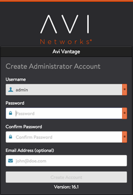 
 
   
 
 
  
 </li> 
 <li>Choose Linux as the infrastructure type: 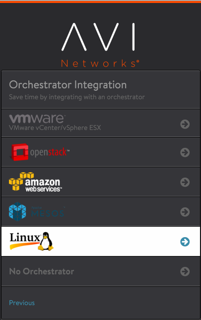</li> 
 <li>The rest of the configuration information prompted for by the wizard also can be entered now while using the wizard, or any time later, after installation is complete. 
  <ul> 
   <li>SSH user and keys: To use the "root" account (simpler option), select Create SSH User, enter the name, select Generate SSH Key Value Pair and click Generate SSH Key Pair. Then click Copy to clipboard, and save the key in a text file. (This file will be useful soon.)</li> 
   <li>Avi SE hosts: After SSH access is set up on each Avi SE host, the hosts can be added to the Avi Controller. For now, click Complete.</li> 
   <li>Multitenancy support: For now, select No. This can be configured at any time later, if needed.</li> 
  </ul> </li> 
 <li>After the wizard closes, see the following articles to complete the installation and create virtual services: 
  <ol> 
   <li><a href="/docs/17.1/public-key-management-on-se-hosts/">Public Key Management on Service Engine Hosts</a></li> 
   <li><a href="/docs/17.1/adding-avi-service-engines-to-a-linux-server-cloud/">Adding Avi Service Engines to a Linux Server Cloud</a></li> 
  </ol> </li> 
</ol>  

### 4. Set up SSH Access to the Avi SE Hosts

If you are continuing with the wizard, this section describes how to add the SSH account information to the Avi Controller, and to then copy the SSH public key to each of the Avi SE hosts.

Note: If the wizard has timed out or you have decided to click through the rest of the wizard and do the SSH setup later, go <a href="/docs/17.1/public-key-management-on-se-hosts/">here instead</a>, when ready. See the same link if using an account other than "root". This section assumes that "root" will be used.

**On the Avi Controller:**
<ol> 
 <ol> 
  <li>When the SSH User wizard page appears, click Create SSH User.    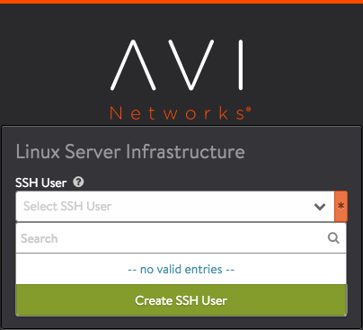  </li> 
  <li>Enter the username ("root").</li> 
  <li>Click Generate, then click Copy to clipboard.</li> 
 </ol> 
</ol> 

<a href="img/Ctlr-setup-sshuser2-linuxservercloud-smaller.png">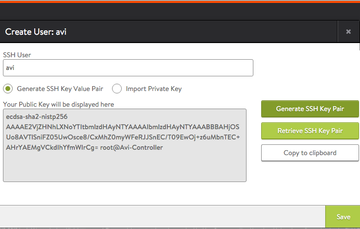</a>

<ol> 
 <li>Click Save.</li> 
 <li>Open a text editor, paste the key from the clipboard, and save the file.  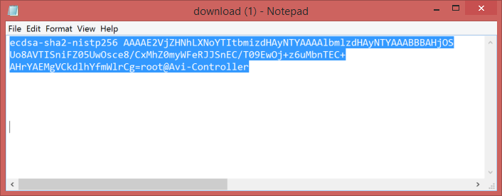</li> 
</ol>  

**On each Avi SE Host:**

Leaving the wizard open, use another window or device to open a CLI session in the Linux shell on one of the Avi SE hosts.
<ol> 
 <li>Log into the Linux shell on the Avi SE host (in this example, 10.130.164.76): <pre crayon="false" pre="" class="command-line language-bash" data-user="" data-host="$" data-output="1-100"><code>ssh avi@10.130.164.76
password:
</code></pre> </li> 
</ol> <ol start="2"> 
 <li>Prepare the Avi SE host for adding the key from the Avi Controller: <pre crayon="false" pre="" class="command-line language-bash" data-user="aviuser" data-host="localhost ~"><code>mkdir .ssh &amp;&amp; chmod 700 .ssh &amp;&amp; cd .ssh
</code></pre> </li> 
</ol> <ol start="3"> 
 <li>Add the Avi Controller's public key to the authorized key file by pasting the key <a href="#copying-ssh-key">copied from the Avi Controller by clicking Copy to clipboard</a> into the following command line:  <pre crayon="false" class="command-line language-bash" data-prompt=": >"><code>echo "paste-key-file-copied-from-Controller" &gt; .ssh/authorized_keys
chmod 644 authorized_keys</code></pre> Use quotation marks to delimit the pasted key string. (If the authorized_keys file does not already exist, the command string also creates the file.)</li> 
</ol> <ol start="4"> 
 <li>Repeat these steps on each Avi SE host.</li> 
</ol> 

**Example:**

<pre pre="" class="command-line language-bash" data-user="aviuser" data-host="localhost ~"><code>mkdir .ssh &amp;&amp; chmod 700 .ssh &amp;&amp; cd .ssh
echo "ecdsa-sha2-nistp256 AAAAE2VjZHNhLXNoYTItbmizdHAyNTYAAAAlbmlzdHAyNTYAAABBBAHjOS
Uo8AVTISniFZ05UwOsce8/CxMhZ0myWFeRJJSnEC/T09EwOj+z6uMbnTEC+
AHrYAEMgVCkdlhYfmWlrCg=root@Avi-Controller" &gt; .ssh/authorized_keys
chmod 644 authorized_keys
</code></pre> 

Note: Make sure to paste the public key for the Avi SE in your deployment. The key shown here is only an example and will not work with your Avi SEs.

### 5. Add the Avi SE Hosts to the Avi Controller

If you are continuing with the wizard, this section describes how to add the Avi SE hosts to the Avi Controller.

Note: This step will not succeed unless SSH setup steps has been completed on the Avi Controller and Avi SE hosts.
<ol> 
 <li>For each Avi SE host, enter the values and click Add New Host. After all the Avi SE hosts are added, click Complete. 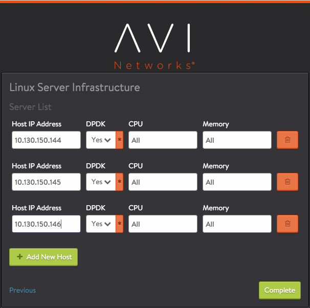</li> 
 <li>In the Support Multiple Tenants window, click No: 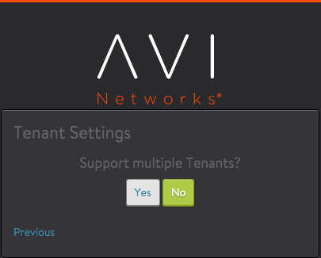</li> 
</ol> 

After a few moments, use a browser to navigate to the Avi Controller's management IP address. A login dialog such as the following should appear. Enter the user name and password added when using the setup wizard.
<a href="img/web-int-login.png">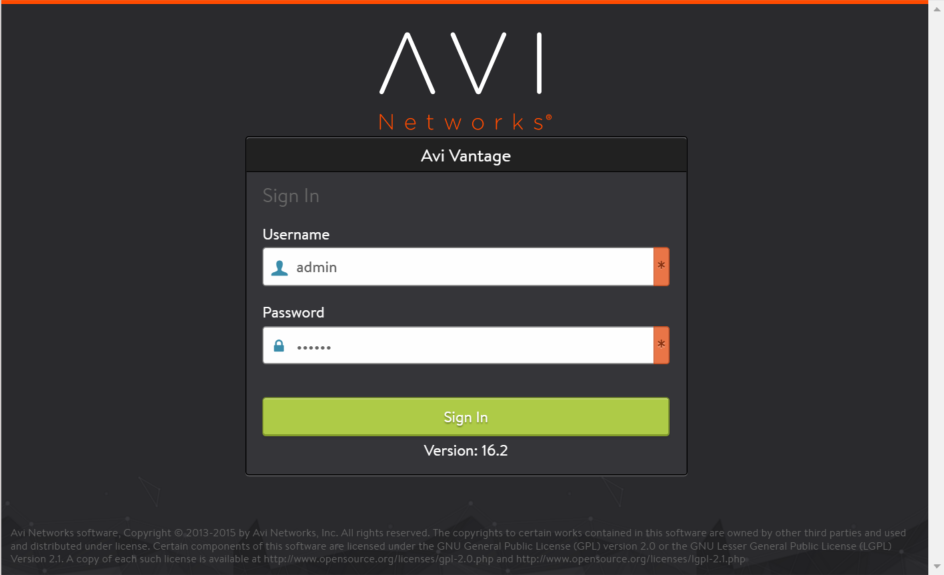</a>
If you clicked through the SSH or Avi SE host pages of the wizard, see the following articles to complete installation:

<ol> 
 <li><a href="/docs/17.1/public-key-management-on-se-hosts/">Public Key Management on Service Engine Hosts</a></li> 
 <li><a href="/docs/17.1/adding-avi-service-engines-to-a-linux-server-cloud/">Adding Avi Service Engines to a Linux Server Cloud</a></li> 
</ol> 