This article describes how to install Avi Vantage on the Cisco CSP-2100 platform. The instructions in this guide can be used for installing Avi Vantage 16.2 and subsequent releases.

### Networking Interfaces of CSP-2100

The following table shows the names of physical interfaces (pNICs) on the CSP-2100, along with their supported speeds.

<table class="table table table-bordered table-hover">  
<tbody>          
<tr>   
<th>Name
</th>
<th>Speed
</th>
</tr>
<tr>   
<td>enp1s0f0</td>
<td>1 Gbps</td>
</tr>
<tr>   
<td>enp1s0f1</td>
<td>1 Gbps</td>
</tr>
<tr>   
<td>enp4s0f0</td>
<td>1 Gbps</td>
</tr>
<tr>   
<td>enp4s0f1</td>
<td>1 Gbps</td>
</tr>
<tr>   
<td>enp4s0f2</td>
<td>1 Gbps</td>
</tr>
<tr>   
<td>enp4s0f3</td>
<td>1 Gbps</td>
</tr>
<tr>   
<td>enp7s0f0</td>
<td>10 Gbps</td>
</tr>
<tr>   
<td>enp7s0f1</td>
<td>10 Gbps</td>
</tr>
</tbody>
</table> 

The pNIC named enp1s0f0 can be connected to the management network. This provides access to the CSP dashboard. The 10-Gbps interfaces (enp7s0f0 and enp7s0f1) can be used as data NICs and must be connected to the corresponding data VLANs or trunk links.

### CSP NIC Modes

The following table explains 3 possible NIC mapping options on CSP and the corresponding performance implications.

<table class="table table table-bordered table-hover">
<tbody>
<tr>
<th>Mode
</th>
<th>Explanation
</th>
<th>Comments
</th>
</tr>
<tr>
<td>Access mode</td>
<td>Traffic switched using OVS</td>
<td>Allows physical NICs to be shared amongst VMs most generally, but performance is generally lower due to soft switch overhead</td>
</tr>
<tr>
<td>Passthrough mode</td>
<td>Physical NIC directly mapped to VM</td>
<td>Physical NIC is dedicated to a VM. With 1x10 Gbps pNIC per VM, a maximum of 2 VMs or 4 VMs can be created on a single CSP with 1 or 2 PCIe dual port 10 Gbps NIC cards. Provides best performance</td>
</tr>
<tr>
<td>SR-IOV mode</td>
<td>Virtual Network Functions created from physical NIC</td>
<td>Allows pNICs to be shared amongst VMs without sacrificing performance, since packets are switched in HW. Maximum 32 virtual functions (VFs) can be configured per pNIC</td>
</tr>
</tbody>
</table>

### Topology

The topology shown below consists of an Avi Controller and Avi Service Engines (SEs). To leverage the DPDK capabilities of the physical NICs, the SEs should be connected to the 10-Gbps enp7s0fx pNICs of the CSP-2100 in passthrough (PCIe) or SR-IOV mode. The SE can be connected to multiple VLANs on the pNICs’ virtual functions (VF) in SR-IOV mode. The management network can be connected to the 1-Gbps pNIC.

<a href="img/Picture1.png">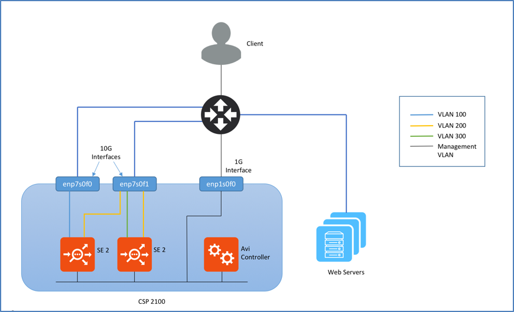</a>

# Deploying The Avi Controller

### Upload the Avi Controller Image

<ol> 
 <li>Log on to the CSP dashboard using a browser.</li>
 <li>Navigate to Configuration &gt; Repository.</li>
 <li>Click on + sign, and browse to and select the Controller qcow2 image.</li>
 <li>Click Upload.</li> 
</ol> 

The Controller itself can have a day-zero YAML file before it is spun up. The YAML file needs to be imported into the repository prior to image creation. Ensure you have VNC access to the console. In a large deployment, this *might* require additional firewall rules.

Note: in a CSP cluster, multiple copies (equal to the number of cluster hosts ) of the same image/YAML file may result. Consequently, when any deletions are required, *all* copies should be deleted. Typically, you would change a key (such as auth token) with the same filename and re-upload.

### Avi Controller Metadata File

To configure the Controller management interface statically, the IP, netmask and gateway information must be passed as a YAML file. The name of the metadata file must be in ‘avi_meta/*.yml’ format.

For example, create a text file with name avi_meta_controller.yml with contents as:

<pre><code class="language-lua">avi.mgmt-ip.CONTROLLER: "10.128.2.20"
avi.mgmt-mask.CONTROLLER: "255.255.255.0"
avi.default-gw.CONTROLLER: "10.128.2.1"</code></pre>

Here avi.mgmt-ip.CONTROLLER is the management IP for Avi controller, avi.mgmt-mask.CONTROLLER is the network mask and avi.default-gw.CONTROLLER is the gateway IP address for the management network. (Make sure to replace the IP address in the example with correct ones for your network)

Upload this metadata file to CSP repository as shown in 3.1.

### Deploy the Avi Controller

This section describes how to deploy Avi Controller using both the CSP UI and the REST API.

### Deploy Using CSP UI

Use the following steps to deploy the Avi Controller using the CSP UI:
<ol> 
 <li>Navigate to Configuration &gt; Services.</li>
 <li>Click on +.Note: The disk size of any CSP image cannot be changed. To avoid deletion and recreation of the entire configuration, have an informed idea of deployment. Refer to <a href="/system-requirements-hardware/">System Requirements: Hardware</a> and/or contact Avi for a recommendation.<a href="img/Picture2-1.png">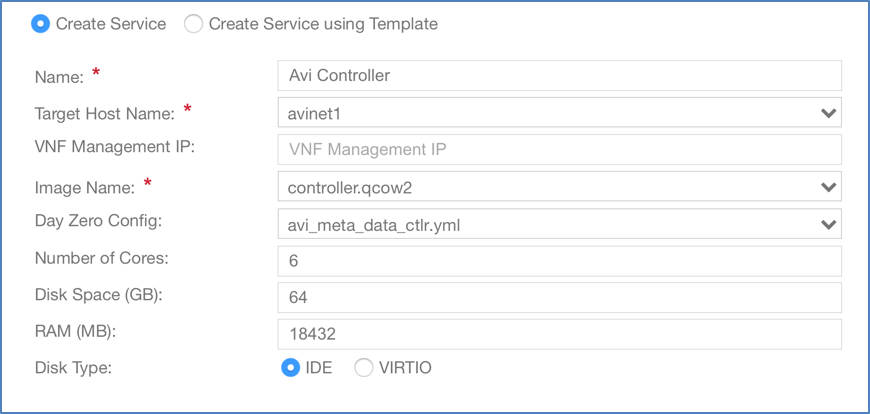</a></li>
 <li>Enter “Avi Controller” in the Service Name field and press enter.</li>
 <li>Click on Target Host Name and select the host from the list. In version CSP 2.1.0, on a CSP cluster, you can select the HA host name.</li>
 <li>Leave the VNF Management IP field blank. This is set using the Day Zero Config.</li>
 <li>Click on Image Name and select the controller.qcow2 image from the list.</li>
 <li>Click on Day Zero Config dropdown and select the Controller metadata file.</li>
 <li>Set the resource values for Disk, CPU and RAM (minimum values shown above)</li>
 <li>Click on + to add a vNIC and connect it to enp1s0f0 in access mode.<a href="img/Picture4.png">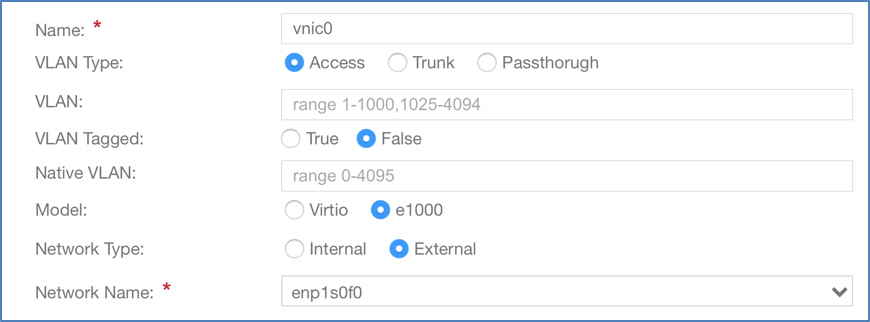</a>  Note: If the management network is on a different VLAN, specify the VLAN number in the VLAN field, and click on VLAN Tagged to enable tagging.</li>
 <li><em>(optional) </em>Specify a password for console login using VNC.</li>
 <li>Click Deploy.</li>
</ol> 

### Deploy Using REST API

CSP uses basic authentication for the REST API. Use the following **curl** command to create the controller service:

<pre><code class="language-lua">curl -X POST --user csp-username:csp-password -H "Content-Type: application/json" -d '{
  "service":{
    "disk_size":"64",
    "name":"Controller",
    "power":"on",
    "iso_name":"controller.qcow2",
    "day0_filename":"avi_meta_controller.yml",
    "numcpu":6,
    "memory":18432,
    "vnics":{
      "vnic":[
        {
          "nic":"0",
          "type":"access",
          "tagged":"false",
          "network_name":"enp1s0f0"
        }
      ]
    }
  }
}' "https://

  <csp-ip>
    /api/running/services/"
  </csp-ip></code></pre>

 

The CSP should reply with status code ‘201 Created’

To verify, get all installed services using following curl command:

<pre><code class="language-lua">curl -X GET --user csp-username:csp-password -H "Content-Type: application/json" "https://10.128.2.16/api/running/services/service"</code></pre>

Response:

<pre><code class="language-lua">{
  "service":[
    {
      "disk_size":"64.0",
      "name":"Controller-16-2",
      "power":"on",
      "iso_name":"controller.qcow2",
      "day0_filename":"avi_meta_controller.yml",
      "numcpu":6,
      "macid":65,
      "memory":18432,
      "vnics":{
        "vnic":[
          {
            "nic":0
          }
        ]
      },
      "uuid":"d8b977fe-42e7-48dd-a6a4-79f4ab5a8f0f"
    }
  ]
}</code></pre>

# Initial Setup of Avi Controller

Use a browser to navigate to the Avi Controller IP address, and follow the below steps to perform initial setup:
<ol> 
 <li>Configure an administrator password.<a href="img/Picture5.png">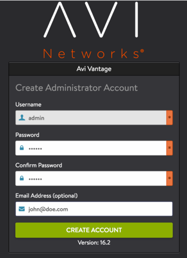</a></li>
 <li>Set DNS information.<a href="img/Picture6.png">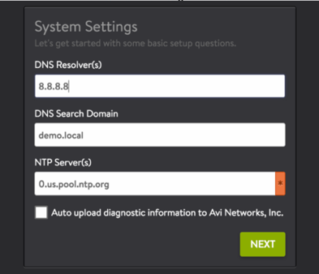</a></li>
 <li>Select No Orchestrator.<a href="img/Picture7.png">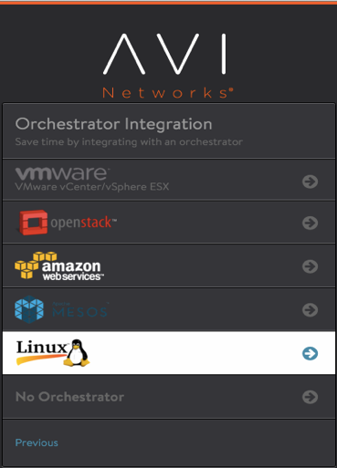</a></li>
 <li>On the Tenant Settings wizard page, select the appropriate option. Refer to <a href="/tenants-versus-se-group-isolation/">Tenants Versus SE Group Isolation.</a><a href="img/Picture8.png">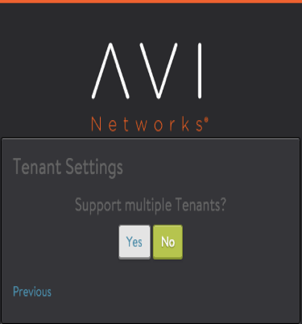</a></li>
</ol> 

# Deploy Avi SE

This section walks through the workflow of deploying an Avi SE on CSP, with data NICs in SR-IOV passthrough mode.

Note: Not every deployment will use SR-IOV, but if it is, it must be configured on the /***CSPs**/* beforehand. A figure appearing in the Enable SR-IOV section of this article shows the number of VFs and the switch mode being set.

### Upload SE image

<ol>
 <li>On the Avi Controller, navigate to Infrastructure &gt; Clouds.</li>
 <li>Click on the download icon on ‘Default Cloud’ row and select Qcow2.<a href="img/Picture9.png">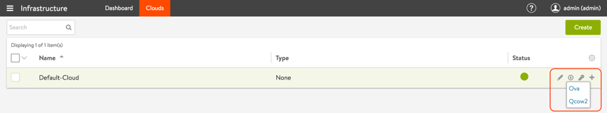</a></li>
 <li>Upload the se.qcow2 to the CSP repository (<a href="#_Toc473547167">steps to upload</a>).</li>
</ol> 

### Upload SE metadata file

To configure SE management interface statically, the IP, netmask and gateway information must be passed as a YAML file. The name of the metadata file must be in ‘avi_meta/*.yml’ format.

For example, create a text file with name avi_meta_se.yml with contents as:

<pre><code class="language-lua">avi.mgmt-ip.SE: "10.128.2.18"
avi.mgmt-mask.SE: "255.255.255.0"
avi.default-gw.SE: "10.128.2.1"
AVICNTRL: "10.10.22.50"
AVICNTRL_AUTHTOKEN: "febab55d-995a-4523-8492-f798520d4515"
AVITENANT_UUID: 'tenant-f3fd4914-01e2-4fbf-b5bc-65b054700cee'</code></pre>

Here avi.mgmt-ip.SE is the management IP for Avi SE, avi.mgmt-mask.SE is the network mask and avi.default-gw.SE is the gateway IP address for the management network. AVICNTRL is the management IP of the Avi controller (Make sure to replace the IP address in the example with correct ones for your network).

AVITENANT_UUID (optional): UUID of the tenant on Avi Controller to which the SE must connect. the SE will connect to the admin tenant by default if this field is omitted.

AVICNTRL_AUTHTOKEN is the authentication token used to authenticate the SE-to-Controller communication. Follow the below steps to generate the authentication token:
<ol> 
 <li>Navigate to Infrastructure &gt; Clouds</li>
 <li>Click on the key icon on the Default-Cloud row to view the authentication token key.
  <figure id="attachment_23645" class="thumbnail wp-caption aligncenter" style="width: 876px">
   <a href="img/Picture10.png">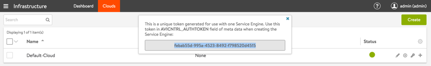</a>
   <figcaption class="caption wp-caption-text">
     Note: The authentication token has a validity timeout of 1 hour by default.
   </figcaption>
  </figure></li>
 <li>Copy the authentication token.</li>
</ol> 

Upload this metadata file to the CSP repository (<a href="#_Toc473547167">steps to upload</a>).

### Enable SR-IOV

SR-IOV must be enabled on the CSP pNIC. Follow the below steps to enable SR-IOV on enp7s0f0:
<ol> 
 <li>Navigate to Configuration &gt; SRIOV Config</li>
 <li>Click on the settings icon for enp7s0f0.</li>
 <li>Set the “Number of VFs” to the desired number.</li>
 <li>Set the “Switch Mode” to veb.
  <figure id="attachment_23643" class="thumbnail wp-caption aligncenter" style="width: 880px">
   <a href="img/Picture11.png">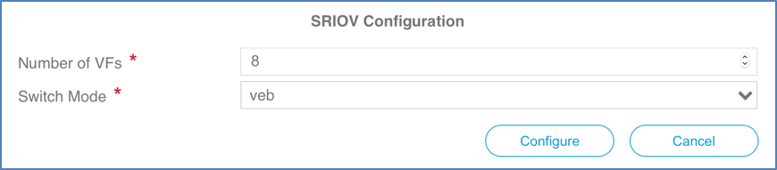</a>
   <figcaption class="caption wp-caption-text">
     Note: In above example 8 VFs (virtual functions) are configured on the pNIC. The uer should configure this number to the appropriate number, depending on the number of services that will share the pNIC. Cisco recommends to over-allocate VFs (maximum 32 on a 10G pNIC).
   </figcaption>
  </figure></li>
</ol> <ol start="5">
 <li>Repeat the above steps to configure enps0f1 for SR-IOV if required.</li>
</ol> 

### Deploy Avi SE in SR-IOV Mode

Use the following steps to deploy the Avi SE using the CSP UI:
<ol> 
 <li>Navigate to Configuration &gt; Services.<a href="img/Picture3-1.png">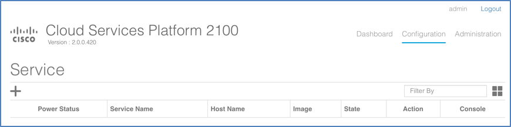</a></li>
 <li>Click on +. Refer to <a href="/system-requirements-hardware/">System Requirements: Hardware</a> for recommendations on a minimum production SE configuration.<a href="img/Picture4-1.png">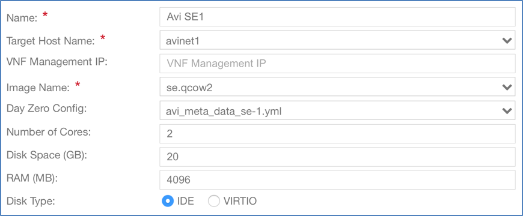</a></li>
 <li>Enter “Avi SE1” in the Service Name field and press enter.</li>
 <li>Click on Target Host Name and select the host from the list.</li>
 <li>Leave the VNF Management IP field blank. This is set using the Day Zero Config.</li>
 <li>Click on Image Name and select the se.qcow2 image from the list.</li>
 <li>Click on Day Zero Config dropdown and select the SE metadata file.</li>
 <li>Set the resource values for Disk, CPU and RAM (minimum values shown above).</li>
 <li>Click on + to add a vNIC and connect it to enp1s0f0 in access mode.<a href="img/Picture14.png">  </a></li>
 <li>Click on + to add a vNIC and connect it to enp7s0f0 in SR-IOV mode.<a href="img/Picture15.png">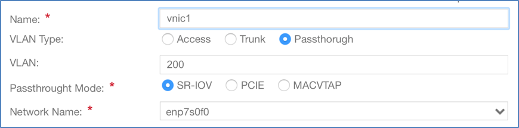  </a></li>
 <li><em>(optional) </em>Specify a password for console login using VNC.</li>
 <li>Click Deploy.</li>
 <li>Verify the SE is able to connect to the Avi Controller by navigating to Infrastructure &gt; Dashboard on Avi Controller UI (this may take a few minutes).</li>
</ol>

 

