This guide describes how to integrate Avi Vantage into a VMware vCenter cloud. The instructions in this guide can be used for installing Avi Vantage 16.3.

Avi Vantage is a software-based solution that provides real-time analytics as well as elastic application delivery services. Avi Vantage optimizes core web-site functions, including SSL termination and load balancing.

**Notes:**

* **Deployment in *write access mode* is recommended. It's the quickest and easiest way to deploy.**
* **After completing the deployment process, click <a href="/configuring-a-virtual-service-for-vmware-basic">here</a> to learn how to create virtual services.**
* **Avi Vantage may be deployed with a VMware cloud in either no access, read access, or write access mode. Each mode results in escalating functionality and automation, but also requires higher levels of privilege for the Avi Controller within VMware vCenter. For more information, please see<a href="/vantage-interaction-with-vcenter/"> this article</a>.**
* **Prior to Avi Vantage 16.3, Service Engines deployed manually by the Avi administrator in No Orchestrator or VMware vCenter read access clouds required the user to download a unique copy of the Service Engine image for each cloud configured in the system. Starting from 16.3 release, the Avi administrator needs to download only one Service Engine image for each type of image needed (<code>ova/qcow2/docker</code>). The same SE image can then be used to deploy Service Engines in any tenant and cloud configured in the system. Read <a href="/manually-deploy-service-engines-in-non-default-tenantcloud/">this relevant article</a>.**
* **vMotion is not supported.** 

## How Avi Vantage Integrates into vCenter

Avi Vantage runs on virtual machines (VMs) managed by VMware vCenter. When deployed into a vCenter-managed VMware cloud, Avi Vantage performs as a fully distributed, virtualized system consisting of the Avi Controller and Avi Service Engines (Avi SEs), each running as a VM.

<a href="img/vmware-deploy1.png">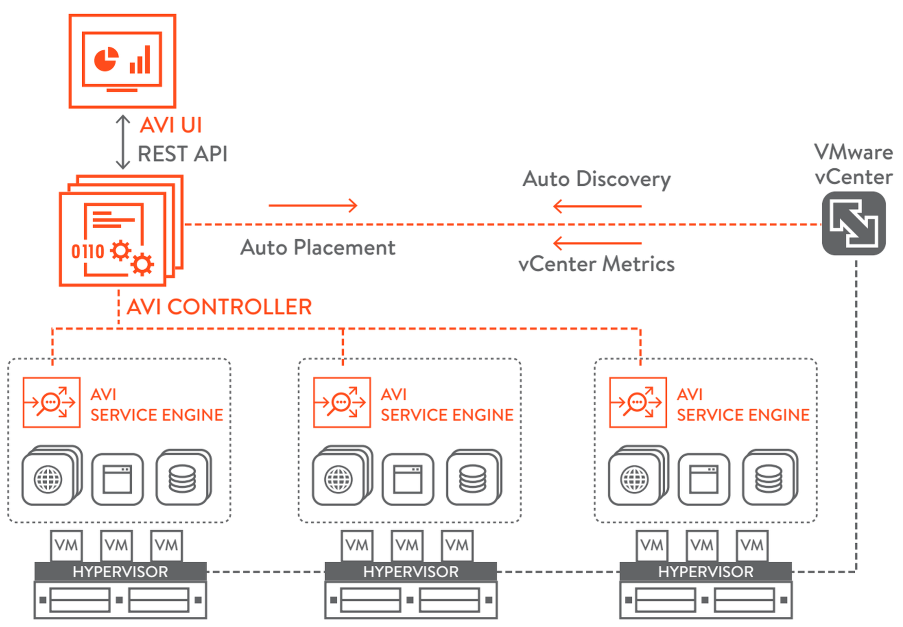</a>

Avi Vantage is deployed and runs as the following main components:

* **Avi Controller**
* **Avi Service Engines (Avi SEs)** 

### Avi Controller

The Avi Controller provides a single point of control and management for the cloud. The Avi Controller runs on a VM and can be managed using its web interface, CLI, or REST API.

The Avi Controller stores and manages all policies related to services and management. Through vCenter, the Avi Controller discovers VMs, data centers, networks, and hosts. Based on this auto-discovered information, virtual services can quickly be added using the web interface. To deploy a virtual service, the Avi Controller automatically selects an ESX server, spins up an Avi SE (described below), and connects it to the correct networks (port groups).

*Note: For this Controller-to-vCenter communication to work, Avi Controllers need access to the desired ESXi hosts (over port 443).*

The Avi Controller also provides a management center for other cloud infrastructures, with the ability to manage resources in multiple infrastructures simultaneously. For example, the Avi Controller can be configured to communicate with both a VMware vCenter server and an OpenStack controller, to manage resources in each type of cloud.

The Avi Controller can be deployed as a single VM or as a high availability cluster of 3 Avi Controller instances, each running on a separate VM.

### Avi Service Engine

Avi SEs provide the application delivery services to end-user traffic, and also collect real-time end-to-end metrics for traffic between end-users and applications.

Each Avi SE runs on its own VM. The Avi Controller manages the lifecycles of Avi SEs by creating, controlling, and deleting them. To deploy an Avi SE, the Avi Controller creates an Avi SE VM, plumbs it into a network, and provisions it with service policies as required to deploy virtual services.

## Deployment Prerequisites

### Virtual Machine Requirements

The <a href="/system-requirements-hardware/">System Requirements: Hardware article</a> lists the minimum requirements for the VMs on which the Avi Controller and Avi SEs are installed.

For added resiliency and redundancy, the Avi Controller can be deployed as a 3-node cluster. [See <a href="/overview-of-vantage-high-availability/">Overview of Avi Vantage High Availability</a>.] In this case, a separate VM is needed for each of the 3 Avi Controller nodes. The requirements are the same for each node.

Appropriate physical resources need to be present in the ESX Host. If appropriate resources are not present in the ESX host, SE creation will fail and manual intervention will be required. 

### Fine-Tuning the SE VM

* **RAM**: Add 1 GB of RAM to the SE configuration for each additional vCPU.
* **CPU socket affinity**: If this option is selected, SEs within their group will have their vCPU cores allocation on the same CPU socket of a multi-socket CPU.
* Dedicated dispatcher CPU: If this option is selected, SEs within their group will dedicate a single CPU thread for dispatching data flows to other vCPU threads. This makes the most sense for SEs having three or more vCPUs.
* **Disk:** With 10 GB as an absolute minimum, set the disk value to at least (2 x RAM-size) + 5 GB. 

For more details on any of the above, read the <a href="/service-engine-group-16-2-1/#SERVICE_ENGINE_CAPACITY_AND_LIMIT_SETTINGS">Service Engine Group KB</a>.

### Software Requirements

The following table lists the software requirements.

<table class="table table table-bordered table-hover">  
<tbody>    
<tr>   
<th>Component
</th>
<th>Version
</th>
</tr>
<tr>   
<td>Avi Controller</td>
<td>16.2.1</td>
</tr>
<tr>   
<td>VMware vCenter</td>
<td>5.1, 5.5, or 6.0</td>
</tr>
</tbody>
</table> 

The Avi Controller OVA contains the images files for the Avi Controller and Avi SEs.

VMware vCenter is required for write access mode deployment or read access mode deployment.

### IP Address Requirements

The Avi Controller requires one management IP address. Each Avi SE requires one management IP address, a virtual service IP address, and an IP address that faces the pool network.

DHCP rather than static assignment is recommended for allocating the Avi SE management and the pool network interface IP addresses. The virtual service IP address is specified manually during creation of a load balancing policy.

Traffic whose destination is the VIP address:port is load balanced by Vantage across the members (servers) within the pool.

### vCenter Account Requirement

During initial Avi Controller setup, a vCenter account must be entered to allow the Avi Controller to communicate with vCenter. The vCenter account must have privileges to create new folders in vCenter. This is required for SE creation, which in turn permits virtual service placement. The privileges required are depicted below.

<a href="img/vCenterAviRole.jpg">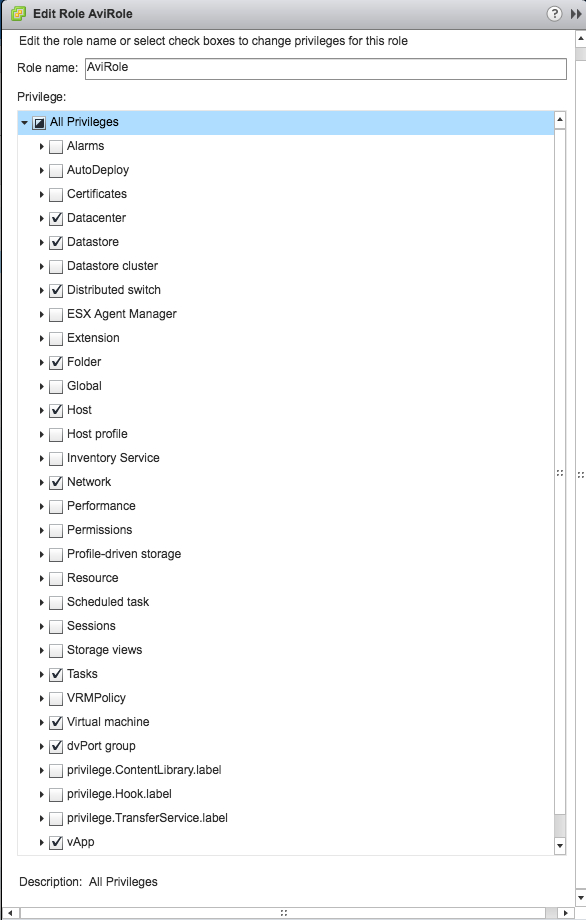</a>

## Deployment Modes

Avi Vantage can be deployed into a VMware cloud in one of the following modes. Each mode differs depending on the level of vCenter access provided to Avi Vantage. Each access level determines the amount of automation and analytics Avi Vantage is able to provide, and accordingly has different requirements for deployment.

* **Write access mode:** Avi Controller automatically spins up Avi SEs as needed. This mode requires a vCenter user account with write privileges.
* **Read access mode:** Avi Controller accesses vCenter to discover information about networks and VMs. Avi SEs must be spun up and connected to networks by the Avi Vantage user (possibly you). This mode requires a vCenter user account with read privileges.
* **No access mode:** Avi Controller does not access vCenter. The Avi Vantage user spins up an Avi SE, discovers networks, and connects the Avi SE to one of the networks. 

### Deployment Example: Write access with DHCP

The following example shows the recommended deployment topology: write access mode with DHCP.

<a href="img/vmware-deploy2.png">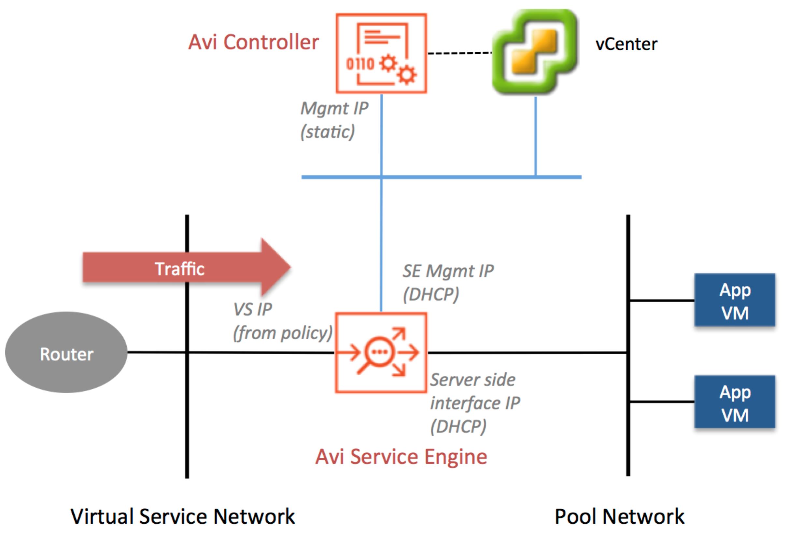</a>

The Avi Controller requires one management IP address. The Avi SE requires one management IP address, a virtual service IP address, and a pool-network-facing IP address. DHCP is recommended for allocation of the Avi SE management IP addresses and the pool-network-interface IP addresses. The virtual service IP address:port is specified manually as part of creating a load balancing policy. End-user requests are received by the virtual service IP and is load balanced across the members of the pool.

----

## Deploying in Write Access Mode

This section provides the steps for deploying Avi Vantage in write access mode.

### Deployment Steps

Deployment of Avi Vantage into a vCenter-managed VMware cloud in write access mode requires the following procedure. Detailed steps for each part of the procedure are provided.
<ol> 
 <li>Deploy the Avi Controller OVA file.</li> 
 <li>Perform initial Avi Controller setup.</li> 
 <li>If using static IP assignment, configure the IP address pools for the networks where the Avi SEs will run.</li> 
 <li>Verify installation.</li> 
</ol> 

### Deploy Avi Controller OVA

Through a vCenter client, log into the vCenter server. Using the vCenter client, deploy the Avi Controller OVA file.
<ol> 
 <li>Click File on the top menu and choose Deploy OVF Template.</li> 
 <li>Follow the instructions of the Deploy OVA Template wizard. 
  <ul> 
   <li>Choose Thick Provision Lazy Zeroed for disk format.</li> 
   <li>Choose a port group for Destination Networks in Network Mapping. This port group will be used by the Avi Controller to communicate with vCenter.</li> 
   <li>Specify the management IP address and default gateway. Or, leave them empty if using DHCP.</li> 
  </ul> </li> 
 <li>Power on the VM.</li> 
</ol> 

Note: Use a static IP address for Avi Controller management unless your DHCP server can keep the assigned IP address permanently.

### Perform Initial Setup of Avi Controller

This section shows how to perform initial configuration of the Avi Controller using its deployment wizard.

You can change or customize settings following initial deployment using the Avi Controller’s web interface.

To start, use a browser to navigate to the Avi Controller.

Note: While the system is booting up, a blank web page or 503 status code may appear. In this case, wait for 5 to 10 minutes; then follow the instructions for the the setup wizard.
<ol> 
 <li>Configure basic system settings: 
  <ul> 
   <li>Administrator account</li> 
   <li>DNS and NTP server information</li> 
   <li>Email/SMTP information</li> 
  </ul> 
  
 
   
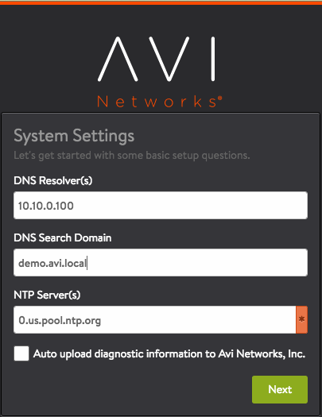
 
   

 
  
 </li> 
 <li>Set the infrastructure type to VMware:  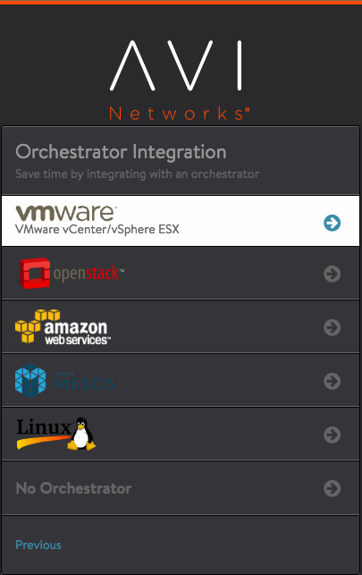</li> 
 <li>Enter vCenter settings: 
  <ul> 
   <li>vCenter credentials (The vCenter account must have privileges to create new folders in vCenter. This is required for SE creation.)</li>
   <li>vCenter IP address</li> 
   <li>Permissions (Select <strong>Write</strong>.)</li> 
   <li>Integration with Cisco APIC (Leave unselected/disabled.)</li> 
   <li>Data center (where Avi Vantage will be deployed)</li> 
   <li>IP allocation method for the networks where the pools and virtual services will be located: DHCP or Static. (Wizard screen example below shows DHCP.)</li> 
  </ul> 
  
 
   
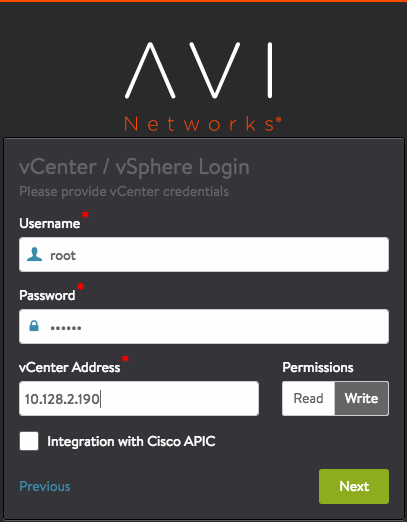
 
   
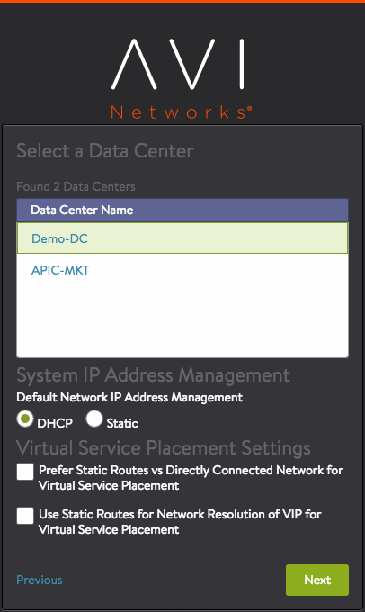
 
   
 
 
  
 </li> 
 <li>Configure Avi SE settings: 
  <ul> 
   <li>Management network</li> 
   <li>IP allocation method for management network</li> 
   <li>Support Multiple Tenants (Select <strong>No</strong>.)</li> 
  </ul> 
One of the Avi SE's 10 vNICs is for connection to the management network. The other vNICs are data vNICs. For the IP allocation method, if static address assignment is used, enter a subnet address and a range of host addresses within the subnet. Avi Vantage assigns addresses from this range to the Avi SE data interfaces.
 
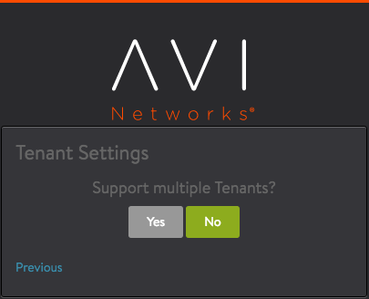
</li> 
 <li>To verify installation, navigate to Infrastructure &gt; Clouds, click Default-Clouds, then click the Status button. If the status is green, installation is a success.<a href="img/vmware-install-writeaccess-verify-cloud-162-1.png">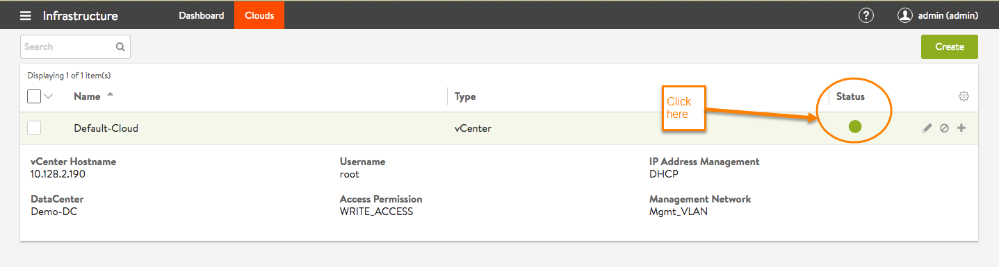</a>If the management and pool networks use DHCP, the deployment procedure is complete. If static address allocation is used, an additional set of steps is required: <a href="#staticIPass">configure IP address pools for networks</a>.</li> 
</ol> 

### Verify Controller-to-VMware Communications

The Avi Controller must be able to communicate with vCenter and all ESX hosts that contribute to the deployment. Failing such, the Avi Controller will not be able to spawn SEs. In the same vein, if the ESX hosts have DNS names, then the Avi Controller should point to the very same DNS server used by the ESX hosts, to avoid names resolving to different IP addresses.

----

## Deploying in Read / No Access Mode

This section provides the steps for deploying Avi Vantage in read access mode or no access mode. In these modes:

* The Avi Controller does not access vCenter and does not deploy Avi SEs or connect them to networks. Instead, Avi SE deployment is performed by the vCenter administrator.
* Read access mode can provide analytics. No access mode does not provide the analytics related to the *VM properties of the SE VM*. However, it does continue to provide *virtual service* analytics.

### Deployment Process

Deployment of Avi Vantage into a vCenter-managed VMware cloud in read or no access mode requires the following procedure.
<ol> 
 <li>Deploy the Avi Controller OVA.</li> 
 <li>Perform initial Avi Controller setup.</li> 
 <li>Download the Avi SE OVA file from the Avi Controller.</li> 
 <li>Deploy the Avi SE OVA file. (This step is required twice, to create 2 Avi SEs. At least two instances of the Avi SE are required for high availability.)</li> 
 <li>Connect the Avi SEs to port groups to allow them to access the management network, virtual service network, and server network.</li> 
 <li>Verify Avi SE discovery.</li> 
 <li>Verify the discovery of VMware resources.</li> 
</ol> 

### Deploy Avi Controller OVA

Through a vCenter client, log into the vCenter server. Then use the vCenter client to deploy the Avi Controller OVA file.
<ol> 
 <li>In vCenter, click File on the top menu and choose Deploy OVF Template.</li> 
 <li>Follow the instructions of the Deploy OVA Template wizard. 
  <ul> 
   <li>Choose Thick Provision Lazy Zeroed for disk format.</li> 
   <li>Choose a port group for Destination Networks in Network Mapping. This port group will be used by the Avi Controller to communicate with vCenter.</li> 
   <li>Specify the management IP address and default gateway. Or, leave them empty if using DHCP.</li> 
  </ul> </li> 
 <li>Power on the VM.</li> 
</ol> 

Note: Use a static IP address for Avi Controller management unless your DHCP server can keep the assigned IP address permanently.

### Perform Initial Setup of Avi Controller

This section shows how to perform initial configuration of the Avi Controller using its deployment wizard.

You can change or customize settings following initial deployment using the Avi Controller’s web interface.

To start, use a browser to navigate to the Avi Controller.

Note: While the system is booting up, a blank web page or 503 status code may appear. In this case, wait for 5 to 10 minutes; then follow the instructions for the the setup wizard.
<ol> 
 <li>Configure basic system settings: 
  <ul> 
   <li>Administrator account</li> 
   <li>DNS and NTP server information</li> 
   <li>Email/SMTP information</li> 
  </ul> 
  
 
   

 
   

 
  
 </li> 
 <li>Set the infrastructure type: 
  <ul> 
   <li>No access mode: select No Orchestrator to finish the wizard. No more information is required.</li> 
   <li>Read access mode: select VMware and continue with this procedure.</li> 
  </ul> 

</li> 
 <li>Enter vCenter settings (read access mode): 
  <ul> 
   <li>vCenter credentials (username and password)</li> 
   <li>vCenter IP address</li> 
   <li>Permissions (Select <strong>Read</strong>.)</li> 
   <li>Integration with Cisco APIC (leave unselected/disabled)</li> 
   <li>Data center (where Avi Vantage will be deployed)</li> 
   <li>IP allocation method for the networks where the pools and virtual services will be located</li> 
  </ul> 
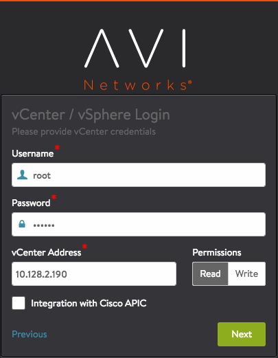  
 
 
</li> 
 <li>To verify discovery by the Avi Controller of all vCenter resources, navigate to Administration &gt; Settings &gt; Infrastructure. The discovery status should be 100% complete. (See example above.)</li> 
</ol> 

If the management and pool networks use DHCP, the deployment procedure is complete. If static address allocation is used, an additional set of steps is required: <a href="#staticIPass">configure IP address pools for networks</a>.

### Install Service Engine

Deployment in read access mode or no access mode requires the user to download and deploy the Avi SE to install it. *(Avi SE installation in write access mode is automatic.)*

### Download Avi SE OVA

The OV image file for Avi SEs is embedded in the Avi Controller image. The Avi SE OV image can be downloaded through the web interface or the API. To download:

* Using the Web Interface: Navigate to Infrastructure > Cloud, click the button, and select se.ova to download the Avi SE ova. 
<a href="img/VMware-deploy-SE-OVA-download-162-1.png">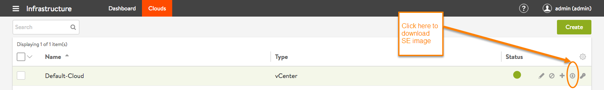</a>
* Using the API: Navigate to <a href="http://avi-ctlr-ip/api/fileservice/seova">http://avi-ctlr-ip/api/fileservice/seova</a>, where avi-ctlr-ip is the IP address of the Avi Controller. 

### Deploy Avi SE OVA

After you download the Avi SE OVA from the Avi Controller, use the following steps to deploy it.

Note: By default, deployment requires a minimum of two Avi SEs, for the sake of high availability.
<ol> 
 <li>In vCenter, click File on the top menu and choose Deploy OVF Template.</li> 
 <li>Follow the instructions of the Deploy OVA Template wizard. 
  <ul> 
   <li>Choose Thick Provision Lazy Zeroed for disk format.</li> 
   <li>Choose the port groups for the Avi SE network connections. The Avi SE has 10 vNICs. Connect the first vNIC to the management network. Connect the other vNICs to the data networks.</li> 
   <li>For the management connection, choose a port group that will allow the Avi SEs to communicate with the Avi Controller. An Avi SE can be connected to up to 9 data networks. For each Source Network, choose a port group in Destination Networks where you plan to have virtual services and pools. The Avi Controller expects the Avi SE’s data vNICs to be connected to virtual service and pool networks.</li> 
   <li>Specify the Avi Controller IP address.</li> 
   <li>Enter the Avi Controller’s authentication token key: 
    <ol> 
     <li>Log into the Avi Controller.</li> 
     <li>Navigate to Infrastructure &gt; Clouds.</li> 
     <li>Click on  to view the authentication token key.</li> 
     <li>Copy the authentication token. 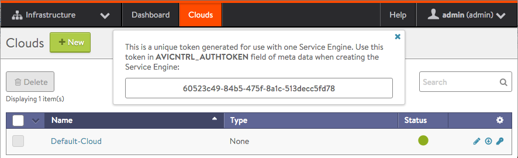</li> 
     <li>Paste the authentication token key into the Authentication Token for Avi field.</li> 
     <li>Specify the management IP address and default gateway. Or, leave them empty if using DHCP.</li> 
     <li><a href="img/vmware-deploy7.png">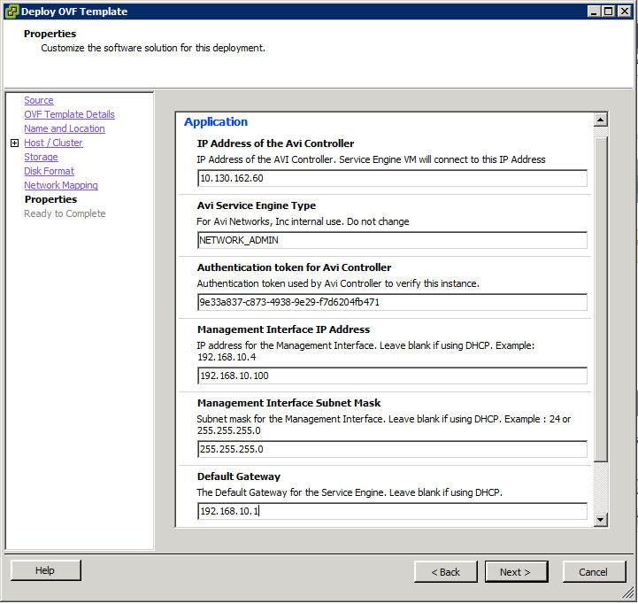</a></li> 
    </ol> </li> 
  </ul> 
 
</li> 
 <li>On the VM Properties menu, connect the Avi SE data vNICs to the port groups needed to reach a virtual service network and pool network. Note: Leave any unused vNICs disconnected.</li> 
 <li><em>(no access mode only)</em> Write down the following information: 
  <ul> 
   <li>MAC addresses of the vNICs</li> 
   <li>IP subnet of the port group</li> 
  </ul> 
This information will be used to identify the Avi SE interfaces because the Avi Controller does not have access to vCenter and therefore cannot associate the Avi SE’s interface names with VMware’s interface names.
 

 
Note: This step is required only for no access mode, not for read access mode.
</li> 
 <li>Power on the VM.</li> 
</ol> 

Repeat to deploy at least one more Avi SE. By default, 2 Avi SEs are required for deployment of a virtual service, for the sake of high availability.

If the management and pool networks use DHCP, the deployment procedure is complete. If static address allocation is used, an additional set of steps is required: <a href="#staticIPass">configure IP address pools for networks</a>.

Note: The Avi SE must be connected to the management network, virtual service networks, and pool (back-end server) networks.

### *(no access mode only)* Configure Avi SE Interfaces

Each Avi SE requires an IP address in each of the virtual service networks and server networks. If deploying in write access mode or read access mode, this process is automatic. If deploying in no access mode, the Avi Vantage user must perform the following steps:
<ol> 
 <li>Navigate to Infrastructure &gt; Service Engines, and select the Avi SE that was deployed in the previous section.</li> 
 <li>Find the interface that matches the list of MAC addresses written down during Avi SE deployment.</li> 
 <li>If DHCP is available for address assignment, enable the DHCP option for the interface. Otherwise, <a href="#staticIPass">provide a static IP address</a>.</li> 
</ol> 

Repeat for each connected interface, for virtual service and server networks.

<a href="img/vmware-deploy10.png">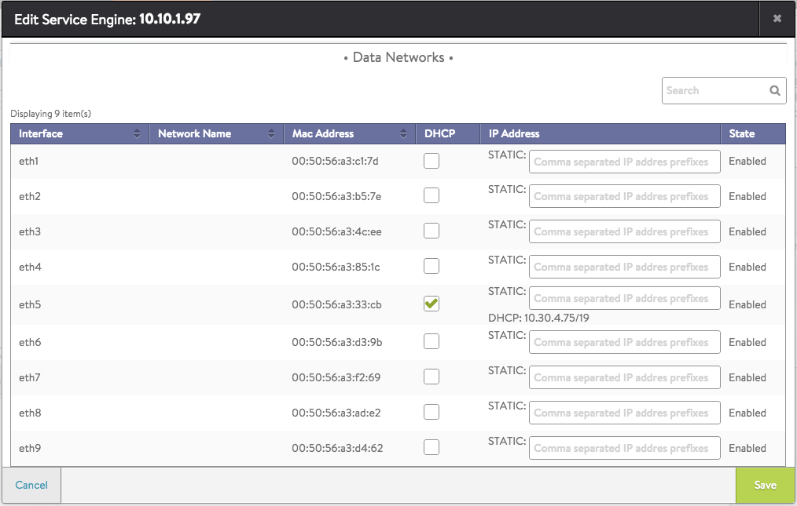</a>

### *(Static IP only)* Configure IP Address Pools for Networks

***These steps are required only if static IP address allocation is used. If the management and pool networks use DHCP, skip this section.***

Each Avi SE deployed in a VMware cloud has 10 vNICs. The first vNIC is the management vNIC through which the Avi SE communicates with the Avi Controller. The other vNICs are data vNICs and are used for end-user traffic.

After spinning up an Avi SE, the Avi Controller connects the Avi SE’s management vNIC to the management network specified during initial configuration. The Avi Controller then connects the data vNICs to virtual service networks according to the IP and pool configurations for the virtual services.

To perform this network plumbing automatically, the Avi Controller builds a table that maps port groups to IP subnets. With this table, the Avi Controller connects Avi SE data vNICs to port groups that match virtual service networks and pools.

<a href="img/vmware-deploy4.png">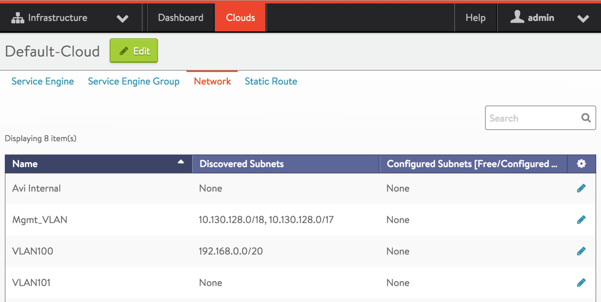</a>

After a data vNIC is connected to a port group, it needs to be assigned an IP address. For static allocation, assign a range of IP addresses to the applicable port group. The Avi Controller selects an IP address from the specified range and adds the address to the data vNIC connected to the port group.

Use the following steps to assign an IP address pool to port groups:
<ol> 
 <li>Navigate to Infrastructure &gt; Cloud &gt; Default-Cloud &gt; Network.</li> 
 <li>Find a port group and IP subnet on which a DHCP service <em>is not</em> available.</li> 
 <li>Select the port group by clicking the edit icon: </li> 
 <li>Check Static for Network IP Address Management.</li> 
 <li>Select the IP subnet by clicking the edit icon: </li> 
 <li>Enter a static IP address or a range.</li> 
</ol> 

<a href="img/vmware-deploy5.png">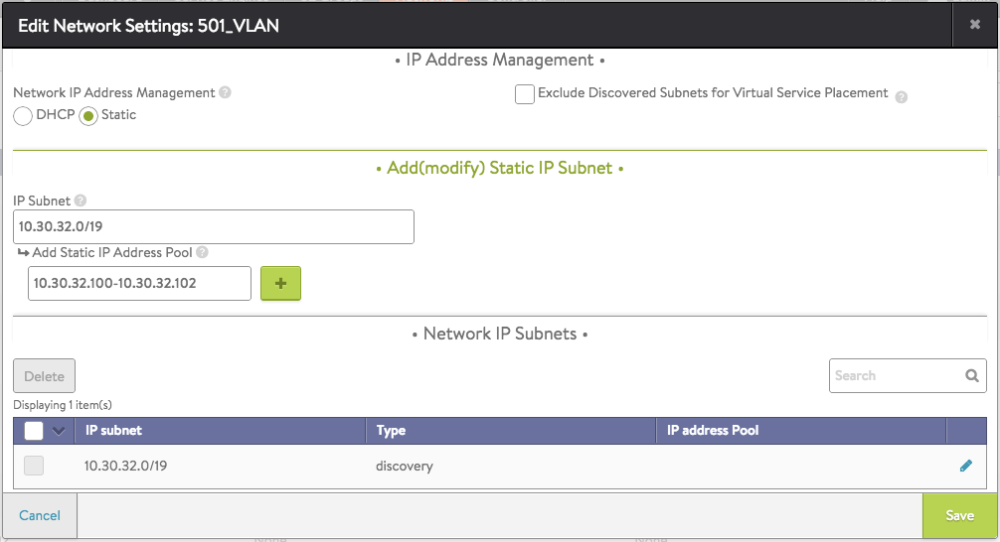</a>

**If deploying in no access mode, <a href="#Avi SEint">one final setup item</a> is required. If deploying in write access or read access mode, the procedure is complete!** Now Avi Vantage is ready for <a href="/configuring-a-virtual-service-for-vmware-basic">creation of virtual services</a>.

### Recommended Reading

* <a href="/virtual-service-creation-vmware/">Creating a Virtual Service</a>
* <a href="/troubleshooting-vmware-deployment/">Troubleshooting</a>