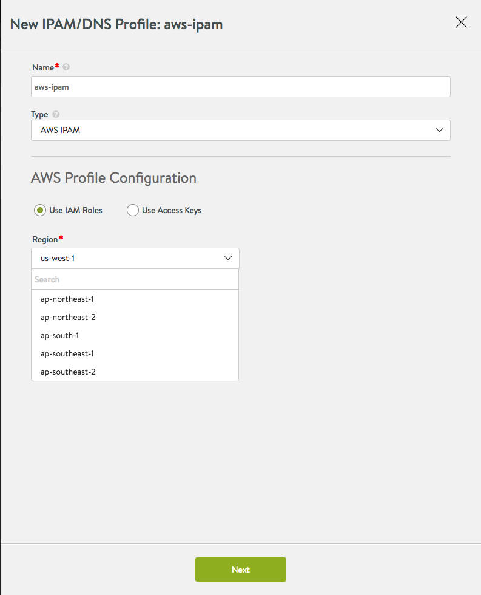
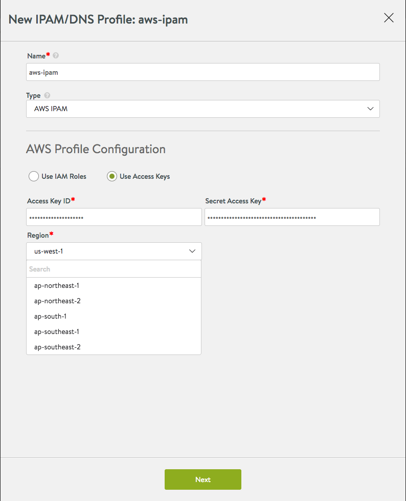
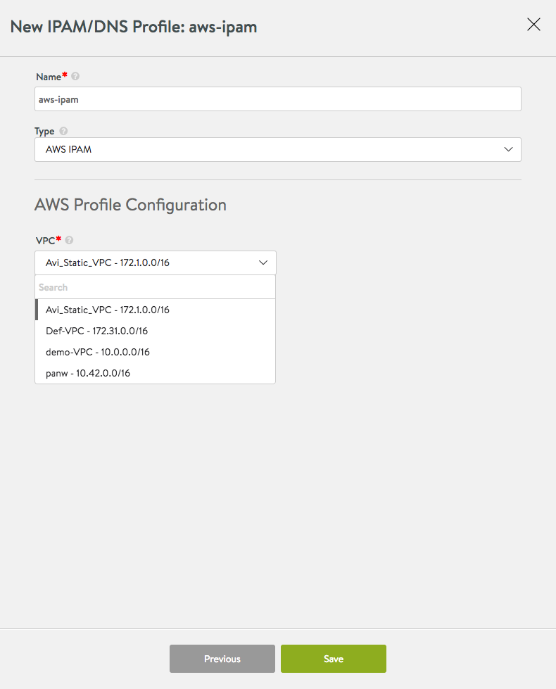

Avi Vantage integrates with Amazon Web Services (AWS) to provide IPAM services to applications running on instances in AWS.

Note:

* If the Avi Vantage cloud type is AWS, there is support for IPAM, by default, without need for a separate IPAM configuration.
* A separate IPAM configuration (as described below) is required only for cases where AWS provides the infrastructure service for *other* clouds (e.g., Mesos Cluster running on AWS instances). In such cases, wherein Avi Vantage is the IPAM provider, it cannot also be the DNS provider; use Route 53 instead. 

See also: <a href="/service-discovery-using-ipam-and-dns-16-3/">Service Discovery Using IPAM and DNS</a>

## IPAM Configuration

To use AWS as the IPAM provider, one of the following types of credentials is required:

* Identity and Access Management (IAM) roles: Set of policies that define access to resources within AWS.
* AWS customer account key: Unique authentication key associated with the AWS account. 

### If Using IAM Role

Note: If using the IAM role method to define access for an Avi Vantage installation in AWS, use the steps in <a href="/iam-role-setup-for-installation-into-aws/">this article</a> to set up the IAM roles before beginning deployment of the Avi Controller EC2 instance.

Select AWS and Use IAM Roles. Then select the AWS region into which the VIPs will be deployed.

 

### If Using Access Key

Select AWS, then select Use Access Keys and enter the following information:

* Access Key ID: AWS customer key ID.
* Secret Access Key: customer key.
* Region: AWS region into which the VIPs will be deployed. 

Click Next (regardless of IAM or Access Keys method chosen), and a drop-down menu of available networks for IPAM is displayed. Select the appropriate network and click Save.

 
