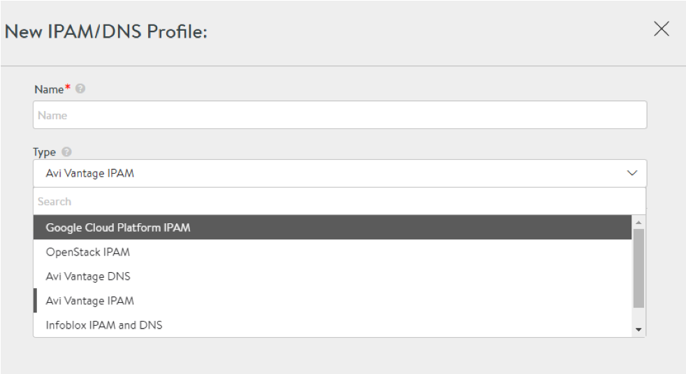
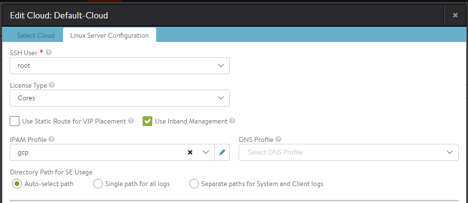

Beginning with release 16.3, Avi Vantage has integration with Google Cloud Platform (GCP) for providing IPAM services to applications running on instances in GCP.

See also: <a href="/docs/17.1/service-discovery-using-ipam-and-dns-16-3/">Service Discovery Using IPAM and DNS</a>

## Prerequisites for GCP IPAM

For details setting up Avi Controller and Service Engines instances on GCP, refer to <a href="/docs/17.1/example-configuration-of-avi-controller-and-se-instances-on-gcp">Example Configuration of Avi Controller and SE Instances on GCP</a>.

To use GCP as the IPAM provider, all the Avi Controller and Service Engine instances must run in Google Cloud.  The cloud type selected within Avi should be Linux Server Cloud.  Configuration steps for setting up a Linux Server Cloud are provided in <a href="/docs/17.1/installing-avi-vantage-for-a-linux-server-cloud-16-2/">Installing Avi Vantage for a Linux Server Cloud</a>.

Note: GCP uses a /32-based interface IP configuration.  To enable support for this, perform the below steps from the Avi Controller CLI after completing the configuration of Linux Server Cloud, and reload all the Service Engines for the configuration to take effect.

<pre class="command-line language-bash" data-prompt="1|:> ;" data-output="2-99"><code>configure serviceengineproperties
se_runtime_properties
se_handle_interface_routes

service_ip_subnets <em>subnet/mask</em>
save
save</code></pre> 

The **service_ip_subnets **configuration optimizes the Docker routes on the Service Engines.  If VIP allocation is done from multiple subnets, specify all of them.

## Configuration of GCP IPAM

<ol> 
 <li>Navigate to Templates -&gt; Profiles -&gt; IPAM/DNS Profiles and click Create.</li> 
 <li>Provide the IPAM profile name, and select Google Cloud Platform IPAM.</li> 
 <li>If auto-allocation of IP address for virtual services is required, select “Add Network” and then select the desired networks. For detailed steps on how to configure networks for auto-allocation, refer to <a href="/docs/17.1/vip-allocation-using-ipam-or-dns/">VIP Allocation Using IPAM or DNS</a>.</li> 
</ol> 

Note that only Avi Vantage's allocation method is supported for GCP IPAM type, and no DNS provider is available. GCP profile information — i.e., project, zone, network, and subnets — are automatically detected.

<ol start="4"> 
 <li>Click Save.</li> 
 <li>Navigate to Infrastructure -&gt; Cloud , and click on the cloud name.</li> 
 <li>From the IPAM pulldown, select the IPAM profile that was configured above.</li> 
 <li>Enable "Use Inband Management."</li> 
 <li>Click Save.</li> 
</ol> 

The above steps complete the configuration of GCP IPAM. Virtual services can now be provisioned.

### Notes

<ol> 
 <li>On GCP only L3 scale out mode is supported for virtual services.</li> 
 <li>Some of the GCP zones may require the MTU to be lowered to 1400. Use the below steps to set the MTU on the Service Engines. The MTU value will take effect after the Service Engines are rebooted once.</li> 
</ol> 
<pre class="command-line language-bash" data-prompt="1|:> ;" data-output="2-99"><code>configure serviceengineproperties
se_runtime_properties
global_mtu 1400
save
save</code></pre> 