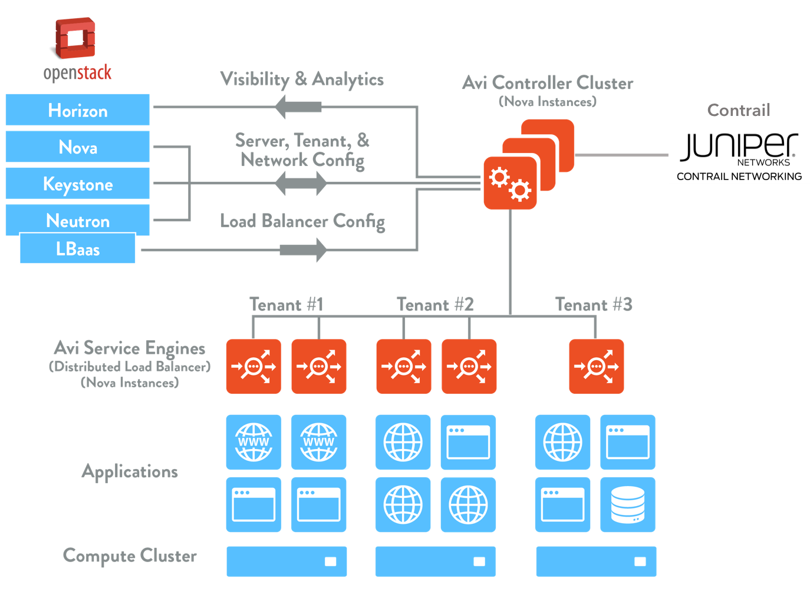
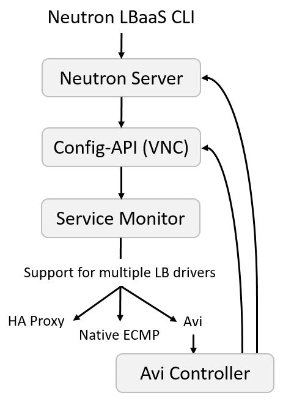

## Introduction

Organizations understand the benefits of web-scale and cloud-native architectures including flexibility, agility, speed, automation, elastic scale, and cost effectiveness. While they can achieve these benefits for application deployments, legacy networking and application services solutions prevent them from realizing end-to-end benefits for the infrastructure stack. Furthermore, emergence of private, public, and hybrid cloud deployments and heterogeneous environments (bare metal servers, virtual machines, containers) requires a next-generation solution architected for software-defined environments.

Juniper and Avi Networks with their software-defined networking and software-defined load balancing solutions enable enterprises to extend the SDN benefits from network layers (L2-L3) to application layers (L4-L7).  This integrated solution enables networks and application services to be provisioned and scaled quickly and automatically to match application and infrastructure automation that is possible with public cloud and private cloud frameworks.

### Features and Benefits:

* Architectural alignment enables seamless integration of Juniper and Avi solutions, delivering intelligent automation
* Complete automation from L2-L7 enables enterprises to automate their infrastructure.  They can respond quickly and cost-effectively to surging demand, without downtime, enabling applications to be deployed and scaled rapidly
* Granular visibility into application performance and end-user experience and access to both historical and real-time application analytics enables admins to troubleshoot network incidents within minutes
* A high-performance networking solution that enables a full-featured, software-defined data center 

### Juniper Networks Contrail Networking

Contrail Networking, based on the open source OpenContrail project, is a software-defined networking cloud automation solution comprised of a highly available controller and a kernel-embedded virtual router. As leading cloud networking and service orchestration powered by open technology, Juniper’s open solution for cloud and NFV improves business agility with security, availability, performance, automation, and elasticity. More information is available in the Juniper Contrail Networking <a href="http://www.juniper.net/assets/us/en/local/pdf/datasheets/1000521-en.pdf">Data Sheet</a>.

## How the Integration Works

Avi Controller is the single point of integration with Contrail using REST APIs. During initial configuration of the Avi Controller, the admin needs to provide OpenStack credentials and Contrail API-Server endpoint URL. From there on, the Avi Controller completely automates the entire deployment. As application or network admins configure application load balancers, the Avi Controller automatically creates SEs, adds the virtual network interfaces (vnics) in the right overlay network to the SEs and invokes Contrail APIs to place the virtual IPs (VIPs) on those vnics without any manual intervention. As application traffic increases, the Avi Controller scales out by creating or additional SEs and placing them in the right network through the integration with OpenStack and Contrail.

### Version Support

Avi and Contrail integration is supported starting with versions:

* Avi Networks v16.3
* Optional <a href="/avi-lbaas-neutron-driver-pre-install-instructions-for-contrail/">LBaaS driver support</a>:  
    * Via Neutron in Avi v16.3
    * Via Contrail in Avi v17.1
* Contrail v3.0.2
* OpenStack Liberty+ 

### Interaction

All interaction between Avi and Contrail is performed via API calls initiated from the Avi Vantage Controller to the Contrail API-Server.  During the OpenStack cloud setup of Avi, Contrail may be selected, along with the Contrail API-Server's IP or endpoint URL. The Avi Controller uses its OpenStack credentials to authenticate API messages sent to Contrail, which are secure and encrypted via SSL.

API calls are sent from Avi to Contrail whenever a network or IP change needs to be made.  Examples of actions that might necessitate this would be a new virtual service creation or deletion, a new Service Engine spun up, or a failover of a Service Engine. In each of these cases the Avi Controller will make the appropriate configuration changes to the Avi load balancing infrastructure and send messages to Contrail to take the corresponding actions to configure the networking. In case of network programming failures, Avi will log an event for the object (such as the virtual service) and mark it down or offline since it cannot be 'placed' in the network

Calls are sent from Avi to Neutron or Contrail, or both, depending on the task. Avi supports using either config-drive or metadata service for reading VM properties. By default, Avi will try config-drive first, but will use whichever method is supported by the OpenStack environment.

## Summary

As mutual technology alliances integrating solutions, Juniper Networks & Avi Networks deliver on the promise of SDN: agility, automation, cost effectiveness and scale, from the network layers (L2-3) all the way up to the application layers (L4-7), for enterprises and service providers alike. Networks and services can be provisioned and scaled quickly and automatically, to match application and infrastructure automation that is possible with OpenStack and other orchestration frameworks.

 
