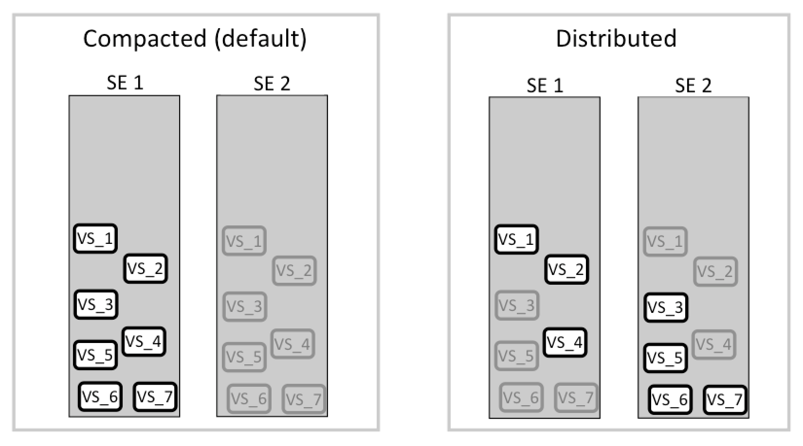
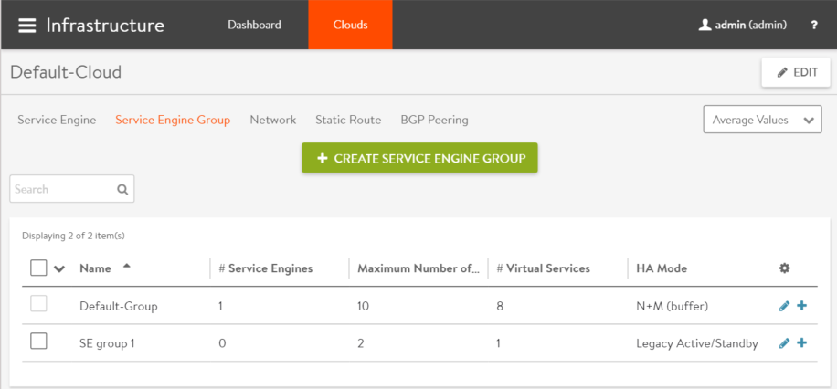
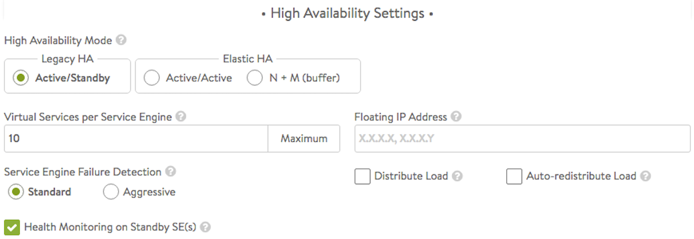
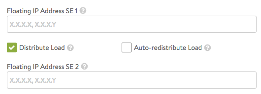
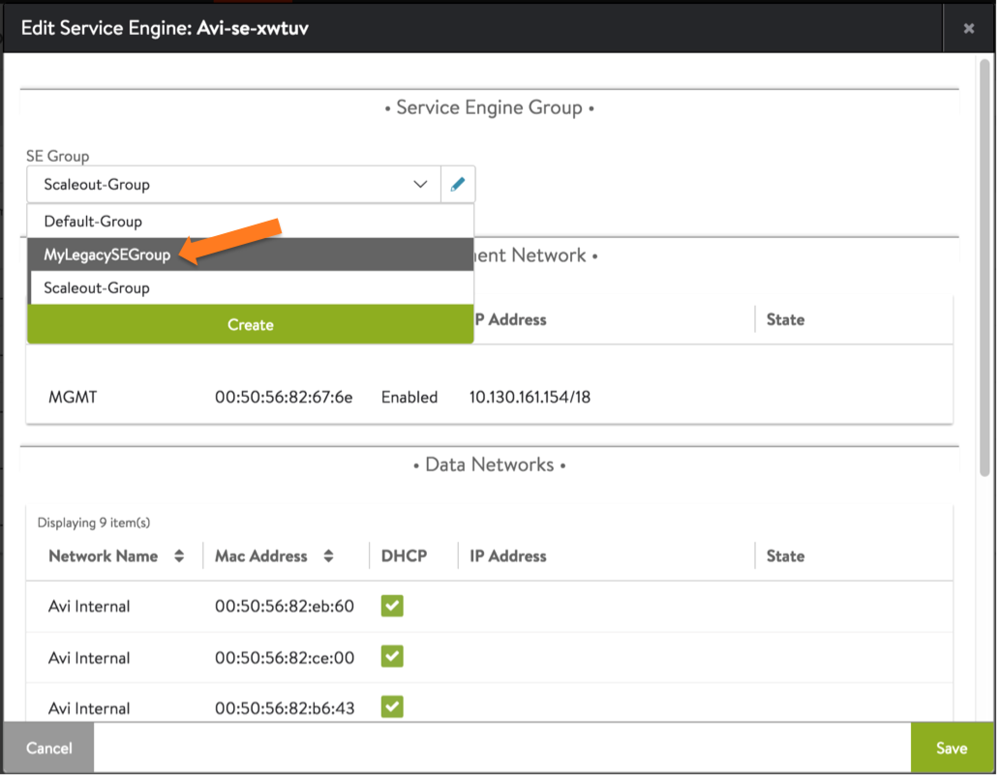

Beginning in Avi Vantage 16.2, legacy active/standby high availability (HA) is available for Avi Service Engine (SE) redundancy. Legacy active/standby is useful for migrating from hardware appliance-based solutions.

Avi Vantage also provides <a href="/docs/17.1/overview-of-vantage-high-availability">elastic HA</a>, including active/active and N+M modes.

In legacy HA mode, exactly two Avi SEs are configured. One SE carries all the traffic for a virtual service placed on it, and is thus the active SE for that VS. The other SE in the pair is the standby for that VS, carrying no traffic for it while the other SE is healthy. Upon failure of an SE, the surviving SE takes over traffic for all virtual services previously active on the failed SE, while continuing to handle traffic for virtual services already assigned to it. As part of the takeover process, the survivor also takes ownership of all floating addresses, such as VIPs, SNAT-IP, and so on. Two options, compacted and distributed (figure 1), determine whether all active virtual service placements are concentrated onto one SE in a healthy pair or not.

Starting with release 16.3, Avi Vantage supports rolling upgrades by the Avi Controller of SEs in a legacy HA configuration. Virtual services running on a legacy HA SE group are not disrupted during their upgrade.

<figure class="thumbnail wp-caption alignnone">   
<figcapture> Figure 1. Legacy HA active/standby, showing compacted and distributed load options. Standby virtual services are shown in light grey. 
</figcapture>
</figure> 

### Health Monitoring

By default, health checks are sent by both Avi SEs to back-end servers. Optionally, one can disable health monitoring by an SE for virtual services for which it is standing by.

Optionally, health checks for each Avi SE's next-hop gateways also can be enabled. <a href="/docs/17.1/gateway-monitoring-for-legacy-ha">Gateway health checking</a> is supported for both Avi SEs.

### Floating IP Address

Optionally, one or more floating IP addresses can be assigned to an SE group configured for legacy HA. The floating IP address is applicable when the SE interfaces are not in the same subnet as the VIP or source NAT (SNAT) IP addresses that will use the SE group.  One floating interface IP is required per each attached subnet per SE group when configured in Legacy HA mode.

## Configuring Legacy HA

To configure a pair of SEs for legacy HA:
<ol> 
 <li>Create an SE group for the pair of SEs. Legacy HA requires each pair of active/standby SEs to be in its own SE group.</li> 
 <li>Within each SE group: 
  <ul> 
   <li>Add 2 SEs.</li> 
   <li>Change the SE group's HA mode to legacy HA.</li> 
   <li>If applicable, add a floating IP interface.</li> 
  </ul> </li> 
</ol> 

Detailed steps are provided below.

### Using the Web Interface

### Create an SE Group for each Active/Standby Pair of SEs

<ol> 
 <li>Navigate to Infrastructure &gt; Clouds.</li> 
 <li>Select the cloud.</li> 
 <li>Select Service Engine Group (figure 2).</li> 
 <li>Click Create Service Engine Group. 
  <figure id="attachment_8395" class="thumbnail wp-caption alignnone" style="width: 418px"> 
    
   <figcaption class="caption wp-caption-text">
     Figure 2. Infrastructure &gt; Clouds &gt; Service Engine Group 
   </figcaption> 
  </figure></li> 
 <li>Enter a name for the group.</li> 
 <li>Select Legacy HA Active/Standby, as shown in figure 3. Some fields will disappear, while others, such as Floating IP Address, will appear. 
  <figure id="attachment_10664" class="thumbnail wp-caption alignnone" style="width: 510px"> 
    
   <figcaption class="caption wp-caption-text">
     Figure 3. The HA settings section of the SE group editor. Legacy HA Active/Standby has been selected. 
   </figcaption> 
  </figure></li> 
 <li>If applicable, enter the (optional) floating IP address. 
  <figure id="attachment_10651" class="thumbnail wp-caption alignright" style="width: 275px"> 
    
   <figcaption class="caption wp-caption-text">
     Figure 4. When Distribute Load option is selected, a second floating IP field appears. 
   </figcaption> 
  </figure></li> 
 <li>By default, Vantage compacts all virtual services onto one SE within the active/standby pair. To distribute active virtual services across the pair, within the Virtual Service Placement Policy section of the SE group editor, select the Distribute Load option (figure 4). Note that a second floating IP address may be specified. Assign virtual services on an individual basis to one or the other SE in the legacy pair by navigating to the Advanced tab in the virtual service editor.</li> 
 <li>By default, virtual services that fail over are <em>not</em> migrated back to the SE that replaces the failed SE. Rather, load will remain compacted on the failover SE. Choose the Auto-redistribute Load option (figure 4) to make failback automatic.</li> 
 <li>The Virtual Services per Service Engine field (figure 3) sets a maximum on the number of virtual services that may be placed, be they compacted onto one SE or not. By its nature, "legacy" is "non-elastic," such that for any given virtual service, exactly <em>one</em> placement (onto the virtual service's active SE) will be performed.</li> 
 <li>Finally, uncheck the Health Monitoring on Standby SE(s) option (figure 3) if you prefer it to be performed only by active SEs.</li> 
 <li>Click Save.</li> 
</ol> 

### Add the Pair of SEs to the SE Group

<ol> 
 <li>Navigate to Infrastructure &gt; Clouds.</li> 
 <li>Select the cloud.</li> 
 <li>Select Service Engine.</li> 
 <li>Click the edit icon next to one of the SEs.</li> 
 <li>Select the SE group from the pull-down list. 
  <figure id="attachment_11056" class="thumbnail wp-caption alignnone" style="width: 610px"> 
    
   <figcaption class="caption wp-caption-text">
     Figure 5. SE editor 
   </figcaption> 
  </figure></li> 
</ol> 

Note: If Avi Vantage was deployed in full access mode, the other SE is automatically added to the same group. If Avi Vantage was installed in no access mode, select the second SE to also add it to the group.

### Placing a Virtual Service on the SE Group

After configuring the SE group for legacy HA, virtual services can be placed on the group. To place a virtual service on the SE group:
<ol> 
 <li>Navigate to Applications &gt; Virtual Services. 
  <ul> 
   <li>If creating a new virtual service, select Create &gt; Advanced. Enter a name and the VIP address, then click Advanced.</li> 
   <li>If editing an existing virtual service, click the edit icon in the row for the virtual service. Then click Advanced.</li> 
  </ul> </li> 
 <li>In the Other Settings section, select the SE group from the pull-down list.</li> 
 <li>Click Save.</li> 
</ol> 

### Using the CLI

This example configures a pair of SEs (10.10.22.80 and 10.10.22.123) for legacy HA.

The following comamnds create a new SE group for the pair of SEs:

<pre><code class="language-lua">: &gt; configure serviceenginegroup NewGroup3
: serviceenginegroup&gt; ha_mode ha_mode_legacy_active_standby
: serviceenginegroup&gt; floating_intf_ip 10.10.1.100
: serviceenginegroup&gt; 
: serviceenginegroup&gt; save</code></pre>  The following commands add the SEs to the new SE group: 

<pre><code class="language-lua">: &gt; configure serviceengine
              10.10.22.123  10.10.22.80
: &gt; configure serviceengine 10.10.22.123
: serviceengine&gt; se_group_ref NewGroup2
: serviceengine&gt; save</code></pre>  Note: If Avi Vantage was deployed in full access mode, these commands add both SEs to the group. If Avi Vantage was installed in no access mode, additional commands are needed to add the second SE to the group: 

<pre><code class="language-lua">: &gt; configure serviceengine
              10.10.22.123  10.10.22.80
: &gt; configure serviceengine 10.10.22.80
: serviceengine&gt; se_group_ref NewGroup2
: serviceengine&gt; save</code></pre>  The following commands configure a virtual service vs1 with VIP 10.10.1.99 on the SE group: 

<pre><code class="language-lua">: &gt; configure virtualservice vs1
: virtualservice&gt; address  10.10.1.99
: virtualservice&gt; se_group_ref NewGroup2
: virtualservice&gt; save</code></pre>  