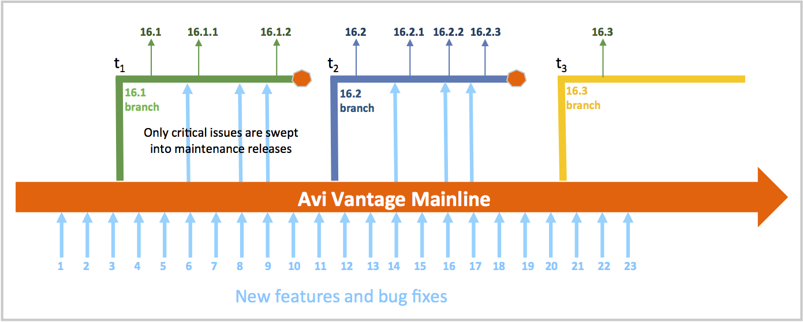

Avi Networks makes three Avi Vantage feature releases per year, approximately four months apart. In addition, three to four maintenance releases accompany a given feature release; they are typically spaced 2 weeks apart.

## Release Numbering

Release numbers take on the form YY.<*feature-release-number*.<*maintenance-version-number*>. Feature and maintenance release numbers start with 1. For example, the following can be said about Avi Vantage 16.2.3:

* The release year is 2016.
* It is a member of the 2nd ***feature*** release, the 2nd branch (see diagram below).
* It is the 3rd ***maintenance*** release within the 2nd feature release. 

## Release Timeline

The above time line serves as the backdrop for our release tutorial. It shows:

* Three ***feature*** releases, 16.1, 16.2 and 16.3.
* Five ***maintenance*** releases, 16.1.1, 16.1.2, 16.2.1, 16.2.2, and 16.2.3.
* Within this snapshot of time, a total of 23 features/bug fixes have been applied to the mainline code base.
* At time t1, the branch for the first release of the year 2016 is made. Features/fixes 1 through 3 are automatically swept into it.
* Some time later Avi Engineering releases 16.1. Thereafter, work on the next maintenance release proceeds.
* Note that features/fixes 4 through 6 have been incorporated into the mainline, independent of the 16.1 branch.
* Some time later, Avi Engineering determines that #6 (but neither #4 nor #5) is critical enough to be made available to customers running 16.1. Accordingly, shortly thereafter, maintenance release 16.1.1 is made available.
* 16.1.2, the final maintenance release of the 16.1 branch, adds feature/bug-fix #8 and #9. [But still not #4, #5, nor #7.]
* At time t2 the decision is taken to begin work on the 2nd feature release of the year. Features/fixes #1 through #11 are automatically swept into it. Shortly thereafter, 16.2 is made available.
* The process continues as before, such that by the time maintenance release 16.2.3 is made available, features/fixes 1 through 11 and selected features of the mainline (#14, 16, and #17) are included. 