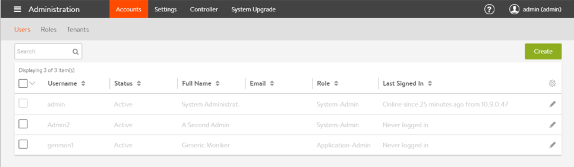
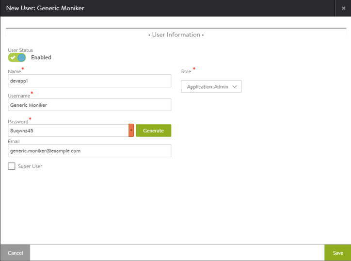

A valid account is required for access to Avi Vantage through the web interface, REST API, or CLI. User accounts can be maintained locally in Avi Vantage or remotely via an external authentication server.

See also <a href="/docs/17.1/overview-of-account-management/">Overview of Account Management</a>
> Notes: 
> <ul> 
>  <li>To configure or manage Vantage user accounts, one needs a user account having write access to the Accounts section of Vantage. (This is defined by the role assigned to the user account.)</li> 
>  <li>The <em>admin</em> user account is a unique account used for initial setup of Avi Vantage. This account cannot be deleted.</li> 
> </ul>
 

## User Account Table

To view the Vantage user accounts that are in Vantage's local user database, navigate to Administration > Accounts > Users.

For each local user account, the following information is listed:

* **Username:** The account name used to log into Avi Vantage through its management interfaces: web interface, REST API, or CLI.
* **Status:** Status of the user account.
* **Full Name:** Full name of the user.
* **Email:** Email address of the user.
* **Role:** Access settings (write, read, or no access) for each type of resource within Vantage.
* **Last Signed In:** System time on the Avi Controller when the user most recently logged in. 

### User Account Management

Vantage user accounts having write access to the Accounts section of Vantage can perform the following management actions on other user accounts:

* **Delete:** Removes the selected user accounts from Vantage.
* **Suspend:** Deactivates the selected user accounts. A suspended user cannot access Avi Vantage through any of its management interfaces. When the user attempts to log into Vantage, a notice is displayed to inform them of the account suspension, and access is denied.
* **Activate:** Reactivates the selected user accounts. 

## Create a User Account

To create a user account:
<ol> 
 <li>Navigate to Administration &gt; Accounts &gt; Users, and click Create.</li> 
 <li>Enter or select the following information: 
  <ul> 
   <li><strong>Name:</strong> Full name of the user.</li> 
   <li><strong>Username:</strong> Name that the user will supply when signing into Avi Vantage, such as <code>jdoe</code> or <code>jdoe@avinetworks.com</code>.</li> 
   <li><strong>Password:</strong> You may either enter a case-sensitive password in this field or click the Generate button to create a random password for the new user.</li> 
   <li><strong>Email:</strong> Email address of the user. This field is used when a user loses their password and requests to have it reset. See Password Recovery.</li> 
   <li><strong>Role:</strong> Areas of the Vantage system to which the user account will be allowed access. For each system area, the role defines whether the user account has read, write, or no access. Vantage comes with predefined roles. In addition, users who have write access to the Accounts section of Vantage can customize the predefined roles and create new roles. See <a href="/docs/17.1/user-account-roles">Roles</a>.</li> 
  </ul> </li> 
 <li>If the user will need to have the same privileges as the "admin" account, select the <a href="/docs/17.1/super-user-accounts">Super User</a> checkbox.</li> 
 <li>Click Save.</li> 
</ol> 

The new account appears in the user account table.

