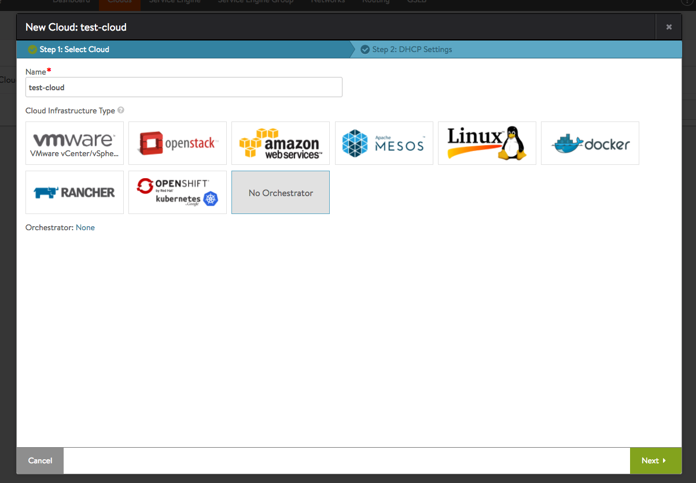
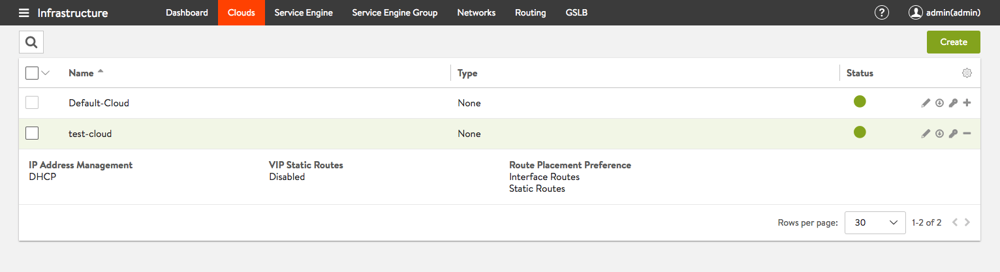
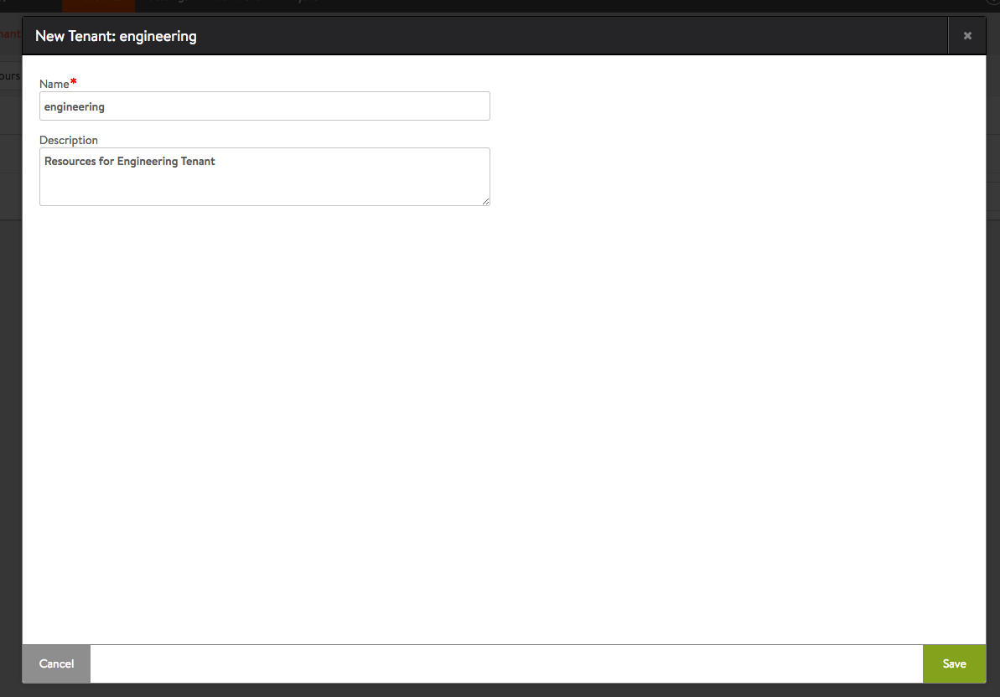
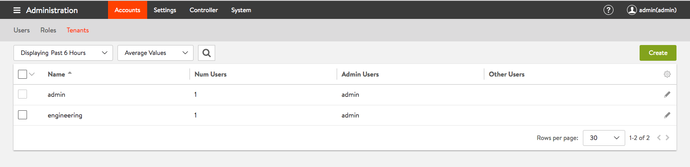
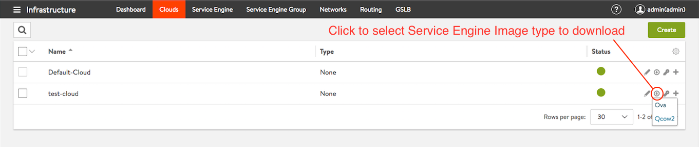
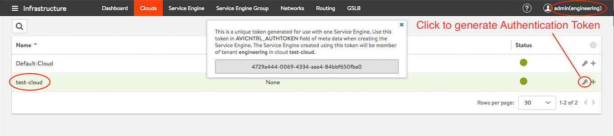
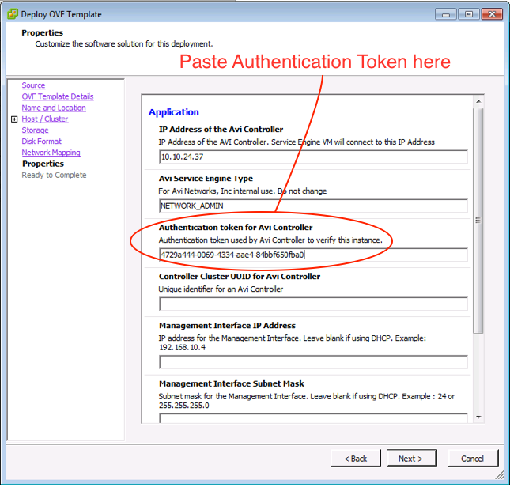
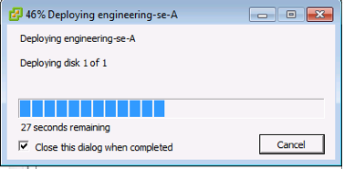
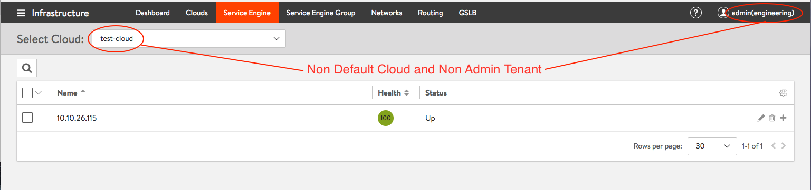

Prior to Avi Vantage 16.3, Service Engines deployed manually by the Avi administrator in No Orchestrator or VMware vCenter read access clouds required the user to download a unique copy of the Service Engine image for each cloud configured in the system. Starting with 16.3 release, the Avi administrator need download only one Service Engine image for each type of image needed (<code>ova/qcow2/docker</code>). The same SE image can then be used to deploy Service Engines in any tenant and cloud configured in the system.

### **Authentication Token Identifies Tenant & Cloud**

To authenticate and establish connectivity with the Avi Controller, each deployed Service Engine needs a unique authentication token that is checked out from Avi Controller.

The authentication token generated on the Controller is uniquely associated with the tenant and cloud, in which context the token was generated. When the SE registers with the Controller after authenticating with it, it will automatically be assigned to the appropriate tenant and cloud.

### **Using Non-Default Service Engine Groups **

SEs deployed in a particular tenant/cloud are first assigned to that tenant/cloud's default SE group. If there are multiple SE groups, and it is desired to have the created SE belong to other than the default group, it needs to be manually moved from the default group to the desired user-created SE group.

### **Provider Mode**

Avi defines provider mode as a configuration in which Service Engines are shared across tenants. Service Engines are always deployed in the default SE group of the cloud's admin tenant. The authentication tokens for such Service Engines need to be checked out from the cloud's "admin" tenant. Checking out authentication tokens from a non-admin tenant is not supported.

### **Deploy Service Engine Using Authentication Token**

Generate unique authentication token for Tenant and Cloud desired and provide the authentication token based on the underlying infrastructure on which the Service Engine is being deployed.

The sample workflow below is illustrated using VMware vCenter as the underlying infrastructure on which the Service Engine is being deployed.

* Create custom cloud "test-cloud" with No Orchestrator selected and download Service Engine OVA image from the controller 

Figure 1: Create No Orchestrator cloud named "test-cloud"

Figure 2: Non default cloud named "test-cloud" configuration complete

* Create custom Tenant - "engineering" 

Figure 3: Create Non Admin tenant named "engineering"

Figure 4: Non Admin tenant named "engineering" configuration complete

* Download the OVA Image from admin tenant and Deploy the image in vCenter. 

Figure 5: Download Service Engine OVA Image from controller

* To deploy the Service Engine in your custom Tenant and newly created cloud, check out Authentication Token from the custom tenant view for the appropriate cloud. 

Figure 6: Authentication token checked out in Tenant "engineering" for cloud "test-cloud"

* Fill in the OVF properties for the Service Engine VM including Authentication Token, Controller IP, Management Interface IP etc. 

Figure 7: Provide Authentication token when deploying the Service Engine

* After the Service Engine deployment is complete, it will automatically be placed in the appropriate Tenant and cloud. 

Figure 8: Service Engine deployment in progress

Figure 9: Service Engine deployed in "engineering" Tenant and "test-cloud" Cloud

 

 
