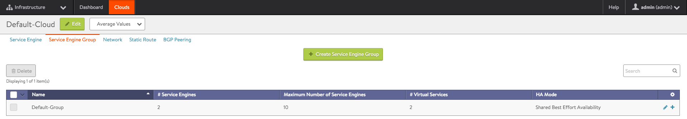
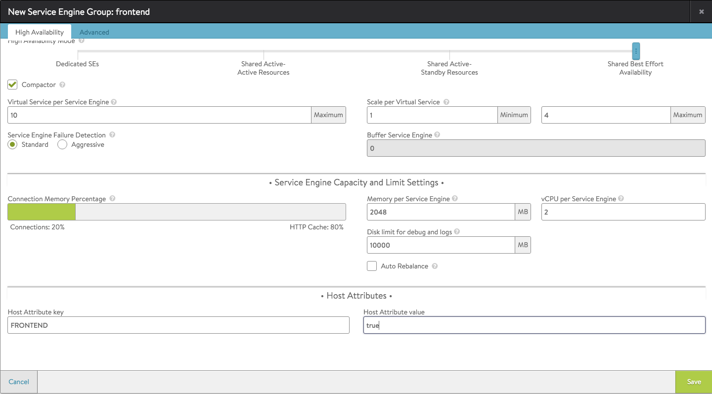

For optimal performance, it is sometimes necessary to create different "types" of Avi Service Engines (SEs) with different resource allocations within a Mesos cluster.

For example, a front-end application may require SSL offload, a CPU-intensive feature that typically requires more than the minimum CPU core allocation on the SEs. In a Mesos cluster managed using Avi Vantage / Marathon, the best way to provide optimized SE resources for an application is to create a custom SE group, defined based on the resource needs of the application.

In this example, a custom SE group with more CPU cores (8 per SE) is created on a set of VM nodes tagged "FRONTEND", and the front-end application (SSL offload) is placed on the SEs in the new SE group.
> Note: If deploying a production application, it is recommended to create the custom SE group before deploying the application. Changes to an SE's CPU or memory allocation require a restart of the SE, which may be disruptive to applications.
 

### Creating a New SE Group in an Existing Mesos Cloud

The following steps create a new SE group.

Creating the SE group is performed using the Avi Controller's web interface. Creating the virtual service and assigning the new SE group to it are performed using avi_proxy labels.
> Note: This procedure assumes that Vantage is installed and the Mesos cloud has already been configured.
 <ol> 
 <li>Navigate to Infrastructure &gt; Clouds.</li> 
 <li>Click on the Mesos cloud name, select Service Engine Group, and click Create Service Engine Group. 

</li> 
 <li>Set the service engine parameters based on the application's requirements, such as additional CPU cores. Enter host attribute key and value pairs to specify where the SEs should be created. 

</li> 
 <li>Click Save.</li> 
</ol> 

### Creating a Virtual Service and Assigning it to the Custom SE Group

To assign a virtual service (the front-end application in this example) to the new SE group, use the avi_proxy label:

<pre class="command-line language-bash" data-output="1-100"><code>
"avi_proxy": "{\"virtualservice\": {\"se_group_ref\": \"/api/serviceenginegroup/?name=frontend\"}}"
  
</code></pre> 