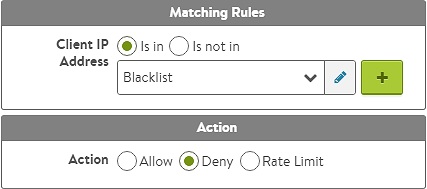

The easiest and most scalable method to provide network layer access control lists is via a Network Security Policy pointing to an IP Group.  The IP Group may be used by multiple virtual services.  When an IP is added to the group, that address will be blocked by all virtual services with a network security policy blocking the IP Group's list of addresses.  

 

### Create an IP ACL

First, set up the environment:
<ol> 
 <li>From the GUI, navigate to <em>Templates &gt; Groups &gt; IP Groups</em> and create a new IP Group.</li> 
 <li>Create or edit a virtual service.</li> 
 <li>From the <em>VS edit &gt; Rules &gt; Network Security Policy</em> tab, add a new Network Security rule.  Set the match to IP address and select the new IP Group from the pull down list.</li> 
</ol> 

See the following <a href="/block-an-ip-address-to-a-virtual-service/">article </a>for creating an IP access control list via DataScript.

 

### Grab the IP Group's UUID

To update the ACL list, first acquire the UUID of the IP Group.  API calls may be made to the name of an object, though UUIDs are preferred as they provide uniqueness.  In the following example, the Controller's cluster IP is 10.1.1.1 and the IP Group is named 'blacklist'.

<pre><code class="language-lua">https://10.1.1.1/api/ipaddrgroup?name=blacklist</code></pre>  

The following JSON result is returned from the example query:

<pre><code class="language-lua">{
   "count": 1,
   "results": [
      {
         "url": "https://10.1.1.1/api/ipaddrgroup/ipaddrgroup-dc43bd65-7227-4585-8213-34c84c9b1c3b",
         "uuid": "ipaddrgroup-dc43bd65-7227-4585-8213-34c84c9b1c3b",
         "name": "Blacklist"
         "tenant_ref": "https://10.1.1.1/api/tenant/admin",
         "prefixes": [
            {
               "ip_addr": {
                  "type": "V4",
                  "addr": "10.128.0.0"
               },
            "mask": 16
            },
         ]
      }
   ]
}</code></pre>  

The query can be filtered to be more specific by appending *&fields=uuid* .  For this example, an IP network **10.128.0.0/16** already exists in the IP Group.

 

### Modify the IP Group Via API

To add the IP network **10.0.0.0/16** and the IP range **192.168.0.1 - 192.168.1.250** to the IP group, make a PUT request to the IP group URL *https://10.1.1.1/api/ipaddrgroup/ipaddrgroup-dc43bd65-7227-4585-8213-34c84c9b1c3b* with the following payload:

<pre><code class="language-lua">{
   "url": "https://10.1.1.1/api/ipaddrgroup/ipaddrgroup-dc43bd65-7227-4585-8213-34c84c9b1c3b",
   "uuid": "ipaddrgroup-dc43bd65-7227-4585-8213-34c84c9b1c3b",
   "name": "Blacklist",
   "tenant_ref": "https://10.1.1.1/api/tenant/admin",
   "ranges": [
      {
         "begin": {
            "type": "V4",
            "addr": "192.168.1.1"
         },
         "end": {
            "type": "V4",
            "addr": "192.168.1.250"
         }
      }
   ],
   "prefixes": [
      {
         "ip_addr": {
            "type": "V4",
            "addr": "10.128.0.0"
         },
         "mask": 16
         },
      {
         "ip_addr": {
            "type": "V4",
            "addr": "10.0.0.0"
         },
      "mask": 16
      }
   ]
}</code></pre>  

Note:  All of the desired config must be included in the PUT request, including previously configured IP addresses.

