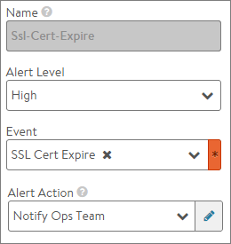

The impact to production traffic of an expired SSL certificate can be drastic. At a minimum, clients receive a disturbing warning message. Worse, clients honoring HTTP strict transport security (HSTS) will not be allowed to access the site.

Avi Vantage provides the following mechanisms to alert administrators to upcoming certificate expiration.

## Certificates Page

The Templates > Security > SSL/TLS Certificates page shows a color-coded status for each certificate. As a certificate nears expiration, its status color will change:

* 30 days until expiration: status changes from green to yellow
* 7 days until expiration: status changes from yellow to orange
* At expiration: status changes from orange to red 

## Health Score

As its SSL certificate nears expiration, the health score of a virtual service will automatically be lowered, indicating increased risk to the application's availability until the certificate issue is resolved. This information can be viewed on the virtual service's security page in the SSL section.

* 30 days until expiration: the virtual service will incur a security penalty of 20 points, which caps the total health score at a maximum of 80 points.
* 7 days until expiration: the virtual service will incur a security penalty of 60 points, which caps the total health score at a maximum of 40 points.
* At expiration: the virtual service will incur a security penalty of 100 points, which sets the total health score to 0. 

## Alerts

System events for soon-to-expire certificates are generated 30 days, 7 days, and 1 day prior to expiration.

Vantage includes a predefined alert called SSL-Cert-Expire that can proactively notify administrators when SSL events are generated. (Navigate to Operations > Alerts > Alert Config to see this alert and modify its defined alert action.)
