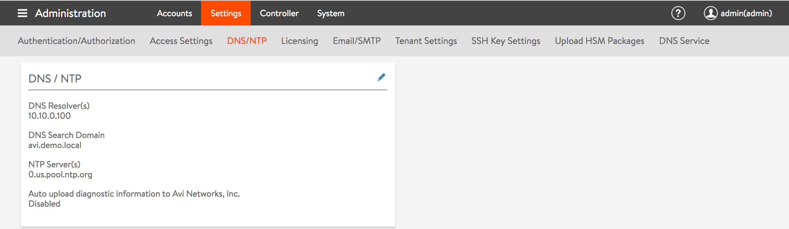
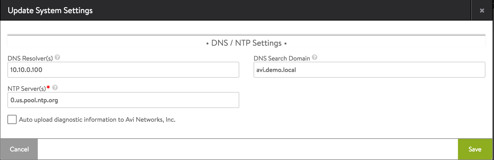
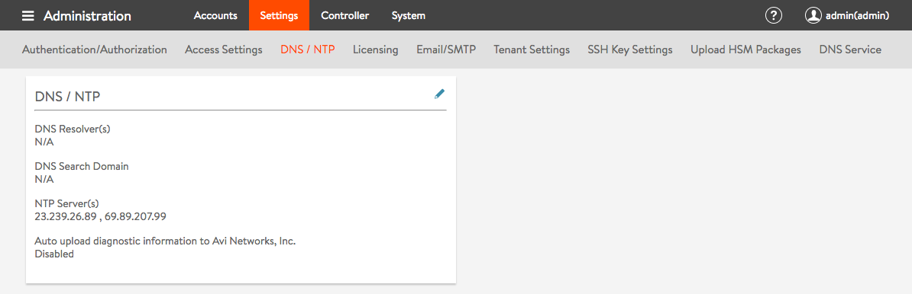
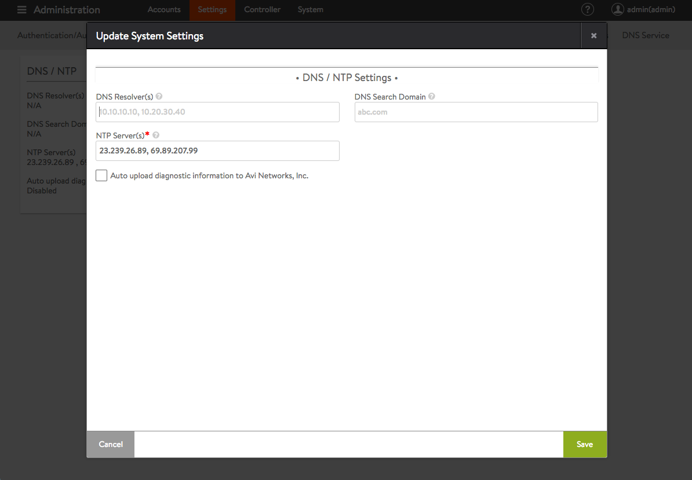

NTP (Network Time Protocol) settings are critical to proper functioning of the Avi Controller. Analytics functionality in the Controller relies on the fact that Controller(s) in the cluster and SE(s) are synchronized. Controller(s) synchronize time from the configured NTP servers and the SE(s) in turn synchronize time from the Controller(s).

### GUI-based Configuration

Configure NTP servers from the Avi GUI as follows:
<ol> 
 <li>Navigate to the DNS/NTP tab in the Administration -&gt; Settings window.  <a href="img/Screen-Shot-2017-01-06-at-3.31.38-PM.png"> Settings" width="700" height="204"></a></li> 
 <li style="text-align: left;">Click the pencil icon to open the System Settings editor. Enter a comma-delimited list of NTP server hostnames or IP addresses and click Save.</li> 
</ol> 

### CLI-based Configuration

Configure NTP servers from the CLI as follows:

<pre class="language-bash"><code>
: &gt; configure systemconfiguration
: systemconfiguration&gt; ntp_configuration
: systemconfiguration:ntp_configuration&gt; ntp_server_list 23.239.26.89 ntp_server_list 69.89.207.99
: systemconfiguration:ntp_configuration&gt; exit
: systemconfiguration&gt; exit
+-------------------------------------+----------------------------------+
| Field                               | Value                            |
+-------------------------------------+----------------------------------+
| uuid                                | default                          |
| dns_configuration                   |                                  |
| search_domain                       |                                  |
| ntp_configuration                   |                                  |
| ntp_server_list[1]                  | 23.239.26.89                     |
| ntp_server_list[2]                  | 69.89.207.99                     |
| tech_support_uploader_configuration |                                  |
| auto_upload                         | False                            |
| portal_configuration                |                                  |
| enable_https                        | True                             |
| redirect_to_https                   | True                             |
| enable_http                         | True                             |
| sslkeyandcertificate_refs[1]        | System-Default-Portal-Cert       |
| sslkeyandcertificate_refs[2]        | System-Default-Portal-Cert-EC256 |
| use_uuid_from_input                 | False                            |
| sslprofile_ref                      | System-Standard                  |
| enable_clickjacking_protection      | True                             |
| allow_basic_authentication          | True                             |
| password_strength_check             | False                            |
| disable_remote_cli_shell            | False                            |
| global_tenant_config                |                                  |
| tenant_vrf                          | False                            |
| se_in_provider_context              | True                             |
| tenant_access_to_provider_se        | True                             |
| email_configuration                 |                                  |
| smtp_type                           | SMTP_LOCAL_HOST                  |
| from_email                          | admin@avicontroller.net          |
| mail_server_name                    | localhost                        |
| mail_server_port                    | 25                               |
| docker_mode                         | False                            |
+-------------------------------------+----------------------------------+
</code></pre> 

### API-based Configuration

Configure NTP servers with the API as follows:

<pre class="language-json"><code>
PUT api/systemconfiguration
DATA:
{
    "email_configuration": {
        "from_email": "admin@avicontroller.net",
        "mail_server_name": "localhost",
        "smtp_type": "SMTP_LOCAL_HOST",
        "mail_server_port": 25
    },
    "global_tenant_config": {
        "se_in_provider_context": true,
        "tenant_access_to_provider_se": true,
        "tenant_vrf": false
    },
    "uuid": "default",
    "url": "https://localhost/api/systemconfiguration",
    "tech_support_uploader_configuration": {
        "auto_upload": false
    },
    "portal_configuration": {
        "use_uuid_from_input": false,
        "redirect_to_https": true,
        "sslprofile_ref": "https://localhost/api/sslprofile/sslprofile-7f7b7c61-c469-4aa0-8c2c-e5237ec34601",
        "sslkeyandcertificate_refs": [
            "https://localhost/api/sslkeyandcertificate/sslkeyandcertificate-25501569-462f-461e-aa82-99e8853c92b5",
            "https://localhost/api/sslkeyandcertificate/sslkeyandcertificate-0d8826fd-5242-45ca-9f22-ca3a91f7ead9"
        ],
        "enable_clickjacking_protection": true,
        "enable_https": true,
        "disable_remote_cli_shell": false,
        "password_strength_check": false,
        "enable_http": true,
        "allow_basic_authentication": true
    },
    "ntp_configuration": {
        "ntp_server_list": [
            {
                "type": "V4",
                "addr": "23.239.26.89"
            },
            {
                "type": "V4",
                "addr": "69.89.207.99"
            }
        ]
    }
}
</code></pre> 

Configure NTP servers with the UI as follows:

 

Starting with Avi Vantage release 16.3, NTP authentication can be enabled using either the CLI or the REST API. With NTP authentication, one can specify a set of trusted authentication keys and configure each NTP server peer with a specific authentication key. The NTP authentication key object consists of a key number, key algorithm (SHA1 or MD5) and the key itself.

 

Configure NTP and NTP authentication with the CLI as follows:

<pre class="language-bash"><code>
[admin:10-10-25-45]: &gt; configure systemconfiguration
[admin:10-10-25-45]: systemconfiguration&gt; ntp_configuration
[admin:10-10-25-45]: systemconfiguration:ntp_configuration&gt; ntp_authentication_keys key_number 1 algorithm ntp_auth_algorithm_md5 key "=I&amp;FBDl,WM,en5Mn~DaG"
New object being created
[admin:10-10-25-45]: systemconfiguration:ntp_configuration:ntp_authentication_keys&gt; exit
[admin:10-10-25-45]: systemconfiguration:ntp_configuration&gt; ntp_authentication_keys key_number 5 algorithm ntp_auth_algorithm_sha1 key ff9a0d589668a0f66649abbd7dfb388d841f1f44
New object being created
[admin:10-10-25-45]: systemconfiguration:ntp_configuration:ntp_authentication_keys&gt; exit
[admin:10-10-25-45]: systemconfiguration:ntp_configuration&gt; exit
[admin:10-10-25-45]: systemconfiguration:ntp_configuration&gt; ntp_servers server 23.239.26.89
New object being created
[admin:10-10-25-45]: systemconfiguration:ntp_configuration:ntp_servers&gt; exit
[admin:10-10-25-45]: systemconfiguration:ntp_configuration&gt; ntp_servers server 69.89.207.99 key_number 5
New object being created
[admin:10-10-25-45]: systemconfiguration:ntp_configuration:ntp_servers&gt; exit
[admin:10-10-25-45]: systemconfiguration:ntp_configuration&gt; exit
[admin:10-10-25-45]: systemconfiguration&gt; exit
+-------------------------------------+------------------------------------------+
| Field                               | Value                                    |
+-------------------------------------+------------------------------------------+
| uuid                                | default                                  |
| dns_configuration                   |                                          |
| search_domain                       |                                          |
| ntp_configuration                   |                                          |
| ntp_authentication_keys[1]          |                                          |
| key_number                          | 1                                        |
| algorithm                           | NTP_AUTH_ALGORITHM_MD5                   |
| key                                 | =I&amp;FBDl,WM,en5Mn~DaG                 |
| ntp_authentication_keys[2]          |                                          |
| key_number                          | 5                                        |
| algorithm                           | NTP_AUTH_ALGORITHM_SHA1                  |
| key                                 | ff9a0d589668a0f66649abbd7dfb388d841f1f44 |
| ntp_servers[1]                      |                                          |
| server                              | 23.239.26.89                             |
| ntp_servers[2]                      |                                          |
| server                              | 69.89.207.99                             |
| key_number                          | 5                                        |
| tech_support_uploader_configuration |                                          |
| auto_upload                         | False                                    |
| portal_configuration                |                                          |
| enable_https                        | True                                     |
| redirect_to_https                   | True                                     |
| enable_http                         | True                                     |
| sslkeyandcertificate_refs[1]        | System-Default-Portal-Cert               |
| sslkeyandcertificate_refs[2]        | System-Default-Portal-Cert-EC256         |
| use_uuid_from_input                 | False                                    |
| sslprofile_ref                      | System-Standard                          |
| enable_clickjacking_protection      | True                                     |
| allow_basic_authentication          | True                                     |
| password_strength_check             | False                                    |
| disable_remote_cli_shell            | False                                    |
| global_tenant_config                |                                          |
| tenant_vrf                          | False                                    |
| se_in_provider_context              | True                                     |
| tenant_access_to_provider_se        | True                                     |
| email_configuration                 |                                          |
| smtp_type                           | SMTP_LOCAL_HOST                          |
| from_email                          | admin@avicontroller.net                  |
| mail_server_name                    | localhost                                |
| mail_server_port                    | 25                                       |
| docker_mode                         | False                                    |
+-------------------------------------+------------------------------------------+
</code></pre> 

Configure NTP and NTP authentication with the API as follows:

<pre class="language-json"><code>
POST api/systemconfiguration
DATA:
{
    "email_configuration": {
        "from_email": "admin@avicontroller.net",
        "mail_server_name": "localhost",
        "smtp_type": "SMTP_LOCAL_HOST",
        "mail_server_port": 25
    },
    "global_tenant_config": {
        "se_in_provider_context": true,
        "tenant_access_to_provider_se": true,
        "tenant_vrf": false
    },
    "uuid": "default",
    "url": "https://localhost/api/systemconfiguration",
    "tech_support_uploader_configuration": {
        "auto_upload": false
    },
    "portal_configuration": {
        "use_uuid_from_input": false,
        "redirect_to_https": true,
        "sslprofile_ref": "https://localhost/api/sslprofile/sslprofile-7f7b7c61-c469-4aa0-8c2c-e5237ec34601",
        "sslkeyandcertificate_refs": [
            "https://localhost/api/sslkeyandcertificate/sslkeyandcertificate-25501569-462f-461e-aa82-99e8853c92b5",
            "https://localhost/api/sslkeyandcertificate/sslkeyandcertificate-0d8826fd-5242-45ca-9f22-ca3a91f7ead9"
        ],
        "enable_clickjacking_protection": true,
        "enable_https": true,
        "disable_remote_cli_shell": false,
        "password_strength_check": false,
        "enable_http": true,
        "allow_basic_authentication": true
    },
    "ntp_configuration": {
        "ntp_servers": [
            {
                "server": {
                    "type": "V4",
                    "addr": "23.239.26.89"
                }
            },
            {
                "key_number": 5,
                "server": {
                    "type": "V4",
                    "addr": "69.89.207.99"
                }
            }
        ],
        "ntp_authentication_keys": [
            {
                "key_number": 1,
                "algorithm": "NTP_AUTH_ALGORITHM_MD5",
                "key": "=I&amp;FBDl,WM,en5Mn~DaG"
            },
            {
                "key_number": 5,
                "algorithm": "NTP_AUTH_ALGORITHM_SHA1",
                "key": "ff9a0d589668a0f66649abbd7dfb388d841f1f44"
            }
        ]
    }
}
</code></pre> 