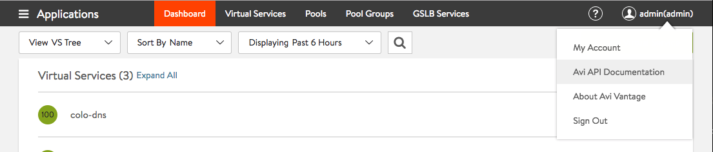
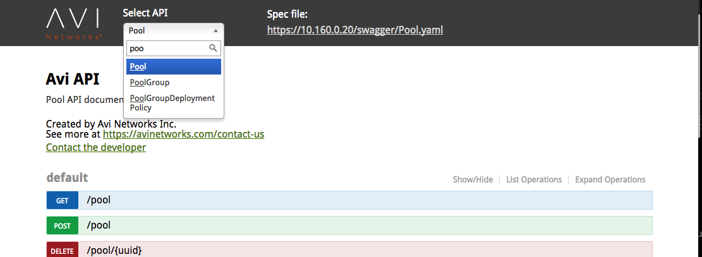
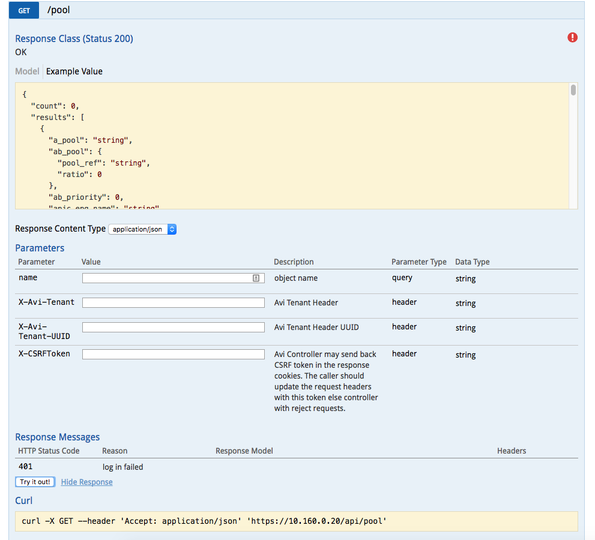

Starting with release 16.3, Avi Vantage includes support for the <a href="http://github.com/OAI/OpenAPI-Specification">OpenAPI Specification</a>(fka Swagger RESTful API Documentation Specification). It can be accessed via the Avi API Documentation link in the pull-down menu, as shown in the below screenshot.

## **Swagger UI Integration into Avi Controller**

The Swagger UI is fully integrated into the Avi Controller. Admins can search from a list of API specifications via search bar as shown.

Once a resource is selected, the location of the specification file is shown on the top right corner of the page. These specifications can be downloaded and used with<a href="http://swagger.io/tools/"> swagger tools </a>like
<ol> 
 <li style="font-weight: 400;"><a href="http://swagger.io/tools/swagger-editor"><b>Swagger Editor</b></a>: Interactive tool for developing and viewing Swagger specifications.</li> 
 <li style="font-weight: 400;"><a href="http://swagger.io/tools/swagger-codegen"><b>Swagger Codegen</b></a>: Generates Client SDKs in several languages.</li> 
</ol> 

## **Swagger API “Try it out” Feature**

Swagger UI also has a built-in “try it out!” functionality to try the API right from the context of the API documentation. The feature requires basic authentication setting to be enabled in the Avi Controller. 

The output provides
<ol> 
 <li style="font-weight: 400;">Allowed query and body parameters</li> 
 <li style="font-weight: 400;">Equivalent <code>curl</code> command for the API</li> 
 <li style="font-weight: 400;">API response from the Controller</li> 
</ol> 

The following shows example of fetching all the pools via try it out!

