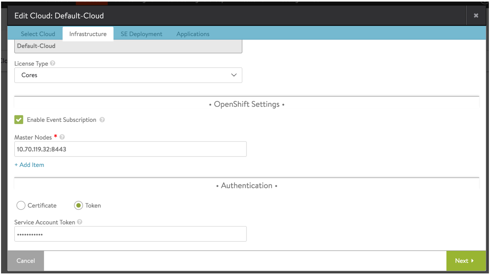

Beginning with release 16.3.4, Avi Vantage supports OpenShift service accounts and corresponding token for authentication with an OpenShift cluster in addition to client certificates.

### Workflow

### Create a Service Account for Avi

### Service account definition of avi service account (<code>sa.json</code>)

<pre><code class="language-lua">{
  "apiVersion": "v1",
  "kind": "ServiceAccount",
  "metadata": {
    "name": "avi"
  }
}</code></pre>  / 

### Create the deployment using OpenShift client

 

<code>&gt;oc create -f sa.json</code>

 

### Add Cluster Admin role to <code>serviceaccount</code> (typically executed on OpenShift master)

 

<code>&gt;oadm policy add-cluster-role-to-user cluster-admin system:serviceaccount:default:avi</code>

 

### Extract the token for use in Avi Cloud configuration

 

### Describe the service account

 

<code>&gt;oc describe serviceaccount avi</code>

 

<pre><code class="language-lua">&gt;Name:           avi
&gt;Namespace:      default
&gt;Labels:         
&gt;Mountable secrets:      avi-token-emof0
&gt;                        avi-dockercfg-ea18k
&gt;Tokens:                 avi-token-emof0
&gt;                        avi-token-xk6sl
&gt;Image pull secrets:     avi-dockercfg-ea18k</code></pre>  

 

### Extract the token

 

<code>&gt;oc describe secret avi-token-emof0</code>

 

<pre><code class="language-lua">&gt;Name:           avi-token-emof0
&gt;Namespace:      default
&gt;Labels:         
&gt;Annotations:    kubernetes.io/service-account.name=avi
&gt;                kubernetes.io/service-account.uid=97501aae-d910-11e6-ba01-005056b0a825
&gt;Type:   kubernetes.io/service-account-token
&gt;Data
&gt;====
&gt;namespace:      7 bytes
&gt;service-ca.crt: 2186 bytes
&gt;token:          eyJhbGciOiJSUzI1NiIsInR5cCI6IkpXVCJ9.eyJpc3MiOiJrdWJlcm5ldGVzL3NlcnZpY2VhY2NvdW… L7tPGrRJgmTbeFL9A
&gt;ca.crt:         1070 bytes</code></pre>  

Enter the token from the “token” field above while configuring an OpenShift cloud on Avi Controller.

