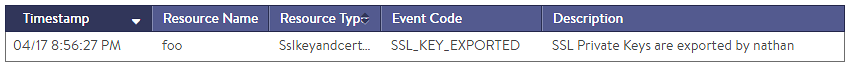

A key component of security is to ensure the integrity of data at rest, or in this case, for stored SSL keys.

### Locally Stored Keys

Private keys are never stored on an Avi Service Engine's file system. They are pushed down to the SEs from the Avi Controller and kept in memory for establishing the SSL session with clients.  Should an SE be compromised or rebooted, all configuration, including the private key and public certificate, are wiped. When the SE comes back online, a Controller may choose to repurpose the SE with a new (or the same) config.  Or the Controller may simply delete the SE, depending on the circumstances.

The Controllers store the keys locally in an encrypted database.  The keys will be encrypted during backups provided a passphrase is included during the backup process.

As the Controllers store the system configuration, including the private SSL keys, it is critical to ensure their proper security. Numerous options exist to lock down the access levels of administrators, ensure strong passwords, and limit administrative source IP address ranges.

For administrators having full access to the certificates and keys, an attempt to export a private key will be noted in the Operations &gt; Events &gt; Config Audit log.  Using role-based access, export ability should be restricted to the fewest number of administrators possible.

### HSM &amp; Externally Stored Keys

To guarantee a higher level of physical security, Vantage supports the use of external hardware security modules and certificate stores. The original key is stored on the external system, with the public key available to Vantage.

Vantage supports the following types of external key stores:

* <a href="/docs/17.1/thales-nshield-integration-2">Thales nShield</a>
* <a href="/docs/17.1/avi-vantage-integration-with-safenet-network-hsm/">Gemalto (formerly SafeNet)</a>
* OpenStack Barbican - coming in v17.1 

 

 
