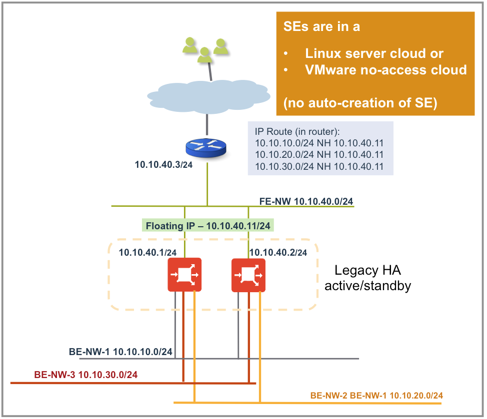
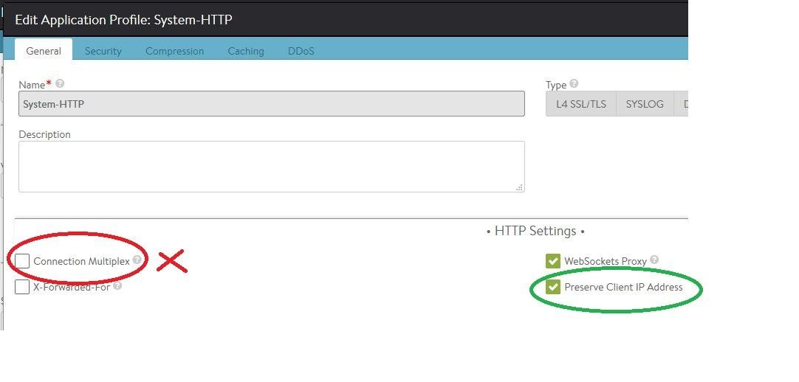

## Overview

By default, Avi Service Engines (SEs) do source NAT-ing (SNAT) of traffic destined to servers. Due to SNAT, the application servers see the IP address of the SE interfaces and are unaware of the original client’s IP address. Preserving a client's IP is a desirable feature in many cases, for example, when servers have to apply security and access-control policies. Two ways to solve this problem in Avi Vantage are:

* <a href="/x-forwarded-for-header-insertion/">X-Forwarded-For</a> — limited to HTTP(S) application profiles only
* <a href="/proxy-protocol-support/">TCP Proxy Protocol </a>— limited to TCP traffic on L4 application profiles only 

Both of the above require the back-end servers to be capable of supporting the respective capability.

A third and more generic approach is for the Service Engine to use the client IP as the source IP for load-balanced connections from the SE to back-end servers. This capability is called **p****reserve client IP**, one component of Avi Vantage's default gateway feature,** **and a property that may be set on/off in application profiles.

**Enable IP routing**in SE group is a prerequisite for enabling preserve client IP in any application profile.

## Scope of Preserve Client IP

As enabling <a href="/docs/17.1/default-gateway-ip-routing-on-avi-se/">IP routing</a> is a prerequisite for enabling preserve client IP, all the restrictions applicable to enabling IP routing are applicable here.

## Mutual Exclusions With Other Features

* Preserving the client IP is mutually exclusive with **SNAT-ing**the virtual services.
* Enabling**connection multiplexing** in an HTTP(s) application profile is incompatible with selecting preserve client IP. 

## Example Use-Case

Enable IP routing on the SE group before enabling preserve client IP on an application profile used to create virtual services on that SE group.

In addition,

* configure static routes to the back-end server networks on the front-end servers with nexthop as front-end floating IP,
* configure back-end servers’ default gateway as SE, and
* configure SE’s default gateway as front-end router. 

## Configure Preserve Client IP

Consider a simple two-leg setup with the back-end server(s) in the 10.10.10.0/24 network (always a **directly-connected network**) and the front-end router in the 10.10.40.0/24 network. Following are the steps to configure the feature:
<ol> 
 <li>Create a virtual service using the advanced-mode wizard. Configure its application profile to preserve client IPs as follows:  Applications -&gt; Create Virtual Service -&gt; Advanced -&gt; Edit Application ProfilePlease note that this configuration needs to be done before enabling any virtual service in the chosen application profile. Once an application profile is configured to preserve client IP, it preserves the client IP for all virtual services using this application profile.  
  <!-- Crayon Syntax Highlighter v2.7.1 --> <pre><code class="language-lua">: &gt; configure applicationprofile System-HTTP
: applicationprofile&gt; preserve_client_ip
Overwriting the previously entered value for preserve_client_ip
: applicationprofile&gt; save</code></pre> 
  <!-- [Format Time: 0.0005 seconds] -->  </li> 
</ol> 