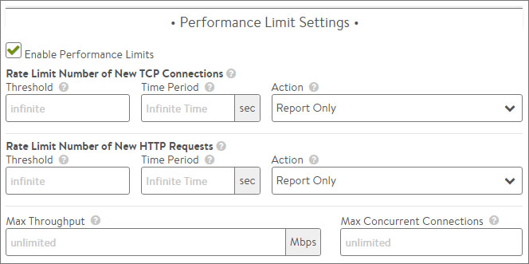

Avi Vantage includes many options for rate shaping and throttling of traffic.  This may be applied at the virtual service, pool/server, or client level.  These options exist in a number of places throughout the UI, depending on the specific object they are applied against.  Additionally, DataScripts may be used to create customized limits.

 

### Virtual Service Limits

Within the virtual service > Edit > Advanced tab, the following options allow specifying limits to connections and requests for the specific virtual service.  

 
* **Rate Limit Number of New TCP Connections**: Set the maximum Threshold of new connections from all clients that may be created for this virtual service over the configured Time Period. The Report action will generate logs for excessive connections, but otherwise allowed them to proceed as normal. Drop SYN will silently discard the client SYN, and RST will send a connection reset back to the client.
* **Rate Limit Number of New HTTP Requests**: Set the maximum Threshold of HTTP requests from all clients for this virtual service over the configured Time Period. The Report action will generate logs for excessive requests, but otherwise allowed them to proceed as normal. Close TCP Connection will send a connection RST to the client. Send Local Response allows Vantage to respond with a simple web page and appropriate status code. Send HTTP Redirect will forward excessive requests to another URI or destination.
* **Max Throughpu**t: Specify the maximum amount of bandwidth in Mbps that Vantage will allow through the virtual service. Traffic that exceeds this limit will be discarded and may require retransmission by either the client or server. When this limit is set, the Analytics tab of the Virtual Service Details page will show a dashed horizontal line on the Throughput metric chart that shows the current throughput versus the maximum allowed throughput.
* **Max Concurrent Connections**: Specify the maximum number of concurrent open connections. Connection attempts that exceed this number will be reset (TCP) or dropped (UDP) until the total number of concurrent connections falls below the threshold. When this limit is set, the Analytics tab of the virtual service Details page will show a dashed horizontal line on the Open Connections metric that shows the current open connections versus the maximum number of allowed connections.  

 

### Pool's Server Limits

Within the pool > Edit > Advanced tab, the following option may be used to set server concurrent connection limits.  

* **Max Connections per Server: **Specify the maximum number of concurrent connections allowed for a server. If all servers in the Pool reach this maximum, then the virtual service will send a reset for TCP connections or silently discard new UDP streams unless otherwise specified in the Server Down Settings, described above. As soon as an existing connection to the server is closed, that server is eligible to receive the next client connection. Valid values are 0, which disables the connection limit, or any number from 50 to 10,000. 

 

### Client Limits

Within the virtual service > Edit > Rules > Network Security tab, create a new policy with the action set to rate limit.  

* **Rate Limit**:  Restrict clients from opening greater than the specified number of connections per second in the Maximum Rate field. Clients that exceed this number will have their excessive connection attempts silently discarded. If Burst Size is enabled, clients may be able to burst above the Max Rate provided they have not recently been opening connections. This feature may be applied to TCP or UDP. All clients that match the Match criteria will be treated as one bucket. For instance, if no Match is defined, all IP addresses will increment the Max Rate counter. Throttling would occur for all new connecting clients.  Individual limits may be applied to separate networks, geographies, or IP and port criteria.  

 Within the *Templates > Application Profile > Edit > DDoS tab*, a number of options are available via the pull down menu from the Rate Limit HTTP and TCP Settings. 

* **Rate Limit Connections from a Client:**Rate limit all connections made from any single client IP address to the virtual service.
* **Rate Limit Requests from a Client to all URLs:**Rate limit all HTTP requests from any single client IP address to all URLs of the virtual service.
* **Rate Limit Requests from all Clients to a URL:**Rate limit all HTTP requests from all client IP addresses to any single URL.
* **Rate Limit Requests from a Client to a URL:**Rate limit all HTTP requests from any single client IP address to any single URL.
* **Rate Limit Failed Requests from a Client to all URLs:**Rate limit all requests from a client for a specified period of time once the count of failed requests from that client crosses a threshold for that period. Clients are tracked based on their IP address. Requests are deemed failed based on client or server side error status codes, consistent with how Avi logs and metrics subsystems mark failed requests.
* **Rate Limit Requests from all Clients to a URL:**Rate limit all requests to a URI for a specified period of time once the count of failed requests to that URI crosses a threshold for that period. Requests are deemed failed based on client or server side error status codes, consistent with how Avi logs and metrics subsystems mark failed requests.
* **Rate Limit Failed Requests from a Client to a URL:**Rate limit all requests from a client to a URI for a specified period of time once the count of failed requests from that client to the URI crosses a threshold for that period. Requests are deemed failed based on client or server side error status codes, consistent with how Avi logs and metrics subsystems mark failed requests.
* **Rate Limit Scans from a Client to all URLs:**Automatically track clients and classify them into three groups: Good, Bad, and Unknown. Clients are tracked based on their IP address. Clients are added to the Good group when the Avi scan detection system builds history of requests from the clients that complete successfully. Clients are added to the Unknown group when there is insufficient history about them. Clients with history of failed requests are added to the Bad group and their requests are rate limited with stricter thresholds than the Unknown clients group. The Avi scan detection system automatically tunes itself so that the Good, Bad, and Unknown client IPs group members change dynamically with changes in traffic patterns through the ADC. In other words, if a change to the website causes mass failures (such as 404 errors) for most customers, Avi adapts and does not mark all clients as attempting to scan the site.
* **Rate Limit Scans from all Clients to all URLs:**Similar to the previous limit, but restricts the scanning from all clients as a single entity rather than individually. Once a limit is collectively reached by all clients, any client that sends the next failed request will be reset. 