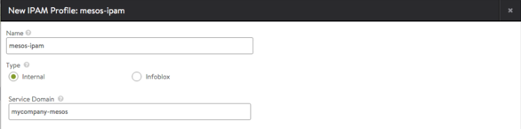
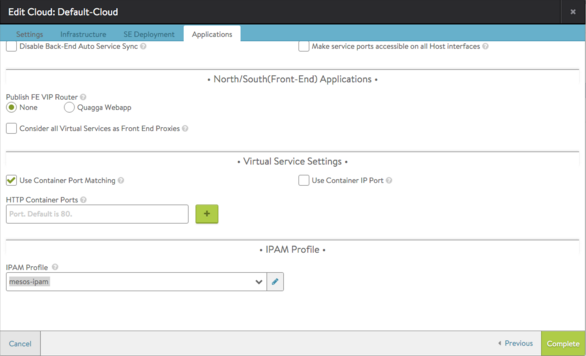
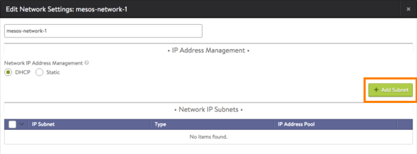
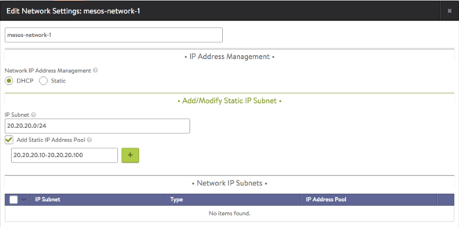
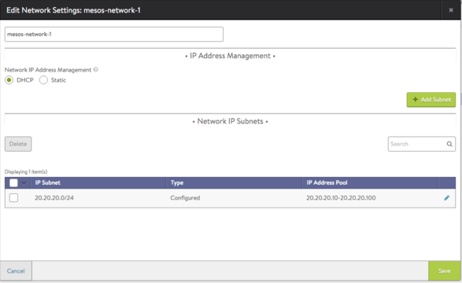
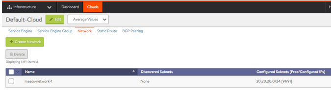

In a Mesos / Marathon deployment, the Avi Controller can serve as the authoritative domain for Mesos service discovery for proxied applications in Marathon. However, for other records, the expectation is for the Mesos cluster to have supplemental name servers (for example, non-proxied applications to talk to Mesos-DNS to obtain information about an application’s containers, reaching the Internet, and so on).

The Controller is authoritative for Marathon proxied applications within the Mesos / Marathon cloud, and services both address (A) records and service (SRV) records, for both North-South and East-West applications. The Controller also handles automatic IP address allocation for North-South applications through a combination of Marathon labels and Vantage network configuration settings.

## Enabling Service Discovery for Mesos

To enable service discovery for Mesos, configure an IP address management (IPAM) template, and add it to the configuration of the Mesos cloud on the Controller.

### Notes

* This procedure assumes the Mesos cloud configuration has already been created on the Controller. 
* This procedure assumes the Mesos cloud has already been set up. Any applications that already exist in the Mesos cloud before service discovery is enabled will not be associated with DNS.  

### Configuration Steps

<ol> 
 <li> 
Navigate to Templates &gt; Profiles.
 </li> 
 <li> 
Click IPAM Profile.
 

 </li> 
 <li> 
Click Create and select Internal as the type.
 </li> 
 <li> 
Enter a name the Name field.
 </li> 
 <li> 
In the Service Domain field, enter the domain name for the Mesos cluster. (For example, "mycompany-mesos".) All applications using this IPAM profile will have DNS records with FQDN <em>app-name</em>.mycompany-mesos.
 </li> 
 <li> 
Click Save. The profile appears in the list.
 </li> 
 <li> 
Navigate to Infrastructure &gt; Clouds, and click on the edit icon  next to the cloud name. (This may be "Default-Cloud" if the Mesos cloud was the first one created.)
 </li> 
 <li> 
After configuring other cloud settings, click Applications.
 </li> 
 <li> 
Scroll down to the IPAM Profile section and select the IPAM profile from the pull-down list.
 

 </li> 
 <li> 
Click Save.
 </li> 
</ol> 

Next, create a virtual service (sample-app) in Marathon using the avi_proxy label. (No change is needed here for service discovery.)

After creating a virtual service, any DNS client that can reach the Controller should be able to reach this virtual service. For example, **dig @*controller-ip* sample-app.mycompany-mesos A** should return the correct address records. Similarly, **dig @*controller-ip* sample-app.mycompany-mesos SRV** should return the correct service records.

For East-West applications, the A record address for the VIP will be 0.0.0.0 (or a VIP specifically configured). The SRV record will have the service port of the application (sample-app).

If 0.0.0.0 is the VIP for an East-West application, it is expected that the bridge-ip is used.

### IP Address Management

East-West applications and North-South applications can use static networking. North-South applications also can use Vantage for IP address management. In this case, the Controller will allocate IP addresses from a pool configured for the cloud, and publish the applicable DNS records (A and SRV records).

### Notes

* This procedure assumes the Mesos cloud configuration has already been created on the Controller. 
* If the static IP address pool is empty, no virtual services that use this address allocation scheme will be created.  

### Configuration Steps

<ol> 
 <li> 
Navigate to Infrastructure &gt; Clouds.
 </li> 
 <li> 
Click on Mesos-Cloud &gt; Network &gt; Create.
 </li> 
 <li> 
Enter a name for the network (IPAM-Network-1).
 </li> 
 <li> 
Add the networks to use for IP allocation:
 
a. Click Add Subnet.
 

 
b. Enter the subnet address, in the following format: 20.20.20.0/24
 
c. Click Add Static IP address pool. Vantage will allocate IP addresses from this pool.
 

 
d. Click Save.
 

 
e. Repeat for each network to be used for IP address allocation.
 </li> 
 <li> 
Click Save.
 

 </li> 
</ol>  

## Creating a Virtual Service Using avi_proxy Labels

The following set of avi_proxy labels configures a virtual service, and enables auto-allocation of IP addresses from subnet 20.20.20.0/24. This is the subnet containing the IP address pool that was added to the cloud in the previous section:

<pre class="command-line language-bash" data-output="1-100"><code>
"avi_proxy": "{\"virtualservice\": {\"auto_allocate_ip\": true, \"subnet\": \"20.20.20.0/24\"}}"
  
</code></pre> 

If the subnet is not specified in the label, as in the following example, Vantage will choose from one of the network subnets configured in the network object of the Mesos cloud on the Controller.

<pre class="command-line language-bash" data-output="1-100"><code>
"avi_proxy": "{\"virtualservice\": {\"auto_allocate_ip\": true}}"
  
</code></pre>  

## Setting Up a Common DNS Infrastructure in a Mesos Environment

The Controller's DNS is an authoritative DNS server, providing service discovery for all applications proxied through Vantage and not for other domains.

If the Controller and Mesos-DNS are on different machines, use a configuration such as the following sample DNS usage in python.

Provide at least one recursive DNS server in Resolvers when setting up the Mesos Cluster. For example, if you want to resolve google.com, you need to direct it to your corporate DNS server, since Vantage handles only domains that it is authoritative for.
> If the Controller and Mesos-DNS are running on the same machine, it is required to run the Avi Controller on port 8053. Use dns_resolver.port = 8053 in the example below.
 

### DNS Query Code Example (python)

<pre class="command-line language-bash" data-output="1-100"><code>
from dns import resolver

def get_avi_controller_ip():
    """
    Insert code that gets Avi Controller IP. If it's static just return that IP.
    """
    controller_ip = 10.10.10.100 #Avi Controller IP
    return controller_ip

def dns_get_resolver(ips=[]):
    dns_resolver = resolver.Resolver()
    dns_resolver.nameservers = ips
    dns_resolver.nameservers.extend([]) # Add your corp DNS IPs here for google.com resolution
    # dns_resolver.port = 8053 #Avi DNS port (explained above).
    return dns_resolver

def sample_dns_request(app_fqdn):
    dns_resolver = dns_get_resolver(get_controller_ip())
    # To Query A record
    print app_fqdn + ', A record: '
    rsp = dns_resolver.query(app_fqdn, 'A')
    for record in rsp:
        print record
    print app_fqdn + ', SRV records: '
    # To Query SRV record
    rsp = dns_resolver.query(app_fqdn, 'SRV')
    for record in rsp:
        print record.port
  
</code></pre> 

### Sample Request

<pre class="command-line language-bash" data-output="1-100"><code>
sample_dns_request("my-app.my-company-avi-mesos") #Application's (my-app) FQDN with domain as my-company-avi-mesos configured in Avi’s IPAM Profile.

</code></pre> 

### Sample Output

<pre class="command-line language-bash" data-output="1-100"><code>
my-app.my-company-avi-mesos, A record:
10.10.10.102
My-app.my-company-avi-mesos, SRV records:
10001
10002
</code></pre> 