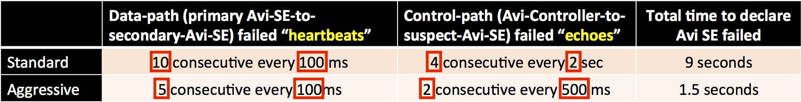
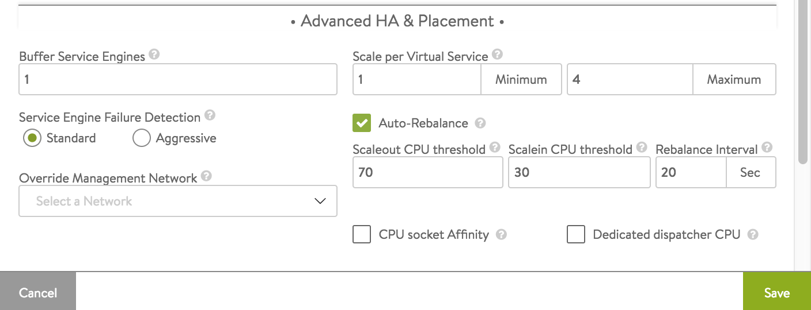
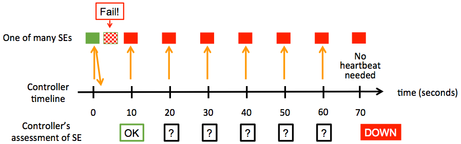

Speedy and accurate SE-failure detection is an essential first step in achieving SE high availability. Avi Vantage relies on a variety of methods to detect Avi Service Engine failures. Thereafter, <a href="/elastic-ha-for-avi-service-engines-16-2/">elastic</a> or <a href="/legacy-ha-for-avi-service-engines/">legacy</a> HA recovers from them. This article focuses on Avi Vantage's SE-failure detection methods.

### SE-to-SE Failure Detection Method

Consider an SE group on which a virtual service has been scaled out.*In non-BGP configurations*, the virtual service's primary SE will periodically send **heartbeat** messages to all the virtual service's secondary SEs. Repeated failures of a particular SE to respond causes the primary SE to suspect that SE may be down; it so informs the Avi Controller, which in turn sends a sequence of **echo** messages to confirm the suspect SE(s) is(are) indeed down. Details follow.

An SE is suspected of failure according to two sets of settings, labeled **standard** and **aggressive**. The algorithm for both sets is the same:

* The primary SE sends every secondary SE *heartbeat* messages on a tunable interval, e.g., 100 milliseconds. A string of consecutive failures to respond causes the given SE to be *suspected* of being down. According to the settings shown in the second column, the primary SE will suspect a secondary SE to be down if  
    * 10 consecutive heartbeats fail over a period of 1 sec (standard), or
    * 5 consecutive heartbeats fail over a period of .5 sec (aggressive).
* As soon as the primary suspects a secondary, it apprises the Avi Controller, which then sends echo messages to the suspect. According to the settings shown in the third column, the Controller will declare the suspect down after  
    * 4 consecutive echoes fail over a period of 8 sec (standard), or
    * 2 consecutive echoes fail over a period of 1 sec (aggressive). 

Bu summing the second and third columns, we can see that a Controller makes a conclusion within 9 seconds under the standard settings, but within just 1.5 seconds under aggressive settings.

Each of the 8 parameter settings (indicated by red boxes) can be customized via the CLI. The API Guide names them and reveals their default values:

<pre><code class="language-lua"><strong> Parameter Name             Default</strong>
dp_hb_frequency                          .1 sec
dp_hb_timeout_count                      10
controller_echo_rpc_timeout             2.0 sec
controller_echo_miss_limit                4
dp_aggressive_hb_frequency               .1 sec
dp_aggressive_hb_timeout_count            5
controller_echo_rpc_aggressive_timeout   .5 seconds
controller_echo_miss_aggressive_limit     2</code></pre>  

### Selecting Standard or Aggressive Settings via the Avi GUI

Navigate to the Advanced tab of the SE Group editor. Click one of the two options.

### Controller-to-SE Failure Detection Method

In all configurations, independent of SE-to-SE heartbeats, and at a more leisurely pace (once every 10 seconds), the Avi Controller sends **heartbeats** to all SEs in all groups under its control. Details follow.

Refer to the below diagram, which depicts one SE's health over time.

* At t=0 seconds, the Controller-to-SE heartbeat finds the SE well (green box). The response to the heartbeat is recorded, but not acted upon.
* A few seconds later the SE's failure is opaque to the Controller.
* At t=10 seconds, the Controller takes two actions: <ol> 
 <li>It looks backward ten seconds in recorded history to observe the SE did indeed respond as healthy (depicted in the diagram by the green-surround OK box).</li> 
 <li>It sends its regular heartbeat.</li> 
</ol> 
* At t=20 seconds, the Controller repeats the two actions: <ol> 
 <li>It looks backward ten seconds to observe the SE did not respond to the heartbeat. This is the Controller's first indication that the SE <em>might</em> be down. It begins to count consecutive failures.</li> 
</ol> 
* At t=30, 40, 50, and 60 the two-action sequence reconfirms the Controller's suspicion.
* At t=70, <ol> 
 <li>The Controller realizes that 6 consecutive examinations of the recent past have resulted in no response to its heartbeat messages. It concludes the SE is DOWN.</li> 
 <li>Because the SE is DOWN, the Controller determines further heartbeats are unnecessary.</li> 
</ol>  

 

### BGP-Router-to-SE Failure Detection Method

With BGP in play, primary SE load balancing is turned off and likewise SE-to-SE failure detection. Instead,

* BGP load balances across SEs.
* The router's Bidirectional Forwarding Detection (BFD) detects SE failures.
* The router continues to balance load across SEs it still considers healthy.
* The BGP router has no way to apprise the Avi Controller of an SE failure it perceives. Therefore, Avi Vantage relies on the above-described Controller-to-SE failure detection method to detect and react to the SE outage. 

 

