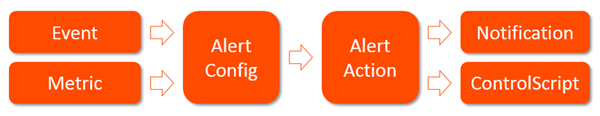
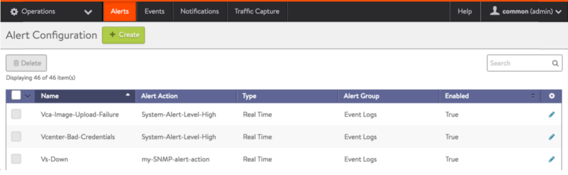
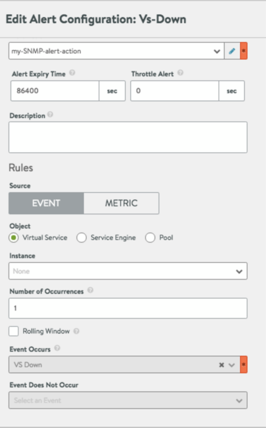
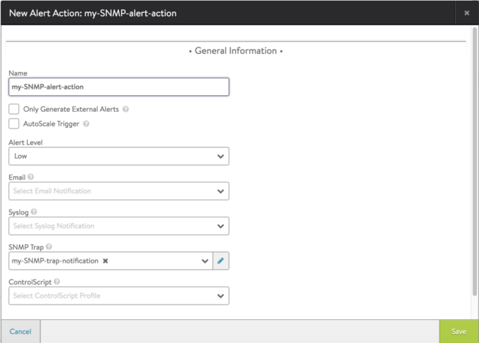
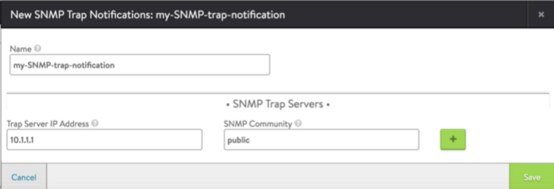
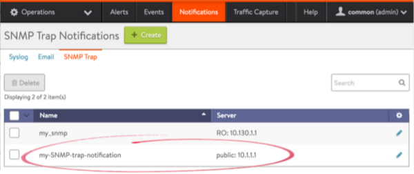

Avi Vantage supports SNMP v2c. The MIB file name is AVI-NETWORKS-MIB.my and is available for download at the following location: <a href="https://github.com/avinetworks/sdk/tree/master/mibs">https://github.com/avinetworks/sdk/tree/master/mibs</a>

The MIB file contains a description of the Avi Vantage SNMP configuration objects and notifications.

This article shows the MIB definitions for the Avi Vantage objects and the definitions for the notifications (traps). An example of how to configure a <a href="#event-based-trap">custom alert based on an SNMP notification</a> also is provided.

## Responding to SNMP Queries

To fetch SNMP objects from Avi Vantage, an external host needs to query the SNMP daemon, which only runs on the Controller cluster leader. It is therefore best to configure the external host to direct queries to the cluster IP of the Avi Controller cluster. Absent a cluster IP, the external host must know the IP addresses of *each* Controller, and try as many as three times before it finds the current leader's SNMP daemon.

Firewall rules should be configured to give that external host access to port 161 on the cluster IP or each of the Controller IPs.

During the brief period of time (1-4 minutes) that a Controller cluster is recovering from the failure of its leader, queries to the cluster IP will fail, which the external host may interpret as "Vantage is down." That is only true in the narrow sense that the control plane is down; the data plane (i.e., the SEs) are likely up and delivering virtual services to clients.

## SNMP System Configuration

You can configure the common system parameters - sysName, sysLocation and sysContact in the Avi Vantage Platform. In a Controller Cluster, sysName is configured for each controller node as node name in the Cluster object. sysLocation and sysContact are specified in SystemConfiguration object.

### API to configure the SNMP system parameters

<pre><code class="language-lua">PUT api/systemconfiguration
{
    "email_configuration": {
        "mail_server_name": "localhost",
        "mail_server_port": 25,
        "smtp_type": "SMTP_LOCAL_HOST",
        "from_email": "admin@avicontroller.net"
    },
    "global_tenant_config": {
        "se_in_provider_context": true,
        "tenant_access_to_provider_se": true,
        "tenant_vrf": false
    },
    "uuid": "default",
    "dns_configuration": {
        "search_domain": ""
    },
    "url": "https://localhost/api/systemconfiguration",
    "tech_support_uploader_configuration": {
        "auto_upload": false
    },
    "docker_mode": false,
    "snmp_configuration": {
        "sys_contact": "support@avinetworks.com",
        "sys_location": "San Jose, CA"
    },
    "portal_configuration": {
        "use_uuid_from_input": false,
        "redirect_to_https": true,
        "sslprofile_ref": "https://localhost/api/sslprofile/sslprofile-788831a0-1ef6-4a65-b0e3-e55c26796e1b",
        "disable_remote_cli_shell": false,
        "enable_clickjacking_protection": true,
        "enable_https": true,
        "sslkeyandcertificate_refs": [
            "https://localhost/api/sslkeyandcertificate/sslkeyandcertificate-cd610fa3-71b5-4c42-b6bd-b6697dda9933",
            "https://localhost/api/sslkeyandcertificate/sslkeyandcertificate-705d3ebd-0a26-447b-84ea-b876508a5319"
        ],
        "password_strength_check": true,
        "enable_http": true,
        "allow_basic_authentication": false
    },
    "ntp_configuration": {
        "ntp_server_list": [
            {
                "type": "DNS",
                "addr": "0.us.pool.ntp.org"
            },
            {
                "type": "DNS",
                "addr": "1.us.pool.ntp.org"
            },
            {
                "type": "DNS",
                "addr": "2.us.pool.ntp.org"
            },
            {
                "type": "DNS",
                "addr": "3.us.pool.ntp.org"
            }
        ]
    },
}

PUT api/cluster
{
    "nodes": [
        {
            "ip": {
                "type": "V4",
                "addr": "10.10.25.44"
            },
            "vm_hostname": "node1.controller.local",
            "vm_uuid": "005056b09a67",
            "name": "node1",
            "vm_mor": "vm-102996"
        },
        {
            "ip": {
                "type": "V4",
                "addr": "10.10.25.45"
            },
            "name": "node2",
        },
        {
            "ip": {
                "type": "V4",
                "addr": "10.10.25.46"
            },
            "name": "node3",
        }
    ],
    "uuid": "cluster-005056b09a67",
    "name": "cluster-0-1"
}</code></pre>

### CLI to configure the SNMP system parameters

<pre><code class="language-lua">[admin:node1]: &gt; configure systemconfiguration
[admin:node1]: systemconfiguration&gt; snmp_configuration
[admin:node1]: systemconfiguration:snmp_configuration&gt; sys_location "San Jose, CA"
[admin:node1]: systemconfiguration:snmp_configuration&gt; sys_contact support@avinetworks.com
[admin:node1]: systemconfiguration:snmp_configuration&gt; exit
[admin:node1]: systemconfiguration&gt; exit
+-------------------------------------+----------------------------------+
| Field                               | Value                            |
+-------------------------------------+----------------------------------+
| uuid                                | default                          |
| dns_configuration                   |                                  |
|   search_domain                     |                                  |
| ntp_configuration                   |                                  |
|   ntp_server_list[1]                | 0.us.pool.ntp.org                |
|   ntp_server_list[2]                | 1.us.pool.ntp.org                |
|   ntp_server_list[3]                | 2.us.pool.ntp.org                |
|   ntp_server_list[4]                | 3.us.pool.ntp.org                |
| tech_support_uploader_configuration |                                  |
|   auto_upload                       | False                            |
| portal_configuration                |                                  |
|   enable_https                      | True                             |
|   redirect_to_https                 | True                             |
|   enable_http                       | True                             |
|   sslkeyandcertificate_refs[1]      | System-Default-Portal-Cert       |
|   sslkeyandcertificate_refs[2]      | System-Default-Portal-Cert-EC256 |
|   use_uuid_from_input               | False                            |
|   sslprofile_ref                    | System-Standard                  |
|   enable_clickjacking_protection    | True                             |
|   allow_basic_authentication        | False                            |
|   password_strength_check           | True                             |
|   disable_remote_cli_shell          | False                            |
| global_tenant_config                |                                  |
|   tenant_vrf                        | False                            |
|   se_in_provider_context            | True                             |
|   tenant_access_to_provider_se      | True                             |
| email_configuration                 |                                  |
|   smtp_type                         | SMTP_LOCAL_HOST                  |
|   from_email                        | admin@avicontroller.net          |
|   mail_server_name                  | localhost                        |
|   mail_server_port                  | 25                               |
| docker_mode                         | False                            |
| snmp_configuration                  |                                  |
|   sys_location                      | San Jose, CA                     |
|   sys_contact                       | support@avinetworks.com          |
+-------------------------------------+----------------------------------+
[admin:node1]: &gt; configure cluster
[admin:node1]: cluster&gt; nodes name node2 ip 10.10.25.45
[admin:node1]: cluster:nodes&gt; exit
[admin:node1]: cluster&gt; nodes name node3 ip 10.10.25.46
[admin:node1]: cluster:nodes&gt; exit
[admin:node1]: cluster&gt; exit
+---------------+------------------------+
| Field         | Value                  |
+---------------+------------------------+
| uuid          | cluster-005056b09a67   |
| name          | cluster-0-1            |
| nodes[1]      |                        |
|   name        | node1                  |
|   ip          | 10.10.25.44            |
|   vm_uuid     | 005056b09a67           |
|   vm_mor      | vm-102996              |
|   vm_hostname | node1.controller.local |
| nodes[2]      |                        |
|   name        | node2                  |
|   ip          | 10.10.25.45            |
|   vm_uuid     | 005056b0c4c4           |
|   vm_mor      | vm-102995              |
|   vm_hostname | node3.controller.local |
| nodes[3]      |                        |
|   name        | node3                  |
|   ip          | 10.10.25.46            |
|   vm_uuid     | 005056b0cd6a           |
|   vm_mor      | vm-102997              |
|   vm_hostname | node2.controller.local |
+---------------+------------------------+</code></pre>

## MIB Objects

The following are the Avi Vantage configuration objects exposed through the AVI-NETWORKS-MIB.my:

* Avi Controller
* Service Engine
* Virtual Service 

### Avi Controller

<pre><code class="language-lua">AviControllerEntry ::=
   	SEQUENCE {
     	aviControllerIndex      Integer32,
       	aviControllerUUID       SnmpAdminString,
       	aviControllerName       DisplayString,
       	aviControllerAddrType   InetAddressType,
      	aviControllerAddr       InetAddress,
       	aviControllerStatus     INTEGER
	}
aviControllerUUID 	    : Unique UUID of the Avi Controller VM
aviControllerName 	    : Name assigned to the Avi Controller (defaults
                          to the IP address of the Avi Controller)
aviControllerAddr 	    : Management v4 IP address of the Avi
                          Controller
aviControllerStatus 	: Runtime status of the Avi Controller</code></pre>   

### Service Engine

<pre><code class="language-lua">AviServiceEngineEntry ::=
    SEQUENCE {
       	aviServiceEngineIndex      Integer32,
       	aviServiceEngineUUID       SnmpAdminString,
       	aviServiceEngineName       DisplayString,
       	aviServiceEngineAddrType   InetAddressType,
       	aviServiceEngineAddr       InetAddress,
       	aviServiceEngineStatus     INTEGER
    }
aviServiceEngineUUID	: Unique UUID of the Avi Service Engine VM
aviServiceEngineName	: Name of the Service Engine VM 
                          assigned in the Virtual Infrastructure
aviServiceEngineAddr	: Management v4 IP address of the Avi Service 
                          Engine VM
aviServiceEngineStatus 	: Runtime status of the Avi Service Engine</code></pre>   

### Virtual Service

<pre><code class="language-lua">AviVirtualServiceEntry ::=
    SEQUENCE {
       	aviVirtualServiceIndex      Integer32,
       	aviVirtualServiceUUID       SnmpAdminString,
       	aviVirtualServiceName       DisplayString,
       	aviVirtualServiceAddrType   InetAddressType,
       	aviVirtualServiceAddr       InetAddress,
       	aviVirtualServiceStatus     INTEGER
    }
aviVirtualService UUID	: Unique UUID of the virtual service
aviVirtualServiceName	: Name assigned to the virtual service
aviVirtualServiceAddr	: Virtual IP (v4) address of the virtual service 
aviVirtualServiceStatus : Runtime status of the virtual service</code></pre>    

## Notifications (traps)

The Controller cluster leader can issue SNMP trap notifications based on system events. For SNMP trap notifications to reach an external SNMP server:

* Since the leadership role can change from time to time, the external SNMP server should be configured to allow traffic from any one of the three Controllers in the cluster, i.e., all three addresses should be in the SNMP server's allowed-access list.
* The firewall rules should be configured to allow UDP traffic destined to port 162 on the SNMP trap server from any of the three cluster member's IP addresses. 

System events related to the Avi Controller cluster, Avi Service Engines, virtual services and SSL certification expiry can be classified into their respective SNMP traps. Other system events use the generic SNMP trap notification to generate traps.

Avi Controller supports the following SNMP notifications (traps).

* aviControllerStatusChanged
* aviServiceEngineStatusChanged
* aviVirtualServiceStatusChanged
* aviSSLCertificateExpired
* aviSystemAlert 

Note: aviSystemAlert is a generic trap notification and can be associated with any of the system events generated by the Avi Controller.

### aviControllerStatusChanged

<pre><code class="language-lua">aviControllerStatusChanged NOTIFICATION-TYPE
   	OBJECTS {
   	aviControllerStatus,
   	aviOperStatusReason
   	}
	STATUS     current
	DESCRIPTION
	"This alert is generated when controller status 
   	Changes."
	::= { aviNotificationsObjects 1 }</code></pre>   

This trap is generated when the Avi Controller status changes.

The following Controller-state-change system events can initiate the aviControllerStatusChange trap:

* Controller-Node-Left
* Controller-Warm-Reboot
* System-Upgrade-Aborted
* System-Rollback-Aborted
* License-Expiry-Notif
* License-Usage-Servers
* License-Usage-Cores
* License-Usage-Throughput
* License-Usage-Vs 

For each of the above Avi Controller status-change events, there is a default system alert configuration and for it a default alert action.

### aviServiceEngineStatusChanged

<pre><code class="language-lua">aviServiceEngineStatusChanged NOTIFICATION-TYPE
   	OBJECTS {
   	aviObjectURL,
   	aviServiceEngineStatus,
   	aviOperStatusReason
   	}
   	STATUS     current
   	DESCRIPTION
   	"This alert is generated when Service Engine status 
   	Changes."
	::= { aviNotificationsObjects 2 }</code></pre>   

This trap is generated when the Avi SE status changes.

The following Avi SE status-change events can initiate the aviServiceEngineStatusChanged trap:

* Se-Fatal-Error
* Se-Marked-Down
* Se-Vm-Deleted
* Se-Powered-Down
* Se-Rebooted
* Se-Down 

For each of the above Avi SE status-change events, there is a default system alert configuration.

### aviVirtualServiceStatusChanged

<pre><code class="language-lua">aviVirtualServiceStatusChanged NOTIFICATION-TYPE
   	OBJECTS {
   	aviObjectURL,
   	aviVirtualServiceStatus,
   	aviVirtualServiceStatusReason
   	}
   	STATUS     current
   	DESCRIPTION
   	"This alert is generated when virtual service status 
   	changes."
   	::= { aviNotificationsObjects 3 }</code></pre>   

This trap is generated when the virtual service status changes.

The following virtual service status-change events can initiate the aviVirtualServiceStatusChanged trap:

* Vs-Down
* Vs-Up 

To configure SNMP traps for the Avi Controller status-change events, <a href="#event-based-trap">click here</a>.

### aviSSLCertificateExpired

<pre><code class="language-lua">aviSSLCertificateExpired NOTIFICATION-TYPE
	OBJECTS {
   	aviObjectURL,
   	aviSSLCertificateInfo
   	}
   	STATUS     current
   	DESCRIPTION
   	"This alert is generated when SSL Certificate 
   	Expires."
   	::= { aviNotificationsObjects 4 }</code></pre>   

This trap is generated when an SSL certificate expires. The following virtual service status-change event(s) can initiate the aviVirtualServiceStatusChanged trap: Ssl-Cert-Expire

To configure SNMP traps for the Avi Controller status-change events, <a href="#event-based-trap">click here</a>.

### aviSystemAlert

<pre><code class="language-lua">aviSystemAlert NOTIFICATION-TYPE
	OBJECTS {
   	aviSystemAlertInfoDesc
   	}
   	STATUS     current
   	DESCRIPTION
   	"This is a generic system alert"
   	::= { aviNotificationsObjects 5 }</code></pre>   

This is a generic trap notification. It can be associated with any of the system events generated by the Avi Controller.

## Configuration for SNMP Event-based Trap

This section shows the configuration for generating an SNMP trap when a Vs-Down event occurs. The workflow is described here, and also shown here:

 

In the following example from the Avi Controller web interface, the Vs-Down event is shown associated with a new alert action named "my-SNMP-alert-action." The default alert action System-Alert-Level-High could be modified instead. However, it is best practice to leave the system default alert action unchanged, and instead create a new, custom alert action.

In the Alert Configuration editor, the alert action is configured:

In the Alert Action editor, the named action is associated with just ***one*** type of notification, an SNMP trap. The notification is given the name “my-SNMP-trap-notification.”

The named notification is defined in the notification editor.

Note: Multiple SNMP servers are supported. (Click on the green + box to add.)

To confirm that the SNMP trap notification is defined:

