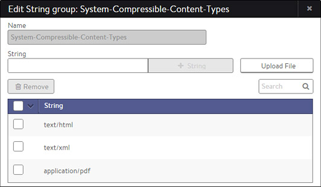

### Description

String groups are simply lists of strings, such as URLs or client names which may be used by various functionality throughout Avi Vantage. String groups come in two flavors, either a basic list, or when String Map is selected, a list of key/value pairs.

A string group may be used for custom purposes such as lists of allowed clients. Avi Vantage includes several pre-created string groups which may be used by various functionality described below.  By leveraging a string group, lengthy lists can be reused throughout the system.  For DataScripts or policies, it enables Avi Vantage to maintain the rule logic separately from the list of strings. This makes administration easier, since an administrator can update the list without being exposed to the underlying logic or script that uses the strings.

String groups may be automatically updated via external API calls.  When a group is updated, the update is pushed from the Controller to any Service Engines that are hosting virtual services that are leveraging the string group.

### Usage

The following are a few examples of string groups used within Avi Vantage.

* **Compression**:  Avi Vantage includes a default *System-Compressible-Content-Types* string group.  This is a list of MIME types that determine if an HTTP response is eligible to be compressed.
* **Caching**:  Avi Vantage includes a default *System-Cacheable-Resource-Types* string group.  This is a list of MIME types that determine if an HTTP response is eligible to be cached.  See <a href="/docs/17.1/overview-of-http-cache/">HTTP Caching</a> for other parameters that may factor into the eligibility of an object being cached.
* **Policies**:  HTTP security and HTTP request policies may be triggered based on criteria matched against a string group.  For example, if a browser's User-Agent header matches an entry in a string group, send the request to a specific pool.
* **Logs**  Logs may be selectively enabled based on a match in a VS > Analytics > log filter.  The filter can compare a client's requested path against a string group containing the list of important paths or URLs.
* **DataScript**:  Custom decisions may be made based on a match against an entry in a string group.  See the DataScript function <a href="/docs/17.1/datascript-avi-stringgroup-contains/">avi.stringgroup.contains</a> for examples and syntax. 

The table on the Templates > Groups > String Group page contains the following information for each string group:

* **Name: ** Name of the string group.
* **Type**:  Either string, which is a list of strings, or map, which is a list of key value pairs.
* **Number of Strings:**  Number of strings within a string group. 

### Create a String Group

Options while creating or editing a string group:

* **Name:** Enter a unique name for the string group in the Name field.
* **String Map**: When enabled, the group will be in a key-value-pair format.  Existing string group entries are not persistent when switching the string group between these two modes.
* **Strings:** Add one or more text strings to the list. You may use any combination of the following methods:  
    * **String:** Enter any text in the field, and then click the **+** String button to add.
    * **Upload File:** Click the Upload File button on the right to navigate to and upload a comma-separated-value (CSV) file that contains text.  When using String Map mode, the first column in the spreadsheet is used as the key, and any additional populated columns are added as comma-separated value such as:  *key a,b,c,d* 