 

### **ISE TACACS+ Server**

Cisco ISE is a security policy management platform that provides secure access to network resources. Cisco ISE functions as a policy decision point and enables enterprises to ensure compliance, enhance infrastructure security, and streamline service operations.

Given below are steps involved in setting up an ISE TACACS+ server as a remote authentication and authorization system for Avi Vantage.

* The ISE server is generally configured with external Identity Sources (in this case OpenLDAP). 

 

<a href="img/ISE-Authentication-setOpenLDAP.png">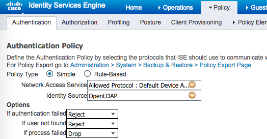</a>

 

 

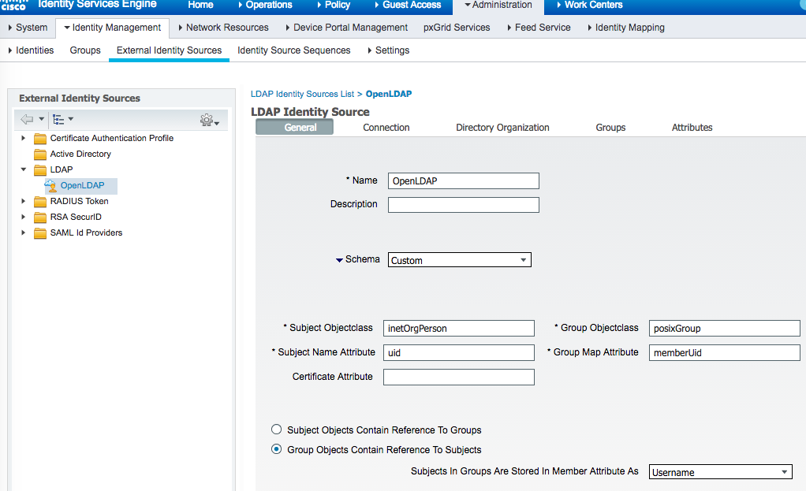

 

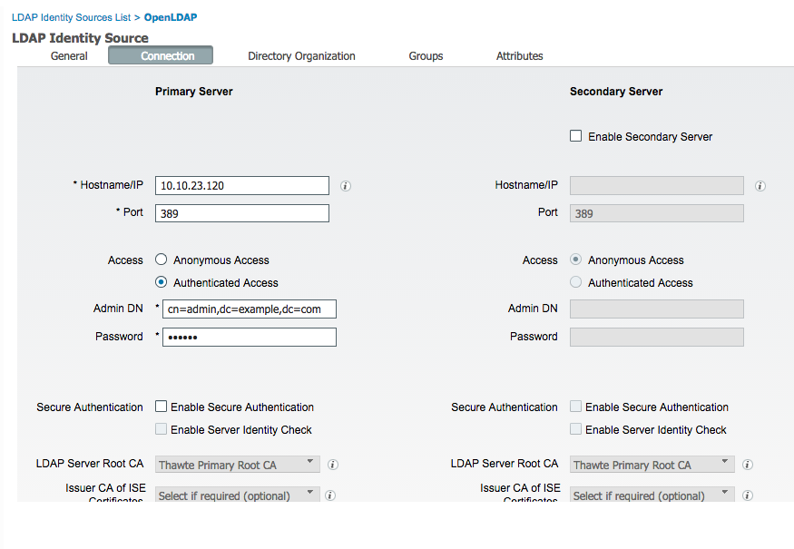

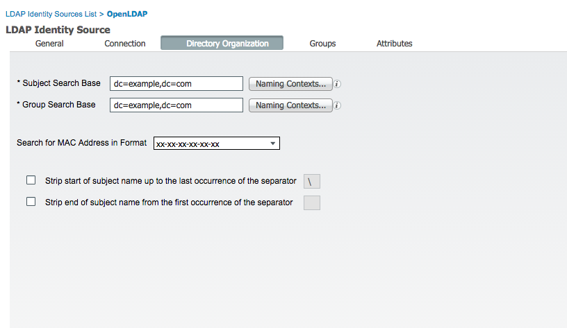

 

* ISE LDAP settings used to fetch LDAP groups in order to use them for Authorization conditions 

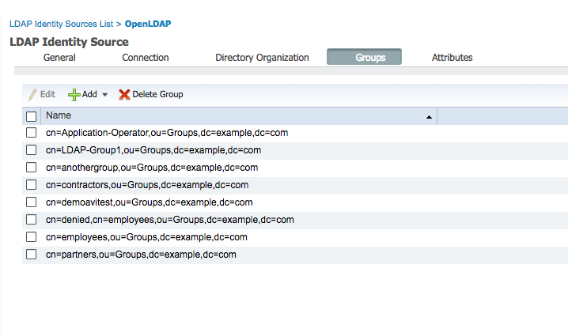

* ISE Authorization conditions added for Users in the AD groups 

 

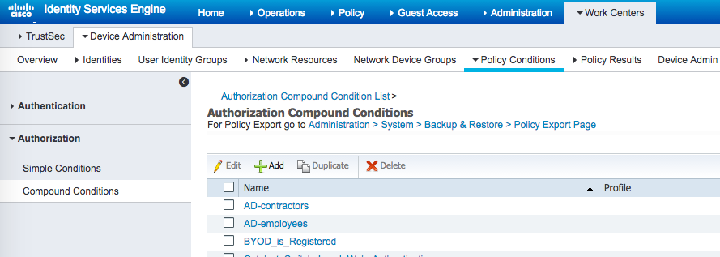

 

 

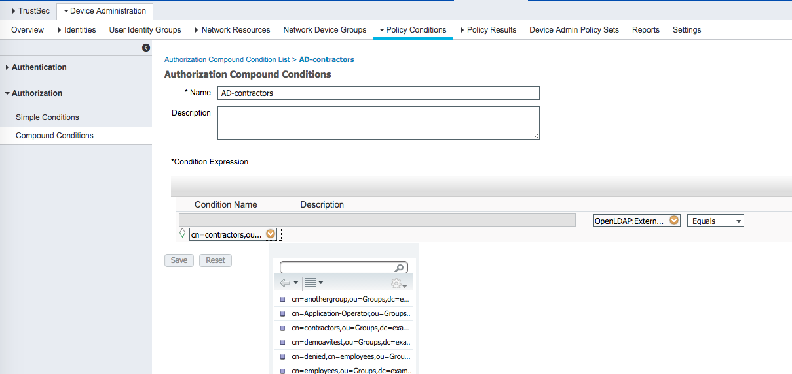

 

* ISE server should recognize all Avi Vantage Controller cluster nodes as valid Network Devices. 

 

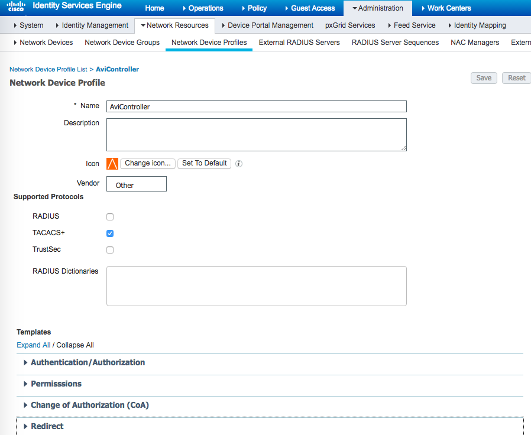

 

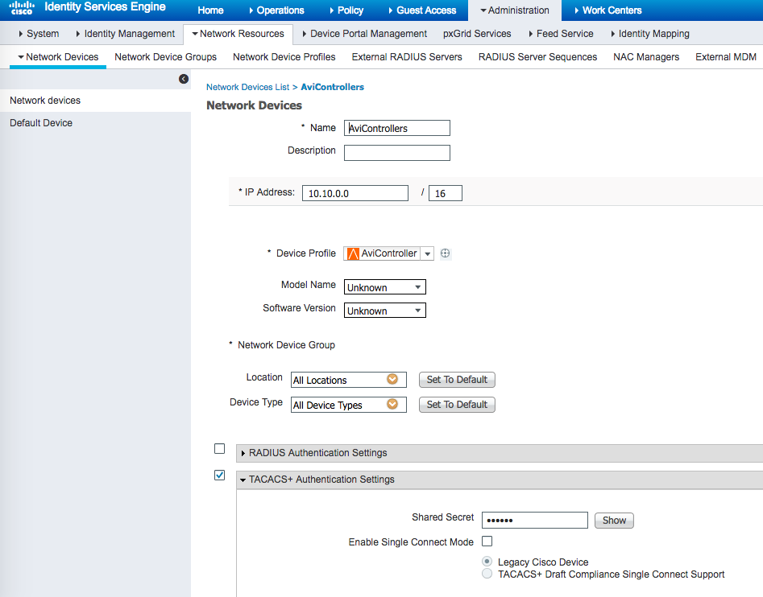

 

* ISE requires shell profiles and TACACS+ profiles configured. 

 

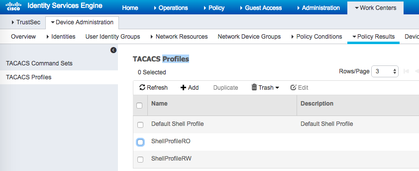

 

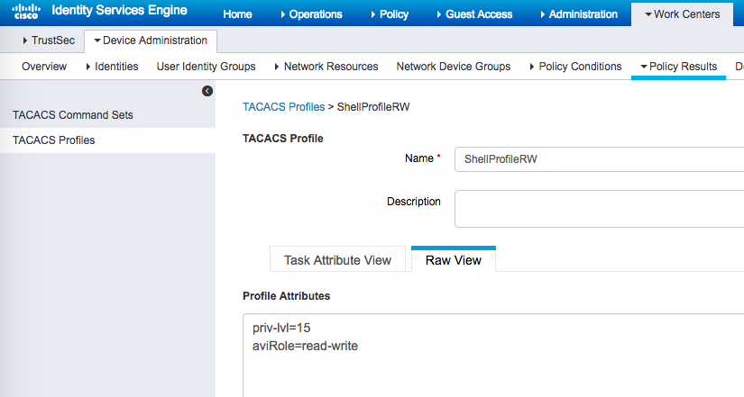

 

* ISE device policy sets default condition updated to assign different shell profiles based on group membership. 

 

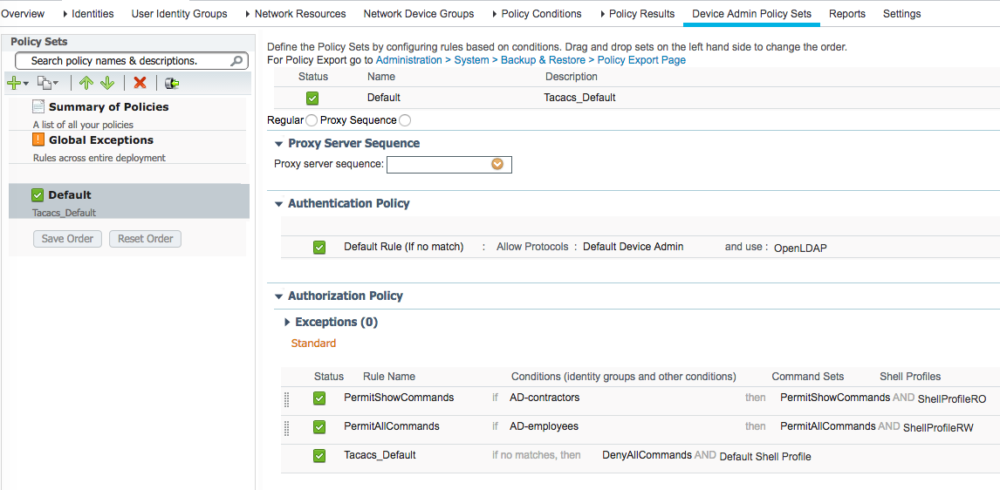

 

* The Avi Vantage TACACS+ auth profile should be configured with the same shared secret that was assigned to the device in ISE. The "service" attribute is generally required for authorization. In the case of an ACS server, service=shell is required for user authorization; while in the case of an ISE server, service=shell is known to cause authorization failure. 

 

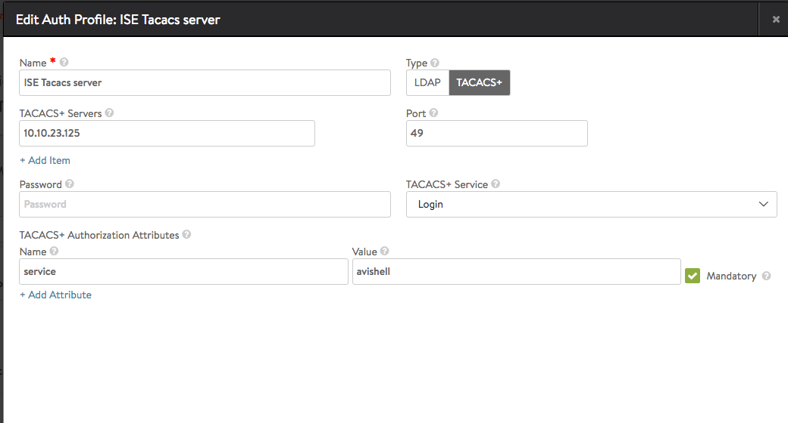

 

* Avi Vantage TACACS+ authorization role and tenant mapping configured to assign different roles based on TACACS+ attribute value 

 

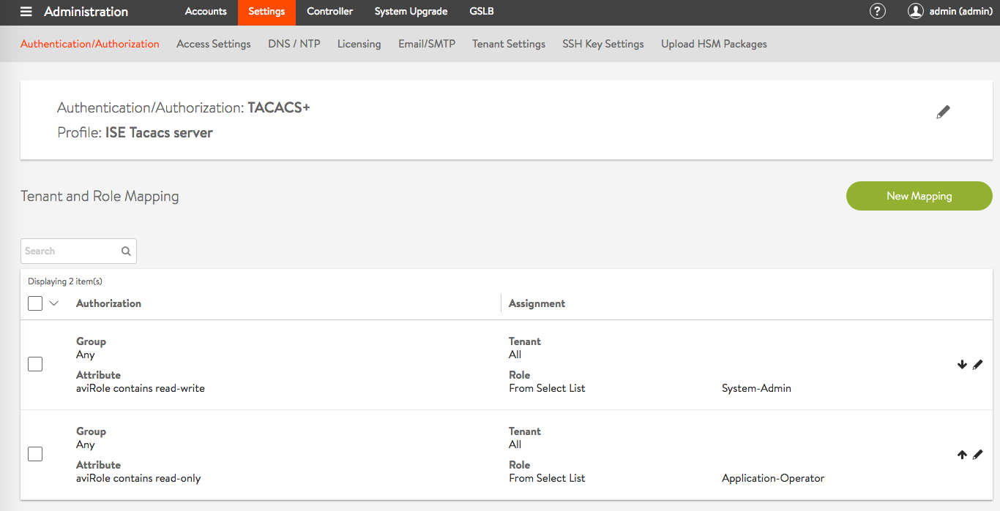

 

### **Shrubbery TAC_PLUS**

 

* TAC_PLUS server is a much simpler alternative to ISE/ACS. This is mostly relevant in development or testing environments. Conceptually, users are assigned to groups and groups have request and response attributes. 

 

<a href="img/TACACSshrubbery-conf.png">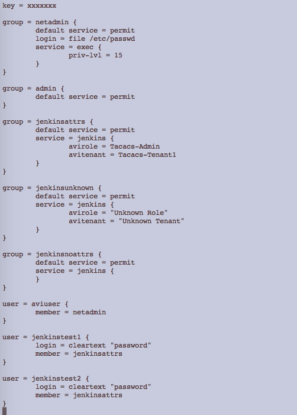</a>

 

<a href="img/TACACSshrubbery-command.png">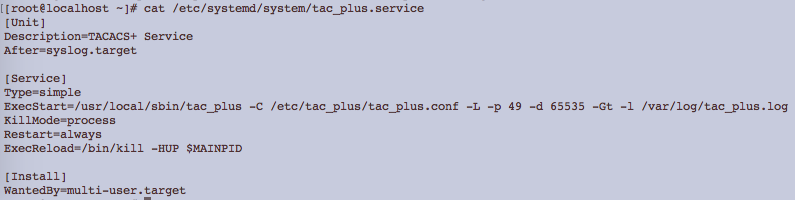</a>

 

* Avi Vantage TACACS+ auth profile is configured the same way as that for ISE or ACS. 

### Other Articles of Interest:

<a href="/docs/17.1/protocol-ports-used-by-avi-vantage-for-management-communication/">Protocol Ports Used by Avi Vantage for Management Communication</a>
