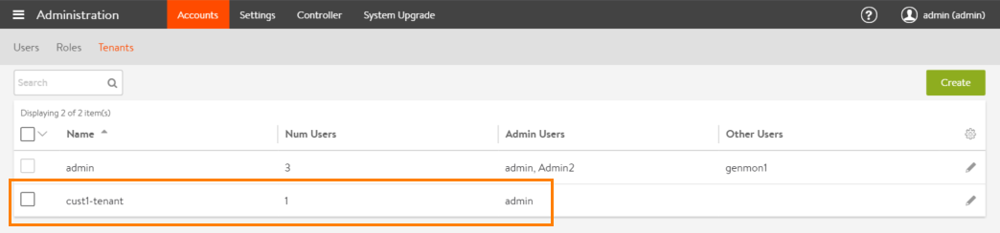
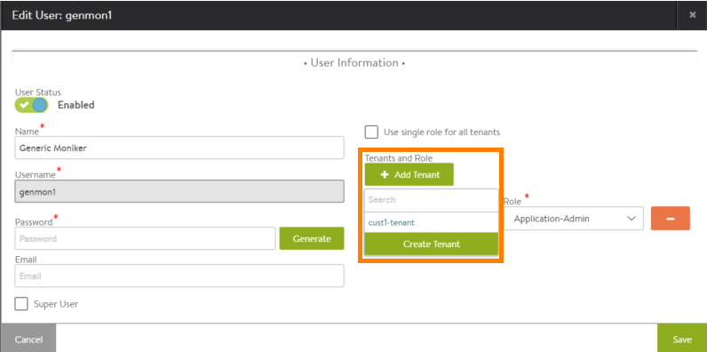
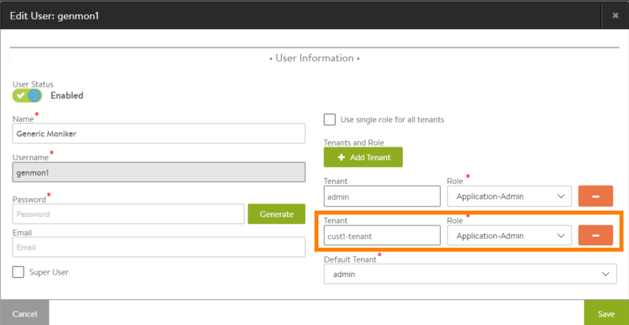
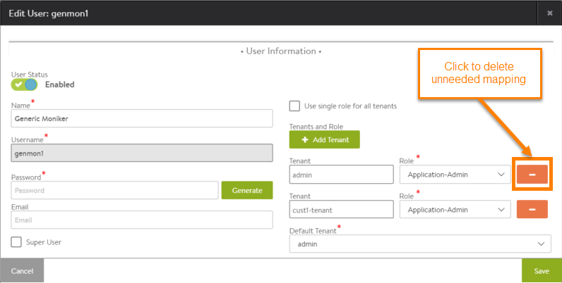
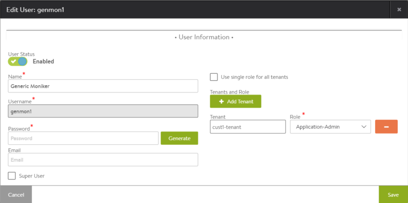
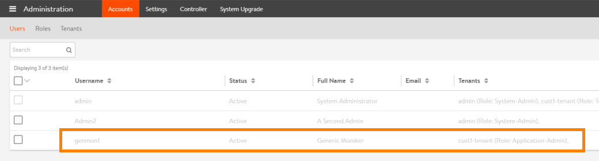
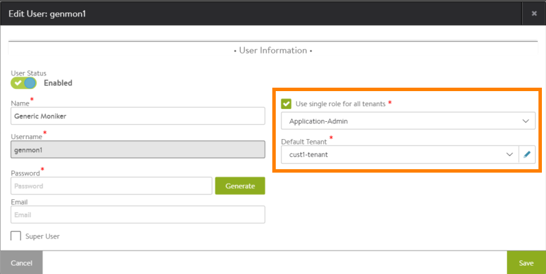

A tenant is an isolated instance of Avi Vantage. Each Vantage user account is associated with one or more tenants. The tenant associated with a user account defines the resources that user can access within Vantage. When a user logs in, Vantage restricts their access to only those resources that are in the same tenant.

If a user is associated with multiple tenants, each tenant still isolates the resources that belong to that tenant from the resources in other tenants. To access resources in another tenant, the user must switch the focus of the management session to that other tenant.

Note: For information on switching a management session from one tenant to another, <a href="/docs/17.1/switch-between-tenants">click here</a>.

### Default Tenant

By default, all resources belong to a single, global tenant: admin. The admin tenant contains all Avi Vantage resources.

The default admin user account belongs to the admin tenant and therefore can access all resources.

If no additional tenants are created, all new Vantage user accounts are automatically added to the admin tenant.

### Tenant-to-Role Mapping

Within each user account, the role selected for the user is mapped to a tenant. If only one tenant is defined (the default admin tenant), this tenant is automatically mapped to the role selected for the user. This allows the user to access all resources, to the extent (write, read, or no access) allowed by their role.

Creating additional tenants allows a user account to have multiple roles. In this case, within the user account, each role can be mapped individually to a tenant. Or, optionally, a single role can be mapped to all tenants.

If a single role is mapped to all tenants, the default tenant for that user must be selected. The default tenant is the one the user is placed into when logging into Vantage. After logging in, the user can switch the management session to other tenants as needed.

### *All Tenants* View-only Tenant for Super Users

Vantage user accounts that are enabled for super user access automatically have access to a special read-only tenant: All Tenants. The All Tenants view provides read-only access to all resources within Avi Vantage.

The <a href="/docs/17.1/all-tenants-view">All Tenants</a> tenant cannot be mapped to any roles within a user account. The All Tenants tenant is automatically made available to all super user accounts.

## Create a Tenant

To create a tenant:
<ol> 
 <li>Navigate to Administration &gt; Tenants, and click Create.</li> 
 <li>Enter a name for the new tenant.</li> 
 <li>Optionally, enter a description.</li> 
 <li>Click Save.</li> 
</ol> 

The new tenant appears in the tenant table.

The *admin* account is automatically added to each new tenant.

## Add an Existing User to a Tenant

To add a user to a tenant:
<ol> 
 <li>Navigate to Administration &gt; Users.</li> 
 <li>Click on the edit icon next to the user name.</li> 
 <li>Click Add Tenant and select the new tenant. (If the new tenant does not exist yet, click Create Tenant.) A new set of mapping fields appears.  </li> 
 <li>Select the role from the Role pull-down list. </li> 
 <li>Click the minus sign next to any mappings that are no longer needed.    After the unneeded mapping is deleted:  </li> 
 <li>Click Save.</li> 
</ol> 

The tenants table reappears, showing the change.

### Single Role for All Tenants

This option allows the user account to access any tenant from the same role. In this case, the default tenant must be selected. The default tenant is the one into which the user is placed after logging in.

In the following example, a user is allowed to access all tenants, and will automatically be placed into tenant cust1-tenant after login.

