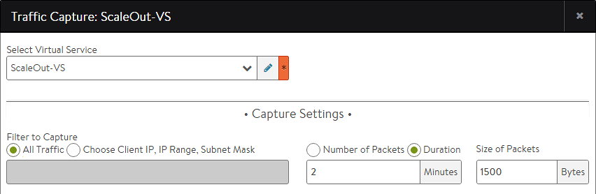

When running a traffic capture (TCPdump), a virtual service must first be selected.

Virtual services may exist on a single Service Engine (SE) or may be scaled out across multiple active SEs. Traffic captures will automatically be executed on all SEs actively handling traffic for the virtual service. Once the captures are complete, the SEs forward their pcap files to the Controller, which aggregates and sorts the data into a single file.

To view traffic flowing through a single SE for a scaled out virtual service, add a filter to the pcap viewer with the desired SE's IP address on the server side of the connection. See <a href="/docs/17.1/manual-traffic-capture/">Traffic Capture</a> for more on this topic.    
