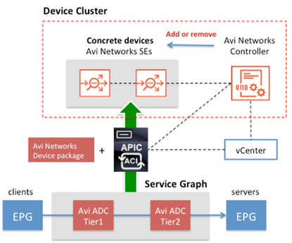
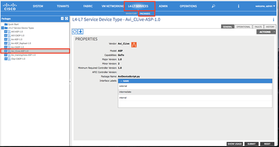
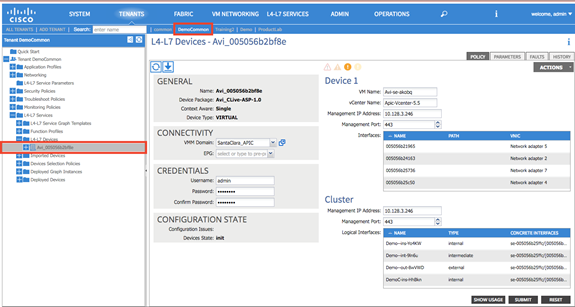
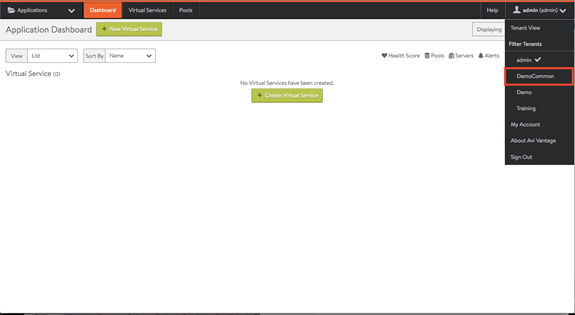
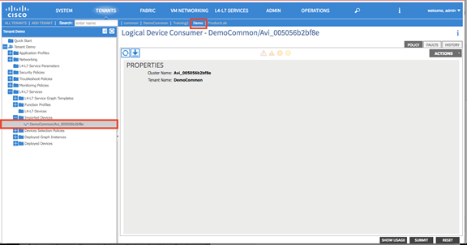
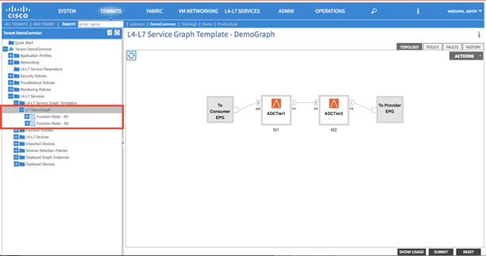
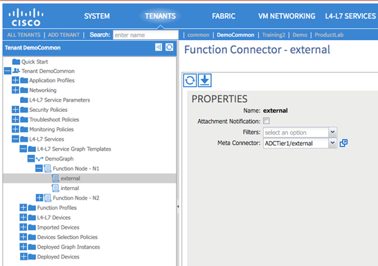
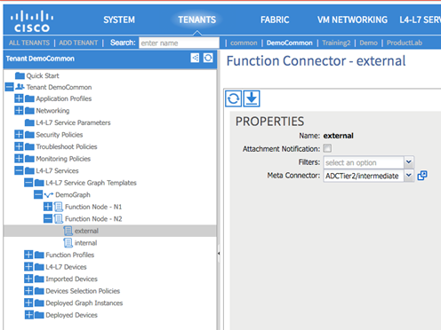
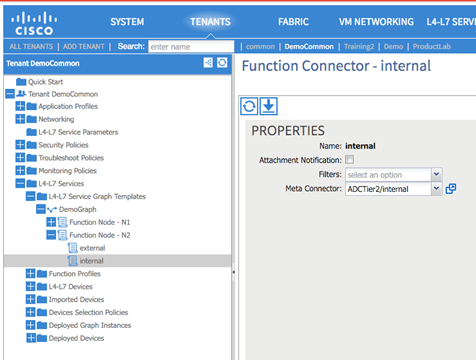

This article provides troubleshooting tips for Avi Vantage integration with Cisco Application Policy Infrastructure Controller (APIC), using VMware vCenter as Cisco APIC’s Virtual Machine Manager (VMM).

Avi Vantage integration with Cisco ACI provides advanced load balancing capacity with high network automation.

Avi-APIC solution troubleshooting can be classified into the following areas:

* Issues related to the device package
* Tenant mapping issues across APIC and Vantage
* Issues related to APIC graph instances 

## Issues Related to the Device Package

Once the Vantage user configures the Avi Controller with Cisco ACI and vCenter, the user should be able to see the automatically uploaded device package.

<ol> 
 <li>Ensure the device package is uploaded correctly under the L4-L7 package list.</li> 
 <li>Make sure the deployment string in the left pane is correct. The deployment string should be in this format:Avi_<em>Deployment</em>-ASP.1.0In the following example, the deployment string is “Avi_CLive-ASP.1.0”, where "CLive" was configured during Avi Controller initialization.</li> 
</ol> 

## Tenant mapping issues across APIC and Vantage

The Controller inherits tenancy from APIC. The Controller is initialized with one of the tenants in APIC. The Vantage user can then export L4-L7 devices from the initial tenant to other tenants. The Controller only maps a tenant where the device package is registered or exported.

For example:
<ol> 
 <li>The Controller is configured within a Democommon tenant during initial setup. The Controller can be traced under Tenants &gt; “DemoCommon” &gt; L4-L7 Services &gt; L4-L7 Devices &gt; Avi_<em>random-number</em>.</li> 
 <li>The Controller web interface then automatically maps corresponding APIC tenant.</li> 
 <li>For example, if the user exports the Avi device from the “DemoCommon” tenant to the “Demo” tenant, the Controller web interface will automatically map the “Demo” tenant from APIC.</li> 
</ol> > Note: When Device import is removed from APIC, the tenant still remains in Vantage. The tenant is removed from Vantage when the tenant is deleted from APIC.
 

## Issues Related to APIC Graph Instance

Vantage requires a 2-node graph to perform scaleout or to autoscale load-balancing capacity. The 2-node Service Graph within APIC looks the same as shown below:

Once the Vantage user assigns the Vantage Service Graph to the contract, the Controller communicates with APIC to populate "L4-L7 Devices” >“Deployed Graph Instances”. If this field is not populated:
<ol> 
 <li>Expand “L4-L7 Services” &gt; “L4-L7 Service Graph Templates” &gt; “Avi Service Graph” &gt; “Function Node 1”. (See figure above.)a. External node of Node 1 should be mapped to the “ADCTier1/external” meta-connector. 
b. Internal node of Node 1 should be mapped to the “ADCTier1/intermediate” meta-connector.
 

</li> 
 <li>Expand “L4-L7 Services” &gt; “L4-L7 Service Graph Templates” &gt; “Avi Service Graph” &gt; “Function Node 2”.a. External node of Node 2 should be mapped to the “ADCTier2/intermediate” meta-connector. 
b. External node of Node 2 should be mapped to the “ADCTier1/internal” meta-connector.
 

</li> 
</ol> 