The Avi Controller can be configured to provide automatic IP address allocation for VIPs and to provide authoritative DNS resolution for VIP addresses.

To enable auto-allocation of VIPs, configure an IP address management (IPAM) profile and add it to the configuration of the cloud on the Avi Controller. IPAM profiles can be configured to use the following IP providers:

* Avi Vantage
* Infoblox
* Amazon Web Services (AWS)
* OpenStack 

To enable authoritative DNS resolution of queries for the VIP addresses, configure a DNS profile and add it to the configuration of the cloud on the Avi Controller.

### Notes

These procedures assume the cloud configuration has already been created on the Avi Controller.

## Providers of IPAM and DNS Support

Here is the list of providers and supported functionalities for IPAM and DNS:

<table class="table table table-bordered table-hover">  
<tbody>     
<tr>     
<th>Support / Provider Profile
</th>
<th>Infoblox
</th>
<th>Internal
</th>
<th> AWS/OpenStack
</th>
</tr>
<tr>     
<td>IPAM only</td>
<td>No (not currently supported)</td>
<td>Yes</td>
<td>Yes</td>
</tr>
<tr>     
<td>DNS only</td>
<td>No (not currently supported)</td>
<td>Yes</td>
<td>No</td>
</tr>
<tr>     
<td>IPAM + DNS</td>
<td>Yes</td>
<td>Yes</td>
<td>No</td>
</tr>
</tbody>
</table> 

For example, if Infoblox is the chosen provider, both IPAM and DNS profiles should be pointing to Infoblox. If Avi Vantage is the chosen provider, the Avi Vantage user has an option to use IPAM, DNS, or both.

## IPAM / DNS Support for Cloud Infrastructure

This table lists the IPAM and DNS provider support available for each type of cloud (infrastructure) configured in Avi Vantage. For example, when creating VirtualServices in OpenStack or AWS cloud, a separate configuration for IPAM is not needed/allowed as the cloud configuration has support for IPAM natively in Avi. However, Avi Vantage DNS service can be still be used with these Clouds.

<table class="table table table-bordered table-hover">  
<tbody>          
<tr>     
<th>Cloud / Provider Profile
</th>
<th>Infoblox
</th>
<th colspan="2">Internal
</th>
<th colspan="2">AWS/OpenStack
</th>
</tr>
<tr>       
<th>
</th>
<th>IPAM+DNS
</th>
<th>IPAM
</th>
<th>DNS
</th>
<th>IPAM
</th>
<th>DNS
</th>
</tr>
<tr>       
<td>VMware (Read Access)</td>
<td>No</td>
<td>Yes  (16.2.1 onwards)</td>
<td>Yes</td>
<td>N/A</td>
<td>N/A</td>
</tr>
<tr>       
<td>VMware (Write Access)</td>
<td>No</td>
<td>No</td>
<td>Yes</td>
<td>N/A</td>
<td>N/A</td>
</tr>
<tr>       
<td>OpenStack</td>
<td>No</td>
<td>No</td>
<td>Yes</td>
<td>N/A (default, native)</td>
<td>N/A (default, not used)</td>
</tr>
<tr>       
<td>AWS</td>
<td>No</td>
<td>No</td>
<td>Yes</td>
<td>N/A (default, native)*</td>
<td>N/A (default, native)*</td>
</tr>
<tr>       
<td>Containers (Mesos/Rancher/Docker UCP)</td>
<td>Yes</td>
<td>Yes</td>
<td>Yes</td>
<td>Yes</td>
<td>No</td>
</tr>
<tr>       
<td>Linux Server</td>
<td>Yes</td>
<td>Yes</td>
<td>Yes</td>
<td>Yes</td>
<td>No</td>
</tr>
<tr>       
<td>No access</td>
<td>Yes</td>
<td>Yes</td>
<td>Yes</td>
<td>Yes</td>
<td>No</td>
</tr>
</tbody>
</table> 

/* Avi Vantage supports Route 53 when AWS is the cloud provider configuration in Avi.

## Cloud Configuration Workflow

This section lists the steps for configuring IPAM and DNS support. The configuration fields differ among the infrastructure types and the provider (Avi Vantage, Infoblox, AWS, and OpenStack). See the sections following this one for detailed steps.
<ol> 
 <li>Navigate to Templates &gt; Profiles.</li> 
 <li>Click IPAM/DNS Profile.</li> 
 <li>Click Create and select the provider: 
  <ul> 
   <li>Internal</li> 
   <li>Infoblox</li> 
   <li>AWS</li> 
   <li>Openstack</li> 
  </ul> </li> 
 <li>Fill in the displayed fields. (Detailed steps are provided in the sections below.)</li> 
 <li>Click Save. The profile appears in the list.</li> 
 <li>Navigate to Infrastructure &gt; Clouds, and edit the cloud setting.</li> 
 <li>Select the IPAM and DNS providers from the pull-down list. Either one or both need to be selected, based on the provider selected.  For example: if Infoblox is the IPAM provider, it must be the DNS provider as well.</li> 
 <li>(Optional) For east-west virtualservices in this cloud, you need to additionally select East-West IPAM and DNS providers from the pull-down list. Either one or both can be selected.</li> 
 <li>Click Save.</li> 
</ol> 

Sample Cloud Configuration with IPAM & DNS from steps 1 through 9:

<a href="img/cloud-ipam-dns.png">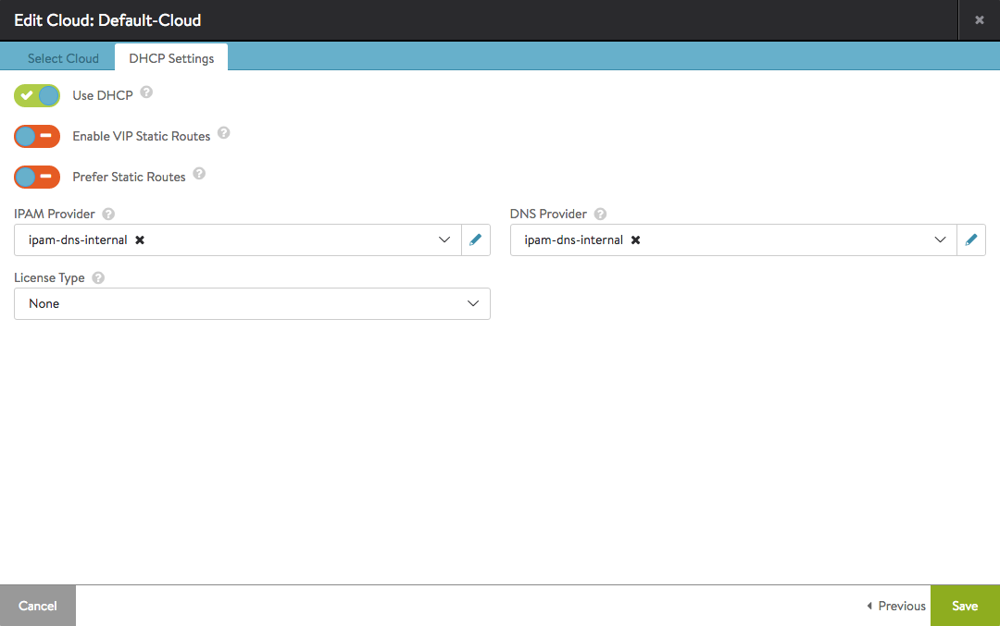</a>

The following sections provide information for each of the IPAM / DNS providers supported by Avi Vantage.

## IPAM / DNS Configuration: Avi Vantage

These steps are applicable if using Avi Vantage as the IPAM and/or DNS provider.

### IPAM

Create a placeholder IPAM profile with no additional fields configured as show below.

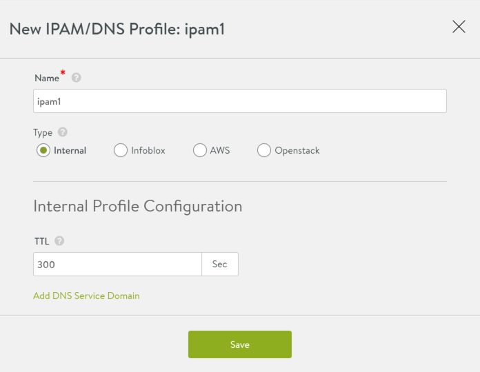

Avi Controller will allocate IP addresses from a pool configured for the cloud as detailed below. If the static IP address pool is empty, no virtual services that use this address allocation scheme will be created. For east-west IPAM requirements (Container clouds like Mesos, Rancher & Docker UCP/Swarm), Avi recommends creating a separate network and a single subnet inside this network.
<ol> 
 <li>Navigate to Infrastructure &gt; Clouds, and click on the cloud name.</li> 
 <li>Select Network and click Create.</li> 
 <li>Enter a name for the network (nw-1).</li> 
 <li>Add the networks to use for IP allocation: 
  <ol> 
   <li>Click Add Subnet.</li> 
   <li>Enter the subnet address, in the following format: 9.9.9.0/24</li> 
   <li>Click Add Static IP address pool. Avi Vantage will allocate IP addresses from this pool. For example, 9.9.9.100-9.9.9.200.</li> 
   <li>Repeat steps 1-3 for adding more subnets to choose IPs from for a VirtualService under the same network object.</li> 
   <li>Click Save.</li> 
   <li>Repeat for each network to be used for IP address allocation</li> 
  </ol> </li> 
 <li>Click Save.</li> 
</ol> 

IPAM network creation after steps 1 through 5:

<a href="img/ns-ipam-nw.png">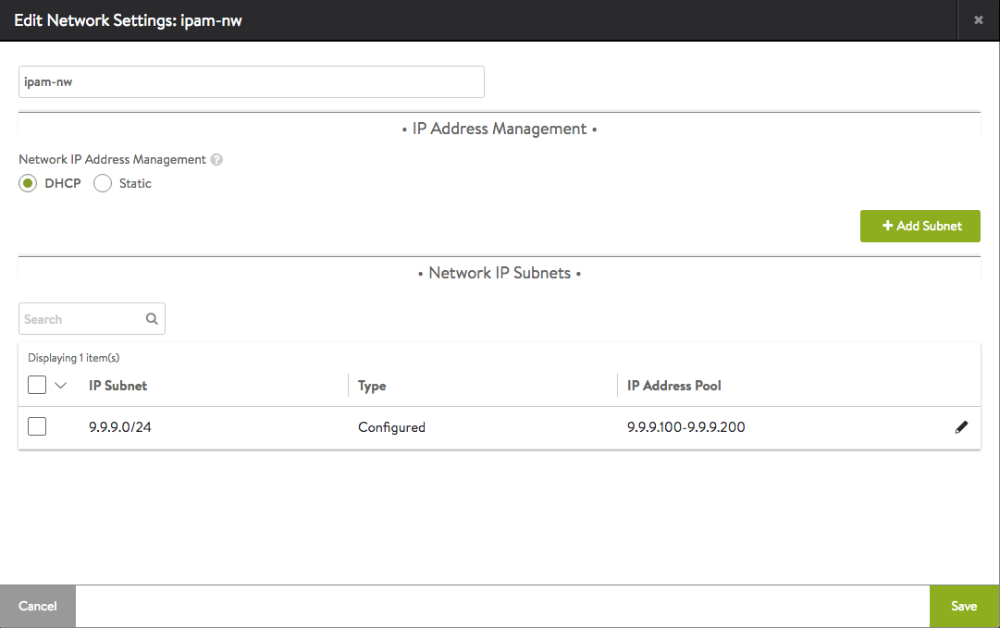</a>

East-West IPAM network creation after steps 1 through 5:

<a href="img/ew-ipam-nw.png">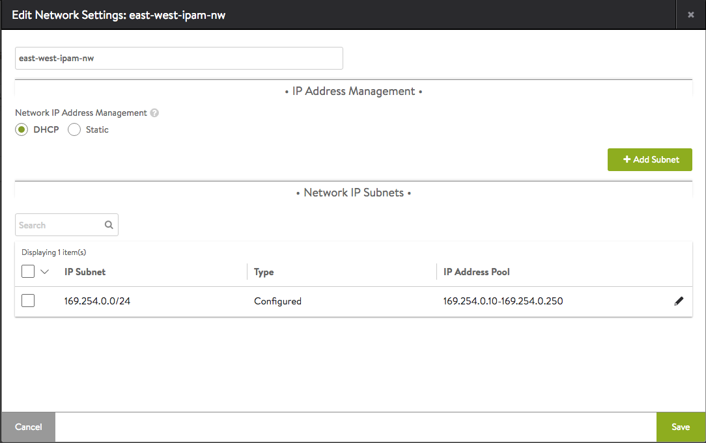</a>

### DNS

In the IPAM/DNS profile, add DNS Service Domains. Service_domain field provided will have Avi Vantage as an authoritative DNS server.

Enter the domain name (for example, “mycompany-cloud”.) All applications using this IPAM profile will have DNS records with fully qualified domain name (FQDN) app-name.mycompany-cloud. User can input any hostname accompanied with the domain name (not necessarily the virtualservice name, although that is recommended for ease of use in identifying applications) in the fqdn field for virtualservice (Refer to VirtualService workflow section at the bottom of this page)

Enter the record TTL. If nothing is entered here, the default value is taken from the TTL field at the top level.

<a href="img/dnsprofile.png">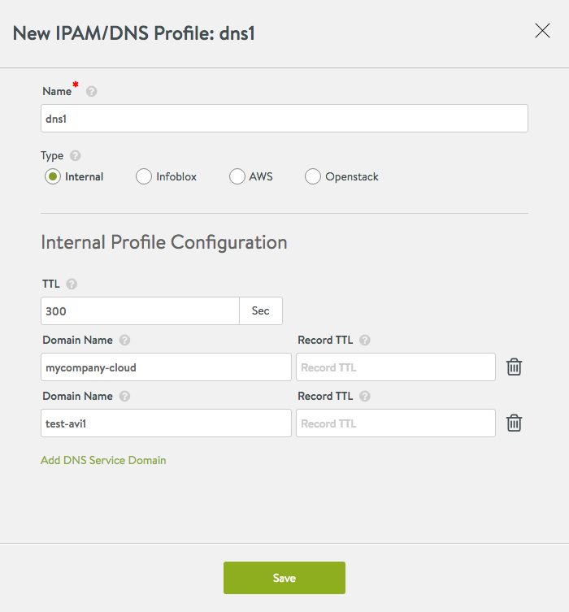</a>

 

## IPAM/DNS Configuration: Infoblox

Note: If using Infoblox as the provider, it must be used for both IPAM and DNS.

In the IPAM profile, enter the Infoblox credentials:

* IP address: address of the Infoblox appliance
* Username and password: credentials for to access Infoblox
* API Version: as supported by Infoblox server (default: 2.0)
* DNS view: as configured in Infoblox (default: “default”)
* Network view: as configured in Infoblox (default: “default”)
* Optionally, select a subset of IP subnets and DNS domains to choose from Infoblox:  
    * Usable subnet: pick all or a subset of subnets configured in Infoblox to be used for VIP allocation. If none is specified, Vantage looks at all subnets.
    * Usable domain: pick all or a subset of the domains configured in Infoblox to be used for DNS purposes. If none is specified, all domains are available during virtual service creation. 

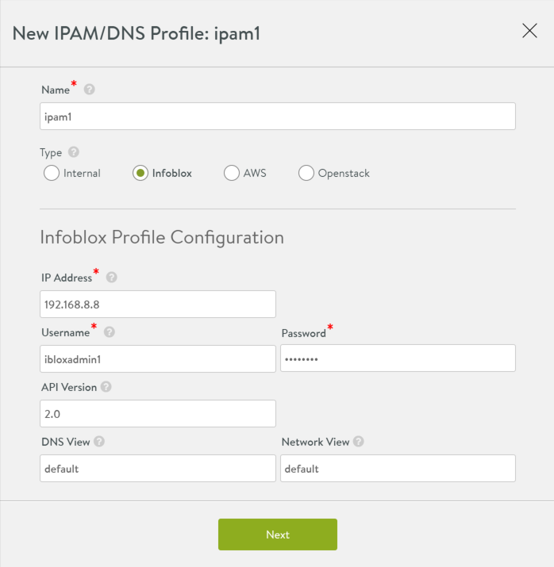

### IPAM & DNS

Only IPAM or Only DNS is not supported with Infoblox.  IPAM + DNS is the only mode supported.

Selecting a subset of subnets/networks from Infoblox for IPAM:

<a href="img/infoblox-subnet.png">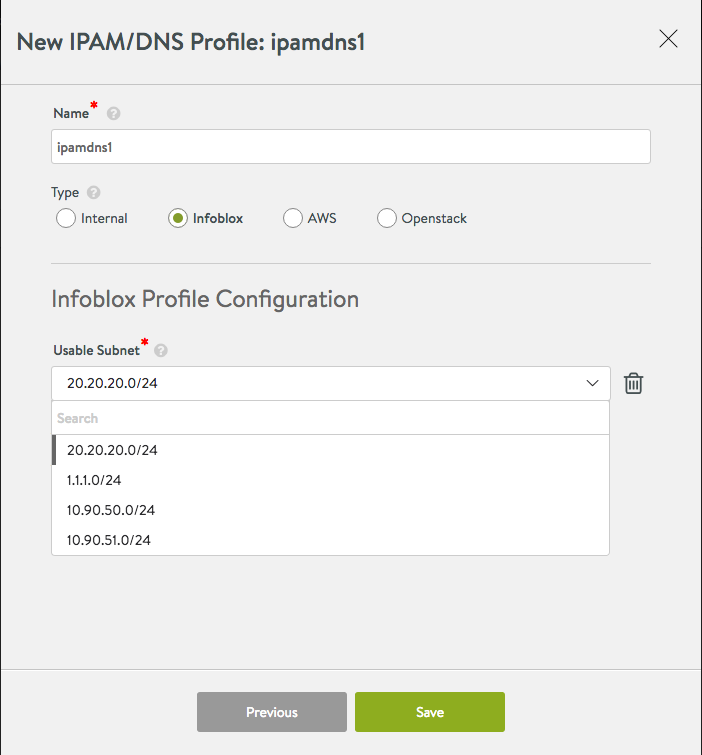</a>

Selecting a subset of domains/zones from Infoblox for DNS:

<a href="img/infoblox-domain.png">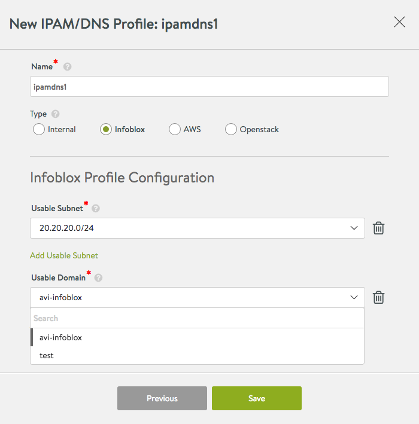</a>

 

 

## IPAM/DNS Configuration: Amazon Web Services

Note: If using AWS as the provider, it must be used for both IPAM and DNS. However, in Vantage 16.2, using AWS as the DNS provider is not supported. Using Vantage DNS service along with AWS IPAM is a supported configuration.

### IPAM

To use AWS as the IPAM provider, one of the following types of credentials is required:

* Identity and Access Management (IAM) roles: set of policies that define access to resources within AWS.
* AWS customer account key: unique authentication key associated with the AWS account. 

**If Using IAM Role:**

Select AWS and Use IAM Roles, then select the AWS region into which the VIPs will be deployed.

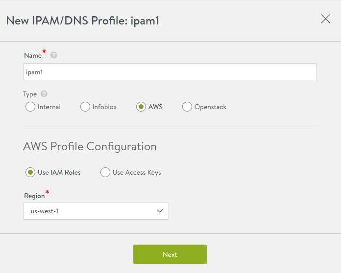

**If Using Access Key:**

Select AWS, then select Use Access Keys and enter the following information:

* Access Key ID: AWS customer key ID.
* Secret Access Key: Customer key.
* Region: AWS region into which the VIPs will be deployed. 

After clicking Next, a drop down of available networks to choose from for IPAM is displayed. Select the appropriate network and Click Save.

<a href="img/aws-vpc-select-2.png">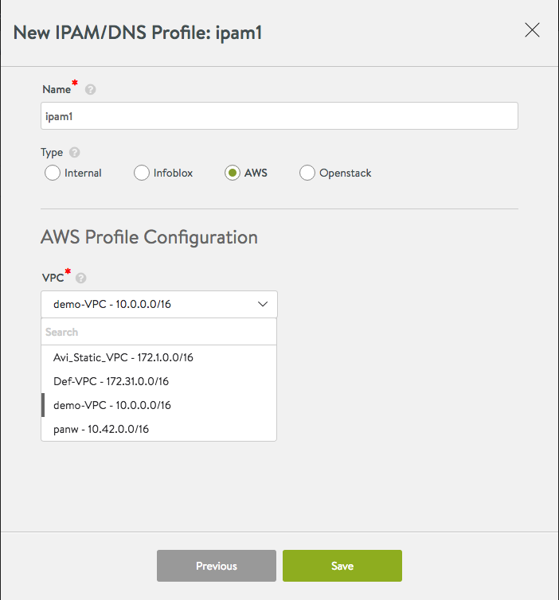</a>

 

### DNS

Not supported.

## IPAM/DNS Configuration: OpenStack

Note: If using OpenStack as the provider, it must be used for both IPAM and DNS. However, in Vantage 16.2, using OpenStack as the DNS provider is not supported. Using Vantage DNS service along with Openstack IPAM is a supported configuration.

### IPAM

Select Openstack, and enter the following information:

* Username: Username for logging onto the Keystone host.
* Password: Password for logging onto the Keystone host.
* Tenant: Name of the OpenStack tenant.
* Keystone Host: IP address or hostname of the Keystone host.
* Network: Network to use for VIP allocation (Openstack network name or the network subnet IP can be used here).
* Region: OpenStack region. 

### DNS

Not supported.

 

## VirtualService Configuration Workflow

Select Auto Allocate IP and a network from a list of networks & subnets in the VS create window as shown below:

<a href="img/vs-create-dns-1.png">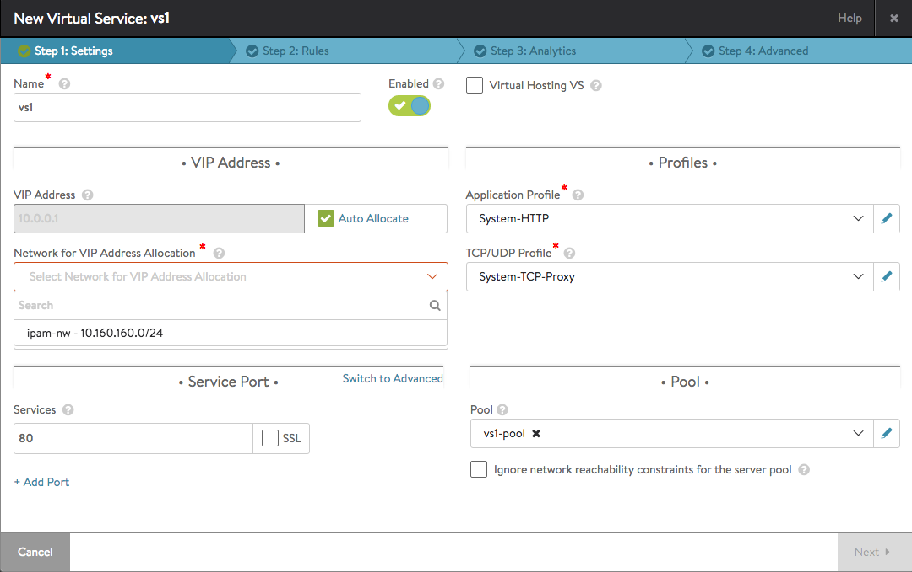</a>

Select FQDN for virtualservice from a list of configured domain names:

<a href="img/vs-create-ipam-1.png">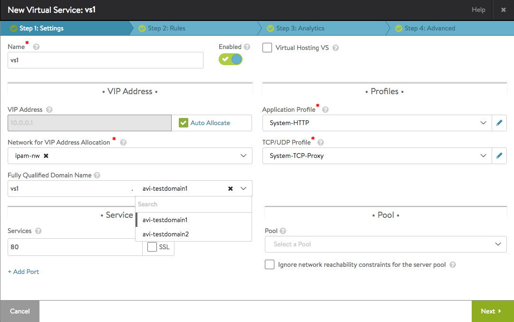</a>

Notes:
<ol> 
 <li>If a DNS profile is configured under a Cloud where VirtualService is being created, then VirtualService IP cannot be determined from a fully qualified domain name, user is expected to enter an IP address or select the auto-allocate IP checkbox.</li> 
 <li>In case of Infoblox, if there is a list of usable_subnets/usable_domains configured (Refer to section for Infoblox above in this article), then the drop-down will consist only those entries. If no such config is found, Avi will display the entire list of available subnets/domains from Infoblox.</li> 
</ol> 