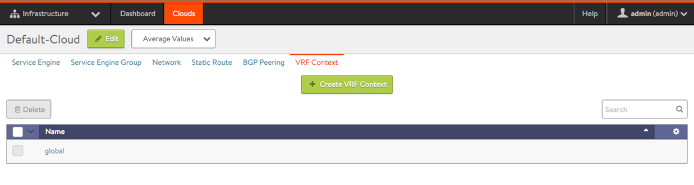
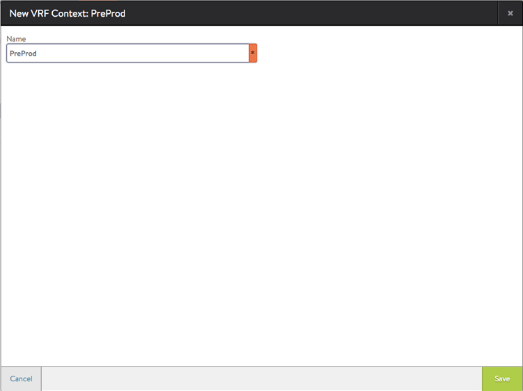
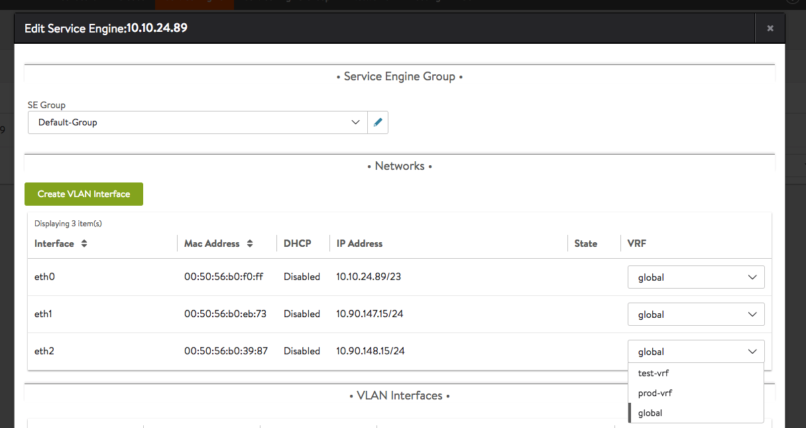
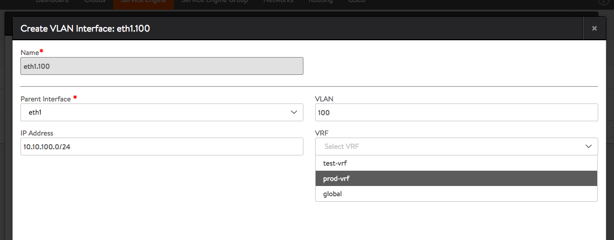
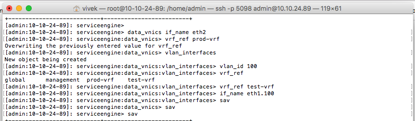
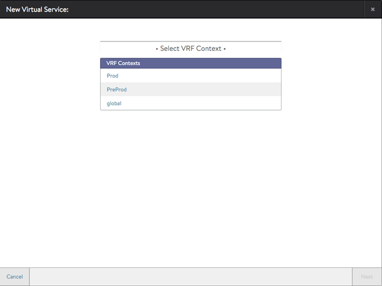

Starting with Avi Vantage release 16.3, Avi Service Engine data interfaces can be assigned to multiple VRFs (Virtual Routing and Forwarding Context).

Virtual Routing Framework, or VRF, is a method of isolating traffic within a system. This is also referred to as a "route domain" within the load balancer community.

### **Clouds Types Supported**

Avi Vantage supports assignment of Service Engine data interfaces to multiple VRFs only in the cloud types listed below.

* No Access Cloud
* Linux Server Cloud 

### **Types of Interfaces Supported**

The VRF property for the following types of data interfaces can be modified by the user, via the REST API, UI, or CLI.

* Physical interfaces
* Port-channel interfaces
* VLAN interfaces 

The types of data interfaces below do not support modification of the VRF property. Any attempt to modify them will result in an error.

* Port-channel member interfaces
* Management interface 

### **Dependency on In-band Management**

Each deployed Service Engine has a new attribute, "in-band management". When enabled, the management interface of the Service Engine (i.e., the interface used to communicate with the Avi Controller cluster) is also used for data plane traffic.

* If in-band management is enabled on an SE, that SE will not support multiple VRFs.
* To enable multiple VRFs on an SE, it must be deployed with in-band management *disabled*. The caveat with disabling in-band management is that the management interface will not be used for data plane traffic, and hence no VS will be placed on this interface and this interface will not be used to communicating with back-end servers. 

To learn how to disable/enable in-band management read <a href="/docs/17.1/configuring-in-band-management-for-an-avi-service-engine/">this article</a>.

### **Creating VRF Contexts**

<ol> 
 <li>Navigate to Infrastructure &gt; Clouds.</li> 
 <li>Click on the cloud name.  
  <blockquote> 
   
Note: If the VMware vCenter cloud is the only one configured, or was the first one configured, the cloud name is "Default-Cloud".
 
  </blockquote> </li> 
 <li>Click VRF Context, then click the Create VRF Context button.</li> 
 <li>Enter the name of the VRF context and click Save.</li> 
</ol> 

### **Modifying SE Data Interface VRF — UI**

Service Engine physical, port-channel & VLAN interface VRFs can be updated if there are multiple VRFs configured in the tenant and cloud to which the SE belongs.

<figure class="thumbnail wp-caption aligncenter">   
<figcapture> Figure. SE editor pulldown menu for updating SE interface VRF 
</figcapture>
</figure> 

 

<figure class="thumbnail wp-caption aligncenter">   
<figcapture> Figure. Selecting VRF for SE VLAN interface 
</figcapture>
</figure> 

### **Modifying SE Data Interface VRF ****—****CLI**

<figure class="thumbnail wp-caption aligncenter">   
<figcapture> Figure. Setting VRF for physical and VLAN interfaces through CLI 
</figcapture>
</figure> 

### **Creating Virtual Services in a VRF**

> Note: These steps can be performed from the admin tenant or from another tenant.
 <ol> 
 <li>Navigate to Applications &gt; Dashboard, and click New Virtual Service.</li> 
 <li>Select the VRF context from the list, and click Next.</li> 
 <li>Enter a name for the virtual service, virtual IP address (VIP) and other properties of the virtual service.</li> 
 <li>Click Save.</li> 
</ol> 