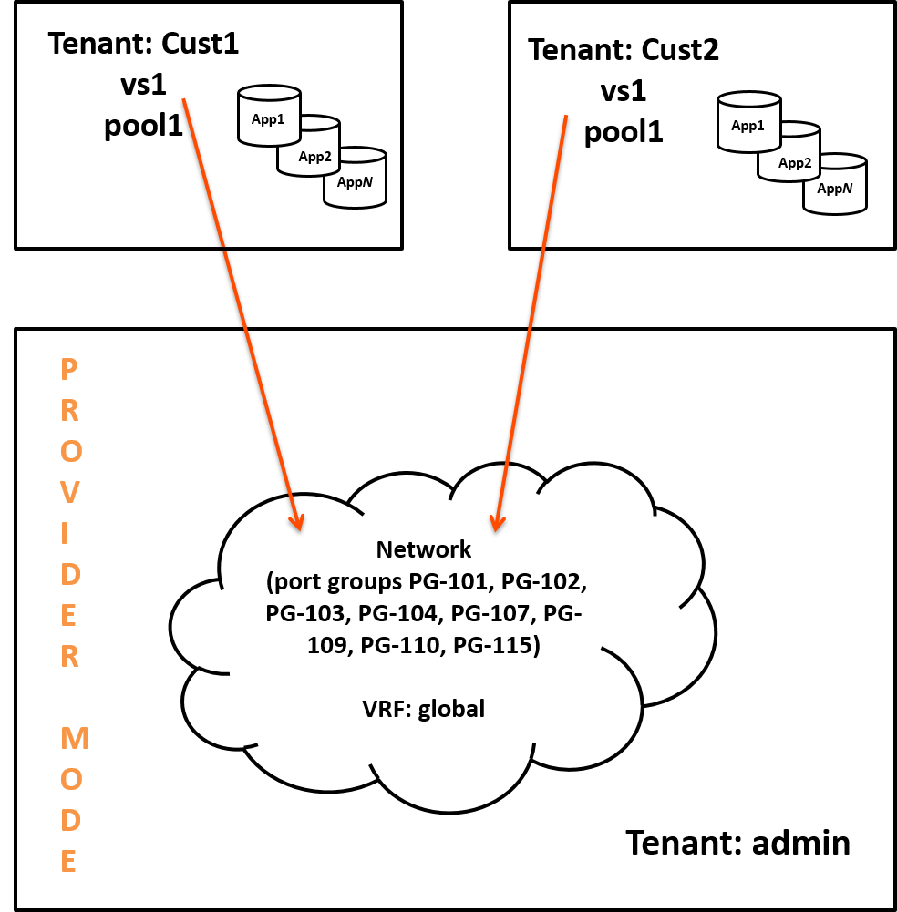
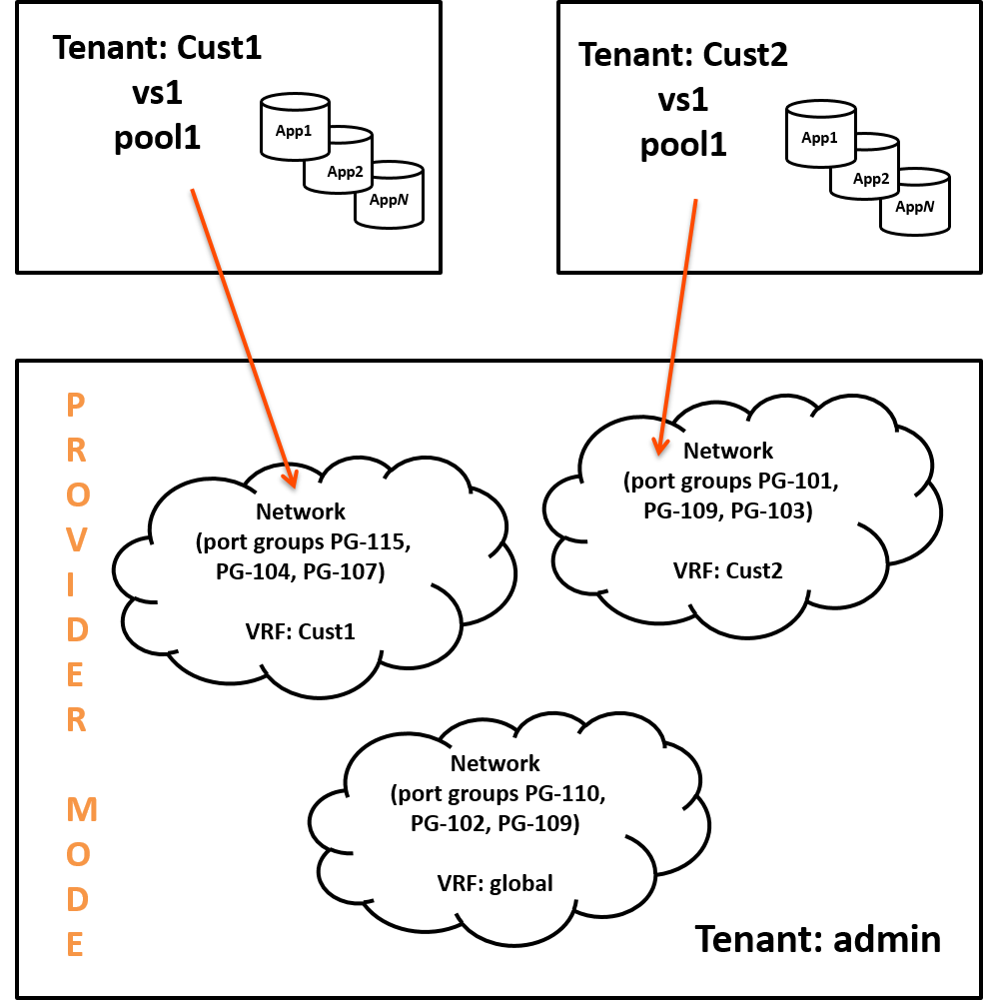
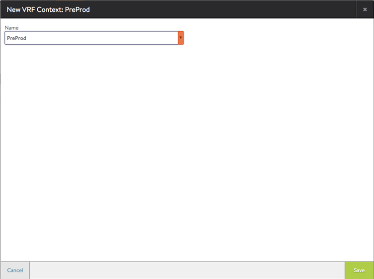
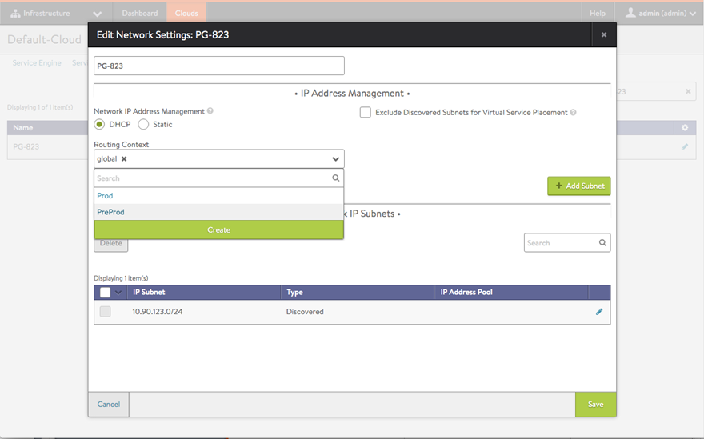
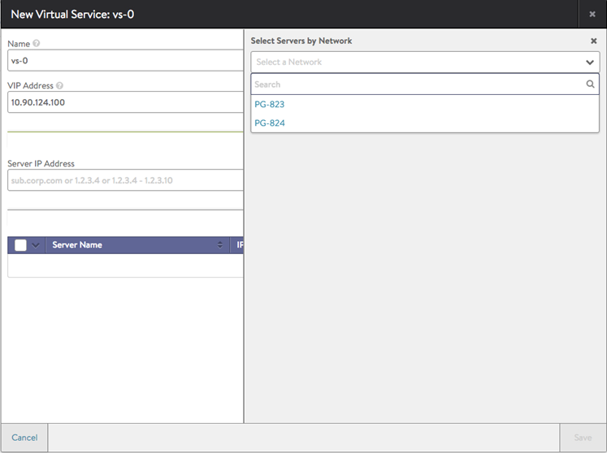
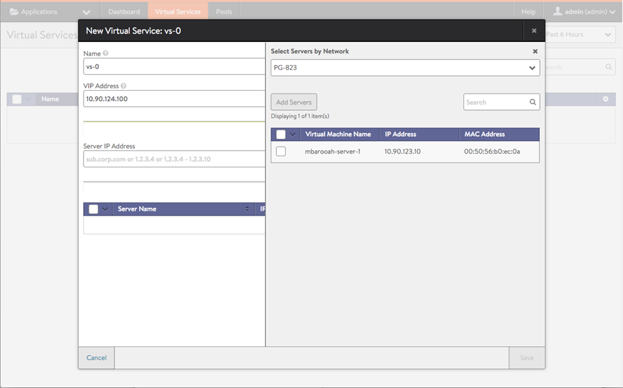

Virtual Routing Framework, or VRF, is a method of isolating traffic within a system. This is also referred to as a "Route Domain" within the load balancer community.

In Avi Vantage deployments with VMware vCenter, all port groups discovered from vCenter are placed into a single VRF context, called "global", by default. Avi Vantage 16.1 adds support for multiple VRF contexts. VRF contexts simplify virtual service deployment, by organizing the port groups discovered from vCenter into subsets.

Beginning in 16.1, ***if multiple VRF contexts are configured***, the workflow for creating a virtual service begins with selecting the VRF in which to place the virtual service. The web interface presents only the networks in the selected VRF context as valid targets for placing that virtual service.
> Note: Support in vCenter-managed clouds for multiple VRF contexts requires Avi Vantage version 16.1 (or later). 
> Note: In 16.1 and earlier, Avi Vantage must be deployed in "provider mode". This is explained below.
 

## Global VRF and Admin Tenant

When a VMware cloud is created on the Controller, Avi Vantage adds all of the port groups learned from vCenter into a VRF named "global", in the admin tenant.

In 16.1, additional VRF contexts can be created in the admin tenant, and individual port groups can be moved from the global VRF into the other VRF contexts. The VRF contexts and their port groups remain in the admin tenant but are available for selection by other tenants when they create virtual services, as shown in the following example:

## Avi Vantage Provider Mode

When integrated with a vCenter-managed cloud, Avi Vantage operates in *provider* mode. This is not the same as a virtual routing context. Provider mode is a Avi Vantage deployment mode wherein all the cloud's network resources--the packet plumbing--remain in the admin tenant and cannot be moved. To configure VRF contexts and move port groups into them the Avi Vantage user must have write privileges for the admin tenant.

In 16.1 and in previous versions, Avi Vantage deployment into a vCenter-managed cloud is supported only in provider mode. In provider mode, other tenants can use the network infrastructure for their virtual services but the infrastructure is managed by the service provider, from the admin tenant.

## VRF Configuration

This section gives steps for creating VRF contexts on the Avi Vantage Controller, moving port groups to the VRF contexts, and creating virtual services in those contexts.

### Notes

* This section assumes that the Controller has already been installed, and that initial configuration of the Controller has been performed using the setup wizard.
* The Avi Vantage user must have write privileges for the admin tenant. These steps can be performed only from the admin tenant.
* The Avi Vantage version must be 16.1 (or later). 

### Creating VRF Contexts

<ol> 
 <li>Navigate to Infrastructure &gt; Clouds.</li> 
 <li>Click on the cloud name.  
  <blockquote> 
   
Note: If the VMware vCenter cloud is the only one configured, or was the first one configured, the cloud name is "Default-Cloud".
 
  </blockquote> </li> 
 <li>Click VRF Context, then click the Create VRF Context button. 

</li> 
 <li>Enter the name of the VRF context and click Save. 

</li> 
</ol> 

### Assigning Networks to the VRF Contexts

<ol> 
 <li>Navigate to Infrastructure &gt; Clouds, and click on the cloud name.</li> 
 <li>Click on Network.</li> 
 <li>Select DHCP, if not already selected.</li> 
 <li>Select the VRF context for the network from the Routing Context pull-down list, and click Save. 

</li> 
</ol> 

## Creating Virtual Services

> Note: These steps can be performed from the admin tenant or from another tenant.
 <ol> 
 <li>Navigate to Applications &gt; Dashboard, and click New Virtual Service.</li> 
 <li>Select the VRF context from the list, and click Next. 

</li> 
 <li>Enter a name for the virtual service.</li> 
 <li>Enter the virtual IP address (VIP) on which Avi Vantage will listen for requests to the virtual service.</li> 
 <li>In the Select Servers by Network section, select the network in which to place the virtual service. <em>Only the networks within the selected VRF context are listed.</em> 

 
After a network is selected, a list of the servers in that network appears.
 

</li> 
 <li>Click to select individual servers, then click Add Servers.</li> 
 <li>Click Save.</li> 
</ol> 