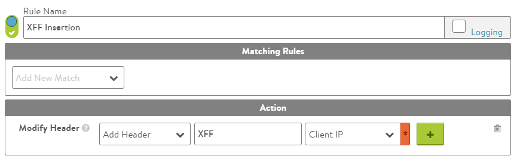

By default, Avi Service Engines (SEs) source-NAT (SNAT) traffic destined to servers. Due to SNAT, logs on the application servers will show the layer 4 IP address of the SE rather than the original client's IP address. 

Most application servers can leverage the XFF header as the source IP address for logging or blacklisting.
For HTTP traffic, Vantage can be configured to insert an X-Forwarded-For (XFF) header in client-server requests, to include the original client IP addresses in the requests for logging.

To include the client's original IP address in HTTP traffic logs, enable Vantage to insert an XFF header into the client traffic destined for the server. XFF insertion can be enabled in the HTTP application profile that is attached to the virtual service.
<ol> 
 <li> 
Navigate to Template &gt; HTTP Application Profile. 
 </li> 
 <li> 
Within the General tab, select the X-Forwarded-For check box. 
 
Note: Optionally the header can be renamed using the XFF Alternate Name field.
 </li> 
 <li> 
When finished changing the profile, click Save.
 </li> 
</ol> 

  

The profile change affects any virtual services that use the same HTTP application profile.

When XFF header insertion is enabled, the SE checks the headers of client-server packets for existing XFF headers. If XFF headers already exist, the SE first removes any pre-existing XFFs, then inserts its own XFF header. This is done to prevent clients from spoofing their IP address. 

### Keeping Pre-existing XFF Headers

There are times when this behavior (removing pre-existing XFF headers) is not desired, such as when multiple proxies may be SNATing and inserting XFF headers. In this case, to insert an XFF header without removing pre-existing XFF headers, use either a DataScript or an HTTP Request Policy.

Example: 

<pre><code class="language-lua">avi.http.add_header("XFF", avi.vs.client_ip())</code></pre>  

   

